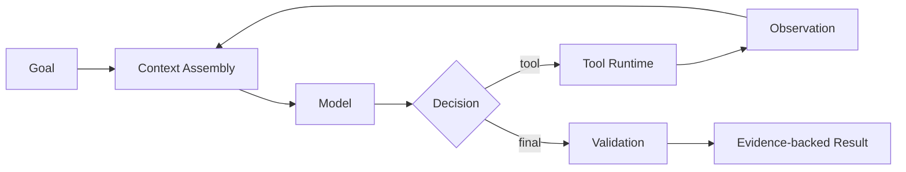

# Agent 开发学习路线：从 Minimum Agent 到 Production Agent

> **Freshness metadata**
> - `last_verified`: `2026-08-24`
> - `version_scope`: `2026 Agent Engineering`
> - `source_type`: `official-spec + primary-paper + official-repository`
> - `stability`: `version-sensitive`

这条路线把 **模型能力**、**Agent 控制循环**、**Context Engineering**、**Tool Runtime** 与 **Harness 工程**分层学习。它不把“调用一次大模型”当成 Agent，也不把 RAG、长期记忆、计划器或 Multi-Agent 当作所有系统的默认组件。

## 1. 两个工程心智模型

- 实现视角：`Agent = Model + Context + Tools`。模型基于本轮上下文产生决定，工具把决定连接到外部世界。
- 系统视角：`Agent = Model + Harness`。Harness 组织 context、tool/runtime、permission/policy、execution control、validation、recovery、trace/session。

这两个公式用于划分工程责任，不是唯一的学术定义。一个固定 DAG 也许包含模型节点，但若控制权始终由预定义图掌握，它更接近 workflow。

## 2. 主线顺序

1. **01 Agent 基础**：Model、Agent、Workflow、Loop、Tool、Skill、Memory、Context、Harness、Runtime、Multi-Agent 的边界。
2. **02 Agent Loop**：Minimal → Reliable → Planned → Workflow → Durable；先获得可停止、可验证的单 Agent。
3. **03 Context Engineering**：Manifest、Assembly、Token Budget、Compaction、Prompt Cache、JIT Retrieval、Progressive Disclosure 与信任边界。
4. **04 Tools 与 Runtime**：Schema、Registry、Invocation、Execution、OS Process、File/Shell/Browser、权限、幂等与证据。
5. **05 Knowledge 与 Memory**：RAG/Knowledge 与 Memory 是两个子系统；均可向 context 提供材料，但不等同于 context。
6. **06 Agent Harness**：执行控制、session、trace、恢复、验证与扩展点。
7. **07 Skills 与 Protocols**：Skill/Tool/Prompt 及 MCP、A2A、ACP 的层级与版本边界。
8. **08 Evaluation / Observability / Safety**：先建立任务、环境、validator、trace 与回归门，再讨论扩展能力。
9. **09 Agent Evolution**：以评测、版本、sandbox 和 rollback 约束候选更新。
10. **10 Multi-Agent**：只有角色隔离、并行吞吐或权限隔离收益高于协调成本时才使用。
11. **11 Model Post-training**：可选高级轨道；区分 Harness Improvement 与 Model Improvement。
12. **12 Production Agent**：可靠性、成本、SLO、发布、运维、审计。
13. **13 Project Ladder**：P0–P7 的逐级可验收工程项目。
14. **14 完整链路与架构对照**：把局部机制放回端到端系统。
15. **99 源码研究**：固定 commit、证据等级和未知项，不把静态推断写成产品承诺。

## 3. 最小学习闭环

每阶段都执行：`Read → Implement → Trace → Evaluate → Explain failure → Fix → Regression`。只展示成功 Demo 不构成完成；至少保存输入、模型事件、工具调用、stdout/stderr 或 API 结果、停止原因和验收证据。

## 4. 哪些能力不是默认项

| 能力 | 何时引入 | 何时暂缓 |
|---|---|---|
| Plan / Scheduler | 任务可拆分、依赖可验证、重规划有收益 | 单步或短链任务 |
| RAG | 答案依赖外部可引用知识 | 模型与确定性工具已经足够 |
| Long-term Memory | 跨会话个性化或持续状态有明确收益 | 一次性任务或写入质量不可控 |
| Reflection | 有独立 verifier 或可测反馈 | 只是让同一模型重复评价自己 |
| Multi-Agent | 并行、隔离或异质能力收益可测 | 单 Agent + tools 已可可靠完成 |
| Post-training | 有高质量轨迹、奖励和离线回归 | 仅靠 prompt/harness 就能修复 |

## 5. 毕业判据

- 能画出模型、context、tool/runtime、harness 与环境的责任边界；
- 能解释一次失败发生在 selection、schema、permission、execution、observation、validation 还是 termination；
- 能用 deterministic validator 优先验证可确定的结果；
- 能在预算耗尽、取消、重启和部分失败后给出一致状态；
- 能用固定数据集比较变更前后成功率、成本、延迟和安全指标；
- 能将版本敏感结论追溯到官方规范、原始论文或固定源码 commit。
