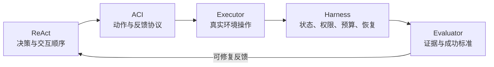

# Agent 基础推荐阅读

## 一、工程入门

1. [Datawhale Agent Learning Hub](https://datawhalechina.github.io/Agent-Learning-Hub/)
   先看 Stage 0～1 的 checklist，明确阶段产物，而不是只收藏链接。
2. [Anthropic：Building effective agents](https://www.anthropic.com/engineering/building-effective-agents)
   重点理解 workflow 与 agent 的边界、prompt chaining、routing、parallelization、orchestrator-workers 与 evaluator-optimizer。
3. [OpenAI：A practical guide to building agents](https://openai.com/business/guides-and-resources/a-practical-guide-to-building-ai-agents/)
   关注模型、工具、指令、guardrail、单 Agent 到多 Agent 的渐进设计。

先用这三份材料建立系统边界，再读下面两篇论文。这样可以把论文中的研究原型与生产 Harness 的权限、状态、评测和恢复机制分开。

## 二、经典论文一：ReAct

### ReAct 书目信息

**ReAct: Synergizing Reasoning and Acting in Language Models**

- 作者：Shunyu Yao、Jeffrey Zhao、Dian Yu、Nan Du、Izhak Shafran、Karthik Narasimhan、Yuan Cao
- 发表：ICLR 2023，In-Person Oral / top 5%
- [ICLR 官方发表页](https://iclr.cc/virtual/2023/oral/12647)
- [OpenReview](https://openreview.net/forum?id=WE_vluYUL-X)
- [arXiv](https://arxiv.org/abs/2210.03629)
- [项目主页](https://react-lm.github.io/)
- [作者官方代码](https://github.com/ysymyth/ReAct)

### ReAct 阅读重点

1. 论文如何把普通动作空间 $\mathcal{A}$ 扩充为动作与语言 thought 的并集；
2. reasoning 如何用于拆解目标、维护计划和处理异常；
3. action 如何从 Wikipedia 或交互环境获得新 observation；
4. 知识任务里的密集 thought 与决策任务里的稀疏 thought 有何不同；
5. ReAct、CoT 和 Act-only 的实验差异；
6. 空搜索、低质量检索、重复 thought/action 和上下文长度怎样造成失败。

ReAct 是推理与行动交错的交互范式，不是包括权限、Executor、Session、Memory、trace 和部署在内的完整 Agent 框架。阅读时应把原论文显式生成的 reasoning trace 与现代 API 的结构化 tool call 分开理解。

### ReAct 结果边界

原论文主要使用 PaLM-540B 和少量人工构造的 in-context trajectories。在论文设置中：

- HotpotQA 上 ReAct 为 27.4 EM，CoT 为 29.4；
- FEVER 上 ReAct 为 60.9，CoT 为 56.3；
- ReAct 与 CoT self-consistency 的组合取得更高结果；
- ALFWorld 和 WebShop 的提升是相对论文当时所选 baselines 的结果。

这些实验说明 reasoning 与环境信息具有互补价值，不表示 ReAct 在所有模型、任务和工具集合上都占优。

## 三、经典论文二：SWE-agent

### SWE-agent 书目信息

**SWE-agent: Agent-Computer Interfaces Enable Automated Software Engineering**

- 作者：John Yang、Carlos E. Jimenez、Alexander Wettig、Kilian Lieret、Shunyu Yao、Karthik Narasimhan、Ofir Press
- 发表：NeurIPS 2024 Main Conference Track
- [NeurIPS 正式论文页](https://proceedings.neurips.cc/paper_files/paper/2024/hash/5a7c947568c1b1328ccc5230172e1e7c-Abstract-Conference.html)
- [arXiv](https://arxiv.org/abs/2405.15793)
- [官方仓库](https://github.com/SWE-agent/SWE-agent)
- [当前官方文档](https://swe-agent.com/latest/)

### SWE-agent 阅读重点

1. 区分 SWE Agent 这一系统类别、SWE-agent 这一具体实现与 SWE-bench 评测；
2. ACI 为什么同时定义 Agent 可用的命令和计算机返回的反馈；
3. 搜索摘要、100 行文件窗口、多行编辑与 lint guardrail 怎样改变轨迹；
4. 无 stdout、格式错误和旧 observation 应怎样反馈或压缩；
5. 为什么“更像人类界面”“工具更多”“上下文更完整”不一定带来更高任务成功率；
6. 为什么 lint 通过、目标测试通过与软件任务整体正确是不同层次的证据。

### SWE-agent 2024 年实验快照

论文在当时的固定模型、Agent 和数据集设置中报告：

- GPT-4 Turbo + SWE-agent 在 SWE-bench full 上解决 12.47%，即 286/2294；
- 在 SWE-bench Lite 上为 18.0%，同表 Shell-only Agent 为 11.0%；
- 摘要式搜索、100 行文件窗口、带 lint 的 edit 和保留最近五个完整 observation，是原消融中表现较好的配置。

这些数字用于理解 ACI 在原论文设置中的影响，不应当作当前 SWE-bench 排行榜或新模型成绩。当前官方文档说明主要开发已转向 [mini-swe-agent](https://github.com/SWE-agent/mini-swe-agent)，原 SWE-agent 处于维护阶段；学习概念时读正式论文，研究当前实现时还要核对版本、commit 和迁移说明。

## 四、两篇论文怎样连起来读

| 问题         | ReAct                                 | SWE-agent                  |
| ------------ | ------------------------------------- | -------------------------- |
| 主要研究对象 | reasoning、action、observation 的交错 | 语言模型与计算机之间的 ACI |
| 回答的问题   | Agent 怎样根据观察选择下一步          | 动作和环境反馈应怎样设计   |
| 原实验环境   | Wikipedia、ALFWorld、WebShop          | 仓库、文件、终端、测试     |
| 工程位置     | 决策和交互范式                        | 工具与环境接口             |

建议把完整系统按五层整理：

图中的 Harness 和 Evaluator 是工程综合层。ReAct 论文聚焦交互范式，SWE-agent 论文聚焦 ACI；二者都没有单独覆盖生产系统的全部生命周期。

## 五、阅读时要回答的问题

- 作者所说的 Agent 是模型、模型加接口，还是完整应用？
- 控制流、动作协议、真实执行和完成验证分别由哪一层负责？
- thought、tool call、tool result 和 evidence 有何区别？
- 工具失败、空输出、日志截断和无搜索结果怎样成为 observation？
- 模型给出 `final` 后，哪些检查才可以把运行标记为完成？
- 可修复的 final validation 失败怎样回到 loop？
- ACI 的动作粒度和反馈长度如何通过任务集与消融实验确定？
- 论文数字对应哪个模型、数据集版本、预算与时间快照？
- 文中的演示如何转成可重放的 trace 和可回归测试的任务？

## 六、建议产出

完成阅读后写一页架构判断记录，至少包含：

- 目标用户、任务和普通 Workflow 基线；
- 需要 Agent 的理由与路径不确定性；
- ReAct、ACI、Executor、Harness、Evaluator 的边界；
- 工具列表、参数 schema 和 observation 格式；
- 最大步数、超时、预算与停止原因；
- 候选 final 的验证规则；
- 一条成功 trace 和一条失败 trace；
- 仓库版本、测试命令、验证证据和未覆盖项。
