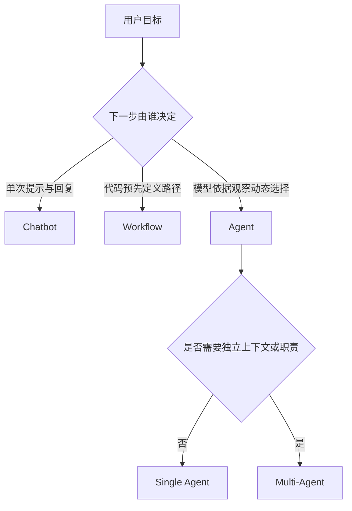
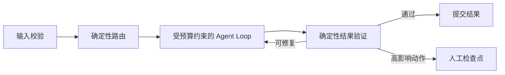

# Agent 类型区分：Chatbot、Workflow、Agent 与 Multi-Agent

## 1. 四类系统的核心差异

### Chatbot

Chatbot 的主结构是“用户消息 → 模型生成 → 文本回复”。它可以保持对话历史，也可以做知识问答，但通常没有由模型自主选择的外部动作。判断关键不是 UI 是否像聊天，而是系统是否存在工具执行、环境反馈和多步状态迁移。

适合：解释、改写、头脑风暴、低风险问答。
主要风险：对话历史过长、事实幻觉、输出格式漂移。

### Workflow

Workflow 的控制流由开发者预先写定，例如：

```text
接收表单 -> 校验字段 -> 查询数据库 -> 调用模型生成摘要 -> 人工确认 -> 发送邮件
```

模型可以出现在某个节点，但节点顺序、分支和重试策略主要由程序决定。Workflow 的优势是确定性、可测试、成本可预测；缺点是面对开放问题时需要预先枚举大量分支。

### Agent

Agent 由模型根据目标和最新观察动态决定下一步动作。Harness 提供工具、状态、权限和预算，模型负责在允许范围内选择工具、调整计划，直到返回答案、满足成功条件或触发停止条件。

典型结构：

```text
goal + state
  -> model decides action
  -> runtime validates and executes
  -> observation returns to model
  -> repeat or finish
```

Agent 的价值来自对不确定步骤的适应能力；成本是行为路径更难穷举，需要更强的追踪、评测和权限约束。

### Multi-Agent

Multi-Agent 把任务分给多个具有独立上下文或职责的 Agent，例如 planner、researcher、writer、reviewer。它解决的是**上下文隔离、专业分工、并行搜索或独立复核**，并不会自动提升正确率。每增加一个 Agent，也增加通信、协调、循环、预算和状态一致性问题。

## 2. 对比表

| 类型        | 控制流决定者                  |     外部动作 | 状态复杂度 | 可预测性 | 典型用途                     |
| ----------- | ----------------------------- | -----------: | ---------: | -------: | ---------------------------- |
| Chatbot     | 用户与单次模型                |     通常没有 |         低 |       中 | 对话、解释、写作             |
| Workflow    | 程序/流程图                   |     固定节点 |         中 |       高 | 审批、ETL、固定业务流程      |
| Agent       | 模型 + Harness                |     动态选择 |         高 |     中低 | 研究、编码、开放式操作       |
| Multi-Agent | Supervisor/Graph + 多模型实例 | 动态且多主体 |       很高 |       低 | 并行研究、独立评审、职责隔离 |

## 3. 常见误判

1. **调用一次搜索不等于 Agent**：如果搜索步骤固定，它仍是 Workflow。
2. **有多个 prompt 不等于 Multi-Agent**：同一状态机里的多阶段提示通常只是 Workflow。
3. **模型输出 JSON 不等于工具调用完成**：运行时还需校验参数、执行动作并回填结果。
4. **长 prompt 不等于 Harness**：Harness 是工具、权限、状态、日志、压缩、恢复等运行时机制的组合。

## 4. 选择原则

优先使用最简单、最可验证的结构：

- 单次生成能解决：Chatbot/普通 LLM 调用。
- 步骤稳定且已知：Workflow。
- 步骤依赖运行时信息且难预先枚举：Agent。
- 确实需要上下文隔离、并行或独立复核：Multi-Agent。

判断时关注任务的**路径不确定性**，而不是营销名称。

## 5. 自测

给自己的项目画控制流图，并回答：

- 下一步由代码决定，还是由模型根据观察决定？
- 工具失败后由固定分支处理，还是由模型重新规划？
- 多个角色是否真的有独立状态与清晰输入输出？
- 移除 Agent 自主决策后，普通 Workflow 是否已经足够？

## 参考资料

- [Anthropic：Building effective agents](https://www.anthropic.com/research/building-effective-agents)
- [OpenAI：A practical guide to building agents](https://openai.com/business/guides-and-resources/a-practical-guide-to-building-ai-agents/)
- [Datawhale Agent Learning Hub](https://github.com/datawhalechina/Agent-Learning-Hub)

<!-- agent-learning-expansion:v2 -->
## 6. 从“控制权”而不是界面判断系统类型

判断一个系统属于 Chatbot、Workflow 还是 Agent，最有效的问题是：**谁在运行时决定下一条边？**



这里有四个容易混淆的维度：

| 维度 | 含义 | 诊断问题 |
| --- | --- | --- |
| 控制权 | 谁选择下一步动作 | 分支是代码里的 `if`，还是模型返回的 tool call？ |
| 自主度 | 系统能连续执行多少步 | 每一步都要用户确认，还是只在检查点停下？ |
| 环境闭环 | 动作结果是否回到下一轮决策 | 工具执行结果是否成为新的 observation？ |
| 状态边界 | 状态属于会话、任务还是多个角色 | 是否能恢复、重放并解释当前状态？ |

因此，“带聊天框”不代表 Chatbot，“调用工具”也不自动代表 Agent。固定的“分类 → 搜索 → 总结”仍是 Workflow；只有模型能根据搜索结果决定继续搜索、换查询、使用别的工具或结束，才具有 Agent 式控制。

## 7. Workflow 与 Agent 的组合方式

生产系统通常不是四选一，而是**确定性外壳包住有限自主循环**：



这种设计把适合代码解决的问题留给代码：身份鉴别、schema 校验、权限、预算、事务和最终验证；把难以枚举的语义决策留给模型：拆解开放任务、选择检索方向、解释不完整证据和重新规划。

## 8. 工程选择矩阵

| 任务特征 | 优先结构 | 原因 |
| --- | --- | --- |
| 路径稳定、规则完整、错误代价高 | Workflow | 可穷举、可单元测试、可审计 |
| 只需语言理解或生成 | Chatbot / 单次 LLM | 额外循环只增加成本与延迟 |
| 步骤数量未知，必须根据环境反馈调整 | Agent | 需要运行时规划与工具选择 |
| 可拆成互不依赖的检索分支 | Workflow 并行或 orchestrator-workers | 是否使用多 Agent 取决于上下文隔离需求 |
| 需要独立复核且不能共享先前结论 | Multi-Agent | 隔离上下文可减少锚定效应 |

Anthropic 将 workflow 描述为由预定义代码路径编排的系统，将 agent 描述为由模型动态控制过程与工具使用的系统；OpenAI 的工程指南则把模型、工具和指令视为 Agent 的三个基础部件。两者共同指向一个实践原则：先建立最简单的可评测基线，再逐步增加自主度。

### 延伸阅读

- [AI Agent 开发教程：Agent、上下文、工具与 Harness](https://bojieli.github.io/ai-agent-book/book/chapter1/)
- [Anthropic：Building effective agents](https://www.anthropic.com/engineering/building-effective-agents)
- [OpenAI：A practical guide to building agents](https://openai.com/business/guides-and-resources/a-practical-guide-to-building-ai-agents/)
