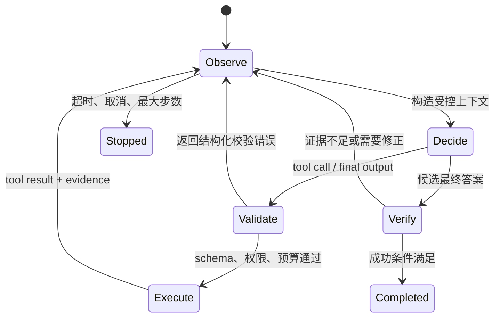

# Agent 基本循环：Observe → Think → Act → Observe

## 1. Observe：把环境事实变成模型可消费的观察

观察不仅是用户输入，还包括工具结果、文件变化、测试日志、页面 DOM、错误类型、剩余预算和权限状态。高质量观察应满足：

- **结构清楚**：区分数据、错误、元信息和证据来源。
- **大小受控**：大文件只返回相关片段、行号和摘要。
- **可追溯**：保留 tool call ID、路径、查询、时间和版本。
- **避免伪事实**：工具超时要标记为超时，而不是写成“没有结果”。

## 2. Think：在约束内选择下一步

Think 是广义的决策阶段，不要求把内部推理文本公开。模型应基于目标、当前状态和工具说明，在以下动作中选择：

- 直接回答；
- 调用一个或多个工具；
- 修改计划；
- 请求关键输入；
- 因预算、权限或成功条件而结束。

运行时应提供显式状态，例如 `step_count`、`deadline`、`remaining_tokens`、`completed_checks`，而不是依赖模型自行记住。

## 3. Act：由确定性运行时执行

模型提出动作，Harness 负责：

1. 解析工具名和参数；
2. 使用 schema 校验；
3. 应用权限、路径、域名、速率和副作用规则；
4. 执行工具；
5. 捕获标准输出、错误、耗时和变更；
6. 返回统一 `ToolResult`。

模型不应绕开执行层直接宣称动作完成。特别是写文件、发送消息、部署、付款等动作，成功状态必须来自实际工具结果。

## 4. 再次 Observe：闭环而非“一次工具调用”

工具结果回到模型后，模型需要判断：

- 结果是否满足原目标；
- 是否出现部分成功；
- 是否需要重试、换工具或缩小范围；
- 是否需要验证副作用；
- 是否已满足终止条件。

例如代码修改任务中，“写入成功”只是中间状态，后续观察还应包含 lint、测试、构建和 `git diff`。

## 5. 一个最小状态机

```ts
type AgentState = {
  goal: string
  messages: Message[]
  step: number
  maxSteps: number
  deadline: number
  evidence: EvidenceItem[]
  status: 'running' | 'completed' | 'failed' | 'cancelled'
}

while (state.status === 'running') {
  assertBudget(state)
  const response = await model.respond(state.messages, tools)
  if (response.finalAnswer) {
    state.status = validateAnswer(response.finalAnswer, state.evidence)
      ? 'completed'
      : 'failed'
    break
  }
  const results = await executeValidatedToolCalls(response.toolCalls)
  state.messages.push(...toToolResultMessages(results))
  state.evidence.push(...extractEvidence(results))
  state.step += 1
}
```

## 6. 与 ReAct 的关系

ReAct 把 reasoning 与 acting 交错：模型基于当前观察选择动作，再利用环境结果更新决策。工程系统通常不会照抄论文中的文本格式，而是使用原生 tool call、结构化消息和确定性执行器实现同一闭环思想。

## 7. 关键不变量

- 每个 tool call 都有且只有一个对应 tool result。
- 结果顺序与调用 ID 可关联。
- 失败也是结构化观察，不丢失。
- 最大步数、超时、取消和成本上限由运行时强制。
- 最终答案引用的事实能追溯到输入或 EvidenceItem。
- 有副作用的动作在完成后有独立验证。

## 参考资料

- [ReAct: Synergizing Reasoning and Acting in Language Models](https://arxiv.org/abs/2210.03629)
- [Anthropic Tool Use](https://docs.anthropic.com/en/docs/agents-and-tools/tool-use/overview)
- [OpenAI Function Calling](https://platform.openai.com/docs/guides/function-calling)

<!-- agent-learning-expansion:v2 -->
## 8. 用状态转移精确定义循环

“Observe → Think → Act”不是三个互相独立的函数，而是一个带约束的状态转移系统。可以把第 $t$ 轮状态写成：

$$
S_t = (G, H_t, E_t, B_t, P_t)
$$

- $G$：稳定的目标与成功标准；
- $H_t$：对话、工具调用与结果组成的历史；
- $E_t$：可验证证据，例如文件版本、查询结果、测试报告；
- $B_t$：剩余步数、时间、token、金额或工具配额；
- $P_t$：权限、审批和副作用策略。

模型根据 $S_t$ 生成候选动作 $a_t$，运行时先验证再执行，环境返回观察 $o_{t+1}$，随后得到 $S_{t+1}$。真正重要的不是展示模型的思考文本，而是确保**输入状态、动作、观察、预算变化和停止原因都可追踪**。



## 9. 同一最小循环的多语言实现

下面四段代码采用相同语义：模型只负责提出 `final` 或 `tool` 动作，运行时负责预算、执行与结果回填。页面上的语言标签可以直接切换实现。

```python group=agent-loop label=Python
def run_agent(goal, model, tools, max_steps=8):
    state = {"goal": goal, "messages": [], "evidence": []}
    for step in range(max_steps):
        decision = model.decide(state)
        if decision.kind == "final":
            return verify_final(decision.text, state["evidence"])

        result = tools.execute_validated(
            decision.tool, decision.arguments
        )
        state["messages"].append({
            "tool_call_id": decision.id,
            "result": result,
        })
        state["evidence"].extend(result.evidence)
    return {"ok": False, "reason": "MAX_STEPS"}
```

```rust group=agent-loop label=Rust
fn run_agent(
    goal: &str,
    model: &dyn Model,
    tools: &ToolRegistry,
    max_steps: usize,
) -> RunResult {
    let mut state = State::new(goal);
    for _ in 0..max_steps {
        match model.decide(&state)? {
            Decision::Final(text) => return verify_final(text, &state.evidence),
            Decision::Tool(call) => {
                let result = tools.execute_validated(&call)?;
                state.record_tool_result(call.id, result);
            }
        }
    }
    RunResult::stopped("MAX_STEPS")
}
```

```javascript group=agent-loop label=JavaScript
async function runAgent(goal, model, tools, maxSteps = 8) {
  const state = { goal, messages: [], evidence: [] }
  for (let step = 0; step < maxSteps; step += 1) {
    const decision = await model.decide(state)
    if (decision.kind === 'final') {
      return verifyFinal(decision.text, state.evidence)
    }
    const result = await tools.executeValidated(
      decision.tool,
      decision.arguments,
    )
    state.messages.push({ toolCallId: decision.id, result })
    state.evidence.push(...result.evidence)
  }
  return { ok: false, reason: 'MAX_STEPS' }
}
```

```typescript group=agent-loop label=TypeScript
type Decision =
  | { kind: 'final'; text: string }
  | { kind: 'tool'; id: string; tool: string; arguments: unknown }

async function runAgent(
  goal: string,
  model: Model,
  tools: ToolRegistry,
  maxSteps = 8,
): Promise<RunResult> {
  const state = createState(goal)
  for (let step = 0; step < maxSteps; step += 1) {
    const decision: Decision = await model.decide(state)
    if (decision.kind === 'final')
      return verifyFinal(decision.text, state.evidence)

    const result = await tools.executeValidated(decision.tool, decision.arguments)
    state.record(decision.id, result)
  }
  return { ok: false, reason: 'MAX_STEPS' }
}
```

## 10. 循环里的四类停止条件

1. **语义完成**：模型给出最终输出，且确定性验证器确认必需字段、证据和产物齐全。
2. **协议完成**：模型返回没有 tool call 的最终消息，或调用专门的 `submit_result` 工具。
3. **资源停止**：最大轮次、deadline、token、金额或并发预算耗尽。
4. **外部停止**：用户取消、审批拒绝、工具返回不可继续的权限或业务错误。

OpenAI Agents SDK 的 Runner 同样围绕这一循环：最终输出结束；handoff 更新当前 Agent；tool calls 执行并回填；超过最大轮次则以明确错误退出。工程实现应额外记录 `stop_reason`，否则“正常完成”和“被预算截断”会在上层看起来一样。

### 延伸阅读

- [OpenAI Agents SDK：Running agents](https://openai.github.io/openai-agents-python/running_agents/)
- [AI Agent 开发教程：一次模型请求中的上下文组成](https://bojieli.github.io/ai-agent-book/book/chapter1/)
