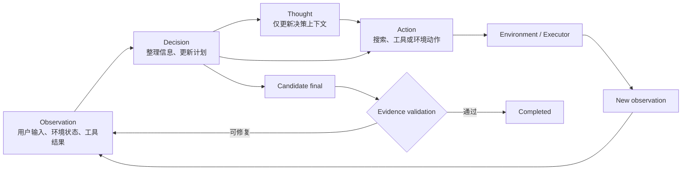
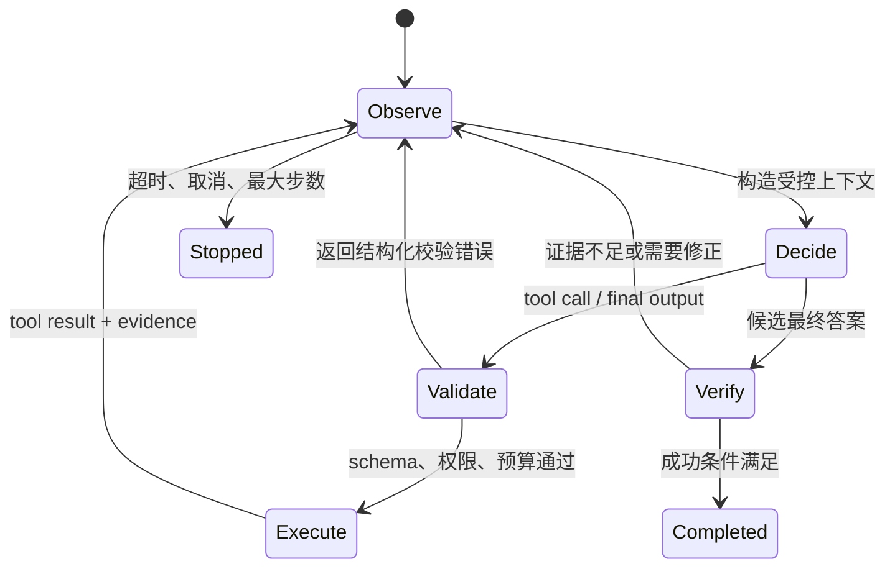

# Agent 基本循环：Observe → Think → Act → Observe

## 1. Observe：把环境事实变成模型可消费的观察

观察不仅是用户输入，还包括工具结果、文件变化、测试日志、页面 DOM、错误类型、剩余预算和权限状态。高质量观察应满足：

- **结构清楚**：区分数据、错误、元信息和证据来源。
- **大小受控**：大文件只返回相关片段、行号和摘要。
- **可追溯**：保留 tool call ID、路径、查询、时间和版本。
- **避免伪事实**：工具超时要标记为超时，而不是写成“没有结果”。

## 2. Think：在约束内选择下一步

Think 是广义的决策阶段，不要求把内部推理文本公开。模型应基于目标、当前状态和工具说明，在以下动作中选择：

- 直接回答；
- 调用一个或多个工具；
- 修改计划；
- 请求关键输入；
- 因预算、权限或成功条件而结束。

运行时应提供显式状态，例如 `step_count`、`deadline`、`remaining_tokens`、`completed_checks`，而不是依赖模型自行记住。

## 3. Act：由确定性运行时执行

模型提出动作，Harness 负责：

1. 解析工具名和参数；
2. 使用 schema 校验；
3. 应用权限、路径、域名、速率和副作用规则；
4. 执行工具；
5. 捕获标准输出、错误、耗时和变更；
6. 返回统一 `ToolResult`。

模型不应绕开执行层直接宣称动作完成。特别是写文件、发送消息、部署、付款等动作，成功状态必须来自实际工具结果。

## 4. 再次 Observe：闭环而非“一次工具调用”

工具结果回到模型后，模型需要判断：

- 结果是否满足原目标；
- 是否出现部分成功；
- 是否需要重试、换工具或缩小范围；
- 是否需要验证副作用；
- 是否已满足终止条件。

例如代码修改任务中，“写入成功”只是中间状态，后续观察还应包含 lint、测试、构建和 `git diff`。

## 5. 一个最小状态机

```python group=multi-424bd49095c6 label=Python
from dataclasses import dataclass, field
from typing import Literal

@dataclass(frozen=True)
class FinalValidation:
    ok: bool
    recoverable: bool
    code: str
    feedback: str

@dataclass
class AgentState:
    goal: str
    messages: list["Message"]
    step: int
    max_steps: int
    deadline: float
    evidence: list["EvidenceItem"] = field(default_factory=list)
    status: Literal["running", "completed", "failed", "cancelled"] = "running"

async def run_loop(state: AgentState, model, tools) -> None:
    while state.status == "running":
        assert_budget(state)
        response = await model.respond(state.messages, tools)
        if response.final_answer is not None:
            validation = validate_answer(response.final_answer, state.evidence)
            if validation.ok:
                state.status = "completed"
                break
            if not validation.recoverable:
                state.status = "failed"
                break
            state.messages.append(to_validation_observation(validation))
            state.step += 1
            continue

        results = await execute_validated_tool_calls(response.tool_calls)
        state.messages.extend(to_tool_result_messages(results))
        state.evidence.extend(extract_evidence(results))
        state.step += 1
```

```rust group=multi-424bd49095c6 label=Rust
#[derive(Debug)]
struct FinalValidation {
    ok: bool,
    recoverable: bool,
    code: String,
    feedback: String,
}

#[derive(Debug)]
enum AgentStatus {
    Running,
    Completed,
    Failed,
    Cancelled,
}

struct AgentState {
    goal: String,
    messages: Vec<Message>,
    step: u32,
    max_steps: u32,
    deadline_ms: u64,
    evidence: Vec<EvidenceItem>,
    status: AgentStatus,
}

async fn run_loop(
    state: &mut AgentState,
    model: &dyn Model,
    tools: &[Tool],
) -> Result<(), AgentError> {
    while matches!(state.status, AgentStatus::Running) {
        assert_budget(state)?;
        let response = model.respond(&state.messages, tools).await?;
        if let Some(answer) = response.final_answer {
            let validation = validate_answer(&answer, &state.evidence);
            if validation.ok {
                state.status = AgentStatus::Completed;
                break;
            }
            if !validation.recoverable {
                state.status = AgentStatus::Failed;
                break;
            }
            state.messages.push(to_validation_observation(validation));
            state.step += 1;
            continue;
        }

        let results = execute_validated_tool_calls(response.tool_calls).await?;
        state.messages.extend(to_tool_result_messages(&results));
        state.evidence.extend(extract_evidence(&results));
        state.step += 1;
    }
    Ok(())
}
```

```javascript group=multi-424bd49095c6 label=JavaScript
async function runLoop(state, model, tools) {
  while (state.status === 'running') {
    assertBudget(state)
    const response = await model.respond(state.messages, tools)
    if (response.finalAnswer !== undefined) {
      const validation = validateAnswer(response.finalAnswer, state.evidence)
      if (validation.ok) {
        state.status = 'completed'
        break
      }
      if (!validation.recoverable) {
        state.status = 'failed'
        break
      }
      state.messages.push(toValidationObservation(validation))
      state.step += 1
      continue
    }

    const results = await executeValidatedToolCalls(response.toolCalls)
    state.messages.push(...toToolResultMessages(results))
    state.evidence.push(...extractEvidence(results))
    state.step += 1
  }
}
```

```typescript group=multi-424bd49095c6 label=TypeScript
type FinalValidation = {
  ok: boolean
  recoverable: boolean
  code: string
  feedback: string
}

type AgentState = {
  goal: string
  messages: Message[]
  step: number
  maxSteps: number
  deadline: number
  evidence: EvidenceItem[]
  status: 'running' | 'completed' | 'failed' | 'cancelled'
}

while (state.status === 'running') {
  assertBudget(state)
  const response = await model.respond(state.messages, tools)
  if (response.finalAnswer) {
    const validation = validateAnswer(response.finalAnswer, state.evidence)
    if (validation.ok) {
      state.status = 'completed'
      break
    }
    if (!validation.recoverable) {
      state.status = 'failed'
      break
    }

    // “证据不足”“漏掉必需字段”等可修复结果要回到循环，
    // 而不是把候选 final 直接标记成失败或完成。
    state.messages.push(toValidationObservation(validation))
    state.step += 1
    continue
  }
  const results = await executeValidatedToolCalls(response.toolCalls)
  state.messages.push(...toToolResultMessages(results))
  state.evidence.push(...extractEvidence(results))
  state.step += 1
}
```

## 6. 与 ReAct 的关系

ReAct 是 Shunyu Yao、Jeffrey Zhao、Dian Yu、Nan Du、Izhak Shafran、Karthik Narasimhan 与 Yuan Cao 提出的交互范式，发表于 ICLR 2023。它把语言形式的 reasoning 与会影响外部环境的 action 交错起来：reasoning 帮助模型拆解目标、维护计划和处理异常；action 从知识库或环境取得新信息，使后续决策建立在新的 observation 上。

### 6.1 论文中的形式化定义

设 Agent 在第 $t$ 步得到观察 $o_t$，它看到的轨迹上下文为：

$$
c_t=(o_1,a_1,\ldots,o_{t-1},a_{t-1},o_t)
$$

普通 Agent 从动作空间 $\mathcal{A}$ 中选择动作。ReAct 将其扩充为：

$$
\hat{\mathcal{A}}=\mathcal{A}\cup\mathcal{L}
$$

- $\mathcal{A}$：搜索、移动、调用工具或提交答案等会影响环境的任务动作；
- $\mathcal{L}$：语言形式的 thought/reasoning trace；
- thought 只更新后续上下文；外部环境保持原状，也没有新的环境 observation；
- action 由环境执行，并返回下一条 observation。

因此，ReAct 的重点不是把三个英文标签排成固定模板，而是建立两条互补路径：

- **reason to act**：根据目标和已有观察决定查什么、做什么以及何时调整计划；
- **act to reason**：通过外部动作获得新事实，修正仅依赖模型内部知识的推断。



### 6.2 Thought 可以密集，也可以稀疏

原论文并未要求每次环境动作前都输出一段长 thought：

- 在 HotpotQA、FEVER 这类知识推理任务中，论文采用较密集的 Thought–Action–Observation 轨迹；
- 在 ALFWorld、WebShop 这类可能包含很多动作的交互任务中，thought 只在需要规划、总结进度或处理异常的位置稀疏出现；
- 模型可以在连续环境动作之间省略 thought。

这一区分很重要。把 ReAct 简化成“每轮必须公开一段思维链”既不符合论文全部设置，也会把交互协议与模型的内部推理混在一起。工程系统更应记录可审计的目标、动作、工具结果、状态变化和停止原因。

### 6.3 ReAct、CoT 与 Act-only

| 方法     | 外部环境动作 | 语言推理轨迹 | 主要特点与限制                                                                                      |
| -------- | -----------: | -----------: | --------------------------------------------------------------------------------------------------- |
| CoT      |           否 |           是 | 可以组织多步推理，但事实主要来自输入和模型已有知识，错误可能沿推理过程传播                          |
| Act-only |           是 |           否 | 能查询环境，但较难显式维护计划、综合多步观察和解释异常恢复                                          |
| ReAct    |           是 |           是 | 用 reasoning 指导 action，再用 observation 更新 reasoning；仍会受到搜索质量、重复循环和错误推理影响 |

原论文在知识任务中只提供一个简化的 Wikipedia API：`search[entity]`、`lookup[string]` 和 `finish[answer]`。这些 action 属于特定实验环境，不等于现代生产系统中的完整工具协议。

### 6.4 怎样准确理解论文结果

原论文主要使用 PaLM-540B 和少量人工编写的 in-context trajectories。论文报告：

- HotpotQA：ReAct 为 27.4 EM，CoT 为 29.4；ReAct 单独没有高于 CoT；
- FEVER：ReAct 为 60.9，CoT 为 56.3；
- ReAct 与 CoT self-consistency 组合后，原设置中的 HotpotQA 最高为 35.1，FEVER 最高为 64.6；
- 在 ALFWorld 与 WebShop 上，相对论文所选 imitation/RL baselines，ReAct 分别带来 34、10 个绝对成功率百分点的提升。

这些结果支持“推理与环境交互具有互补价值”，并不表示 ReAct 在任意模型、工具和任务上都优于其他方法。模型、示例、动作空间、检索质量、最大步数和评测方式都会改变结果。

### 6.5 ReAct 仍有哪些失败模式

论文对 HotpotQA 轨迹的人工分析指出：

- ReAct 会重复先前的 thought 和 action，停留在无进展循环；
- 在抽样的失败案例中，23% 与搜索为空或没有取得有用信息有关；
- 交错结构增强了 factual grounding，但也可能限制推理结构的灵活性；
- 大动作空间任务需要更多示例，容易受到上下文长度限制。

因此，更准确的结论是：在论文评估的知识任务中，外部检索让 ReAct 相对 CoT 减少了一部分事实幻觉；它仍可能产生错误推理、选择低质量动作或很难从无信息 observation 中恢复。

### 6.6 从论文范式映射到工程系统

ReAct 主要描述“如何随 observation 更新下一步”，没有定义生产 Agent 的全部运行时。现代实现通常把它映射为：

```text
ReAct decision
  -> structured ToolCall
  -> schema / permission validation
  -> deterministic Executor
  -> structured ToolResult
  -> context and state update
  -> evidence validation
  -> continue / complete / stop
```

- 原生 tool call 或类型化 JSON 负责动作协议；
- Executor 负责真实副作用，模型不直接执行；
- Harness 强制预算、权限、超时、trace、checkpoint 和停止条件；
- final answer 是候选完成信号，验证器通过后才进入 `completed`；
- 可修复验证反馈应像工具失败一样成为新的 observation。

ReAct 决定交互的时间结构，ACI 决定 Agent 与计算机之间的动作和反馈语言，Harness 管理完整生命周期。三者的进一步对比见《SWE Agent 基础概念与 ACI》。

## 7. 关键不变量

- 每个 tool call 都有且只有一个对应 tool result。
- 结果顺序与调用 ID 可关联。
- 失败也是结构化观察，不丢失。
- 最大步数、超时、取消和成本上限由运行时强制。
- 最终答案引用的事实能追溯到输入或 EvidenceItem。
- 有副作用的动作在完成后有独立验证。

## 参考资料

- [ReAct：ICLR 2023 官方发表页](https://iclr.cc/virtual/2023/oral/12647)
- [ReAct：arXiv 论文](https://arxiv.org/abs/2210.03629)
- [ReAct：项目主页](https://react-lm.github.io/)
- [ReAct：官方代码](https://github.com/ysymyth/ReAct)
- [Anthropic Tool Use](https://docs.anthropic.com/en/docs/agents-and-tools/tool-use/overview)
- [OpenAI Function Calling](https://platform.openai.com/docs/guides/function-calling)

<!-- agent-learning-expansion:v2 -->

## 8. 用状态转移精确定义循环

“Observe → Think → Act”不是三个互相独立的函数，而是一个带约束的状态转移系统。可以把第 $t$ 轮状态写成：

$$
S_t = (G, H_t, E_t, B_t, P_t)
$$

- $G$：稳定的目标与成功标准；
- $H_t$：对话、工具调用与结果组成的历史；
- $E_t$：可验证证据，例如文件版本、查询结果、测试报告；
- $B_t$：剩余步数、时间、token、金额或工具配额；
- $P_t$：权限、审批和副作用策略。

模型根据 $S_t$ 生成候选动作 $a_t$，运行时先验证再执行，环境返回观察 $o_{t+1}$，随后得到 $S_{t+1}$。真正重要的不是展示模型的思考文本，而是确保**输入状态、动作、观察、预算变化和停止原因都可追踪**。



## 9. 同一最小循环的多语言实现

下面四段代码采用相同语义：模型只负责提出 `final` 或 `tool` 动作，运行时负责预算、执行与结果回填。页面上的语言标签可以直接切换实现。

```python group=agent-loop label=Python
def run_agent(goal, model, tools, max_steps=8):
    state = {"goal": goal, "messages": [], "evidence": []}
    for step in range(max_steps):
        decision = model.decide(state)
        if decision.kind == "final":
            validation = verify_final(decision.text, state["evidence"])
            if validation.ok:
                return {"ok": True, "answer": decision.text}
            if not validation.recoverable:
                return {"ok": False, "reason": validation.code}
            state["messages"].append({
                "role": "validation",
                "content": validation.feedback,
            })
            continue

        result = tools.execute_validated(
            decision.tool, decision.arguments
        )
        state["messages"].append({
            "tool_call_id": decision.id,
            "result": result,
        })
        state["evidence"].extend(result.evidence)
    return {"ok": False, "reason": "MAX_STEPS"}
```

```rust group=agent-loop label=Rust
fn run_agent(
    goal: &str,
    model: &dyn Model,
    tools: &ToolRegistry,
    max_steps: usize,
) -> RunResult {
    let mut state = State::new(goal);
    for _ in 0..max_steps {
        match model.decide(&state)? {
            Decision::Final(text) => {
                let validation = verify_final(&text, &state.evidence);
                if validation.ok {
                    return RunResult::completed(text);
                }
                if !validation.recoverable {
                    return RunResult::failed(validation.code);
                }
                state.record_validation_observation(validation);
            }
            Decision::Tool(call) => {
                let result = tools.execute_validated(&call)?;
                state.record_tool_result(call.id, result);
            }
        }
    }
    RunResult::stopped("MAX_STEPS")
}
```

```javascript group=agent-loop label=JavaScript
async function runAgent(goal, model, tools, maxSteps = 8) {
  const state = { goal, messages: [], evidence: [] }
  for (let step = 0; step < maxSteps; step += 1) {
    const decision = await model.decide(state)
    if (decision.kind === 'final') {
      const validation = verifyFinal(decision.text, state.evidence)
      if (validation.ok) return { ok: true, answer: decision.text }
      if (!validation.recoverable) {
        return { ok: false, reason: validation.code }
      }
      state.messages.push({
        role: 'validation',
        content: validation.feedback,
      })
      continue
    }
    const result = await tools.executeValidated(decision.tool, decision.arguments)
    state.messages.push({ toolCallId: decision.id, result })
    state.evidence.push(...result.evidence)
  }
  return { ok: false, reason: 'MAX_STEPS' }
}
```

```typescript group=agent-loop label=TypeScript
type Decision =
  | { kind: 'final'; text: string }
  | { kind: 'tool'; id: string; tool: string; arguments: unknown }

async function runAgent(
  goal: string,
  model: Model,
  tools: ToolRegistry,
  maxSteps = 8,
): Promise<RunResult> {
  const state = createState(goal)
  for (let step = 0; step < maxSteps; step += 1) {
    const decision: Decision = await model.decide(state)
    if (decision.kind === 'final') {
      const validation = verifyFinal(decision.text, state.evidence)
      if (validation.ok) return { ok: true, answer: decision.text }
      if (!validation.recoverable) {
        return { ok: false, reason: validation.code }
      }
      state.recordValidationObservation(validation)
      continue
    }

    const result = await tools.executeValidated(decision.tool, decision.arguments)
    state.record(decision.id, result)
  }
  return { ok: false, reason: 'MAX_STEPS' }
}
```

## 10. 循环里的四类停止条件

1. **验证完成**：模型通过无 tool call 的消息或 `submit_result` 提交候选结果，确定性验证器确认必需字段、证据、产物和成功标准齐全。
2. **终止失败**：最终结果存在协议或语义错误，验证器判断当前状态已经不适合继续修复；运行时记录失败类型和证据。
3. **资源停止**：最大轮次、deadline、token、金额或并发预算耗尽。
4. **外部停止**：用户取消、审批没有通过，或工具返回不可继续的权限、环境或业务错误。

模型的 `final`、没有 tool call 的消息或 `submit_result` 都只是触发验证的协议事件。可修复的验证失败要回到循环；只有验证通过或发生终止条件时才离开。OpenAI Agents SDK 的 Runner 同样围绕“最终输出、handoff、tool calls、最大轮次”推进。工程实现还应记录 `stop_reason`，否则“正常完成”和“被预算截断”会在上层看起来一样。

### 延伸阅读

- [OpenAI Agents SDK：Running agents](https://openai.github.io/openai-agents-python/running_agents/)
- [AI Agent 开发教程：一次模型请求中的上下文组成](https://bojieli.github.io/ai-agent-book/book/chapter1/)
