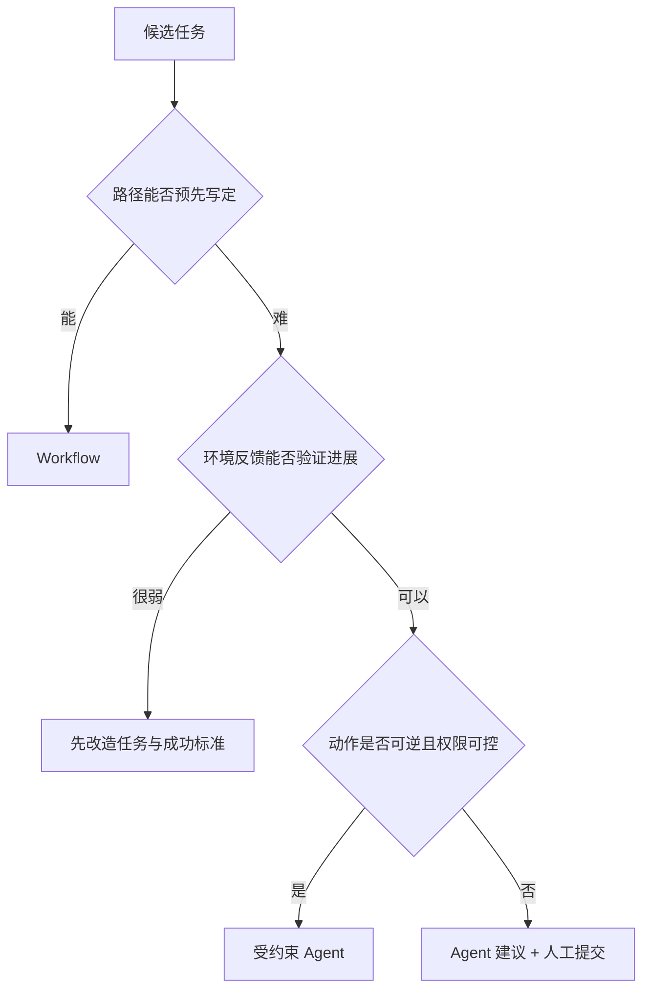

# Agent 适用范围：什么时候使用，什么时候优先 Workflow

## 1. 适合 Agent 的任务特征

### 路径依赖运行时信息

例如修复陌生仓库问题：先读取日志，再定位源码，修改后根据测试反馈继续调整。后续步骤取决于前一步观察，很难提前穷举完整路径。

### 工具多且组合开放

研究助手可能需要搜索、浏览网页、下载论文、解析 PDF、筛选证据、生成报告。工具组合和调用次数由主题决定。

### 成功标准可以验证

Agent 并不适合“目标完全模糊”的任务。理想任务虽然路径开放，但成功条件清楚，例如测试通过、目标字段已生成、报告包含来源、网页表单状态已更新。

### 异常分支多

页面变化、依赖冲突、空检索、工具超时等情况适合让 Agent依据观察恢复，但前提是 Harness 提供错误分类、预算和安全边界。

## 2. 优先固定程序或 Workflow 的情况

- 业务规则稳定、步骤完全已知；
- 结果必须严格确定且已有成熟算法；
- 大批量高频任务对成本和延迟敏感；
- 错误代价高，而每个分支都可显式建模；
- 普通 SQL、脚本、正则、编译器或规则引擎已能可靠解决。

例如税率计算、数据库约束检查、文件格式转换、固定审批链，通常应把 LLM 限制在解释或非确定性文本处理节点。

## 3. 决策矩阵

对每项打 0～2 分：

| 维度         | 0 分         | 1 分     | 2 分         |
| ------------ | ------------ | -------- | ------------ |
| 路径不确定性 | 固定         | 少量分支 | 高度依赖观察 |
| 工具组合     | 单一固定     | 少量可选 | 动态组合     |
| 环境变化     | 很少         | 偶发     | 经常变化     |
| 结果可验证性 | 难验证       | 部分验证 | 明确验证     |
| 失败恢复价值 | 固定重试足够 | 少量策略 | 需要重规划   |

总分高不代表直接上 Multi-Agent。通常先做单 Agent；只有上下文隔离、并行或独立复核带来明确收益时再拆分。

## 4. 渐进式架构

```text
普通函数
  -> 带 LLM 的固定 Workflow
  -> 带路由的 Workflow
  -> 单 Agent + 少量工具
  -> 单 Agent + RAG/Memory
  -> 多 Agent 协调
```

每次升级都要用测试集证明成功率、成本或维护性得到改善。若升级后只是 demo 更“聪明”，但成功率和可追踪性下降，应退回更简单结构。

## 5. 场景示例

- **客服 FAQ**：检索 + 固定回答模板通常足够；复杂工单再交给 Agent。
- **数据报表**：固定 SQL 和图表 Workflow；只有探索性诊断才引入 Agent。
- **代码修改**：路径开放、可通过测试验证，是典型 Agent 场景。
- **合同审批**：规则节点使用 Workflow，模型做抽取与提示，关键决策保留人工确认。
- **深度研究**：检索路径开放、需要证据综合，适合 Agent，但必须保存引用与抓取证据。

## 6. 上线前问题

1. 目标能否写成机器可检查的成功条件？
2. 最坏情况下会调用多少次模型和工具？
3. 工具失败后有哪些恢复策略？
4. 哪些动作有副作用，确认点放在哪里？
5. 一次失败能否通过 trace 重放和定位？
6. 普通 Workflow 的基线成功率是多少？

## 参考资料

- [Anthropic：Building effective agents](https://www.anthropic.com/research/building-effective-agents)
- [OpenAI：A practical guide to building agents](https://openai.com/business/guides-and-resources/a-practical-guide-to-building-ai-agents/)

<!-- agent-learning-expansion:v2 -->
## 6. 用“路径不确定性”评估是否值得使用 Agent

可把候选任务按五个维度打分，每项 0～2 分：

| 维度 | 0 分 | 1 分 | 2 分 |
| --- | --- | --- | --- |
| 路径不确定性 | 步骤固定 | 少量分支 | 必须边做边决定 |
| 环境反馈 | 不依赖外部状态 | 读取少量数据 | 多轮工具反馈决定下一步 |
| 语义判断 | 规则可完整编码 | 规则加模型分类 | 例外多、需综合判断 |
| 可验证性 | 无清晰验证 | 部分可检查 | 有测试、约束或证据闭环 |
| 失败代价 | 高且不可逆 | 可审批 | 低、可回滚或隔离 |

前三项高表示 Agent 可能有价值；“可验证性”低或“失败代价”高则表示需要先建设 Harness、审批点与回滚，而不是直接增加自主轮次。



## 7. 典型适合与不适合任务

**较适合**：跨多个来源的研究、代码库定位与修改、故障诊断、复杂工单处理、需要试探和验证的浏览器操作。它们的共同点是下一步依赖刚获得的信息。

**更适合 Workflow**：财务结算、固定审批、数据同步、字段转换、合规报表生成。即使中间用 LLM 抽取或分类，主控制流仍应由代码拥有。

**先重构任务再考虑 Agent**：目标只有“做得更好”、没有成功标准；工具返回没有稳定 schema；数据权限没有边界；任何一步失败都会产生不可逆影响。

## 8. 小规模验证方法

先收集 30～100 个真实任务样本，建立普通 LLM 或 Workflow 基线，再比较 Agent 版本的任务完成率、人工接管率、P95 延迟、单任务成本和副作用错误。若 Agent 只提升了语言流畅度，却显著增加路径波动与运维成本，应回退到更简单结构。

参考：[OpenAI Agent 构建指南](https://openai.com/business/guides-and-resources/a-practical-guide-to-building-ai-agents/)与 [Anthropic Agent 模式](https://www.anthropic.com/engineering/building-effective-agents)都建议从简单方案开始，只在任务复杂度确实需要时增加 Agent 控制。
