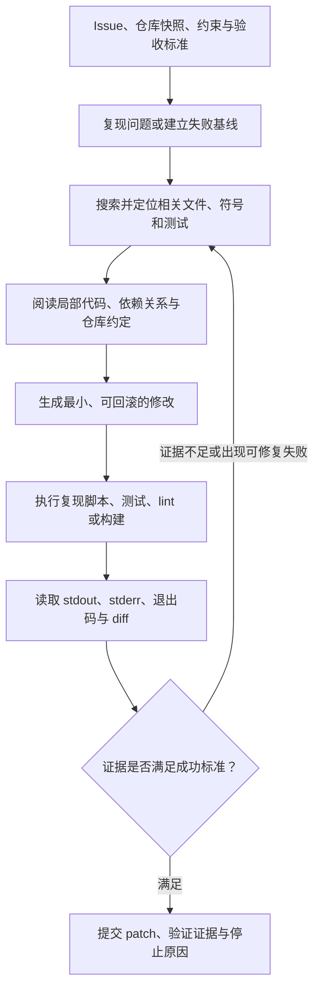
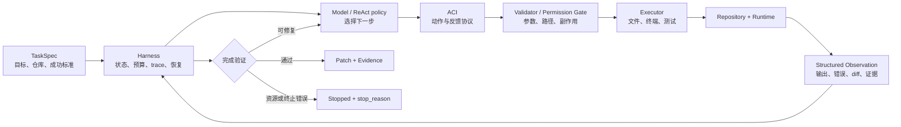
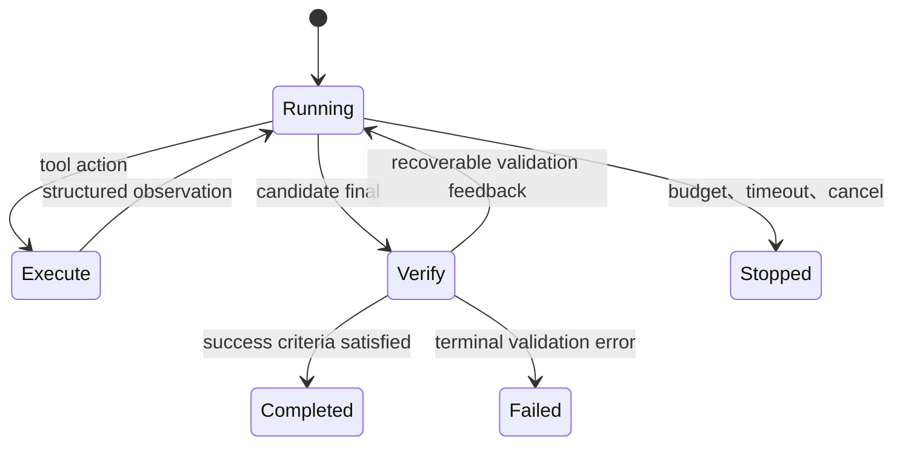

# SWE Agent 基础概念与 ACI

SWE Agent（Software Engineering Agent，软件工程智能体）面向的不是“补全一段代码”，而是在真实或可复现的代码仓库环境中持续观察、采取动作、读取执行反馈，并交付可验证的软件变更。它是理解现代 Coding Agent 的重要入口：模型能力固然重要，但工具接口、上下文组织、执行环境和验证方式同样会显著影响最终结果。

## 1. 先区分三个相近名称

### 1.1 SWE Agent：一类系统

泛称的 **SWE Agent** 指能够处理软件工程任务的 Agent 类别。其典型输入包括：

- issue、缺陷描述或功能需求；
- 固定版本的代码仓库；
- 构建、测试与运行环境；
- 约束条件和验收标准。

典型输出不是一段孤立代码，而是：

- 仓库内的文件变更或 patch；
- 执行过的测试、lint、构建或复现命令；
- stdout、stderr、退出码和失败分类；
- 对变更范围、验证证据和剩余问题的说明。

Claude Code、Codex、OpenHands、SWE-agent 等都可放入软件工程 Agent 的大类中，但它们的工具、权限、上下文管理和产品边界并不相同。

### 1.2 SWE-agent：一个具体研究系统

带连字符的 **SWE-agent** 是 John Yang、Carlos E. Jimenez 等人在 2024 年发表的具体系统。论文的核心贡献不是提出“让模型写代码”这一想法，而是研究 **Agent-Computer Interface（ACI）** 如何改变语言模型 Agent 在代码仓库中的行为和成功率。

论文将系统概括为：

$$
\text{SWE-agent} = \text{Language Model} + \text{Agent-Computer Interface}
$$

这里的 ACI 位于模型与计算机之间，规定模型能使用哪些动作，也规定文件、终端和错误状态如何反馈给模型。

### 1.3 SWE-bench：一个评测基准

**SWE-bench** 是由真实 GitHub issue 和代码仓库构造的软件工程评测。一个任务通常要求系统在指定仓库版本上生成 patch，再由任务对应的测试检查该 patch 是否解决问题。

因此三者关系是：

| 名称      | 类型               | 主要问题                              |
| --------- | ------------------ | ------------------------------------- |
| SWE Agent | 系统类别           | Agent 怎样完成仓库级软件工程任务？    |
| SWE-agent | 具体论文与开源系统 | 怎样设计适合语言模型的计算机接口？    |
| SWE-bench | 数据集与评测环境   | 生成的 patch 是否通过任务定义的测试？ |

SWE-bench 上的某个分数属于特定模型、Agent 实现、数据集版本和评测设置，不宜直接当作所有 SWE Agent 的固有能力。

## 2. 为什么软件工程任务需要闭环 Agent

短代码生成通常是“需求 → 一次生成”。仓库级任务的后续步骤却依赖刚获得的环境信息：

1. issue 中提到的符号可能已经改名；
2. 复现脚本可能暴露与初始猜测不同的根因；
3. 修改一个文件后，类型检查可能指出另一个调用点；
4. 目标测试通过后，相关回归测试仍可能失败；
5. 测试命令本身也可能因依赖、工作目录或环境配置失败。

所以，一个较完整的 SWE Agent 轨迹是：



流程中的关键点不是“调用过测试工具”，而是测试结果要回到下一轮决策。模型需要根据新的 observation 判断继续定位、修正实现、补充验证还是结束。

## 3. ReAct、ACI、Executor 与 Harness 的边界

这几个词经常被混在一起，实际对应不同层次。

### 3.1 ReAct：决定交互的时间结构

ReAct 研究如何把 reasoning、action 和 observation 交错起来。它主要回答：

> Agent 怎样根据刚获得的观察修正计划并选择下一步？

SWE-agent 论文明确采用 ReAct 式交互：模型每轮生成 thought 与 command，命令执行后的环境反馈再进入下一轮。

### 3.2 ACI：定义动作与反馈的语言

ACI 主要回答：

> 模型可以怎样操作计算机，计算机又以什么格式把状态反馈给模型？

ACI 不只是一份工具名称列表。原论文中的 ACI 同时覆盖：

- 动作集合与参数；
- 命令文档；
- 搜索结果的摘要方式；
- 文件窗口、路径和行号；
- 编辑完成后的即时反馈；
- 语法错误等 guardrail；
- 终端没有输出时的明确状态；
- 历史 observation 的压缩和组合。

### 3.3 Executor：产生真实环境副作用

Executor 是确定性执行层。它解析并校验动作，然后实际读取文件、运行命令或写入变更，再捕获结果。模型提出“运行测试”只是候选动作；只有 Executor 返回的退出码和日志才是环境事实。

### 3.4 Harness：管理完整运行生命周期

Harness 把模型、ACI、Executor、状态、权限、预算、trace、checkpoint 和验证器组织成可运行系统。论文里的 ACI 是 Harness 的关键组成部分，但二者不是同义词。

下面是一个面向工程实现的分层图。权限门、预算和证据验证属于从论文思想推导出的生产扩展，并不是 2024 论文对原始 ACI 的完整定义。



## 4. 2024 论文中的 ACI 设计

### 4.1 搜索与仓库导航

原 SWE-agent 提供 `find_file`、`search_file` 和 `search_dir` 等专门命令：

- `find_file` 按文件名定位；
- `search_file` 在单个文件中查找字符串；
- `search_dir` 在目录中查找字符串；
- 搜索结果过多时，不把大量匹配全部注入上下文，而是提示 Agent 缩小查询。

这与人类界面的直觉并不总是相同。逐条展示搜索结果、让 Agent 不断调用 `next`，看起来像编辑器搜索，却会诱导模型机械遍历结果，消耗轮次和上下文。论文的消融实验中，摘要式搜索优于这种逐条迭代式搜索。

### 4.2 文件查看器

Agent 使用 `open` 查看文件，窗口一次最多呈现 100 行，并同时显示：

- 完整文件路径；
- 文件总行数；
- 当前可见行的行号；
- 窗口上方和下方省略了多少行。

模型可以滚动窗口或跳到指定行。这个设计解决两个相反问题：

- 片段过短时，模型缺少局部依赖和结构信息；
- 整个文件全部进入上下文时，噪声、成本和过期内容都会增加。

论文中的“100 行较好”是特定模型和 SWE-bench Lite 设置下的实验观察，不是适用于所有语言、文件和模型的常数。工程系统仍应按任务与模型评测窗口策略。

### 4.3 文件编辑器与 lint guardrail

论文中的 `edit` 与文件查看器配合，用起始行、结束行和替换文本完成一次多行编辑。编辑后系统立即展示更新后的文件窗口，让模型看到这次动作的真实效果。

编辑器还会运行 linter：

1. 计算候选修改；
2. 检查修改是否引入新的主要语法错误；
3. 如果出现错误，保留原文件；
4. 返回错误类型以及修改前后的相关片段；
5. 让 Agent 基于该 observation 重新编辑。

这体现了一个重要原则：**尽量在错误刚出现时阻断传播**。如果错误修改已经落盘，后续定位和测试会建立在损坏状态之上，恢复成本通常更高。

同时要注意，lint 通过只表示相应静态规则没有发现问题，并不等于功能正确，也不代替测试和需求验证。

### 4.4 终端执行与无输出反馈

SWE-agent 构建在 Linux shell 之上，Agent 仍可调用 Python、pytest 和常见命令。ACI 需要区分：

- 命令执行成功并产生输出；
- 命令执行成功但 stdout 为空；
- 命令返回非零退出码；
- 命令超时或被终止；
- Executor 自身发生协议或环境错误。

论文特别指出：如果命令没有输出，系统会返回一条明确的成功说明。否则模型可能把空 observation 解释为命令没有执行、执行仍未结束或工具丢失了结果。

一个更完整的终端 observation 可以抽象为：

```text
CommandResult {
  command_id
  cwd
  exit_code
  stdout
  stderr
  duration_ms
  timed_out
  truncated
  changed_files
}
```

这份结构是工程化扩展，用于表达论文所强调的“信息充分但简洁的反馈”。`truncated` 很重要：被截断的日志不是“完整日志中没有错误”。

### 4.5 上下文管理

原系统会在 prompt 中提供工具文档和示例，并要求模型生成符合协议的 thought 与 action。格式错误会形成 observation，请模型重新生成。

为了减少上下文噪声，原论文实验把最近五个 observation 保留为完整内容，更早的 observation 压缩成单行。这样做可以：

- 保留动作轨迹；
- 减少旧日志反复占用 token；
- 避免把修改前的文件内容误当成当前状态；
- 给后续交互留下更多上下文空间。

但“只保留最近五个”同样是论文实验配置，不是通用规则。生产 Harness 还需决定哪些信息属于必须长期保留的不变量，例如原始目标、验收标准、已批准权限、关键失败、当前 diff 和未完成检查。

## 5. ACI 的四条设计原则

论文通过轨迹检查和开发集实验，总结了四条 ACI 原则。

### 原则一：动作对 Agent 应简单、易理解

为人类设计的 shell 命令常有大量参数和组合方式。对模型而言，少量、命名明确、文档短而精确的动作更容易稳定使用。

简单不等于把一个高层动作拆成几十个微动作。每增加一次模型轮次，就增加一次格式、选择、延迟和上下文漂移的机会。

### 原则二：动作应紧凑且高效

重要操作应在一次动作中取得有意义的进展。例如，编辑器在同一次调用中完成多行替换，并立即返回更新后的局部内容。

动作粒度需要平衡：

- 太粗：参数复杂，副作用难控制，反馈难定位；
- 太细：需要多轮组合，状态容易漂移，成本和失败面扩大。

### 原则三：环境反馈应信息充分但简洁

反馈要让模型知道：

- 动作是否执行；
- 环境发生了什么变化；
- 当前关键状态是什么；
- 下一步修复所需的信息在哪里。

返回整个仓库、完整构建日志或整份大文件通常不是“更充分”，而是把相关信号淹没在噪声中。更合适的方式是稳定摘要、有限窗口、截断标记以及按需继续读取。

### 原则四：Guardrail 应阻断错误传播并促进恢复

模型会产生格式错误、无效搜索和破坏语法的编辑。Guardrail 的价值在于：

- 在执行前校验动作；
- 在不可接受修改落盘前拦截；
- 把错误转成清晰 observation；
- 保持原状态可继续操作；
- 让恢复路径短于重新构建整个环境。

Guardrail 属于确定性执行机制，不应只写在 system prompt 中。

## 6. 一次 SWE Agent 任务的阶段

### 6.1 固定任务和环境

记录仓库 URL、commit、依赖版本、工作目录、初始 `git status` 和验收标准。否则任务期间依赖或源码变化会让结果难以复现。

### 6.2 复现或建立失败基线

优先运行最小复现或目标测试，确认：

- 当前版本确实出现问题；
- 失败信息与 issue 一致；
- 测试命令和环境本身可运行；
- 后续可以用同一检查比较修改前后。

若复现成本过高，可以先定位，但应明确记录“尚未建立运行时复现”，避免把静态猜测写成已证实根因。

### 6.3 从宽到窄定位

常见顺序是：

1. 根据 issue 中的符号、路径和错误信息搜索；
2. 找到候选文件；
3. 阅读定义、调用方、测试和配置；
4. 必要时写小型复现脚本；
5. 形成可被后续观察推翻的根因假设。

论文轨迹也显示，成功任务通常从复现或定位开始，然后进入“编辑—执行”的反馈循环。

### 6.4 生成最小修改

修改前应掌握局部约束：

- 项目风格和类型规则；
- 输入输出契约；
- 相邻代码的错误处理；
- 现有测试表达的行为；
- 兼容性和公共 API 影响。

“最小”指覆盖根因所需的最小语义范围，而不是机械追求最少字符。一个只针对单个样例的补丁可能行数很少，却属于 overly specific implementation。

### 6.5 分层验证

验证可以从便宜、局部的检查逐步扩展：

```text
syntax / format
  -> focused reproduction
  -> target tests
  -> related tests
  -> typecheck / lint / build
  -> diff and unintended-file review
```

顺序不是固定规范。关键是明确每层检查覆盖什么，以及哪些检查因时间、环境或依赖条件尚未执行。

### 6.6 提交带证据的结果

最终输出至少区分：

- 修改了什么；
- 为什么这些修改对应根因；
- 实际运行了哪些命令；
- 每项验证的结果和退出状态；
- 哪些结论来自执行证据，哪些仍是静态推断；
- 运行是完成、资源停止还是出现终止错误。

## 7. 候选答案不是已验证完成

模型产生 `final` 只表示它建议结束。Harness 还要检查产物、证据和验收标准。



可修复的验证失败应作为新的 observation 回到 loop，例如：

- 缺少要求的输出字段；
- 没有运行目标测试；
- 引用的文件已在后续编辑中改变；
- 结果声称“构建通过”，但 trace 中只有 lint；
- diff 出现未说明的额外文件。

资源耗尽、用户取消或执行环境已经不可恢复，则应记录独立 `stop_reason`，不要伪装成正常完成。

## 8. 论文实验结果应怎样阅读

### 8.1 2024 年实验快照

NeurIPS 2024 论文在当时的固定设置中报告：

- SWE-bench full：GPT-4 Turbo + SWE-agent 解决 12.47%，即 286/2294；
- SWE-bench Lite：SWE-agent 为 18.0%，Shell-only Agent 为 11.0%；
- HumanEvalFix 中，论文表格报告 Python、JavaScript、Java 的 pass@1 分别为 87.7%、89.7%、87.9%。

这些数字用于说明交互式 Agent 和 ACI 设计在原设置中的效果。它们不是当前模型、当前 SWE-bench 版本或当前排行榜的结果。

### 8.2 ACI 消融实验

论文在 SWE-bench Lite 上报告的部分消融如下：

| 组件     | 设置                      | 解决率 |
| -------- | ------------------------- | -----: |
| 搜索     | 摘要式搜索                |  18.0% |
| 搜索     | 逐条迭代搜索              |  12.0% |
| 搜索     | 没有专门搜索工具          |  15.7% |
| 文件窗口 | 30 行                     |  14.3% |
| 文件窗口 | 100 行                    |  18.0% |
| 文件窗口 | 整个文件                  |  12.7% |
| 编辑     | edit + lint               |  18.0% |
| 编辑     | edit、无 lint             |  15.0% |
| 编辑     | 没有专门 edit             |  10.3% |
| 上下文   | 最近 5 个完整 observation |  18.0% |
| 上下文   | 完整历史                  |  15.0% |

这里最值得学习的不是某个固定参数，而是实验方法：对工具形态、反馈长度和历史策略做消融，并通过任务成功率和轨迹分析检查真实影响。“更像人类界面”“信息更多”或“工具更多”都不自动代表对模型更好。

### 8.3 当前项目状态

当前 SWE-agent 官方文档说明，主要开发已转向更简单的 **mini-swe-agent**，原 SWE-agent 进入维护阶段。因此：

- 学习 ACI 概念时，以 NeurIPS 2024 论文为主；
- 研究当前代码时，先确认仓库版本和官方迁移说明；
- 比较性能时，记录模型、数据集版本、Agent commit、配置和预算；
- 不把论文快照与当前项目宣传数字混在同一张表中。

## 9. 论文揭示的常见失败

### 9.1 实现语义错误

论文对未解决轨迹的分析中，约 52% 属于 incorrect implementation 或 overly specific implementation。Agent 可能成功定位文件、写出语法正确代码，却没有真正覆盖需求。

这说明：

- 定位正确不等于修复正确；
- lint 通过不等于行为正确；
- 单个复现通过也可能只是过拟合样例；
- 验收需要目标测试、相关回归和语义审查。

### 9.2 编辑失败会级联

论文报告，2294 个 GPT-4 Turbo 轨迹中有 1185 个至少出现一次失败编辑。模型通常能从一次错误中恢复，但连续失败越多，后续恢复机会越低。

因此编辑工具应：

- 尽早检查候选修改；
- 失败时保持原文件；
- 返回最小但足够的错误上下文；
- 给每次修改稳定标识；
- 支持查看当前真实文件，而不是依赖模型记忆旧内容。

### 9.3 成功快，失败慢

原论文发现成功轨迹通常更早提交，长时间运行的失败轨迹常在已有错误上继续累积成本。仅提高最大轮次并不会自动改善效果。

Harness 可以结合以下信号判断是否需要重新规划：

- 相同命令和参数重复出现；
- 同一位置连续编辑失败；
- 测试失败类别多轮没有变化；
- 搜索范围反复扩大却没有新证据；
- 剩余预算不足以完成验证。

这是一种工程推论：信号用于触发重新规划、恢复检查点或明确停止，具体阈值需要在自己的任务集上评测。

## 10. 从两篇经典论文得到的组合视角

ReAct 与 SWE-agent 关注不同问题：

| 层次         | ReAct                                   | SWE-agent                       |
| ------------ | --------------------------------------- | ------------------------------- |
| 研究问题     | 如何交错 reasoning、action、observation | 如何设计适合 LM 的计算机接口    |
| 主要贡献     | 交互和提示范式                          | 具体 SWE Agent 与 ACI           |
| 原实验环境   | Wikipedia、ALFWorld、WebShop            | 仓库、文件系统、终端、测试      |
| 对工程的启发 | 观察必须改变下一步决策                  | 动作和反馈格式会改变 Agent 行为 |

可以把完整链路总结为：

```text
TaskSpec
  -> Context Builder
  -> ReAct-style Decision Policy
  -> ACI Action
  -> Validator / Executor
  -> Repository Environment
  -> Structured Observation
  -> Evidence Validator
  -> Continue / Complete / Stop
```

其中：

- ReAct 定义“交互的时间协议”；
- ACI 定义“Agent 与计算机的输入输出语言”；
- Executor 负责“真实动作和结果”；
- Harness 负责“运行生命周期和边界”；
- Evaluator 负责“结果是否满足成功标准”。

## 11. 学完后的自测

1. 能否用一句话分别解释 SWE Agent、SWE-agent 和 SWE-bench？
2. 一个代码 Chatbot 给出补丁建议，与 SWE Agent 实际修改仓库的差异是什么？
3. ACI 为什么同时包含 action 和 observation？
4. 为什么完整文件输出有时比 100 行窗口表现更差？
5. 命令没有 stdout 时，ToolResult 至少还应返回哪些状态？
6. 为什么可修复的 final validation 失败应回到 Agent loop？
7. lint、目标测试、相关回归分别证明什么，又遗漏什么？
8. 如何记录模型、仓库、环境、配置和预算，使一次结果可以复现？
9. 若同一编辑连续失败，应继续增加轮次，还是触发怎样的恢复策略？
10. 论文中的 12.47% 应怎样描述，才不会与当前排行榜混淆？

## 参考资料

- [Shunyu Yao：个人学术主页与代表工作](https://ysymyth.github.io/)
- [ReAct：ICLR 2023 官方发表页](https://iclr.cc/virtual/2023/oral/12647)
- [ReAct：OpenReview](https://openreview.net/forum?id=WE_vluYUL-X)
- [ReAct：arXiv](https://arxiv.org/abs/2210.03629)
- [ReAct：项目主页](https://react-lm.github.io/)
- [ReAct：官方代码](https://github.com/ysymyth/ReAct)
- [SWE-agent：NeurIPS 2024 正式论文页](https://proceedings.neurips.cc/paper_files/paper/2024/hash/5a7c947568c1b1328ccc5230172e1e7c-Abstract-Conference.html)
- [SWE-agent：arXiv](https://arxiv.org/abs/2405.15793)
- [SWE-agent：官方仓库](https://github.com/SWE-agent/SWE-agent)
- [SWE-agent：当前官方文档](https://swe-agent.com/latest/)
- [SWE-bench：论文与数据集](https://arxiv.org/abs/2310.06770)
