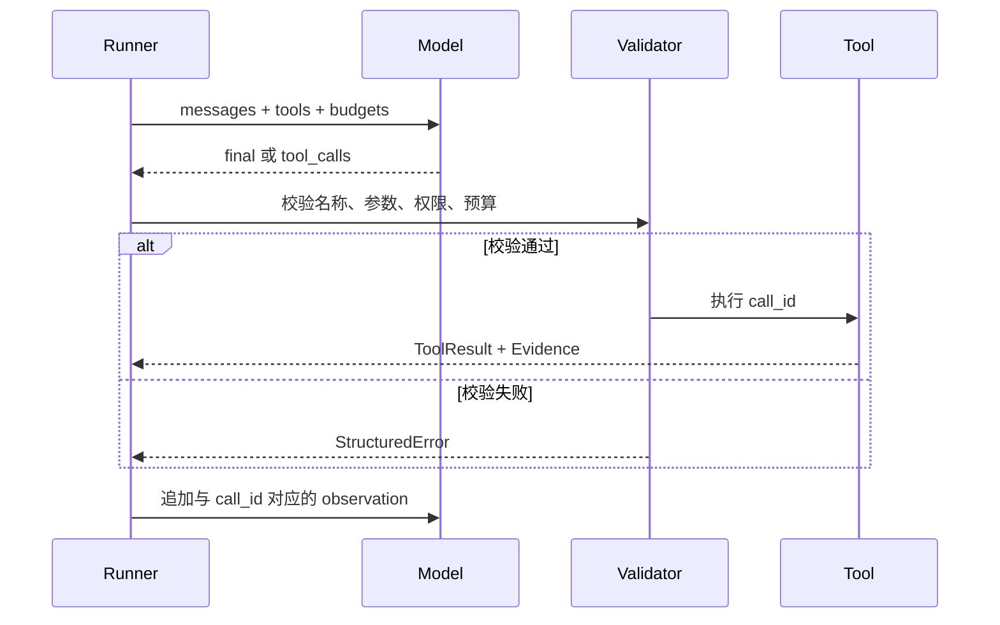

# 最小 Agent Loop 实现

## 1. 最小组成

一个可运行的最小 Agent 至少包含：

1. LLM client；
2. 对话与状态容器；
3. 工具定义和 JSON Schema；
4. tool call 解析；
5. 参数校验与工具执行；
6. tool result 回填；
7. 最终答案识别；
8. 最大步数、超时、取消和错误分类。

“模型输出一段 JSON”只是决策，不是完整闭环。只有结果回填后模型继续判断，才形成 Agent Loop。

## 2. 消息顺序

通用顺序如下：

```text
system: 目标、规则、工具说明
user: 当前任务
assistant: tool_call(id=call_1, name=read_file, args={...})
tool: tool_result(tool_call_id=call_1, content={...})
assistant: tool_call(...) 或 final_answer
```

关键不变量是每个调用 ID 与结果对应。并行调用时，也要保持协议要求的结果集合和顺序。

## 3. 参考实现

```python group=multi-3d8a038d43df label=Python
async def run_agent(goal, tools, options):
    state = create_initial_state(goal, options)

    while state.step < state.max_steps and now_ms() < state.deadline:
        response = await call_model(
            messages=state.messages,
            tools=[to_tool_schema(tool) for tool in tools],
            abort_signal=state.abort_signal,
        )
        if response.type == "final":
            return validate_final(response.text, state)

        for call in response.tool_calls:
            tool = find_tool(tools, call.name)
            parsed = tool.input_schema.safe_parse(call.arguments)
            result = (
                await execute_with_timeout(tool, parsed.data)
                if parsed.success
                else invalid_arguments_result(parsed.error)
            )
            state.messages.append(to_tool_result_message(call.id, result))
            state.trace.append({"call": call, "result": result})
        state.step += 1

    return stop_result(state)
```

```rust group=multi-3d8a038d43df label=Rust
async fn run_agent(
    goal: &str,
    tools: &[Tool],
    options: Options,
) -> Result<FinalResult, AgentError> {
    let mut state = create_initial_state(goal, options);

    while state.step < state.max_steps && now_ms() < state.deadline {
        let response = call_model(
            &state.messages,
            tools.iter().map(to_tool_schema).collect(),
            &state.abort_signal,
        )
        .await?;
        if let ModelResponse::Final { text } = response {
            return Ok(validate_final(&text, &state));
        }

        for call in response.tool_calls() {
            let tool = find_tool(tools, &call.name)?;
            let result = match tool.input_schema.safe_parse(&call.arguments) {
                Ok(input) => execute_with_timeout(tool, input).await,
                Err(error) => invalid_arguments_result(error),
            };
            state.messages.push(to_tool_result_message(&call.id, &result));
            state.trace.push(TraceItem { call, result });
        }
        state.step += 1;
    }

    Ok(stop_result(&state))
}
```

```javascript group=multi-3d8a038d43df label=JavaScript
async function runAgent(goal, tools, options) {
  const state = createInitialState(goal, options)

  while (state.step < state.maxSteps && Date.now() < state.deadline) {
    const response = await callModel({
      messages: state.messages,
      tools: tools.map(toToolSchema),
      signal: state.abortSignal,
    })
    if (response.type === 'final') return validateFinal(response.text, state)

    for (const call of response.toolCalls) {
      const tool = findTool(tools, call.name)
      const parsed = tool.inputSchema.safeParse(call.arguments)
      const result = parsed.success
        ? await executeWithTimeout(tool, parsed.data)
        : invalidArgumentsResult(parsed.error)
      state.messages.push(toToolResultMessage(call.id, result))
      state.trace.push({ call, result })
    }
    state.step += 1
  }

  return stopResult(state)
}
```

```typescript group=multi-3d8a038d43df label=TypeScript
async function runAgent(goal: string, tools: Tool[], options: Options) {
  const state = createInitialState(goal, options)

  while (state.step < state.maxSteps && Date.now() < state.deadline) {
    const response = await callModel({
      messages: state.messages,
      tools: tools.map(toToolSchema),
      signal: state.abortSignal,
    })

    if (response.type === 'final') {
      return validateFinal(response.text, state)
    }

    for (const call of response.toolCalls) {
      const tool = findTool(tools, call.name)
      const parsed = tool.inputSchema.safeParse(call.arguments)
      const result = parsed.success
        ? await executeWithTimeout(tool, parsed.data)
        : invalidArgumentsResult(parsed.error)

      state.messages.push(toToolResultMessage(call.id, result))
      state.trace.push({ call, result })
    }

    state.step += 1
  }

  return stopResult(state)
}
```

## 4. 错误要进入观察

将错误分成模型可利用的结构：

```json
{
  "ok": false,
  "error": {
    "type": "INVALID_ARGUMENT",
    "message": "path is required",
    "retryable": true,
    "fields": { "path": "missing" }
  }
}
```

参数错误可以让模型修正；权限拒绝通常需要换方案；超时可按幂等性决定重试；业务校验失败则应补充上下文或终止。

## 5. 最小验证清单

- 工具调用与结果 ID 对应；
- 未知工具不会执行；
- 非法参数不会进入 handler；
- 工具异常转成结构化结果；
- 超过最大步数会停止；
- 用户取消可中断模型和工具；
- 最终答案之前执行完成度验证；
- trace 能重建每一步。

## 参考资料

- [OpenAI Function Calling](https://platform.openai.com/docs/guides/function-calling)
- [Claude Tool Use](https://docs.anthropic.com/en/docs/agents-and-tools/tool-use/overview)
- [Gemini Function Calling](https://ai.google.dev/gemini-api/docs/function-calling)

<!-- agent-learning-expansion:v2 -->

## 6. 一轮运行的协议边界

一轮并不是“调用一次模型”这么简单，而是以下协议的组合：



运行时必须保持三个不变量：

1. **协议不变量**：每个调用都有唯一 ID，每个结果引用原调用；未知工具和非法参数不会进入 handler。
2. **状态不变量**：模型看到的历史与 Runner 持久化的状态一致；恢复运行不会重复提交已成功的副作用。
3. **资源不变量**：每轮都先检查 deadline、取消信号与预算，模型也不能延长运行时强制上限。

## 7. 决策、执行和验证要使用不同类型

```python group=multi-2ba42f5c714d label=Python
from dataclasses import dataclass, field
from typing import Any, Literal

@dataclass(frozen=True)
class ToolDecision:
    kind: Literal["tool"]
    call_id: str
    name: str
    arguments: Any

@dataclass(frozen=True)
class ToolResult:
    ok: bool
    call_id: str
    data: Any | None = None
    evidence: tuple["EvidenceItem", ...] = ()
    error: "ToolError | None" = None

@dataclass(frozen=True)
class FinalResult:
    ok: bool
    stop_reason: Literal[
        "COMPLETED", "MAX_STEPS", "TIMEOUT", "CANCELLED", "ERROR"
    ]
    evidence: tuple["EvidenceItem", ...] = ()
    answer: str | None = None
```

```rust group=multi-2ba42f5c714d label=Rust
use serde_json::Value;

struct ToolDecision {
    kind: &'static str,
    call_id: String,
    name: String,
    arguments: Value,
}

enum ToolResult {
    Ok {
        call_id: String,
        data: Value,
        evidence: Vec<EvidenceItem>,
    },
    Err {
        call_id: String,
        error: ToolError,
    },
}

enum StopReason {
    Completed,
    MaxSteps,
    Timeout,
    Cancelled,
    Error,
}

struct FinalResult {
    ok: bool,
    answer: Option<String>,
    stop_reason: StopReason,
    evidence: Vec<EvidenceItem>,
}
```

```javascript group=multi-2ba42f5c714d label=JavaScript
/**
 * @typedef {{
 *   kind: 'tool',
 *   callId: string,
 *   name: string,
 *   arguments: unknown
 * }} ToolDecision
 *
 * @typedef {{
 *   ok: boolean,
 *   callId: string,
 *   data?: unknown,
 *   evidence?: EvidenceItem[],
 *   error?: ToolError
 * }} ToolResult
 *
 * @typedef {{
 *   ok: boolean,
 *   answer?: string,
 *   stopReason: 'COMPLETED'|'MAX_STEPS'|'TIMEOUT'|'CANCELLED'|'ERROR',
 *   evidence: EvidenceItem[]
 * }} FinalResult
 */
```

```typescript group=multi-2ba42f5c714d label=TypeScript
type ToolDecision = {
  kind: 'tool'
  callId: string
  name: string
  arguments: unknown
}

type ToolResult =
  | { ok: true; callId: string; data: unknown; evidence: EvidenceItem[] }
  | { ok: false; callId: string; error: ToolError }

type FinalResult = {
  ok: boolean
  answer?: string
  stopReason: 'COMPLETED' | 'MAX_STEPS' | 'TIMEOUT' | 'CANCELLED' | 'ERROR'
  evidence: EvidenceItem[]
}
```

不要把三者压成一个任意 JSON。`ToolDecision` 是模型建议；`ToolResult` 是运行时事实；`FinalResult` 是经过完成度验证后的外部契约。类型分开后，日志、重放、统计和错误处理都会更清晰。

## 8. 从最小实现到生产 Runner

生产 Runner 还需增加：并行调用并发上限、幂等键、checkpoint、流式事件、审批暂停与恢复、上下文压缩、trace/span、模型与工具重试的独立策略，以及最终产物的语义验证。每增加一个机制，都应配一个确定性测试用例，而不是只靠对话试跑。

参考：[OpenAI Agents SDK 的 Agent loop](https://openai.github.io/openai-agents-python/running_agents/)。
