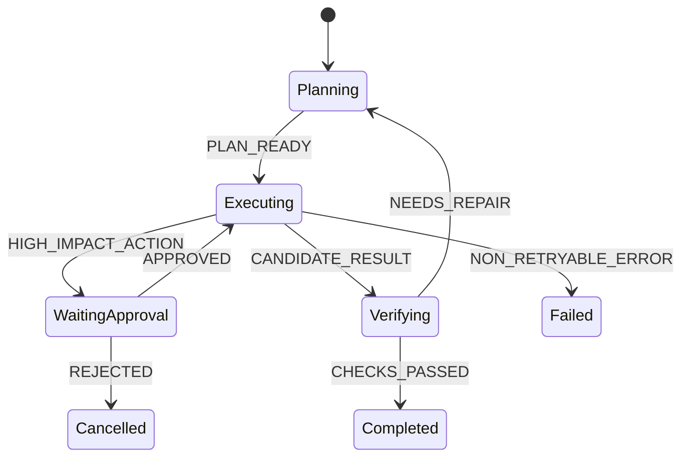

# 结构化输出与 Agent 状态机

## 1. 为什么需要结构化输出

自由文本适合最终回答，不适合驱动程序。动作决策至少应包含：

```json
{
  "action": "tool",
  "tool_name": "search",
  "arguments": { "query": "..." },
  "expected_observation": "包含官方来源的结果"
}
```

更推荐使用模型提供商的原生 tool/function calling，因为调用与普通文本分离，协议更清楚。无论来源如何，运行时都要再次使用 schema 验证，不能把模型输出当成可信输入。

## 2. 状态分类

- **任务状态**：目标、子任务、完成条件。
- **对话状态**：系统消息、用户消息、模型响应、工具结果。
- **执行状态**：步数、超时、取消、重试次数、成本。
- **证据状态**：来源、文件片段、查询结果、测试记录。
- **副作用状态**：待确认、执行中、已验证、需回滚。

把这些状态全部塞入自然语言历史会导致漂移。稳定字段应放入类型化对象或数据库，由 Harness 在每轮构造模型上下文。

## 3. 显式状态机

```text
INITIAL
  -> MODEL_DECISION
      -> TOOL_VALIDATION
          -> PERMISSION_CHECK
              -> TOOL_EXECUTION
                  -> RESULT_OBSERVATION
                      -> MODEL_DECISION
      -> FINAL_VALIDATION
          -> COMPLETED
  -> FAILED / CANCELLED / TIMED_OUT
```

显式状态机便于：

- 定义每个状态允许的转移；
- 在崩溃后从检查点恢复；
- 对每个转移记录 trace；
- 写状态级测试；
- 防止模型跳过权限或验证节点。

## 4. Schema 设计原则

- 字段少而明确；避免一个字符串同时表达多种含义。
- 枚举值稳定，错误类型可机器处理。
- 使用 `additionalProperties: false` 或等价约束减少意外参数。
- 描述说明语义、单位、边界和示例，而不只写类型。
- 工具结果也有 schema，尤其要区分 `not_found`、`empty`、`timeout`、`denied`。
- Schema 版本进入 trace，避免后续重放解释错旧数据。

## 5. 验证分层

1. **语法验证**：JSON 是否可解析。
2. **Schema 验证**：字段、类型、枚举、范围。
3. **语义验证**：文件路径是否存在、日期范围是否合理。
4. **权限验证**：主体是否有权执行。
5. **业务验证**：动作是否符合当前状态和幂等性要求。
6. **结果验证**：工具声称成功后，目标状态是否真的发生。

## 6. 测试方法

准备以下固定输入：

- 缺字段；
- 多余字段；
- 错误枚举；
- 极长字符串；
- 路径遍历；
- 重复 tool call ID；
- 工具成功但业务状态未改变；
- 同一幂等键重复提交。

期望系统给出确定错误，不把异常堆栈直接注入模型，也不丢失可诊断信息。

<!-- agent-learning-expansion:v2 -->
## 6. 结构化输出解决的是“可解析”，状态机解决的是“可执行”

JSON Schema 只能约束某次模型输出的形状，例如 `{"action":"search","query":"..."}`；它不会证明该动作在当前状态合法，也不会保证执行成功。状态机需要额外定义：

- 当前状态允许哪些事件；
- 事件进入后怎样更新数据；
- 哪些 guard 必须先通过；
- 副作用失败后回到哪个状态；
- 哪些状态是终态。



## 7. Schema 设计细节

采用封闭联合类型而不是大量可选字段；为枚举、长度、数值范围和数组上限设置约束；区分“字段缺失”和 `null`；给 schema 建版本号；模型输出通过解析后仍需做业务校验。例如合法的 `transfer(amount=1000000)` JSON 仍可能超过当前账户或审批额度。

## 8. 状态迁移的可测试性

为每条边至少写三类测试：正常迁移、guard 拒绝、重复事件。对副作用事件使用幂等键，把“事件已接收”和“副作用已提交”分别持久化。这样进程在提交后崩溃并恢复时，Runner 能识别完成记录，避免重复执行。
