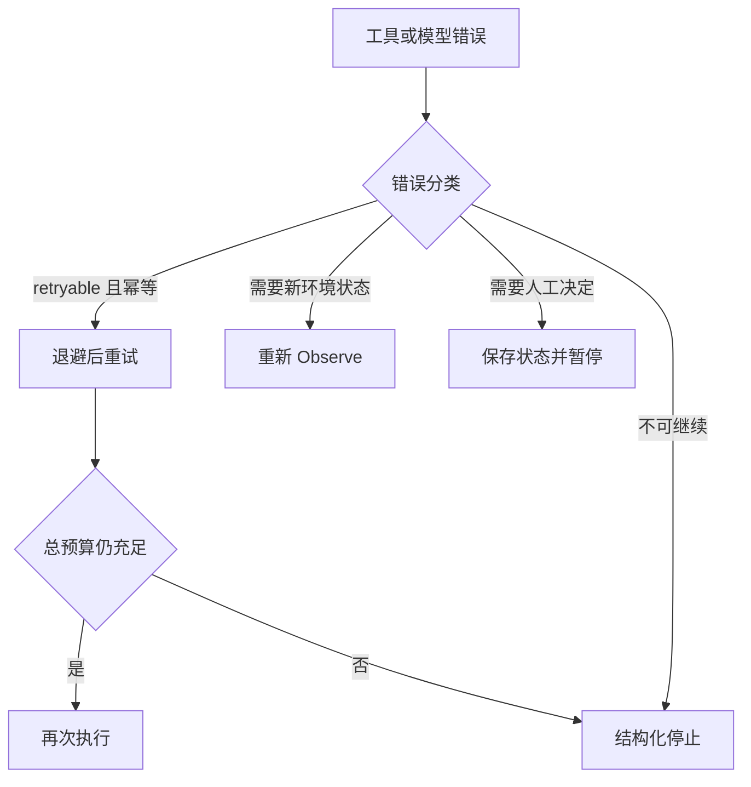

# Agent Loop 的终止条件、超时与错误处理

## 1. 终止条件必须由运行时强制

常见停止来源：

- 模型返回 final answer；
- 任务成功条件被验证器满足；
- 达到最大步骤；
- 达到 wall-clock deadline；
- token、金额或工具调用预算耗尽；
- 用户取消；
- 不可恢复错误；
- 连续重复动作触发循环检测。

只在 prompt 中写“最多调用 10 次”不够。模型可能忽略，网络重试也可能让真实次数与模型认知不同。

## 2. 多层超时

- **整次运行超时**：限制任务最长时间。
- **单轮模型超时**：控制 provider 卡住。
- **单工具超时**：不同工具配置不同上限。
- **外部请求超时**：连接、首字节、读取分别设置。
- **人工确认超时**：超时后保持待处理或明确取消。

超时结果应包含发生层级、已用时间、是否产生部分副作用以及是否适合重试。

## 3. 重试分类

| 错误               | 默认策略                            |
| ------------------ | ----------------------------------- |
| 临时网络错误、限流 | 指数退避 + jitter，尊重 Retry-After |
| 非法参数           | 返回字段错误，由模型修正            |
| 权限错误           | 停止该动作或切换到允许的只读路径    |
| 空结果             | 改写查询、扩大范围，但限制次数      |
| 业务冲突           | 重新读取最新状态，再决定            |
| 非幂等动作结果未知 | 先查询状态，避免直接重复            |
| 模型格式漂移       | 结构化重试一次，再失败则记录        |

## 4. 循环检测

对最近动作生成指纹：

```text
fingerprint = hash(tool_name + canonical_json(arguments) + relevant_state)
```

如果相同指纹连续出现，且观察没有新信息，可：

1. 向模型加入“动作重复且状态未变化”的观察；
2. 要求明确提出不同策略；
3. 超过阈值后停止并输出失败记录。

还要检测语义循环，例如搜索词只做轻微改写但结果集合相同。

## 5. 部分成功

长任务可能完成 8/10 个子项。状态应保存：

- 已完成项和验证证据；
- 未完成项及原因；
- 可安全重试的下一步；
- 已产生副作用；
- 检查点版本。

最终响应要区分 complete、partial、failed，而不是把部分结果包装成完整成功。

## 6. 故障注入测试

主动模拟：

- provider 429/500；
- 工具返回慢；
- 结果 JSON 损坏；
- 数据库冲突；
- 进程在工具执行后、状态提交前崩溃；
- 用户中途取消；
- 相同动作重复。

验证预算、幂等、恢复和 trace 是否仍然正确。

<!-- agent-learning-expansion:v2 -->
## 6. 错误分类决定恢复策略

| 错误类别 | 示例 | 默认策略 |
| --- | --- | --- |
| 参数错误 | schema 不匹配、必填项缺失 | 把字段级错误作为观察交给模型修正 |
| 暂时性基础设施错误 | 429、连接重置、短暂 5xx | 指数退避、抖动、总重试预算 |
| 权限错误 | 认证过期、路径越界、审批缺失 | 刷新凭据、申请审批或结束，不盲目重试 |
| 业务冲突 | 版本冲突、库存变化 | 重新观察最新状态后重规划 |
| 语义失败 | 结果不满足成功标准 | 回到计划或 evaluator，限制修复轮次 |
| 取消/截止时间 | 用户取消、deadline | 传播取消信号，写 checkpoint 和停止原因 |



## 7. 三层预算

一次调用有 `attempt_timeout`，一个步骤有 `step_deadline`，整个任务有 `run_deadline`。重试次数不是单独的无限计数器，而应消耗统一时间与成本预算。外层取消要传给模型请求、HTTP、浏览器和子进程；仅设置 `Promise.race` 而未中止底层操作会留下后台副作用。

## 8. 防止“看似结束”

最终文本出现“已完成”不构成成功。Runner 应检查必需产物、测试结果、提交状态或业务记录，并把未通过项作为 observation。最终返回同时包含 `status`、`stop_reason`、`checks` 和 `evidence`，让上层能区分完成、部分完成、取消与资源耗尽。
