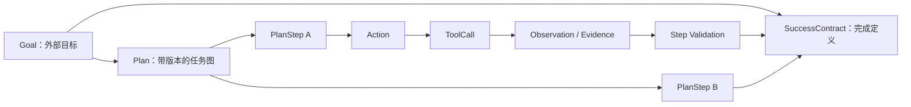
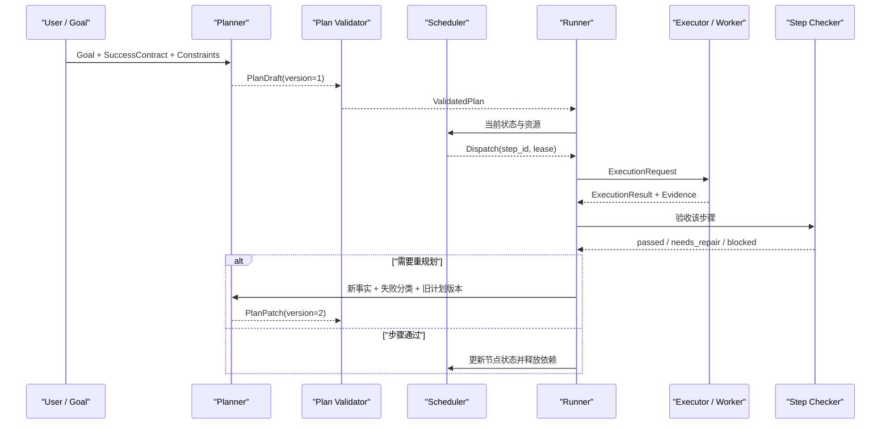
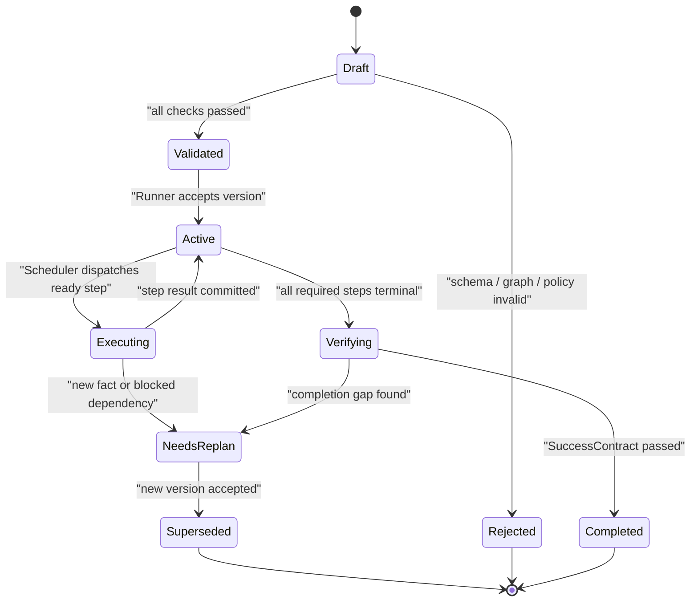
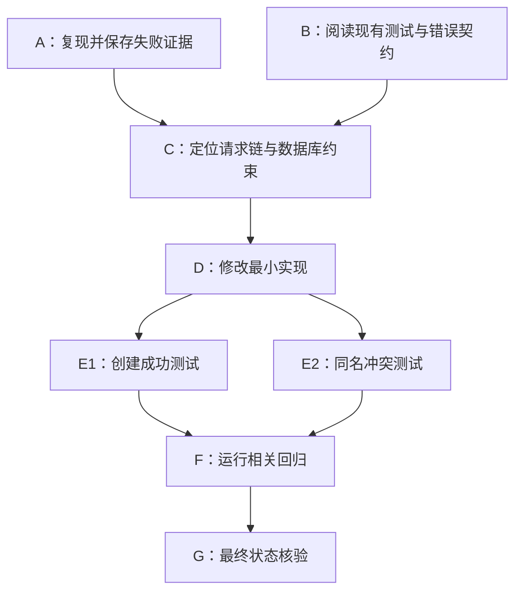

# 任务拆分与 Plan 表示：从目标到可验证执行图

## 1. 学习目标

完成本章后，应能回答以下问题：

1. 一段自然语言待办列表为什么还不是可执行计划；
2. `Goal`、`SuccessContract`、`Plan`、`PlanStep`、`Action`、`ToolCall` 分别处于哪一层；
3. Planner、Scheduler、Runner、Executor 各自拥有什么决定权；
4. 如何把依赖、输入、输出、验收条件、工具权限、预算和副作用写进数据契约；
5. 计划发生变化时，哪些旧结果仍可复用，哪些下游步骤必须失效；
6. 如何通过确定性校验，拦截循环依赖、悬空引用和不可验收的计划。

任务拆分的核心不是“把任务写得更长”，而是把一个开放目标转换成一组**依赖明确、输入可定位、输出可校验、失败可归因、状态可恢复**的工作单元。

---

## 2. 先区分六个容易混淆的概念

| 概念                | 含义                               | 例子                                         |
| ------------------- | ---------------------------------- | -------------------------------------------- |
| `Goal`              | 用户希望达成的外部结果             | “修复创建文件夹失败并提交变更”               |
| `SuccessContract`   | 判定 Goal 是否完成的机器可检查条件 | API 返回成功、数据库存在记录、回归测试通过   |
| `Plan`              | 为实现 Goal 设计的有版本执行图     | 读取代码 → 复现 → 定位 → 修改 → 测试         |
| `PlanStep` / `Task` | 可独立调度和验收的计划节点         | “为重复名称场景增加集成测试”                 |
| `Action`            | 一个 Task 内部的原子意图           | “读取 handler 文件”                          |
| `ToolCall`          | 某次 Action 对具体工具协议的调用   | `read_file({"path":"server/api/folder.ts"})` |

它们之间并非一一对应：

- 一个 `PlanStep` 可能需要多轮 Observe–Think–Act；
- 一次模型响应可能提出多个相互独立的 `ToolCall`；
- 工具返回成功，只表示该调用按协议结束，并不自动证明 `PlanStep` 验收通过；
- 所有步骤都标记成功，也仍需用 `SuccessContract` 检查外部目标。



---

## 3. Planner、Scheduler、Runner、Executor 的边界

生产系统最常见的问题之一，是把所有控制逻辑都塞进一个名为 `executor` 的类。更清晰的划分如下：

| 组件          | 核心职责                                                      | 典型输入                        | 典型输出                  | 不负责的决定                  |
| ------------- | ------------------------------------------------------------- | ------------------------------- | ------------------------- | ----------------------------- |
| **Planner**   | 提出或修订任务图，解释为何这些步骤足以覆盖目标                | Goal、当前事实、历史结果、约束  | `PlanDraft`、`PlanPatch`  | 不直接宣布某节点此刻可运行    |
| **Scheduler** | 根据依赖、资源、优先级和预算选择 ready task                   | 已校验 Plan、任务状态、资源状态 | `DispatchDecision`        | 不依靠模型猜测依赖是否满足    |
| **Runner**    | 拥有整次 run 生命周期、事件循环、checkpoint、暂停、取消和终止 | Run 配置、计划、事件            | Run 状态、trace、最终结果 | 不绕过 Scheduler 随意派发任务 |
| **Executor**  | 校验并执行一个具体节点、动作或工具调用，返回结构化结果        | 单个 `ExecutionRequest`         | `ExecutionResult`         | 不自行重写全局计划            |

工程中还会出现几个同名词，文档和类型名应主动消歧：

- `WorkflowExecutor`：工作流图中的一个处理节点；
- `ToolExecutor`：执行一个已校验的 `ToolCall`；
- `ProcessExecutor`：启动并监管一个操作系统子进程；
- `Worker`：接收 Scheduler 派发的任务并运行；
- `Runner` / `Orchestrator`：管理一次完整运行，而非某个单独工具。



这条边界带来一个重要性质：**Planner 的输出只是提案，确定性运行时仍会校验依赖、权限、预算和状态转移。**

---

## 4. 固定拆分、动态拆分与增量规划

### 4.1 固定拆分：路径预先已知

当步骤顺序稳定、分支有限时，用代码声明工作流通常更清楚。例如：

```text
提取需求 -> 生成草稿 -> 执行事实检查 -> 生成终稿
```

这是 prompt chaining。每一阶段的输入输出均可预先定义，错误也容易定位。模型负责节点内部推理，代码负责流程。

### 4.2 动态拆分：子任务数量取决于输入

当任务规模只有在观察输入后才清楚，可采用 orchestrator–workers：

1. Orchestrator 先分析输入；
2. 生成若干 `WorkerTask`；
3. Scheduler 并发派发无依赖任务；
4. 聚合器按显式规则合并结果；
5. Evaluator 检查覆盖率与冲突。

典型场景是代码库审计：仓库包含多少模块、各模块需要哪些检查，在读取目录前并不确定。

### 4.3 增量规划：每轮只承诺下一段

探索性任务常缺少完整事实。此时先给出较粗计划，再在新观察到来后细化：

```text
阶段 1：定位相关模块
阶段 2：依据实际实现生成修复步骤
阶段 3：依据测试结果决定收尾或修订
```

这与 ReAct 的交错推理和行动相容，但仍应把已承诺的步骤、版本和证据放入显式状态，而非只留在聊天文本中。

### 4.4 选择原则

| 条件                         | 更适合的控制方式        |
| ---------------------------- | ----------------------- |
| 路径稳定、合规要求高         | 固定工作流              |
| 子任务数量动态、彼此较独立   | Orchestrator–workers    |
| 环境信息逐步揭示             | 增量规划                |
| 高风险写操作                 | 固定外壳 + 受限动态规划 |
| 验收标准清晰但生成质量需迭代 | Evaluator–optimizer     |

通常最稳健的做法是**确定性外壳包围有限的模型决策空间**：模型提出计划，代码校验图；模型选择候选动作，Executor 再执行策略检查。

---

## 5. Plan 的数据契约

下面是一份可作为起点的 TypeScript 契约。字段可按业务裁剪，但“依赖、验收、预算、权限、版本”不宜仅存在于自然语言描述。

```typescript group=plan-contract label=TypeScript
type StepStatus =
  | 'planned'
  | 'ready'
  | 'running'
  | 'waiting_approval'
  | 'succeeded'
  | 'partial'
  | 'blocked'
  | 'failed'
  | 'cancelled'
  | 'stale'

type ArtifactRef = {
  artifactId: string
  version: string
  mediaType: string
  digest?: string
}

type AcceptanceCriterion =
  | {
      kind: 'command_exit'
      commandRef: string
      expectedExitCode: number
    }
  | {
      kind: 'schema'
      artifactRef: string
      schemaId: string
    }
  | {
      kind: 'state_predicate'
      predicateId: string
      expected: unknown
    }
  | {
      kind: 'human_review'
      checklistId: string
    }

type StepBudget = {
  maxAttempts: number
  timeoutMs: number
  maxToolCalls?: number
  maxCostUsd?: number
}

type PlanStep = {
  id: string
  title: string
  objective: string
  dependsOn: string[]
  inputRefs: ArtifactRef[]
  expectedOutputs: Array<{
    name: string
    schemaId?: string
    mediaType: string
  }>
  acceptanceCriteria: AcceptanceCriterion[]
  allowedTools: string[]
  readScopes: string[]
  writeScopes: string[]
  budget: StepBudget
  priority: number
  status: StepStatus
  attempt: number
  evidenceRefs: string[]
  planVersion: number
}

type SuccessContract = {
  goalId: string
  requiredArtifacts: Array<{
    name: string
    schemaId?: string
  }>
  finalChecks: AcceptanceCriterion[]
  allowedPartial: boolean
}

type Plan = {
  planId: string
  goalId: string
  version: number
  createdFromObservationVersion: number
  rationale: string
  steps: PlanStep[]
  successContract: SuccessContract
}
```

同一语义也可用 Python 数据类表达：

```python group=plan-contract label=Python
from dataclasses import dataclass, field
from typing import Any, Literal

StepStatus = Literal[
    "planned", "ready", "running", "waiting_approval",
    "succeeded", "partial", "blocked", "failed",
    "cancelled", "stale",
]

@dataclass(frozen=True)
class StepBudget:
    max_attempts: int
    timeout_ms: int
    max_tool_calls: int | None = None
    max_cost_usd: float | None = None

@dataclass
class PlanStep:
    id: str
    objective: str
    depends_on: list[str]
    input_refs: list[str]
    expected_outputs: list[dict[str, Any]]
    acceptance_criteria: list[dict[str, Any]]
    allowed_tools: list[str]
    read_scopes: list[str]
    write_scopes: list[str]
    budget: StepBudget
    priority: int = 0
    status: StepStatus = "planned"
    attempt: int = 0
    evidence_refs: list[str] = field(default_factory=list)
    plan_version: int = 1
```

### 5.1 为什么需要 `createdFromObservationVersion`

计划来自某一时刻的世界状态。若文件、数据库记录或远端分支之后变化，旧计划可能已经过期。记录观察版本后，Runner 可在执行写操作前比较：

```text
plan.createdFromObservationVersion == state.currentObservationVersion
```

不相等时，不应直接把旧计划当作当前事实；系统可重新读取相关状态、局部重规划或把节点标记为 `stale`。

### 5.2 为什么验收条件要结构化

“确认修好了”缺少可执行语义。更好的步骤验收是：

```json
{
  "kind": "state_predicate",
  "predicateId": "folder_exists_once",
  "expected": {
    "parentId": "root",
    "name": "Agent基础",
    "count": 1
  }
}
```

结构化验收可由 Checker 重放，也让失败原因落在具体条件，而非只依赖模型的文字判断。

---

## 6. 高质量拆分的六条不变量

### 6.1 覆盖目标

每个外部成功条件至少应映射到一个步骤输出或最终检查。可构造覆盖矩阵：

| 成功条件       | 产生证据的步骤      | 最终检查   |
| -------------- | ------------------- | ---------- |
| 文件夹创建成功 | `fix-handler`       | 集成测试   |
| 重名错误稳定   | `add-conflict-test` | 断言错误码 |
| 无旧行为回归   | `run-regression`    | 测试汇总   |

存在未映射条件时，计划尚未覆盖目标。

### 6.2 步骤可独立验收

一个步骤应有明确产物和通过标准。若标题是“继续研究并完善”，其结束边界不明确。可改成：

> 对创建文件夹请求链路建立一份调用图，列出入口、数据库调用、异常映射，并用文件路径与行号作为证据。

### 6.3 依赖显式且图可排序

普通任务依赖应组成有向无环图。需要循环的 evaluator–optimizer 模式，应把循环放在一个受控复合节点内，并设置 `maxRounds`、预算和终止条件，而非在 Task DAG 中制造隐式环。

### 6.4 写入所有权清晰

并行步骤若会修改相同文件、数据库行或外部对象，应声明 `writeScopes`。Scheduler 据此串行化冲突任务，或为每个 worker 分配独立工作区后再进入显式 merge 步骤。

### 6.5 子任务大小适中

过大时失败难归因、checkpoint 粒度粗；过小时模型调用和调度开销过高。实用判断是：

- 单步有一个主要产物；
- 单步可在一次预算内完成；
- 失败后可单独重试；
- 下游只依赖其稳定输出，不依赖内部聊天过程。

### 6.6 副作用有边界

读操作、可逆写操作、外部提交应分层。高影响动作最好是独立步骤，带审批点、幂等键、前置状态摘要与回滚信息。

---

## 7. Plan Validator：模型计划进入调度前的确定性闸门

Validator 至少检查五层：

1. **结构校验**：字段类型、枚举、长度、唯一 ID；
2. **图校验**：依赖节点存在、无自依赖、可拓扑排序；
3. **引用校验**：每个 `inputRef` 有来源或属于初始输入；
4. **策略校验**：工具、路径、网络、写入范围和审批要求合规；
5. **可验收性校验**：每个节点有输出和验收条件，最终条件有证据来源。

下面实现最关键的图校验。它只判定结构，不替代业务可行性评估。

```python group=plan-validation label=Python
from collections import defaultdict, deque

class PlanValidationError(ValueError):
    pass

def validate_dag(steps: list[PlanStep]) -> list[str]:
    by_id = {step.id: step for step in steps}
    if len(by_id) != len(steps):
        raise PlanValidationError("DUPLICATE_STEP_ID")

    indegree = {step.id: 0 for step in steps}
    dependents: dict[str, list[str]] = defaultdict(list)

    for step in steps:
        for dependency in step.depends_on:
            if dependency not in by_id:
                raise PlanValidationError(
                    f"UNKNOWN_DEPENDENCY:{step.id}:{dependency}"
                )
            if dependency == step.id:
                raise PlanValidationError(f"SELF_DEPENDENCY:{step.id}")
            indegree[step.id] += 1
            dependents[dependency].append(step.id)

    ready = deque(sorted(
        step_id for step_id, degree in indegree.items() if degree == 0
    ))
    order: list[str] = []

    while ready:
        current = ready.popleft()
        order.append(current)
        for child in sorted(dependents[current]):
            indegree[child] -= 1
            if indegree[child] == 0:
                ready.append(child)

    if len(order) != len(steps):
        cyclic = sorted(
            step_id for step_id, degree in indegree.items() if degree > 0
        )
        raise PlanValidationError(f"DEPENDENCY_CYCLE:{cyclic}")
    return order
```

```typescript group=plan-validation label=TypeScript
function validateDag(steps: PlanStep[]): string[] {
  const byId = new Map(steps.map((step) => [step.id, step]))
  if (byId.size !== steps.length) throw new Error('DUPLICATE_STEP_ID')

  const indegree = new Map(steps.map((step) => [step.id, 0]))
  const dependents = new Map<string, string[]>()

  for (const step of steps) {
    for (const dependency of step.dependsOn) {
      if (!byId.has(dependency)) {
        throw new Error(`UNKNOWN_DEPENDENCY:${step.id}:${dependency}`)
      }
      if (dependency === step.id) {
        throw new Error(`SELF_DEPENDENCY:${step.id}`)
      }
      indegree.set(step.id, (indegree.get(step.id) ?? 0) + 1)
      dependents.set(dependency, [...(dependents.get(dependency) ?? []), step.id])
    }
  }

  const ready = [...indegree.entries()]
    .filter(([, degree]) => degree === 0)
    .map(([id]) => id)
    .sort()
  const order: string[] = []

  while (ready.length > 0) {
    const current = ready.shift()!
    order.push(current)
    for (const child of (dependents.get(current) ?? []).sort()) {
      const next = (indegree.get(child) ?? 0) - 1
      indegree.set(child, next)
      if (next === 0) ready.push(child)
    }
    ready.sort()
  }

  if (order.length !== steps.length) {
    const cyclic = [...indegree.entries()]
      .filter(([, degree]) => degree > 0)
      .map(([id]) => id)
    throw new Error(`DEPENDENCY_CYCLE:${cyclic.sort().join(',')}`)
  }
  return order
}
```

固定排序很重要：当优先级相同，按稳定 ID 排序可让测试、重放和审计得到一致结果。

---

## 8. 计划生命周期



几个关键约束：

- 同一 run 同一时刻只接受一个 active plan version；
- Planner 生成新版本后，旧版本先进入 `superseded`，再由 Scheduler 处理受影响任务；
- 节点状态变化由运行时提交，不由模型直接写数据库；
- `succeeded` 只表示步骤验收通过，整个 Goal 仍需最终检查；
- 计划文本、验证结果、版本差异和采用原因均应进入 trace。

---

## 9. 重规划：局部修订优先于全量推倒

### 9.1 触发条件

合理的重规划触发包括：

- 新观察推翻了步骤前提；
- 工具或资源长期不可用；
- 某步骤达到重试上限；
- 用户更新目标或约束；
- 下游验收发现覆盖缺口；
- 并发步骤产生冲突结果；
- 预算变化使原方案不再可行。

临时 429 或一次可重试超时通常属于执行恢复，不必立即重写计划。

### 9.2 PlanPatch 契约

```json
{
  "basePlanVersion": 3,
  "newPlanVersion": 4,
  "reasonCode": "NEW_REPOSITORY_STATE",
  "observations": ["obs_81", "obs_82"],
  "operations": [
    {
      "op": "replace",
      "stepId": "edit-handler",
      "newStep": {
        "id": "edit-transaction",
        "dependsOn": ["inspect-schema"]
      }
    },
    {
      "op": "invalidate_downstream",
      "fromStepId": "edit-handler"
    }
  ]
}
```

采用 patch 而非只保存一份新文本，可解释“为什么变更”“哪些结果失效”“哪些产物可复用”。

### 9.3 下游失效规则

若步骤 `B` 消费 `A` 的产物，`A` 被替换或产物 digest 改变，则：

1. 尚未开始的 `B` 标记为 `stale`；
2. 正在执行的 `B` 请求取消；若已产生副作用，先记录结果再判断补偿；
3. 已成功的 `B` 重新验收其输入版本；输入不一致时标记为 `stale`；
4. 与 `A` 无依赖且输入版本未变的成功节点可复用；
5. 旧产物保留审计记录，但不再作为 active plan 的默认输入。

这是一种基于数据血缘的失效传播，而非“版本变了就重跑全部步骤”。

---

## 10. 示例：把代码修复目标转换为任务图

目标：

> 修复知识库创建文件夹失败；保留同名冲突语义；加入回归测试。



`D` 的验收不应写成“代码看起来正确”，而应是：

- 变更位于已确认的失败路径；
- 写范围仅覆盖指定文件；
- 类型检查通过；
- `E1` 和 `E2` 都消费修改后的实现；
- 数据库最终状态由查询确认；
- 重复请求的行为符合幂等或显式冲突契约。

若 `C` 发现根因来自云端迁移缺失，Planner 可用新步骤替换 `D`，但 `A`、`B` 的证据通常仍可复用。

---

## 11. 失败语义

| 状态或错误            | 含义                           | 默认处理                         |
| --------------------- | ------------------------------ | -------------------------------- |
| `INVALID_PLAN_SCHEMA` | 计划形状不符合契约             | 退回 Planner，附字段级错误       |
| `DEPENDENCY_CYCLE`    | 普通任务图存在环               | 拒绝该版本，要求显式复合循环节点 |
| `UNKNOWN_DEPENDENCY`  | 节点引用不存在                 | 拒绝该版本                       |
| `UNRESOLVED_INPUT`    | 输入既非初始输入，也无上游产物 | 补充来源或新增前置步骤           |
| `UNVERIFIABLE_STEP`   | 缺少可执行验收条件             | 重写验收条件                     |
| `POLICY_CONFLICT`     | 所需工具或写范围超出策略       | 调整方案或进入审批               |
| `INFEASIBLE`          | 当前工具、资源或预算不足       | 选择替代路径或报告阻塞           |
| `BLOCKED`             | 依赖外部输入，当前缺少推进条件 | 保存 checkpoint 和所需输入       |
| `STALE_PLAN`          | 计划基于旧观察版本             | 重新观察并局部重规划             |
| `PARTIAL`             | 部分验收通过，仍有未满足条件   | 保留证据，明确剩余步骤           |

错误消息应包含稳定的机器码、相关 `stepId`、`planVersion` 和证据引用。自然语言解释用于诊断，不作为唯一状态。

---

## 12. 测试清单

### 12.1 契约与图

- [ ] 重复 `stepId` 被拒绝；
- [ ] 未知依赖、自依赖和多节点环被识别；
- [ ] 拓扑排序在相同输入下稳定；
- [ ] 悬空 `inputRef` 被识别；
- [ ] 每个必要成功条件至少有一个证据来源；
- [ ] 普通循环与受控 evaluator loop 被区分。

### 12.2 权限与副作用

- [ ] 超出 `writeScopes` 的步骤不进入 ready；
- [ ] 高影响节点会产生审批事件；
- [ ] 两个写范围冲突的节点不会同时执行；
- [ ] 已提交副作用与仅接收请求的状态分开记录。

### 12.3 版本与重规划

- [ ] 旧版本的迟到结果不会覆盖新版本状态；
- [ ] 上游产物版本改变后，下游按血缘失效；
- [ ] 无关成功节点可被新计划复用；
- [ ] 取消中的旧节点即使返回结果，也进入可审计的 orphan/late-result 路径；
- [ ] PlanPatch 可从 trace 重放并得到相同任务图。

### 12.4 完成度

- [ ] 所有步骤成功但最终检查失败时，Goal 保持未完成；
- [ ] `partial` 明确列出已完成、未完成和可恢复位置；
- [ ] Planner 的自述不会绕过确定性 Checker；
- [ ] checkpoint 包含 active plan version、节点状态和产物版本。

---

## 13. 进一步思考

1. **计划质量首先是接口质量。** 优美的自然语言不等于可执行计划；依赖、验收和版本才决定系统是否可恢复。
2. **分解与调度是两次不同决策。** Planner 说明“工作由哪些部分组成”，Scheduler 决定“当前哪部分满足运行条件”。
3. **模型更适合提出候选结构，代码更适合守住不变量。** 拓扑排序、作用域冲突、预算扣减和状态转移都应由确定性代码执行。
4. **重规划不是遗忘。** 保留旧计划、证据和 patch，系统才能解释为什么改变路线，并安全复用已验证结果。
5. **验收条件决定拆分粒度。** 若一个子任务找不到独立验收方法，它很可能仍过大、语义过虚，或只是内部思考步骤。

---

## 参考资料

- [Anthropic：Building Effective Agents](https://www.anthropic.com/engineering/building-effective-agents)——工作流与 Agent 的区分，以及 prompt chaining、routing、parallelization、orchestrator–workers、evaluator–optimizer 等模式。
- [OpenAI Agents SDK：Running agents](https://openai.github.io/openai-agents-python/running_agents/)——Runner 的循环、终止、工具执行和 max turns 语义。
- [OpenAI Agents SDK：Agent orchestration](https://openai.github.io/openai-agents-python/multi_agent/)——由 LLM 编排与由代码编排的边界。
- [LangGraph：Workflows and agents](https://docs.langchain.com/oss/python/langgraph/workflows-agents)——结构化规划、动态 worker 创建与状态聚合。
- [LangGraph：Persistence](https://docs.langchain.com/oss/python/langgraph/persistence)——checkpoint、super-step 与故障恢复。
- [Google ADK：Graph-based workflows](https://adk.dev/graphs/)——确定性图、route、join 与 Agent 节点组合。
- [Microsoft Agent Framework：Workflows](https://learn.microsoft.com/en-us/agent-framework/workflows/)——Executor、edge、运行状态与 checkpoint 的工作流模型。
- [ReAct: Synergizing Reasoning and Acting in Language Models](https://openreview.net/forum?id=WE_vluYUL-X)——推理与行动交错的经典方法。
