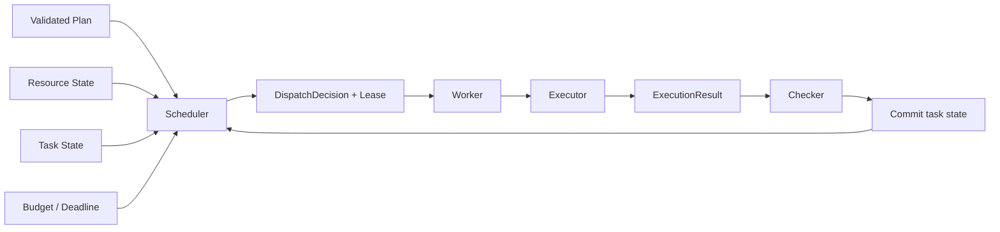
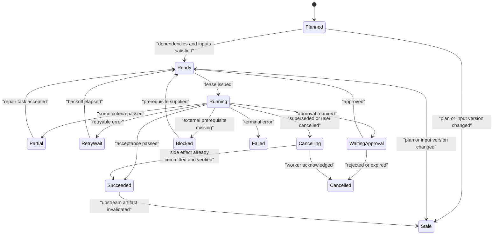
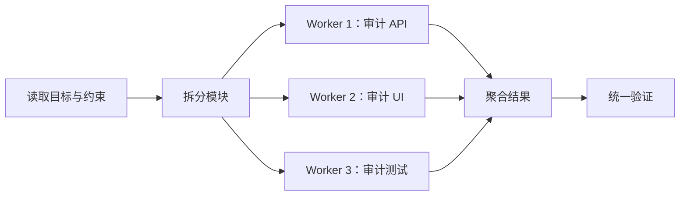
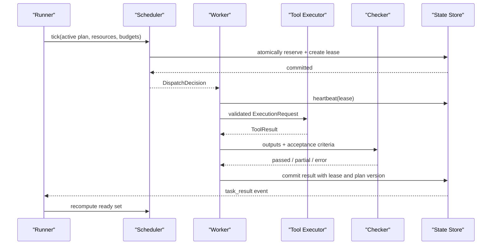

# Task Scheduler：依赖、并发、资源与动态重规划

## 1. Scheduler 解决什么问题

Planner 回答：

> 为了完成目标，需要哪些任务，它们之间有什么逻辑依赖？

Scheduler 回答：

> 在当前时刻，哪些任务已经具备执行条件；应按什么顺序、并发度和资源约束派发？

二者分离后，系统不再依靠模型每轮“凭感觉选择下一项”。依赖满足、预算扣减、锁冲突、并发上限、租约过期和迟到结果处理，都可由确定性运行时管理。

一个调度器至少维护五类事实：

1. **任务图**：节点、依赖和 active plan version；
2. **任务状态**：计划中、就绪、运行、等待、终态；
3. **数据状态**：输入产物是否存在、版本是否匹配；
4. **资源状态**：worker、并发令牌、路径锁、外部限流；
5. **运行约束**：deadline、成本、重试、审批、取消。

---

## 2. 再次确认组件边界

| 组件      | 决定内容                                       | 不应代替的组件                 |
| --------- | ---------------------------------------------- | ------------------------------ |
| Planner   | 任务结构、依赖、目标、候选工具、验收条件       | 不直接发放 worker lease        |
| Scheduler | ready 判定、优先级、资源分配、派发、重调度     | 不自行发明新的业务目标         |
| Runner    | run 生命周期、事件循环、checkpoint、停止、取消 | 不跳过调度条件直接运行节点     |
| Worker    | 在 lease 范围内执行已派发任务                  | 不修改全局任务图               |
| Executor  | 校验并执行一个节点内的具体动作或 ToolCall      | 不把一次工具成功等同于任务完成 |
| Checker   | 根据验收条件判断任务结果                       | 不提交真实副作用               |

本文中的 `Task Scheduler` 是运行时调度组件，不是操作系统调度器，也不是定时任务服务。



---

## 3. 任务状态机

推荐把“等待依赖”“等待重试”“等待审批”和“失败”分开，否则恢复逻辑会变得含糊。



### 3.1 终态并非永远不可变

相对于某一计划版本，`succeeded` 是终态；若上游产物被新计划替换，该结果会转成 `stale`。因此持久化记录应同时保存：

```text
task_id + plan_version + input_versions + attempt + result_digest
```

单独保存 `task_id=succeeded` 会丢失其成立条件。

### 3.2 `partial` 与 `failed` 的差别

- `partial`：已有可复用产物或部分验收条件通过；
- `failed`：该次执行没有形成可接受的任务结果；
- 二者都应记录是否产生副作用、哪些证据有效、下一次应从哪里恢复。

---

## 4. Ready Predicate：任务何时真正就绪

节点没有前置依赖，只说明拓扑上可能就绪。生产判定还应检查输入、策略、资源和预算。

设任务为 \(t\)，可执行条件可写成以下逻辑合取：

```text
ready(t) =
  active_plan(t)
  AND status_allows_dispatch(t)
  AND dependencies_satisfied(t)
  AND input_versions_available(t)
  AND policy_still_valid(t)
  AND approval_satisfied(t)
  AND resource_claims_available(t)
  AND retry_backoff_elapsed(t)
  AND run_budget_remaining(t)
  AND before_deadline(t)
  AND not_cancelled(run)
```

### 4.1 依赖成功的语义必须显式

下游对上游的接受策略可分为：

```python group=multi-000b9fb76281 label=Python
from dataclasses import dataclass
from typing import Literal

@dataclass(frozen=True)
class DependencyPolicy:
    kind: Literal[
        "require_success", "allow_partial", "always_run", "condition"
    ]
    required_artifacts: tuple[str, ...] = ()
    predicate_id: str | None = None
```

```rust group=multi-000b9fb76281 label=Rust
enum DependencyPolicy {
    RequireSuccess,
    AllowPartial { required_artifacts: Vec<String> },
    AlwaysRun,
    Condition { predicate_id: String },
}
```

```javascript group=multi-000b9fb76281 label=JavaScript
/**
 * @typedef (
 *   { kind: 'require_success' } |
 *   { kind: 'allow_partial', requiredArtifacts: string[] } |
 *   { kind: 'always_run' } |
 *   { kind: 'condition', predicateId: string }
 * ) DependencyPolicy
 */
```

```typescript group=multi-000b9fb76281 label=TypeScript
type DependencyPolicy =
  | { kind: 'require_success' }
  | { kind: 'allow_partial'; requiredArtifacts: string[] }
  | { kind: 'always_run' } // 例如 cleanup 或审计汇总
  | { kind: 'condition'; predicateId: string }
```

默认建议使用 `require_success`。`always_run` 适合 finally/cleanup，但仍受取消和安全策略控制。

### 4.2 输入版本也属于依赖

即使上游状态是 `succeeded`，若下游声明的 artifact digest 与当前版本不一致，下游仍不是 ready。调度器应依据数据血缘判断，而非只看状态枚举。

---

## 5. 调度数据契约

```typescript group=scheduler-contract label=TypeScript
type ResourceClaim =
  | {
      kind: 'concurrency_slot'
      pool: string
      units: number
    }
  | {
      kind: 'read_scope'
      scope: string
    }
  | {
      kind: 'write_scope'
      scope: string
    }
  | {
      kind: 'rate_limit'
      bucket: string
      tokens: number
    }

type TaskLease = {
  leaseId: string
  runId: string
  taskId: string
  planVersion: number
  attempt: number
  workerId: string
  issuedAt: string
  expiresAt: string
  heartbeatEveryMs: number
}

type DispatchDecision = {
  taskId: string
  planVersion: number
  attempt: number
  priority: number
  claims: ResourceClaim[]
  lease: TaskLease
  idempotencyKey: string
  inputRefs: Array<{
    artifactId: string
    version: string
    digest?: string
  }>
}

type TaskResult =
  | {
      kind: 'completed'
      leaseId: string
      idempotencyKey: string
      outputs: Array<{
        artifactId: string
        version: string
        digest?: string
      }>
      evidenceRefs: string[]
    }
  | {
      kind: 'error'
      leaseId: string
      idempotencyKey: string
      errorCode: string
      retryClass:
        | 'same_attempt_safe'
        | 'needs_new_observation'
        | 'needs_approval'
        | 'unknown_side_effect'
        | 'terminal'
      sideEffectState: 'none' | 'prepared' | 'committed' | 'unknown'
    }
```

```python group=scheduler-contract label=Python
from dataclasses import dataclass
from datetime import datetime
from typing import Literal

@dataclass(frozen=True)
class ResourceClaim:
    kind: Literal[
        "concurrency_slot", "read_scope",
        "write_scope", "rate_limit",
    ]
    key: str
    units: int = 1

@dataclass(frozen=True)
class TaskLease:
    lease_id: str
    run_id: str
    task_id: str
    plan_version: int
    attempt: int
    worker_id: str
    issued_at: datetime
    expires_at: datetime

@dataclass(frozen=True)
class DispatchDecision:
    task_id: str
    plan_version: int
    attempt: int
    priority: int
    claims: tuple[ResourceClaim, ...]
    lease: TaskLease
    idempotency_key: str
    input_refs: tuple[str, ...]
```

```rust group=scheduler-contract label=Rust
enum ResourceClaim {
    ConcurrencySlot { pool: String, units: u32 },
    ReadScope { scope: String },
    WriteScope { scope: String },
    RateLimit { bucket: String, tokens: u32 },
}

struct TaskLease {
    lease_id: String,
    run_id: String,
    task_id: String,
    plan_version: u32,
    attempt: u32,
    worker_id: String,
    issued_at: String,
    expires_at: String,
    heartbeat_every_ms: u64,
}

struct DispatchDecision {
    task_id: String,
    plan_version: u32,
    attempt: u32,
    priority: i32,
    claims: Vec<ResourceClaim>,
    lease: TaskLease,
    idempotency_key: String,
    input_refs: Vec<ArtifactRef>,
}

enum TaskResult {
    Completed {
        lease_id: String,
        idempotency_key: String,
        outputs: Vec<ArtifactRef>,
        evidence_refs: Vec<String>,
    },
    Error {
        lease_id: String,
        idempotency_key: String,
        error_code: String,
        retry_class: RetryClass,
        side_effect_state: SideEffectState,
    },
}
```

```javascript group=scheduler-contract label=JavaScript
/**
 * @typedef (
 *   { kind: 'concurrency_slot', pool: string, units: number } |
 *   { kind: 'read_scope', scope: string } |
 *   { kind: 'write_scope', scope: string } |
 *   { kind: 'rate_limit', bucket: string, tokens: number }
 * ) ResourceClaim
 *
 * @typedef {{
 *   leaseId: string,
 *   runId: string,
 *   taskId: string,
 *   planVersion: number,
 *   attempt: number,
 *   workerId: string,
 *   issuedAt: string,
 *   expiresAt: string,
 *   heartbeatEveryMs: number
 * }} TaskLease
 *
 * @typedef {{
 *   taskId: string,
 *   planVersion: number,
 *   attempt: number,
 *   priority: number,
 *   claims: ResourceClaim[],
 *   lease: TaskLease,
 *   idempotencyKey: string,
 *   inputRefs: ArtifactRef[]
 * }} DispatchDecision
 */
```

### 5.1 Lease 和 idempotency key 分别解决什么

- **Lease** 表示某个 worker 在有限时间内拥有该次尝试的执行权；
- **Idempotency key** 表示同一个逻辑副作用的稳定身份。

worker 丢失心跳后，Scheduler 可以让 lease 过期并重新派发。但若旧 worker 其实已提交外部写入，新 worker 直接重做会产生重复副作用。因此恢复顺序应是：

1. 查询副作用状态或幂等记录；
2. 已提交则获取并验证既有结果；
3. 明确未提交才重试；
4. 状态未知时进入人工确认或补偿路径。

Lease 避免长期占用调度权；幂等键避免同一逻辑操作被重复提交。二者互不替代。

---

## 6. DAG、fan-out 与 fan-in



- **fan-out**：一个节点产生多个独立 worker task；
- **fan-in**：聚合节点等待其所需上游达到规定状态；
- **join 策略**必须说明是 `all`、`any`、`quorum`、`best_effort` 还是条件表达式。

```python group=multi-4c98e132830a label=Python
from dataclasses import dataclass
from typing import Literal

@dataclass(frozen=True)
class JoinPolicy:
    kind: Literal["all", "any", "quorum", "best_effort", "predicate"]
    minimum: int | None = None
    deadline: str | None = None
    predicate_id: str | None = None
```

```rust group=multi-4c98e132830a label=Rust
enum JoinPolicy {
    All,
    Any,
    Quorum { minimum: usize },
    BestEffort { deadline: String, minimum: usize },
    Predicate { predicate_id: String },
}
```

```javascript group=multi-4c98e132830a label=JavaScript
/**
 * @typedef (
 *   { kind: 'all' } |
 *   { kind: 'any' } |
 *   { kind: 'quorum', minimum: number } |
 *   { kind: 'best_effort', deadline: string, minimum: number } |
 *   { kind: 'predicate', predicateId: string }
 * ) JoinPolicy
 */
```

```typescript group=multi-4c98e132830a label=TypeScript
type JoinPolicy =
  | { kind: 'all' }
  | { kind: 'any' }
  | { kind: 'quorum'; minimum: number }
  | { kind: 'best_effort'; deadline: string; minimum: number }
  | { kind: 'predicate'; predicateId: string }
```

“所有 worker 结束”也需要定义结束集合：`failed` 是否计入？`partial` 是否提供必要产物？被取消的非必要 worker 是否影响聚合？这些都应属于数据契约。

### 6.1 聚合不是简单拼接

fan-in 节点至少处理：

- worker 输出 schema；
- 重复事实和冲突事实；
- 引用来源与证据质量；
- 结果排序的确定性；
- 缺失 worker 的降级语义；
- 输入版本和聚合器版本。

多数投票适合降低随机分类误差，但它并不证明事实正确；独立验证与来源证据仍然重要。

---

## 7. 并发控制与资源所有权

### 7.1 哪些任务适合并发

通常适合：

- 读取互不依赖的文件；
- 对不同文档做相同分析；
- 调用相互独立的只读 API；
- 生成多个候选方案；
- 独立运行分片测试。

通常需要串行化或隔离：

- 修改同一文件或同一数据库行；
- 共享同一浏览器会话且步骤有顺序；
- 消耗严格顺序 token 的外部协议；
- 后一步依赖前一步实时输出；
- 使用全局可变状态的工具。

### 7.2 路径锁不应只做字符串相等

写入 `content/Agent开发` 与写入 `content/Agent开发/02-Agent Loop/a.md` 存在祖先路径冲突。可将 scope 规范化为资源树：

```text
write("content/Agent开发")
  conflicts with
read("content/Agent开发/02-Agent Loop/a.md")
write("content/Agent开发/02-Agent Loop/a.md")
```

不同工作树、事务快照或分支可降低冲突，但最终 merge 仍是独立步骤，并需处理语义冲突。

### 7.3 并发上限、速率和背压

并发度不等于任务数。Scheduler 应同时考虑：

- 模型 provider 并发上限；
- 工具进程和浏览器资源；
- 外部 API rate limit；
- 数据库连接池；
- 结果队列容量；
- 聚合器消费速度；
- run 级成本和 token 预算。

当生产速度高于消费速度时，应停止继续 fan-out、降低 dispatch rate 或拒绝新的低优先级任务，这就是背压。只在失败后重试，会让过载进一步放大。

---

## 8. 确定性调度算法

下面的简化算法展示关键顺序。生产实现还需持久化事务、分布式锁或单写者事件日志。

```python group=ready-scheduler label=Python
def schedule_tick(state, now):
    # 1. 先处理租约过期与取消，不先发新任务
    expire_leases(state, now)
    propagate_cancellation(state)

    candidates = []
    for task in state.active_plan.tasks:
        decision = evaluate_ready(task, state, now)
        if decision.ready:
            candidates.append((task, decision.claims))
        elif decision.mark_stale:
            commit_transition(task.id, "stale", decision.reason)

    # 2. 使用稳定排序，保证重放与测试一致
    candidates.sort(key=lambda item: (
        -item[0].priority,
        item[0].deadline,
        item[0].id,
    ))

    dispatched = []
    for task, claims in candidates:
        # 3. 资源申请和 lease 创建必须在同一原子提交中
        reservation = try_reserve_resources(claims)
        if reservation is None:
            continue

        lease = create_lease(
            task=task,
            worker=select_worker(task),
            now=now,
        )
        commit_dispatch(task, lease, reservation)
        dispatched.append(lease)

    return dispatched
```

```typescript group=ready-scheduler label=TypeScript
async function scheduleTick(state: SchedulerState, now: Date): Promise<TaskLease[]> {
  await expireLeases(state, now)
  await propagateCancellation(state)

  const candidates = state.activePlan.tasks
    .map((task) => ({ task, check: evaluateReady(task, state, now) }))
    .filter(({ check }) => check.ready)
    .sort(
      (a, b) =>
        b.task.priority - a.task.priority ||
        a.task.deadline.localeCompare(b.task.deadline) ||
        a.task.id.localeCompare(b.task.id),
    )

  const leases: TaskLease[] = []
  for (const { task, check } of candidates) {
    const committed = await state.transaction(async (tx) => {
      const reservation = await tx.tryReserve(check.claims)
      if (!reservation) return null

      const lease = await tx.createLease(task, now)
      await tx.transition(task.id, 'ready', 'running', {
        leaseId: lease.leaseId,
        planVersion: task.planVersion,
      })
      return lease
    })
    if (committed) leases.push(committed)
  }
  return leases
}
```

```rust group=ready-scheduler label=Rust
async fn schedule_tick(
    state: &mut SchedulerState,
    now: DateTime<Utc>,
) -> Result<Vec<TaskLease>, SchedulerError> {
    expire_leases(state, now).await?;
    propagate_cancellation(state).await?;

    let mut candidates: Vec<_> = state
        .active_plan
        .tasks
        .iter()
        .filter_map(|task| {
            let check = evaluate_ready(task, state, now);
            check.ready.then_some((task, check))
        })
        .collect();
    candidates.sort_by(|(left, _), (right, _)| {
        right
            .priority
            .cmp(&left.priority)
            .then(left.deadline.cmp(&right.deadline))
            .then(left.id.cmp(&right.id))
    });

    let mut leases = Vec::new();
    for (task, check) in candidates {
        let committed = state
            .transaction(|tx| async {
                let reservation = tx.try_reserve(&check.claims).await?;
                let lease = tx.create_lease(task, now).await?;
                tx.transition(
                    &task.id,
                    TaskStatus::Ready,
                    TaskStatus::Running,
                    &lease,
                )
                .await?;
                Ok(Some((reservation, lease)))
            })
            .await?;
        if let Some((_, lease)) = committed {
            leases.push(lease);
        }
    }
    Ok(leases)
}
```

```javascript group=ready-scheduler label=JavaScript
async function scheduleTick(state, now) {
  await expireLeases(state, now)
  await propagateCancellation(state)

  const candidates = state.activePlan.tasks
    .map((task) => ({ task, check: evaluateReady(task, state, now) }))
    .filter(({ check }) => check.ready)
    .sort(
      (a, b) =>
        b.task.priority - a.task.priority ||
        a.task.deadline.localeCompare(b.task.deadline) ||
        a.task.id.localeCompare(b.task.id),
    )

  const leases = []
  for (const { task, check } of candidates) {
    const committed = await state.transaction(async (tx) => {
      const reservation = await tx.tryReserve(check.claims)
      if (!reservation) return null
      const lease = await tx.createLease(task, now)
      await tx.transition(task.id, 'ready', 'running', {
        leaseId: lease.leaseId,
        planVersion: task.planVersion,
      })
      return lease
    })
    if (committed) leases.push(committed)
  }
  return leases
}
```

### 8.1 为什么“申请资源 + 状态转移 + 创建 lease”要原子提交

若先把任务改成 `running`，进程随后崩溃且 lease 尚未保存，任务可能永久卡住。若先占资源而未改状态，资源可能泄漏或同一任务被重复派发。原子提交使恢复过程能从一个一致快照继续。

---

## 9. 优先级、公平性与关键路径

最简单的排序是：

```text
priority DESC, deadline ASC, task_id ASC
```

但只按业务优先级会让低优先级 run 长期饥饿。常见改进：

- **aging**：等待越久，动态优先级越高；
- **weighted fair queue**：为不同租户或 run 分配权重；
- **critical path**：优先执行决定总工期的长依赖链；
- **shortest remaining work**：在交互场景降低平均完成延迟；
- **resource-aware**：避免大任务长期占满稀缺资源。

选择策略时应记录可解释的 `dispatchReason`，例如：

```json
{
  "taskId": "run-integration-tests",
  "dispatchReason": {
    "basePriority": 50,
    "agingBoost": 7,
    "criticalPathBoost": 10,
    "resourcePool": "test-runner",
    "tieBreak": "task_id"
  }
}
```

---

## 10. Runner、Scheduler 与 Executor 的一次交互



Executor 收到的是**一个已选择的动作**。它仍需校验工具参数、权限、幂等键和当前状态，但不负责从整个 DAG 里选下一项。

---

## 11. 故障恢复与投递语义

分布式 worker 常采用 **at-least-once delivery**：消息可能重复，但最终至少到达一个 worker。仅依赖消息系统通常得不到端到端 exactly-once 副作用；外部 API、文件系统和数据库之间缺少单一事务边界。

更可靠的组合是：

1. 稳定 `idempotencyKey`；
2. 执行前写入 intent；
3. 工具支持时传递同一幂等键；
4. 执行后保存返回标识与证据；
5. 状态提交前崩溃时，恢复流程先查询真实状态；
6. 事件发布与本地状态采用 transactional outbox 或等价机制；
7. 重复 `TaskResult` 通过 `(taskId, attempt, leaseId, resultDigest)` 去重。

### 11.1 心跳丢失

心跳丢失只证明 Scheduler 未及时收到进展，不证明 worker 已停止，也不证明副作用未发生。lease 过期后应先进入 `suspected_lost`，根据工具能力决定查询、取消或重派。

### 11.2 迟到结果

旧 lease 的结果到达时：

- 若其 plan version 已被替换，记录为 late/orphan result；
- 若副作用已提交，纳入补偿或复用判断；
- 不直接覆盖 active attempt；
- 保留证据，以便审计和恢复。

---

## 12. 重试分类

| `retryClass`            | 例子                              | Scheduler 行为                     |
| ----------------------- | --------------------------------- | ---------------------------------- |
| `same_attempt_safe`     | 只读请求临时 503，且未产生副作用  | 按退避策略重试                     |
| `needs_new_observation` | 版本冲突、输入文件已变化          | 重新读取事实，再判断是否重规划     |
| `needs_approval`        | 新路径需要额外写权限              | 暂停并生成审批事件                 |
| `unknown_side_effect`   | 请求超时，远端提交状态未知        | 查询状态或人工确认，不直接重复写入 |
| `terminal`              | schema 永久不兼容、资源确定不存在 | 结束该节点并传播失败               |

退避通常采用指数增长并加入 jitter，同时服从 `Retry-After`。所有重试共享 run 级时间、成本和调用预算；某节点达到 `maxAttempts` 后，不应通过重建同名任务偷偷重置计数。

---

## 13. 动态重规划与并发竞态

### 13.1 采用新计划的顺序

```text
1. Runner 冻结旧版本的新派发
2. Plan Validator 校验新版本
3. 计算 PlanDiff 和受影响节点
4. 原子切换 active plan version
5. 将未运行的受影响节点标记 stale
6. 向运行中的受影响节点发送取消
7. 重新计算 ready set
8. 对迟到结果执行版本与副作用判定
```

先校验新版本，再冻结和切换，可避免用一个非法计划替换仍可运行的旧计划。

### 13.2 正在运行的任务如何处理

| 情况                                     | 处理                             |
| ---------------------------------------- | -------------------------------- |
| 新旧版本中任务定义与输入 digest 完全相同 | 允许继续，结果可提交到新版本映射 |
| 只读任务输入已变化                       | 请求取消；旧结果仅供历史参考     |
| 可逆写任务已开始                         | 记录阶段，完成后验证或补偿       |
| 外部提交状态未知                         | 查询真实状态后再决定             |
| 任务与新计划无关                         | 取消并释放资源                   |

“任务名称相同”不代表可复用。应比较规范化定义、输入版本、工具版本、策略版本和验收条件。

### 13.3 图版本更新

```json
{
  "event": "PLAN_ACTIVATED",
  "runId": "run_42",
  "fromVersion": 3,
  "toVersion": 4,
  "changedSteps": ["inspect-db", "apply-migration"],
  "invalidatedSteps": ["edit-handler", "integration-test"],
  "reusedSteps": ["reproduce", "read-tests"],
  "reasonEvidence": ["obs_81"]
}
```

这是可重放调度的重要事件；仅保存“当前计划 JSON”会丢失切换历史。

---

## 14. 失败语义

| 错误码                 | 含义                           | 恢复方向                          |
| ---------------------- | ------------------------------ | --------------------------------- |
| `NOT_READY`            | 依赖、输入或审批尚未满足       | 等待相关事件                      |
| `RESOURCE_BUSY`        | 资源冲突或并发令牌不足         | 保留 ready，稍后重评估            |
| `RATE_LIMITED`         | 外部 bucket 暂无 token         | 按可用时间重新排队                |
| `LEASE_EXPIRED`        | worker 执行权已过期            | 查询真实状态，再决定重派          |
| `STALE_PLAN_VERSION`   | 结果来自非 active 计划         | 保存为迟到结果，不覆盖当前状态    |
| `STALE_INPUT`          | 输入版本已变化                 | 重新观察或重规划                  |
| `DUPLICATE_RESULT`     | 同一逻辑结果重复到达           | 幂等接收并保留首次提交            |
| `WRITE_SCOPE_CONFLICT` | 并行任务争用同一写资源         | 串行化或隔离工作区                |
| `BACKPRESSURE`         | 下游处理能力不足               | 暂缓 fan-out，降低派发率          |
| `BUDGET_EXHAUSTED`     | run 或 task 预算用尽           | checkpoint 后终止或由上层扩展预算 |
| `UNKNOWN_SIDE_EFFECT`  | 工具结束状态与真实提交状态不明 | 状态查询、对账或补偿              |

---

## 15. 测试清单

### 15.1 Ready 与依赖

- [ ] 只有全部必要依赖通过后才进入 ready；
- [ ] `partial` 仅在依赖策略声明接受时释放下游；
- [ ] 输入 artifact 版本不匹配时任务保持 stale；
- [ ] 条件边只在谓词满足时激活；
- [ ] cleanup 节点按 `always_run` 规则执行；
- [ ] 相同状态快照得到相同派发顺序。

### 15.2 并发与资源

- [ ] 全局、租户、run、工具四级并发上限均生效；
- [ ] 父路径和子路径写冲突被识别；
- [ ] 只读分片可并行，fan-in 等待正确集合；
- [ ] 资源申请失败不会把任务错误留在 running；
- [ ] 队列过载触发背压，而非无限创建 worker；
- [ ] aging 或公平队列避免低优先级任务长期饥饿。

### 15.3 Lease、重复与崩溃

- [ ] worker 丢失心跳后 lease 会过期；
- [ ] 旧 worker 的迟到结果不会覆盖新 attempt；
- [ ] 同一幂等键的外部写入只产生一个逻辑结果；
- [ ] 进程在副作用提交后、状态提交前崩溃时可恢复；
- [ ] 重复事件与乱序事件得到确定性结果；
- [ ] outbox 重发不产生重复业务动作。

### 15.4 重规划

- [ ] 新版本校验失败时旧版本保持 active；
- [ ] 切换版本期间停止旧版本的新派发；
- [ ] 上游变化会按数据血缘使下游失效；
- [ ] 未受影响且输入一致的任务可复用；
- [ ] 运行中写任务的取消与副作用状态均有记录；
- [ ] PlanDiff、激活事件和重调度过程可重放。

### 15.5 终止与可观测性

- [ ] deadline 和用户取消会传播到 worker 与底层工具；
- [ ] 每次派发记录 ready reason、资源声明和 lease；
- [ ] trace 能回答“为什么这个任务先运行”；
- [ ] 指标包含队列时间、运行时间、重试、资源等待和过期 lease；
- [ ] run 结束时没有遗留资源锁或未归属结果。

---

## 16. 实践结论

1. **Task DAG 是逻辑关系，Scheduler 是运行时决策。** 拓扑顺序只是 ready 判定的一部分。
2. **并发的前提是独立性与资源隔离。** “模型一次返回多个调用”并不自动意味着它们适合并行。
3. **分布式恢复依靠幂等、租约、版本和真实状态查询。** 单纯重试消息不足以覆盖副作用不确定性。
4. **重规划是一种版本迁移。** 先校验、再切换、再失效传播，且迟到结果需要单独语义。
5. **调度器应尽量确定性。** 稳定排序、原子状态转移和事件日志让故障重放与测试成为可能。

---

## 参考资料

- [Anthropic：Building Effective Agents](https://www.anthropic.com/engineering/building-effective-agents)——parallelization、orchestrator–workers 和 evaluator–optimizer 的适用边界。
- [OpenAI Agents SDK：Running agents](https://openai.github.io/openai-agents-python/running_agents/)——Runner loop、工具调用、并发工具和终止语义。
- [OpenAI Agents SDK：Agent orchestration](https://openai.github.io/openai-agents-python/multi_agent/)——代码编排、handoff 与 agents-as-tools。
- [LangGraph：Workflows and agents](https://docs.langchain.com/oss/python/langgraph/workflows-agents)——动态 worker、`Send`、共享状态和 reducer。
- [LangGraph：Persistence](https://docs.langchain.com/oss/python/langgraph/persistence)——super-step checkpoint、pending writes 与故障恢复。
- [Google ADK：Graph-based workflows](https://adk.dev/graphs/)——确定性 route、join、并行分支和 Agent 节点组合。
- [Google ADK：Dynamic workflows](https://adk.dev/graphs/dynamic/)——sequence、loop、parallel route、checkpoint 与 concurrency cap。
- [Google ADK：Event loop](https://adk.dev/runtime/event-loop/)——Runner 的事件处理、提交和恢复。
- [Microsoft Agent Framework：Workflows](https://learn.microsoft.com/en-us/agent-framework/workflows/)——Executor、edge、run、checkpoint 与 graph workflow。
