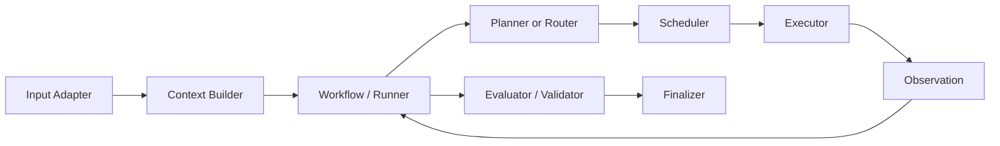
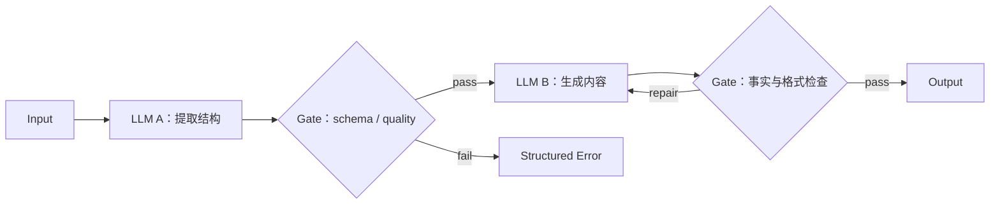
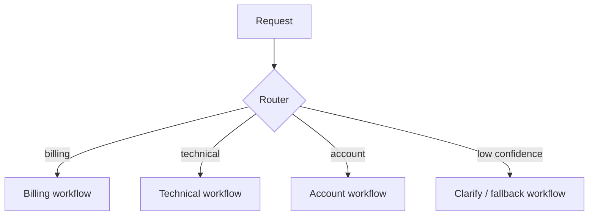
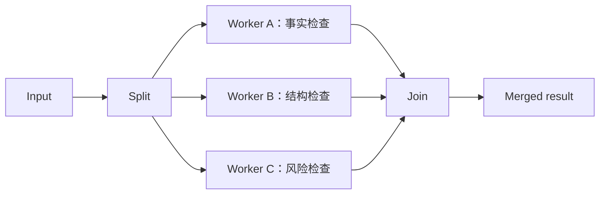
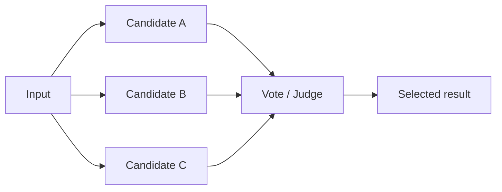
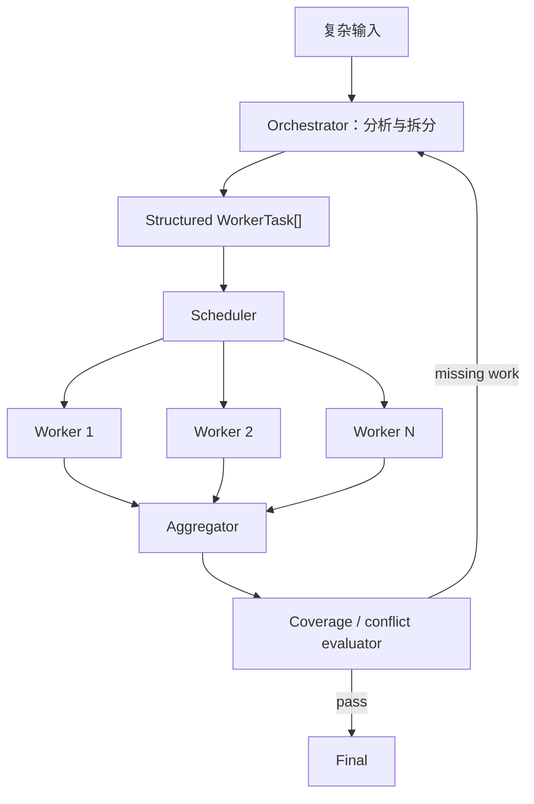
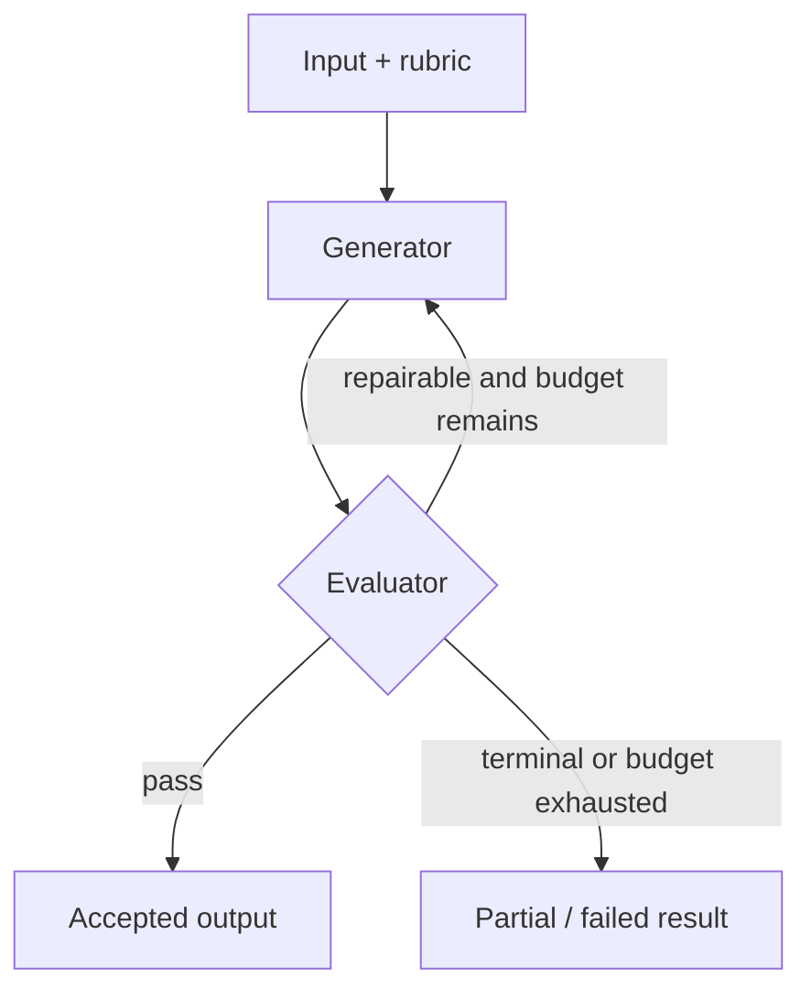
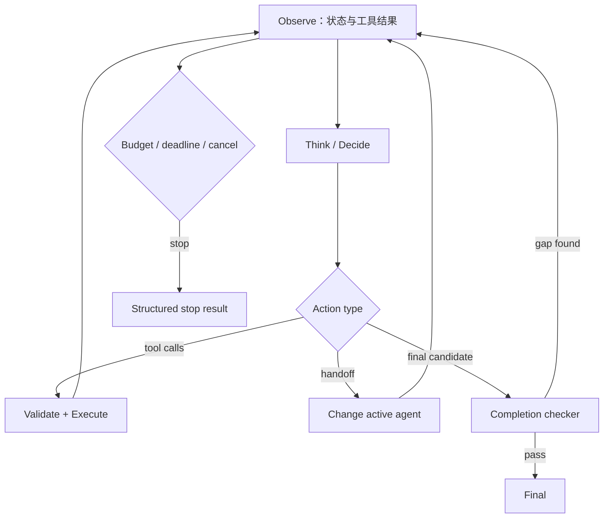
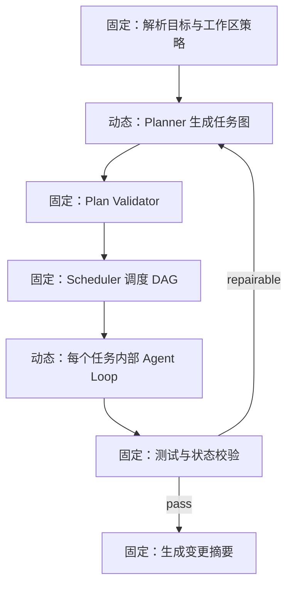
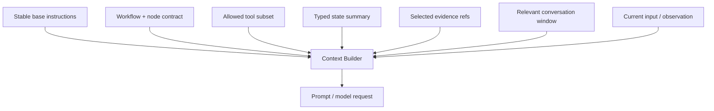

# Workflow 流程控制模式：从确定性链路到自主 Agent Loop

## 1. Workflow 与 Agent 的核心差异

Anthropic 在 _Building Effective Agents_ 中给出一个实用区分：

- **Workflow**：LLM 和工具沿着预先定义的代码路径运行；
- **Agent**：LLM 根据当前环境反馈，动态决定过程和工具使用。

两者不是互斥产品类型，而是一条控制权连续谱：

```text
固定函数
  -> Prompt Chaining
  -> Routing
  -> Parallelization
  -> Orchestrator–Workers
  -> Evaluator–Optimizer
  -> Autonomous Agent Loop
```

越靠右，系统越能适应开放环境，但成本、延迟、状态空间和失败模式也随之增加。工程目标不是“尽量 Agent 化”，而是把动态决策放在确有价值的位置，其他部分保持可预测。

---

## 2. 一条完整链路中的控制组件



这些名称有明确边界：

| 组件                  | 负责什么                                                              |
| --------------------- | --------------------------------------------------------------------- |
| Input Adapter         | 规范化用户输入、附件、事件和请求元数据                                |
| Context Builder       | 选择并拼接 system instruction、工具定义、对话、检索结果和当前任务状态 |
| Workflow / Runner     | 驱动整次运行、保存状态、处理暂停与终止                                |
| Planner / Router      | 提出任务图，或在候选分支中选择一个                                    |
| Scheduler             | 根据依赖和资源选择 ready task                                         |
| Executor              | 执行一个具体动作、节点或 ToolCall                                     |
| Observation           | 将真实工具结果、错误和证据写回状态                                    |
| Evaluator / Validator | 检查质量、schema、业务条件和目标完成度                                |
| Finalizer             | 生成对外结果，附状态、证据和停止原因                                  |

“多次调用模型”不自动构成 Agent；“调用一次工具”也不自动构成完整 Agent Loop。关键在于谁拥有下一步控制权、是否读取真实观察、是否存在可验证的终止条件。

---

## 3. 模式一：Prompt Chaining

### 3.1 数据流



前一步输出成为后一步输入，每个阶段可插入确定性 gate。

### 3.2 适用条件

- 步骤顺序稳定；
- 每阶段职责可清楚描述；
- 中间结果有 schema 或质量门；
- 任务拆成多个简单调用后，质量高于一个超长 prompt；
- 延迟增加是可接受的。

### 3.3 典型例子

```text
原始需求
 -> 提取功能与约束
 -> 生成实现计划
 -> 生成代码变更
 -> 执行测试
 -> 根据测试结果生成报告
```

注意“执行测试”通常是工具节点，不是让模型想象测试结果。

### 3.4 失败语义

- 上游输出 schema 错误：停在当前 gate，做一次受限修复或返回字段级错误；
- 中间语义不足：回到产生该中间结果的节点；
- 下游失败：保留已验证的上游产物，避免全链重跑；
- 链路太长：用 checkpoint 与 artifact ref 传递稳定数据，避免把全部历史反复拼入 prompt。

---

## 4. 模式二：Routing

Router 对输入分类，并选择专门流程、模型、工具集或知识源。



### 4.1 RouteDecision 契约

```typescript
type RouteDecision = {
  route: 'billing' | 'technical' | 'account' | 'needs_clarification'
  confidence: number
  reasonCodes: string[]
  requiredCapabilities: string[]
  inputVersion: string
}
```

Router 输出只决定分支，不直接执行该分支的高影响动作。运行时还要检查该 route 是否存在、所需工具是否可用、权限是否满足。

### 4.2 Router 的评估

不要只看整体准确率。至少统计：

- 每个 route 的 precision / recall；
- 低置信度覆盖率；
- 高代价误路由；
- 多意图输入；
- 输入漂移后的混淆矩阵；
- 路由延迟与后续成功率。

### 4.3 常见问题

- route 标签互相重叠；
- router prompt 与下游 capability 描述不同步；
- 强制单标签，但请求本身包含多个意图；
- 置信度没有校准；
- 下游失败后，系统仍不断选择同一路由。

多意图请求可拆成多个子任务，或选择能协调多域的上层流程，而非强行压缩成单标签。

---

## 5. 模式三：Parallelization

Anthropic 将并行化分为两类：

### 5.1 Sectioning：切分不同工作



各 worker 处理互补维度。合并器应声明冲突解决、缺失结果和证据保留规则。

### 5.2 Voting：同一任务产生多个候选



投票可降低随机误差，前提是候选之间有足够独立性。相同模型、相同 prompt 和相同错误前提可能产生高度相关的错误。对事实任务，应优先要求来源证据与独立验证；多数票本身不是事实证明。

### 5.3 并行化的前提

- 任务之间没有必须按顺序观察的依赖；
- 工具资源和写入作用域互不冲突；
- fan-in 有明确 join policy；
- 每个 worker 有独立预算和取消信号；
- 部分失败时的降级语义已定义。

并行分支的调度、并发上限和资源锁属于 Scheduler，而不是让模型口头承诺“同时处理”。

---

## 6. 模式四：Orchestrator–Workers

Orchestrator 先根据输入动态决定子任务，再由 worker 处理，最后综合结果。它与固定 parallelization 的差别是：**子任务集合不是预先写死的。**



### 6.1 WorkerTask 契约

```typescript
type WorkerTask = {
  id: string
  objective: string
  dependsOn: string[]
  inputRefs: string[]
  expectedOutputSchema: string
  acceptanceCriteria: string[]
  allowedTools: string[]
  readScopes: string[]
  writeScopes: string[]
  timeoutMs: number
  maxAttempts: number
}
```

### 6.2 适用场景

- 阅读多个代码模块并归纳；
- 搜索多个资料源并做来源对比；
- 修改范围取决于仓库结构；
- 对一批未知数量文档做处理；
- 复杂问题需要不同能力的专家 worker。

### 6.3 Orchestrator 的职责边界

Orchestrator 负责生成任务结构；Plan Validator 检查依赖与契约；Scheduler 决定并发派发；Worker/Executor 执行；Aggregator 合并；Evaluator 检查覆盖。

若 Orchestrator 同时自由创建任务、直接执行工具、修改全局状态并宣布完成，系统会失去清晰的恢复边界。

### 6.4 动态 worker 的状态

LangGraph 的 `Send` 模式展示了一个重要思路：动态创建的 worker 拥有各自输入和局部状态，输出通过 reducer 合并到共享状态。生产实现还应保存：

- worker task ID；
- 来源 plan version；
- 输入 artifact version；
- worker attempt 与 lease；
- 输出 schema version；
- merge key；
- 验收与证据。

---

## 7. 模式五：Evaluator–Optimizer

一个模型或流程生成结果，另一个 evaluator 按明确标准反馈，optimizer 在有限轮次内修订。



### 7.1 Evaluation 契约

```typescript
type Evaluation = {
  verdict: 'pass' | 'repair' | 'terminal'
  criterionResults: Array<{
    criterionId: string
    passed: boolean
    score?: number
    evidenceRefs: string[]
    issueCode?: string
  }>
  repairInstructions: Array<{
    target: string
    issueCode: string
    expectedChange: string
  }>
  evaluatorVersion: string
}
```

### 7.2 适用条件

- 质量标准可以明确表达；
- 迭代能实质改善结果；
- 额外调用成本可接受；
- 存在最大轮次、deadline 和最低改进阈值。

### 7.3 避免无限“批评—重写”

Runner 应强制：

```text
maxRounds
maxCost
deadline
minimumScoreDelta
sameIssueRepeatLimit
```

若连续两轮分数未改善，或重复同一问题，应结束循环、改用新策略或输出部分结果。停止权属于运行时，不属于 evaluator 的自然语言承诺。

### 7.4 模型评审与确定性验证组合

可由代码验证：

- JSON/schema；
- 编译、测试、lint；
- 文件存在与 digest；
- 数据库状态；
- 数值边界。

模型 evaluator 更适合：

- 表达是否清晰；
- 论证是否覆盖多个角度；
- 是否遗漏明显需求；
- 文风是否一致。

二者结合比“让模型评价所有事情”更稳健。

---

## 8. 模式六：Autonomous Agent Loop

Agent 在每轮读取状态，决定调用工具、交接或返回最终答案。



### 8.1 Runner loop 的典型语义

OpenAI Agents SDK 描述的运行循环包括：

1. 用当前 agent、输入和状态调用模型；
2. 若返回最终输出，则结束；
3. 若发生 handoff，则更新 active agent 并继续；
4. 若有 tool calls，则执行工具、追加结果并继续；
5. 超过 `max_turns` 等运行时限制时停止。

完整生产实现还应增加最终完成度 Checker。模型返回 `final` 是候选终止信号，不等于外部成功条件已经满足。

### 8.2 Agent Loop 的适用条件

- 下一步依赖实时观察；
- 任务路径很难提前枚举；
- 工具反馈会持续改变策略；
- 错误恢复需要探索；
- 可接受较高延迟和成本；
- 运行时具备预算、权限、trace、取消和验证。

若流程只有固定三步，Agent Loop 往往只是增加不确定性。

---

## 9. 混合模式：确定性外壳包围动态节点

实际系统很少只使用一种模式。一个代码修复 Agent 可采用：



这种设计的好处：

- 任务内保留探索能力；
- 全局依赖和资源保持可预测；
- 高影响动作仍经过固定策略；
- 每个动态节点都有输入、输出、预算和验收边界；
- 故障恢复可从 checkpoint 继续，而非重放整段对话。

---

## 10. WorkflowState 数据契约

```typescript group=workflow-state label=TypeScript
type WorkflowState = {
  runId: string
  workflowId: string
  workflowVersion: string
  phase: string
  inputRefs: string[]
  activePlanVersion?: number
  activeTaskIds: string[]
  routeHistory: RouteDecision[]
  artifacts: Array<{
    id: string
    version: string
    schemaId?: string
    digest?: string
  }>
  budgets: {
    remainingTurns: number
    remainingToolCalls: number
    remainingCostUsd?: number
    deadline: string
  }
  stop?: {
    reason: 'completed' | 'cancelled' | 'deadline' | 'budget' | 'terminal_error'
    evidenceRefs: string[]
  }
}
```

```python group=workflow-state label=Python
from dataclasses import dataclass, field
from datetime import datetime
from typing import Any

@dataclass
class WorkflowState:
    run_id: str
    workflow_id: str
    workflow_version: str
    phase: str
    input_refs: list[str]
    active_plan_version: int | None = None
    active_task_ids: list[str] = field(default_factory=list)
    route_history: list[dict[str, Any]] = field(default_factory=list)
    artifacts: list[dict[str, Any]] = field(default_factory=list)
    remaining_turns: int = 20
    remaining_tool_calls: int = 50
    deadline: datetime | None = None
    stop: dict[str, Any] | None = None
```

状态中保存 artifact ref，而非把所有大文本无限累积在一个对象中。Context Builder 根据当前节点需要选择内容，Runner 仍保留完整证据与状态历史。

---

## 11. 多语言示例：受控 Evaluator–Optimizer

这个示例强调控制权：模型只返回候选和评审；循环次数与停止条件由代码管理。

```python group=evaluator-loop label=Python
from dataclasses import dataclass

@dataclass
class Review:
    verdict: str
    score: float
    issues: list[str]

def generate_with_review(spec, generator, evaluator, max_rounds=3):
    candidate = generator(spec=spec, previous=None, issues=[])
    best = candidate
    best_score = float("-inf")

    for round_index in range(max_rounds):
        review: Review = evaluator(spec=spec, candidate=candidate)

        if review.score > best_score:
            best, best_score = candidate, review.score
        if review.verdict == "pass":
            return {"status": "completed", "value": candidate, "review": review}
        if review.verdict == "terminal":
            break

        candidate = generator(
            spec=spec,
            previous=candidate,
            issues=review.issues,
        )

    return {
        "status": "partial",
        "value": best,
        "score": best_score,
        "stop_reason": "MAX_REVIEW_ROUNDS",
    }
```

```typescript group=evaluator-loop label=TypeScript
type Review = {
  verdict: 'pass' | 'repair' | 'terminal'
  score: number
  issues: string[]
}

async function generateWithReview<T>(
  spec: unknown,
  generator: (input: { spec: unknown; previous?: T; issues: string[] }) => Promise<T>,
  evaluator: (input: { spec: unknown; candidate: T }) => Promise<Review>,
  maxRounds = 3,
): Promise<{
  status: 'completed' | 'partial'
  value: T
  review?: Review
  stopReason?: string
}> {
  let candidate = await generator({ spec, issues: [] })
  let best = candidate
  let bestScore = Number.NEGATIVE_INFINITY

  for (let round = 0; round < maxRounds; round += 1) {
    const review = await evaluator({ spec, candidate })
    if (review.score > bestScore) {
      best = candidate
      bestScore = review.score
    }
    if (review.verdict === 'pass') {
      return { status: 'completed', value: candidate, review }
    }
    if (review.verdict === 'terminal') break
    candidate = await generator({
      spec,
      previous: candidate,
      issues: review.issues,
    })
  }

  return {
    status: 'partial',
    value: best,
    stopReason: 'MAX_REVIEW_ROUNDS',
  }
}
```

真实实现还应加入 deadline、取消信号、调用成本、相同问题重复检测，以及每轮 artifact 版本。

---

## 12. Context Builder：流程控制与“大拼接 Prompt”的关系

流程定义“当前要做哪一步”，Context Builder 决定“这一轮模型看见哪些信息”。把所有历史、全部工具说明、完整仓库和每份检索文档直接拼接，会带来：

- token 成本和延迟上升；
- 关键指令被长上下文稀释；
- 旧状态与新状态冲突；
- 工具结果重复；
- 超出上下文后被截断；
- 缓存命中率下降；
- 敏感或无关数据传播到不需要的节点。

更清晰的输入层次：

```text
1. Base/System：稳定角色与全局规则
2. Workflow policy：当前流程、状态机与停止条件
3. Node instruction：当前节点任务、输出契约
4. Tool catalog：该节点允许使用的工具子集
5. State summary：结构化任务状态、预算、计划版本
6. Evidence bundle：当前步骤真正依赖的检索片段或文件
7. Conversation window：必要的近期交互
8. Current input：本轮新请求或 observation
```



应记录每一块的来源、版本、token 数和裁剪原因。旧 observation 若已被新事实取代，应通过状态摘要表达，不应继续与新状态平铺竞争。

---

## 13. 选择模式的决策矩阵

| 维度               |  Chain | Route | Parallel | Orchestrator–Workers | Evaluator–Optimizer | Agent Loop |
| ------------------ | -----: | ----: | -------: | -------------------: | ------------------: | ---------: |
| 路径是否预知       |     高 |    高 |       高 |                   中 |                  高 |         低 |
| 子任务数量动态     |     低 |    低 |       低 |                   高 |                  低 |         高 |
| 可并行独立性       |     低 |    低 |       高 |               中到高 |                  低 | 视任务而定 |
| 评价标准清晰       |     中 |    中 |       中 |                   中 |                  高 |         中 |
| 环境反馈决定下一步 |     低 |    低 |       低 |                   中 |                  中 |         高 |
| 延迟与成本         | 低到中 |    低 |       中 |               中到高 |              中到高 |         高 |
| 控制与审计难度     |     低 |    低 |       中 |                   中 |                  中 |         高 |

实用选择步骤：

1. 单次模型调用是否已经足够；
2. 路径固定时先用 chain / route；
3. 独立工作才引入 parallel；
4. 子任务集合动态时用 orchestrator–workers；
5. 有明确 rubric 且迭代有效时用 evaluator–optimizer；
6. 只有下一步高度依赖实时环境时，再采用更自主的 Agent Loop；
7. 无论哪种模式，都保留预算、状态、验证和 trace。

---

## 14. 反模式

### 14.1 角色聊天冒充协作

多个“专家角色”轮流输出意见，若没有独立输入、工具、状态、任务契约和聚合规则，仍只是多段 prompt，不等于可靠的多 Agent 系统。

### 14.2 Router 同时承担所有职责

Router 若一边分类，一边生成最终回答和提交副作用，分支边界与错误归因都会变差。更清楚的设计是 route decision 后进入专用流程。

### 14.3 并行写共享状态

多个 worker 修改同一文档或同一任务状态，最后依赖“后写覆盖”，会产生不可重复结果。应采用独立 workspace + merge，或明确资源锁。

### 14.4 Reviewer 无上限循环

没有 `maxRounds`、改进阈值和预算的 reviewer loop，可能只是在措辞上来回变化。运行时应保存每轮得分与 issue code，并检测停滞。

### 14.5 自由文本承担机器协议

“请在回答末尾写 APPROVED”容易受格式漂移影响。route、plan、tool decision、evaluation 和 stop result 应有结构化契约。

### 14.6 把模型 final 当成成功

最终文本是模型的候选结果。编译、测试、数据库状态、文件 digest 和业务谓词仍需 Checker 验证。

---

## 15. 失败语义

| 错误码                 | 所属模式       | 含义                     | 默认处理                              |
| ---------------------- | -------------- | ------------------------ | ------------------------------------- |
| `CHAIN_GATE_FAILED`    | Chain          | 中间产物未通过 gate      | 回到产物节点或结束                    |
| `UNKNOWN_ROUTE`        | Routing        | route 不在允许集合       | schema 错误，重新结构化一次           |
| `LOW_ROUTE_CONFIDENCE` | Routing        | 分类把握不足             | 进入澄清或通用流程                    |
| `WORKER_PARTIAL`       | Parallel / O-W | worker 只返回部分产物    | 按 join policy 决定等待、降级或补任务 |
| `MERGE_CONFLICT`       | Parallel / O-W | 多 worker 结果冲突       | 保留各自证据，进入 resolver/evaluator |
| `COVERAGE_GAP`         | O-W            | 动态拆分遗漏必要维度     | 生成有界补充任务                      |
| `EVALUATION_STALLED`   | E-O            | 多轮得分没有改善         | 停止循环并保留最佳版本                |
| `MAX_REVIEW_ROUNDS`    | E-O            | 达到最大评审轮次         | 返回最佳部分结果和未解决项            |
| `LOOP_REPEATED_ACTION` | Agent          | 相同动作与状态反复出现   | 注入重复观察，达到阈值后停止          |
| `CONTEXT_STALE`        | 全部           | 节点使用过期状态或证据   | 重建上下文并核对版本                  |
| `BUDGET_EXHAUSTED`     | 全部           | 时间、调用或成本预算耗尽 | checkpoint 后结构化终止               |

---

## 16. 测试清单

### 16.1 Prompt Chaining

- [ ] 每个节点只接收声明的输入；
- [ ] 上游 schema 错误不会进入下游；
- [ ] 下游失败时可复用已验证上游产物；
- [ ] checkpoint 恢复后不会重复已提交副作用；
- [ ] 节点版本变化会使相关缓存失效。

### 16.2 Routing

- [ ] 每个 route 有代表性正例、近邻反例和多意图样本；
- [ ] 低置信度进入明确流程；
- [ ] 未知 route 被 schema 拦截；
- [ ] 混淆矩阵与高代价误路由单独统计；
- [ ] route 与下游 capability 清单保持一致。

### 16.3 Parallelization / Orchestrator–Workers

- [ ] worker 任务具有独立 ID、输入版本和输出 schema；
- [ ] 写范围冲突会串行或隔离；
- [ ] join policy 在超时、失败、部分结果时均有确定语义；
- [ ] 聚合顺序稳定且保留来源；
- [ ] 动态 worker 数量受并发与总任务预算限制；
- [ ] 取消信号会传播到所有仍在运行的 worker。

### 16.4 Evaluator–Optimizer

- [ ] evaluator 按 rubric 返回 criterion-level 结果；
- [ ] 最大轮次、deadline、成本和停滞阈值生效；
- [ ] 每轮修订只针对结构化 issue；
- [ ] 保存最佳版本，而非默认返回最后版本；
- [ ] 确定性检查与模型评审分别测试。

### 16.5 Agent Loop 与混合工作流

- [ ] ToolCall 与 ToolResult ID 对应；
- [ ] handoff 更新 active agent 与工具集合；
- [ ] max turns、deadline、取消和预算由 Runner 强制；
- [ ] final candidate 经过完成度 Checker；
- [ ] 计划、调度、执行、验证的 trace 可串联；
- [ ] 动态节点恢复后不会重复已确认副作用。

### 16.6 Context Builder

- [ ] 每个 context block 有来源、版本和 token 统计；
- [ ] 节点只获得必要工具；
- [ ] 新状态替代旧状态，避免冲突事实并列；
- [ ] 超预算时按显式优先级裁剪；
- [ ] 裁剪不会移除输出 schema、停止条件或当前任务；
- [ ] evidence bundle 可从引用恢复原文。

---

## 17. 实践结论

1. **先用最简单、可组合的模式。** 复杂框架本身不会提高任务正确率。
2. **控制权必须可定位。** 每一步应能回答是代码、模型、Scheduler 还是人工在做决定。
3. **动态性应被数据契约包围。** 动态任务数量、动态路由和动态工具选择都要落入可校验类型。
4. **循环必须有外部停止器。** 轮次、预算、deadline、重复检测和完成度验证由 Runner 管理。
5. **上下文构建属于运行时设计。** 大拼接 prompt 不是状态管理；应按当前节点选择证据和工具。
6. **混合工作流通常优于全固定或全自主。** 确定性外壳负责安全、恢复和验证，Agent 节点负责真正需要探索的部分。

---

## 参考资料

- [Anthropic：Building Effective Agents](https://www.anthropic.com/engineering/building-effective-agents)——workflow/agent 区分与六类可组合模式。
- [OpenAI Agents SDK：Running agents](https://openai.github.io/openai-agents-python/running_agents/)——Runner loop、handoff、tool call、final output 和 max turns。
- [OpenAI Agents SDK：Agent orchestration](https://openai.github.io/openai-agents-python/multi_agent/)——LLM orchestration、code orchestration、agents-as-tools 和 handoff。
- [LangGraph：Workflows and agents](https://docs.langchain.com/oss/python/langgraph/workflows-agents)——prompt chaining、routing、parallelization、orchestrator–worker 和 evaluator–optimizer 示例。
- [LangGraph：Persistence](https://docs.langchain.com/oss/python/langgraph/persistence)——checkpoint、super-step 与 pending writes。
- [Google ADK：Graph-based workflows](https://adk.dev/graphs/)——确定性 graph、route、join 和 Agent 节点。
- [Google ADK：Dynamic workflows](https://adk.dev/graphs/dynamic/)——sequence、loop、parallel route 与并发限制。
- [Google ADK：Event loop](https://adk.dev/runtime/event-loop/)——Runner 的事件生成、处理、提交和恢复。
- [Microsoft Agent Framework：Workflows](https://learn.microsoft.com/en-us/agent-framework/workflows/)——Executor、edge、checkpoint 和 graph-based workflow。
- [AutoGen AgentChat：Teams](https://microsoft.github.io/autogen/stable/user-guide/agentchat-user-guide/tutorial/teams.html)——多 Agent team 的工作方式。
- [AutoGen AgentChat：Termination](https://microsoft.github.io/autogen/stable/user-guide/agentchat-user-guide/tutorial/termination.html)——终止条件与组合。
