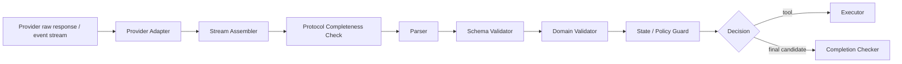

# Output Parser 与结构化响应：从 Provider 事件到可执行决策

## 1. Output Parser 不是“从文本里抠 JSON”

Agent 运行时接收的模型输出可能包含：

- 普通文本；
- 原生结构化输出；
- 一个或多个 tool/function calls；
- tool call 参数的流式 delta；
- reasoning、引用、附件等 provider 专有内容块；
- finish reason、usage、错误和中断事件。

因此 Output Parser 的真正任务是：

> 把 provider 的原始响应或事件流，按协议组装并规范化为运行时可识别的候选决策。

它不负责证明业务动作合理，也不负责宣布任务已经完成。正确链路是：



每一层都应有独立错误类型和测试。把它们压成一个 `try { JSON.parse(...) }`，会让格式错误、协议截断、业务冲突与执行失败混在一起。

---

## 2. 六层边界

| 层                            | 输入                 | 输出                     | 负责检查                               | 不负责检查         |
| ----------------------------- | -------------------- | ------------------------ | -------------------------------------- | ------------------ |
| Provider Adapter              | SDK/HTTP 原始对象    | 统一事件                 | provider 字段映射、事件类型            | 业务正确性         |
| Stream Assembler              | start/delta/end 事件 | 完整响应项               | call ID、片段顺序、结束边界            | 参数语义           |
| Parser                        | 完整响应项           | 语言级对象或规范化决策   | JSON/协议可解析性                      | 字段业务含义       |
| Schema Validator              | `unknown`            | typed value              | 类型、必填项、枚举、联合类型、额外字段 | 当前状态是否允许   |
| Domain/State Validator        | typed value + state  | accepted decision        | 工具存在、范围、业务约束、状态转移     | 真实副作用是否成功 |
| Executor / Completion Checker | accepted decision    | ToolResult / FinalResult | 执行、结果验证、目标完成度             | provider 事件拼装  |

一个 JSON 对象即使完全符合 schema，也可能在业务上错误。例如：

```json
{
  "kind": "tool",
  "name": "delete_file",
  "arguments": {
    "path": "content/index.md"
  }
}
```

schema 只能说明字段形状正确；Domain Validator 仍要检查工具是否注册、路径是否在允许写范围、是否需要审批、当前状态是否支持该动作。Executor 执行后还要确认真实结果。

---

## 3. 规范化数据契约

不要让整个 Agent 核心直接依赖某个 provider 的响应类。先定义内部协议：

```typescript group=normalized-output label=TypeScript
type RawProviderEvent = {
  provider: string
  responseId: string
  sequence: number
  type: string
  payload: unknown
}

type NormalizedContent =
  | {
      kind: 'text'
      itemId: string
      text: string
    }
  | {
      kind: 'tool_call'
      itemId: string
      callId: string
      name: string
      argumentsJson: string
    }
  | {
      kind: 'structured'
      itemId: string
      value: unknown
      schemaId: string
    }

type NormalizedResponse = {
  provider: string
  responseId: string
  model: string
  items: NormalizedContent[]
  finishReason:
    | 'stop'
    | 'tool_calls'
    | 'length'
    | 'content_filter'
    | 'cancelled'
    | 'error'
    | 'unknown'
  usage?: {
    inputTokens?: number
    outputTokens?: number
  }
}

type ToolDecision = {
  kind: 'tool'
  calls: Array<{
    callId: string
    name: string
    arguments: unknown
  }>
}

type FinalDecision<T> = {
  kind: 'final'
  value: T
}

type ParsedDecision<T> = ToolDecision | FinalDecision<T>
```

```python group=normalized-output label=Python
from dataclasses import dataclass
from typing import Any, Literal

@dataclass(frozen=True)
class ToolCall:
    call_id: str
    name: str
    arguments: Any

@dataclass(frozen=True)
class ToolDecision:
    kind: Literal["tool"]
    calls: tuple[ToolCall, ...]

@dataclass(frozen=True)
class FinalDecision:
    kind: Literal["final"]
    value: Any

ParsedDecision = ToolDecision | FinalDecision
```

```rust group=normalized-output label=Rust
use serde_json::Value;

struct RawProviderEvent {
    provider: String,
    response_id: String,
    sequence: u64,
    event_type: String,
    payload: Value,
}

enum NormalizedContent {
    Text { item_id: String, text: String },
    ToolCall {
        item_id: String,
        call_id: String,
        name: String,
        arguments_json: String,
    },
    Structured {
        item_id: String,
        value: Value,
        schema_id: String,
    },
}

struct NormalizedResponse {
    provider: String,
    response_id: String,
    model: String,
    items: Vec<NormalizedContent>,
    finish_reason: FinishReason,
    usage: Option<Usage>,
}

enum ParsedDecision<T> {
    Tool { calls: Vec<ToolCall> },
    Final { value: T },
}
```

```javascript group=normalized-output label=JavaScript
/**
 * @typedef {{
 *   provider: string,
 *   responseId: string,
 *   sequence: number,
 *   type: string,
 *   payload: unknown
 * }} RawProviderEvent
 *
 * @typedef (
 *   { kind: 'text', itemId: string, text: string } |
 *   { kind: 'tool_call', itemId: string, callId: string,
 *     name: string, argumentsJson: string } |
 *   { kind: 'structured', itemId: string, value: unknown, schemaId: string }
 * ) NormalizedContent
 *
 * @typedef {{
 *   provider: string,
 *   responseId: string,
 *   model: string,
 *   items: NormalizedContent[],
 *   finishReason: 'stop'|'tool_calls'|'length'|'content_filter'|
 *     'cancelled'|'error'|'unknown',
 *   usage?: { inputTokens?: number, outputTokens?: number }
 * }} NormalizedResponse
 */
```

内部对象应保留 provider 的 `responseId`、`itemId` 和 `callId`，以便把 ToolResult 精确关联到原调用，也便于 trace、重放和乱序事件诊断。

---

## 4. 四种常见输出策略

### 4.1 Provider-native Structured Output

模型供应商直接接受 JSON Schema 或等价声明，并返回结构化值。LangChain 将这种路径称为 `ProviderStrategy`；Google Gemini 文档也区分 structured output 与 function calling。

适合：

- 提取信息；
- 分类与路由；
- 生成 Plan；
- 生成 evaluator 结果；
- 最终返回机器消费对象。

优点：

- 结构约束在 provider 解码或响应层生效；
- 普通文本与结构化值边界清楚；
- 少一次从 Markdown 中猜测 JSON 的步骤。

仍需注意：

- provider 只支持 JSON Schema 的某个子集；
- schema 形状合规不代表业务语义正确；
- `finishReason=length`、中断和网络错误仍会产生不完整响应；
- 模型或 SDK 版本变化需要契约测试；
- 某些 provider 对 strict、枚举、递归类型和额外字段的行为不同。

### 4.2 原生 Tool / Function Calling

模型返回工具名和参数，运行时校验后执行工具。它适合“采取动作”：

```text
Model -> ToolCall(name, arguments, call_id)
Runner -> ToolResult(call_id, status, data)
Model -> next decision
```

工具调用与最终结构化回答是两个概念：

- function calling 连接模型与系统动作；
- structured output 约束模型返回给应用的数据形状。

它们可以在同一 Agent 中先后出现，但不要把 tool call 当作最终业务结果。

### 4.3 Tool-based Structured Response

当 provider 缺少原生结构化输出，可声明一个“返回结果”工具，让模型以工具参数形式提交结构化数据。LangChain 将此类回退抽象为 `ToolStrategy`。

例如：

```json
{
  "name": "submit_evaluation",
  "arguments": {
    "verdict": "repair",
    "issues": [
      {
        "code": "MISSING_SOURCE",
        "target": "section_3"
      }
    ]
  }
}
```

运行时可把该工具视为控制协议，而非真实外部副作用。

### 4.4 JSON Text Fallback

最后才考虑要求模型输出纯 JSON 文本，然后本地解析。使用时：

- 明确只接受一个顶层对象；
- 禁止 Markdown 前后缀；
- 设置长度上限；
- 使用严格 JSON parser；
- 解析后执行 schema 校验；
- 只进行有限次数修复；
- 保存原始响应与错误位置。

不建议用贪婪正则从任意回复中抽取第一个 `{...}`。嵌套括号、转义字符串、多个对象和恶意内容都会破坏这种方法。

---

## 5. Schema 设计：让错误落在边界上

### 5.1 使用封闭联合类型

比起大量可选字段：

```json
{
  "tool_name": "...",
  "arguments": {},
  "final_answer": "...",
  "error": "..."
}
```

更推荐判别联合：

```json
{
  "oneOf": [
    {
      "type": "object",
      "properties": {
        "kind": { "const": "tool" },
        "calls": {
          "type": "array",
          "minItems": 1,
          "maxItems": 4,
          "items": { "$ref": "#/$defs/toolCall" }
        }
      },
      "required": ["kind", "calls"],
      "additionalProperties": false
    },
    {
      "type": "object",
      "properties": {
        "kind": { "const": "final" },
        "answer": { "type": "string", "minLength": 1 }
      },
      "required": ["kind", "answer"],
      "additionalProperties": false
    }
  ]
}
```

这样可避免同一响应同时带 `calls` 和 `answer`，或既不像工具决策也不像最终结果。

### 5.2 `null` 与字段缺失不同

```json
{ "summary": null }
```

表示字段存在，但当前值为空；字段完全缺失通常表示没有产生或不适用。若二者业务语义相同，可统一；若不同，应在 schema 与类型中明确。

### 5.3 关闭额外字段

`additionalProperties: false` 或语言库中的 strict object 可帮助发现模型输出的拼写错误：

```json
{ "toolNmae": "search" }
```

若允许任意额外字段，这类错误可能静默进入下游。

### 5.4 给 schema 加版本

保存：

```text
schema_id = "agent.decision"
schema_version = "2.1.0"
provider_strategy = "native"
```

重放历史响应时要使用当时的 schema，而不是当前最新版本。兼容迁移应通过显式 adapter 完成。

### 5.5 限制集合和字符串

应设置合理的：

- `minItems` / `maxItems`；
- 字符串最大长度；
- 数值范围；
- 稳定 enum；
- 对象深度；
- tool calls 数量；
- payload 总字节数。

结构化输出也是外部输入，边界限制可避免内存、日志和下游系统被异常大响应拖垮。

---

## 6. Streaming：先组装完整项，再解析

流式 tool call 参数常按片段到达：

```text
item_start(call_7, name="read_file")
arguments_delta(call_7, "{\"pa")
arguments_delta(call_7, "th\":\"README.md\"}")
item_end(call_7)
response_end
```

每个 delta 都不是独立 JSON。Parser 应等待对应 item 的完成事件后再解析。

### 6.1 Stream Assembler 状态

```python group=multi-966cdd0bc796 label=Python
from dataclasses import dataclass, field

@dataclass
class PartialToolCall:
    item_id: str
    argument_chunks: list[str] = field(default_factory=list)
    started: bool = False
    ended: bool = False
    first_sequence: int = -1
    last_sequence: int = -1
    byte_length: int = 0
    call_id: str | None = None
    name: str | None = None
```

```rust group=multi-966cdd0bc796 label=Rust
struct PartialToolCall {
    item_id: String,
    call_id: Option<String>,
    name: Option<String>,
    argument_chunks: Vec<String>,
    started: bool,
    ended: bool,
    first_sequence: u64,
    last_sequence: u64,
    byte_length: usize,
}
```

```javascript group=multi-966cdd0bc796 label=JavaScript
/**
 * @typedef {{
 *   itemId: string,
 *   callId?: string,
 *   name?: string,
 *   argumentChunks: string[],
 *   started: boolean,
 *   ended: boolean,
 *   firstSequence: number,
 *   lastSequence: number,
 *   byteLength: number
 * }} PartialToolCall
 */
```

```typescript group=multi-966cdd0bc796 label=TypeScript
type PartialToolCall = {
  itemId: string
  callId?: string
  name?: string
  argumentChunks: string[]
  started: boolean
  ended: boolean
  firstSequence: number
  lastSequence: number
  byteLength: number
}
```

需要检查：

- sequence 是否单调或已正确去重；
- delta 引用的 item 是否已开始；
- `callId` 是否唯一；
- item 是否收到结束事件；
- response 是否正常结束；
- 累计字节是否超限；
- 同一个 call 的 name 是否中途改变；
- 取消或断线时如何标记未完成项。

### 6.2 一个简化的组装器

```typescript group=stream-assembler label=TypeScript
type ToolStreamEvent =
  | {
      type: 'tool_start'
      sequence: number
      itemId: string
      callId: string
      name: string
    }
  | {
      type: 'tool_arguments_delta'
      sequence: number
      itemId: string
      delta: string
    }
  | {
      type: 'tool_end'
      sequence: number
      itemId: string
    }

class StreamProtocolError extends Error {
  constructor(
    public code: string,
    message: string,
  ) {
    super(message)
  }
}

function assembleToolCalls(
  events: ToolStreamEvent[],
  maxBytesPerCall = 64 * 1024,
): Array<{
  callId: string
  name: string
  argumentsJson: string
}> {
  const items = new Map<
    string,
    {
      callId: string
      name: string
      chunks: string[]
      bytes: number
      ended: boolean
    }
  >()
  const callIds = new Set<string>()
  let previousSequence = -1

  for (const event of events) {
    if (event.sequence <= previousSequence) {
      throw new StreamProtocolError(
        'NON_MONOTONIC_SEQUENCE',
        `sequence=${event.sequence}`,
      )
    }
    previousSequence = event.sequence

    if (event.type === 'tool_start') {
      if (items.has(event.itemId) || callIds.has(event.callId)) {
        throw new StreamProtocolError('DUPLICATE_CALL_ID', event.callId)
      }
      items.set(event.itemId, {
        callId: event.callId,
        name: event.name,
        chunks: [],
        bytes: 0,
        ended: false,
      })
      callIds.add(event.callId)
      continue
    }

    const item = items.get(event.itemId)
    if (!item) {
      throw new StreamProtocolError('UNKNOWN_STREAM_ITEM', event.itemId)
    }

    if (event.type === 'tool_arguments_delta') {
      if (item.ended) {
        throw new StreamProtocolError('DELTA_AFTER_END', event.itemId)
      }
      item.bytes += new TextEncoder().encode(event.delta).byteLength
      if (item.bytes > maxBytesPerCall) {
        throw new StreamProtocolError('ARGUMENTS_TOO_LARGE', event.itemId)
      }
      item.chunks.push(event.delta)
    } else {
      item.ended = true
    }
  }

  return [...items.values()].map((item) => {
    if (!item.ended) {
      throw new StreamProtocolError('INCOMPLETE_TOOL_CALL', item.callId)
    }
    return {
      callId: item.callId,
      name: item.name,
      argumentsJson: item.chunks.join(''),
    }
  })
}
```

```python group=stream-assembler label=Python
import json
from dataclasses import dataclass, field

class StreamProtocolError(ValueError):
    def __init__(self, code: str, detail: str):
        super().__init__(f"{code}:{detail}")
        self.code = code
        self.detail = detail

@dataclass
class PartialCall:
    call_id: str
    name: str
    chunks: list[str] = field(default_factory=list)
    bytes_seen: int = 0
    ended: bool = False

def assemble_tool_calls(events, max_bytes_per_call=64 * 1024):
    items: dict[str, PartialCall] = {}
    call_ids: set[str] = set()
    previous_sequence = -1

    for event in events:
        sequence = event["sequence"]
        if sequence <= previous_sequence:
            raise StreamProtocolError(
                "NON_MONOTONIC_SEQUENCE", str(sequence)
            )
        previous_sequence = sequence

        if event["type"] == "tool_start":
            item_id = event["item_id"]
            call_id = event["call_id"]
            if item_id in items or call_id in call_ids:
                raise StreamProtocolError("DUPLICATE_CALL_ID", call_id)
            items[item_id] = PartialCall(call_id, event["name"])
            call_ids.add(call_id)
            continue

        item = items.get(event["item_id"])
        if item is None:
            raise StreamProtocolError(
                "UNKNOWN_STREAM_ITEM", event["item_id"]
            )
        if event["type"] == "tool_arguments_delta":
            if item.ended:
                raise StreamProtocolError(
                    "DELTA_AFTER_END", event["item_id"]
                )
            chunk = event["delta"]
            item.bytes_seen += len(chunk.encode("utf-8"))
            if item.bytes_seen > max_bytes_per_call:
                raise StreamProtocolError(
                    "ARGUMENTS_TOO_LARGE", event["item_id"]
                )
            item.chunks.append(chunk)
        elif event["type"] == "tool_end":
            item.ended = True

    result = []
    for item in items.values():
        if not item.ended:
            raise StreamProtocolError(
                "INCOMPLETE_TOOL_CALL", item.call_id
            )
        arguments_json = "".join(item.chunks)
        result.append({
            "call_id": item.call_id,
            "name": item.name,
            "arguments": json.loads(arguments_json),
        })
    return result
```

```rust group=stream-assembler label=Rust
use std::collections::{HashMap, HashSet};

struct PartialCall {
    call_id: String,
    name: String,
    chunks: Vec<String>,
    bytes_seen: usize,
    ended: bool,
}

fn assemble_tool_calls(
    events: &[ToolStreamEvent],
    max_bytes_per_call: usize,
) -> Result<Vec<AssembledToolCall>, StreamProtocolError> {
    let mut items: HashMap<String, PartialCall> = HashMap::new();
    let mut call_ids = HashSet::new();
    let mut previous_sequence = None;

    for event in events {
        if previous_sequence.is_some_and(|value| event.sequence() <= value) {
            return Err(StreamProtocolError::NonMonotonicSequence);
        }
        previous_sequence = Some(event.sequence());

        match event {
            ToolStreamEvent::Start { item_id, call_id, name, .. } => {
                if items.contains_key(item_id) || !call_ids.insert(call_id.clone()) {
                    return Err(StreamProtocolError::DuplicateCallId(call_id.clone()));
                }
                items.insert(
                    item_id.clone(),
                    PartialCall {
                        call_id: call_id.clone(),
                        name: name.clone(),
                        chunks: Vec::new(),
                        bytes_seen: 0,
                        ended: false,
                    },
                );
            }
            ToolStreamEvent::Delta { item_id, delta, .. } => {
                let item = items
                    .get_mut(item_id)
                    .ok_or_else(|| StreamProtocolError::UnknownItem(item_id.clone()))?;
                if item.ended {
                    return Err(StreamProtocolError::DeltaAfterEnd(item_id.clone()));
                }
                item.bytes_seen += delta.len();
                if item.bytes_seen > max_bytes_per_call {
                    return Err(StreamProtocolError::ArgumentsTooLarge(item_id.clone()));
                }
                item.chunks.push(delta.clone());
            }
            ToolStreamEvent::End { item_id, .. } => {
                items
                    .get_mut(item_id)
                    .ok_or_else(|| StreamProtocolError::UnknownItem(item_id.clone()))?
                    .ended = true;
            }
        }
    }

    items
        .into_values()
        .map(|item| {
            if !item.ended {
                return Err(StreamProtocolError::IncompleteToolCall(item.call_id));
            }
            Ok(AssembledToolCall {
                call_id: item.call_id,
                name: item.name,
                arguments_json: item.chunks.concat(),
            })
        })
        .collect()
}
```

```javascript group=stream-assembler label=JavaScript
function assembleToolCalls(events, maxBytesPerCall = 64 * 1024) {
  const items = new Map()
  const callIds = new Set()
  let previousSequence = -1

  for (const event of events) {
    if (event.sequence <= previousSequence) {
      throw new StreamProtocolError('NON_MONOTONIC_SEQUENCE')
    }
    previousSequence = event.sequence

    if (event.type === 'tool_start') {
      if (items.has(event.itemId) || callIds.has(event.callId)) {
        throw new StreamProtocolError('DUPLICATE_CALL_ID')
      }
      items.set(event.itemId, {
        callId: event.callId,
        name: event.name,
        chunks: [],
        bytes: 0,
        ended: false,
      })
      callIds.add(event.callId)
      continue
    }

    const item = items.get(event.itemId)
    if (!item) throw new StreamProtocolError('UNKNOWN_STREAM_ITEM')
    if (event.type === 'tool_arguments_delta') {
      if (item.ended) throw new StreamProtocolError('DELTA_AFTER_END')
      item.bytes += new TextEncoder().encode(event.delta).byteLength
      if (item.bytes > maxBytesPerCall) {
        throw new StreamProtocolError('ARGUMENTS_TOO_LARGE')
      }
      item.chunks.push(event.delta)
    } else {
      item.ended = true
    }
  }

  return [...items.values()].map((item) => {
    if (!item.ended) throw new StreamProtocolError('INCOMPLETE_TOOL_CALL')
    return {
      callId: item.callId,
      name: item.name,
      argumentsJson: item.chunks.join(''),
    }
  })
}
```

实际 provider 可能保证事件顺序，也可能由 SDK 完成部分组装。内部 adapter 仍应通过 fixture 测试对应保证，并对取消、断线和 SDK 升级做回归。

---

## 7. 从 `unknown` 到 Typed Decision

下面以 Python Pydantic、TypeScript Zod 和 Rust Serde 展示同一个判别联合。三种语言都只完成**语法和 schema**层；业务与状态检查另行执行。

```python group=decision-parser label=Python
from typing import Annotated, Literal
from pydantic import BaseModel, ConfigDict, Field, TypeAdapter

class ToolCall(BaseModel):
    model_config = ConfigDict(extra="forbid")
    call_id: str = Field(min_length=1, max_length=128)
    name: str = Field(min_length=1, max_length=128)
    arguments: dict

class ToolDecision(BaseModel):
    model_config = ConfigDict(extra="forbid")
    kind: Literal["tool"]
    calls: list[ToolCall] = Field(min_length=1, max_length=4)

class FinalDecision(BaseModel):
    model_config = ConfigDict(extra="forbid")
    kind: Literal["final"]
    answer: str = Field(min_length=1, max_length=32_000)

Decision = Annotated[
    ToolDecision | FinalDecision,
    Field(discriminator="kind"),
]
decision_adapter = TypeAdapter(Decision)

def parse_decision_json(raw: str) -> Decision:
    return decision_adapter.validate_json(raw)
```

```typescript group=decision-parser label=TypeScript
import { z } from 'zod'

const ToolCall = z
  .object({
    callId: z.string().min(1).max(128),
    name: z.string().min(1).max(128),
    arguments: z.record(z.string(), z.unknown()),
  })
  .strict()

const Decision = z.discriminatedUnion('kind', [
  z
    .object({
      kind: z.literal('tool'),
      calls: z.array(ToolCall).min(1).max(4),
    })
    .strict(),
  z
    .object({
      kind: z.literal('final'),
      answer: z.string().min(1).max(32_000),
    })
    .strict(),
])

type Decision = z.infer<typeof Decision>

export function parseDecisionJson(raw: string): Decision {
  const value: unknown = JSON.parse(raw)
  return Decision.parse(value)
}
```

```rust group=decision-parser label=Rust
use serde::Deserialize;
use serde_json::Value;

#[derive(Debug, Deserialize)]
#[serde(deny_unknown_fields)]
struct ToolCall {
    call_id: String,
    name: String,
    arguments: Value,
}

#[derive(Debug, Deserialize)]
#[serde(tag = "kind", rename_all = "snake_case")]
enum Decision {
    Tool { calls: Vec<ToolCall> },
    Final { answer: String },
}

fn parse_decision_json(raw: &str) -> Result<Decision, serde_json::Error> {
    serde_json::from_str(raw)
}
```

```javascript group=decision-parser label=JavaScript
import { z } from 'zod'

const ToolCall = z
  .object({
    callId: z.string().min(1).max(128),
    name: z.string().min(1).max(128),
    arguments: z.record(z.string(), z.unknown()),
  })
  .strict()

const Decision = z.discriminatedUnion('kind', [
  z
    .object({
      kind: z.literal('tool'),
      calls: z.array(ToolCall).min(1).max(4),
    })
    .strict(),
  z
    .object({
      kind: z.literal('final'),
      answer: z.string().min(1).max(32_000),
    })
    .strict(),
])

export function parseDecisionJson(raw) {
  return Decision.parse(JSON.parse(raw))
}
```

Rust 示例中的长度和数组上限需要在 deserialize 后的 schema/domain validator 中补充，或使用带验证能力的类型库。不同语言库的能力不同，语义契约应通过跨语言 fixture 保持一致。

---

## 8. Schema Validator 与业务验证的明确分工

假设模型返回：

```json
{
  "kind": "tool",
  "calls": [
    {
      "callId": "call_9",
      "name": "write_file",
      "arguments": {
        "path": "content/a.md",
        "content": "# A"
      }
    }
  ]
}
```

### 8.1 Parser 检查

- JSON 是否完整；
- 是否只有一个顶层值；
- 编码是否正确；
- 流式 item 是否结束。

### 8.2 Schema Validator 检查

- `kind` 是否在联合类型中；
- `calls` 是否为 1–4 个；
- 每个 `callId`、`name` 和 `arguments` 类型是否正确；
- 是否有未声明字段。

### 8.3 Domain Validator 检查

- `write_file` 是否注册；
- 工具版本是否匹配；
- `path` 是否满足该工具自身 schema；
- 路径规范化后是否仍在工作区；
- content 大小是否在业务限制内。

### 8.4 State / Policy Guard 检查

- 当前 task 是否允许 `write_file`；
- `writeScopes` 是否包含该规范化路径；
- 当前 run 是否已取消；
- 是否需要审批；
- 幂等键是否已提交；
- 此时状态机是否允许写入。

### 8.5 Executor 与 Result Checker 检查

- 真实写入是否成功；
- 文件 digest 是否与预期一致；
- 是否产生部分副作用；
- ToolResult 是否能安全重试；
- 该写入是否满足 task acceptance criteria。

把这些层分开后，一个失败可准确标记为 `PARSE_ERROR`、`SCHEMA_MISMATCH`、`UNKNOWN_TOOL`、`POLICY_DENIED`、`TOOL_ERROR` 或 `ACCEPTANCE_FAILED`。

---

## 9. 多个 Tool Calls、混合内容与顺序

### 9.1 多个 Tool Calls

一次响应可能包含多个 calls。Parser 应保持：

- 原始 `callId`；
- 响应项顺序；
- 每个参数对象；
- provider 关于是否可并发的元数据。

Scheduler/Runner 再判断是否并行执行。两个只读搜索可能独立；“创建文件后读取该文件”存在依赖，即使模型同时返回，也应串行或要求模型重写计划。

### 9.2 文本与 Tool Calls 同时出现

provider 可能返回解释文本加 tool calls。内部策略需明确：

- 文本仅作为 trace，不对用户发布；
- tool calls 优先，执行后继续循环；
- 或协议明确允许某种 mixed response。

不要从解释文本中推断额外动作。机器动作只来自结构化 call。

### 9.3 Final 与 Tool Calls 同时出现

若内部协议是封闭联合，二者同时出现属于冲突：

```text
AMBIGUOUS_DECISION
```

可进行一次受限结构化重试，要求选择 `tool` 或 `final`。直接执行工具并同时把文本当最终答案，会让状态和用户界面产生竞争。

### 9.4 Unknown tool

Parser 可以解析任意字符串工具名；Domain Validator 根据当前注册表和版本给出：

```json
{
  "code": "UNKNOWN_TOOL",
  "toolName": "read_flie",
  "availableToolNames": ["read_file", "list_directory"]
}
```

返回给模型的候选列表应有长度上限，不应把内部调试信息、完整栈或敏感配置注入上下文。

---

## 10. 解析失败、修复与重试

### 10.1 错误分层

```python group=multi-2c0c21d76e4f label=Python
from dataclasses import dataclass, field
from typing import Literal

@dataclass(frozen=True)
class OutputError:
    layer: Literal["transport", "stream", "parse", "schema", "domain"]
    code: str
    retryable: bool
    offset: int | None = None
    issues: tuple[dict[str, str], ...] = ()
```

```rust group=multi-2c0c21d76e4f label=Rust
enum OutputError {
    Transport { code: String, retryable: bool },
    Stream { code: String, retryable: bool },
    Parse { code: String, offset: Option<usize>, retryable: bool },
    Schema { issues: Vec<SchemaIssue>, retryable: bool },
    Domain { code: String, retryable: bool },
}

struct SchemaIssue {
    path: String,
    code: String,
    expected: Option<String>,
}
```

```javascript group=multi-2c0c21d76e4f label=JavaScript
/**
 * @typedef {{
 *   layer: 'transport'|'stream'|'parse'|'schema'|'domain',
 *   code: string,
 *   retryable: boolean,
 *   offset?: number,
 *   issues?: Array<{ path: string, code: string, expected?: string }>
 * }} OutputError
 */
```

```typescript group=multi-2c0c21d76e4f label=TypeScript
type OutputError =
  | {
      layer: 'transport'
      code: 'CONNECTION_CLOSED' | 'PROVIDER_ERROR'
      retryable: boolean
    }
  | {
      layer: 'stream'
      code:
        'INCOMPLETE_ITEM' | 'UNKNOWN_ITEM' | 'DUPLICATE_CALL_ID' | 'ARGUMENTS_TOO_LARGE'
      retryable: boolean
    }
  | {
      layer: 'parse'
      code: 'INVALID_JSON' | 'TRAILING_CONTENT'
      offset?: number
      retryable: boolean
    }
  | {
      layer: 'schema'
      code: 'SCHEMA_MISMATCH'
      issues: Array<{
        path: string
        code: string
        expected?: string
      }>
      retryable: boolean
    }
  | {
      layer: 'domain'
      code: 'UNKNOWN_TOOL' | 'INVALID_ARGUMENTS'
      retryable: boolean
    }
```

### 10.2 先判断响应是否完整

如果 finish reason 表示长度截断，或 stream 缺少 `item_end`，这不是普通 JSON 格式漂移。应标记为 `INCOMPLETE_RESPONSE`，根据幂等与成本策略重新调用 provider；不要把截断文本交给“JSON 修复器”猜测缺失内容。

### 10.3 有界修复

对完整但 schema 轻微不符的响应，可做一次结构化 repair：

```text
The previous response did not match schema agent.decision@2.1.
Issues:
- $.calls[0].callId: required
- $.extra: unknown field
Return exactly one value matching the supplied schema.
```

约束：

- 只回传字段路径和稳定错误码；
- 不暴露内部栈、凭据或无关状态；
- repair 次数有上限；
- repair 也消耗 run 预算；
- 保存原始响应、错误和修复结果；
- 若涉及 tool call，不为缺失的高影响参数自动编造值。

### 10.4 确定性转换与模型修复分开

对于已知、无歧义的版本迁移，可用 adapter：

```text
v1: {"tool_name":"search","args":{...}}
 -> deterministic adapter
v2: {"kind":"tool","calls":[{"name":"search","arguments":{...}}]}
```

如果缺失的信息需要推断，则属于模型修复或重新规划，不应伪装成 parser 的确定性转换。

---

## 11. Provider Adapter 的设计

核心 Agent 只依赖 `NormalizedResponse`，每个 provider adapter 负责：

1. 请求参数映射；
2. tool/schema 声明转换；
3. 同步与流式响应映射；
4. finish reason 规范化；
5. tool call ID 和 item ID 保留；
6. usage 规范化；
7. provider 错误分类；
8. 能力声明。

```python group=multi-539b25c29d3f label=Python
from dataclasses import dataclass

@dataclass(frozen=True)
class ProviderCapabilities:
    native_structured_output: bool
    strict_json_schema: bool
    parallel_tool_calls: bool
    streaming_tool_arguments: bool
    supported_schema_keywords: tuple[str, ...]
    max_tools: int | None = None
```

```rust group=multi-539b25c29d3f label=Rust
struct ProviderCapabilities {
    native_structured_output: bool,
    strict_json_schema: bool,
    parallel_tool_calls: bool,
    streaming_tool_arguments: bool,
    supported_schema_keywords: Vec<String>,
    max_tools: Option<usize>,
}
```

```javascript group=multi-539b25c29d3f label=JavaScript
/**
 * @typedef {{
 *   nativeStructuredOutput: boolean,
 *   strictJsonSchema: boolean,
 *   parallelToolCalls: boolean,
 *   streamingToolArguments: boolean,
 *   supportedSchemaKeywords: string[],
 *   maxTools?: number
 * }} ProviderCapabilities
 */
```

```typescript group=multi-539b25c29d3f label=TypeScript
type ProviderCapabilities = {
  nativeStructuredOutput: boolean
  strictJsonSchema: boolean
  parallelToolCalls: boolean
  streamingToolArguments: boolean
  supportedSchemaKeywords: string[]
  maxTools?: number
}
```

策略选择应基于能力探测或固定配置，而不是根据 provider 名称散落大量条件判断：

```text
if native structured output supports this schema
  -> ProviderStrategy
else if tool calling is supported
  -> ToolStrategy
else
  -> bounded JSON text fallback
```

当 provider 或 SDK 升级时，用录制 fixture 和契约测试验证 adapter，不让变化直接传入 Runner。

---

## 12. Final Output 的两次验证

最终输出通常有两层：

### 12.1 Output schema 验证

例如应用要求：

```json
{
  "status": "completed",
  "summary": "...",
  "changedFiles": ["..."],
  "checks": [
    {
      "name": "build",
      "passed": true,
      "evidenceRef": "ev_91"
    }
  ]
}
```

Parser 和 Schema Validator 确认其形状。

### 12.2 Completion validation

Checker 再确认：

- `changedFiles` 是否来自真实 diff；
- build evidence 是否存在且属于当前 commit/工作树；
- 所有 required acceptance criteria 是否通过；
- status 与实际 task graph 是否一致；
- 引用是否能解析到当前 run 的证据；
- 是否仍有 running、blocked 或未处理的高影响副作用。

结构化结果让验证可执行，但不会替代验证本身。

---

## 13. 可观测性与敏感数据

建议为每次解析记录：

```json
{
  "runId": "run_42",
  "responseId": "resp_18",
  "provider": "PROVIDER",
  "model": "MODEL",
  "strategy": "native_structured_output",
  "schemaId": "agent.decision@2.1.0",
  "streamEventCount": 47,
  "parseDurationMs": 3,
  "validationDurationMs": 2,
  "decisionKind": "tool",
  "toolCallCount": 2,
  "repairAttempt": 0
}
```

原始响应可能包含用户数据、文件内容和工具参数。日志策略应：

- 对凭据、token 和个人字段做结构化遮蔽；
- 对大文本保存受控 artifact ref，而非复制到每条日志；
- 记录 digest 以支持一致性检查；
- 限制保存周期和访问权限；
- 保留错误位置与 schema version；
- trace UI 只展示当前排障所需字段。

---

## 14. 失败语义

| 错误码                    | 层级            | 含义                         | 默认处理                              |
| ------------------------- | --------------- | ---------------------------- | ------------------------------------- |
| `PROVIDER_ERROR`          | transport       | provider 返回错误            | 按错误类别与预算重试                  |
| `INCOMPLETE_RESPONSE`     | stream/protocol | 响应截断或缺少结束事件       | 丢弃未完成候选，重新请求或停止        |
| `NON_MONOTONIC_SEQUENCE`  | stream          | 事件顺序不符合 adapter 契约  | 去重/重排仅在协议明确允许时进行       |
| `UNKNOWN_STREAM_ITEM`     | stream          | delta 引用未开始的 item      | 记录 provider fixture 并结束本次解析  |
| `DUPLICATE_CALL_ID`       | protocol        | 调用 ID 在同一响应重复       | 拒绝歧义响应                          |
| `ARGUMENTS_TOO_LARGE`     | protocol        | 参数累计字节超限             | 停止缓冲并报告限制                    |
| `INVALID_JSON`            | parse           | 完整文本不是合法 JSON        | 一次有界结构化修复                    |
| `TRAILING_CONTENT`        | parse           | 顶层 JSON 后还有文本         | 按严格协议处理，不做猜测抽取          |
| `SCHEMA_MISMATCH`         | schema          | 类型、字段、枚举或联合不匹配 | 返回字段级 issue，有限修复            |
| `UNKNOWN_TOOL`            | domain          | 工具名未注册                 | 返回可用工具子集或重新决策            |
| `INVALID_ARGUMENTS`       | domain          | 工具自身输入 schema 不通过   | 返回字段级工具参数错误                |
| `STATE_GUARD_FAILED`      | state           | 当前状态不允许该决策         | 重新观察状态或结束该动作              |
| `AMBIGUOUS_DECISION`      | protocol        | final 与 tool 同时出现       | 要求模型选择一种决策                  |
| `FINAL_VALIDATION_FAILED` | completion      | 最终对象合规但目标条件未满足 | 把缺口作为 observation 继续或部分结束 |

---

## 15. 测试清单

### 15.1 Parser 与 Schema

- [ ] 合法的 tool、final 联合类型均可解析；
- [ ] 缺字段、错枚举、多余字段和错误类型给出稳定路径；
- [ ] `null` 与字段缺失按契约区分；
- [ ] 多个顶层 JSON、尾随文本和 Markdown fence 被拒绝；
- [ ] 超长字符串、超大数组和深层对象触发边界；
- [ ] 同一 fixture 在 Python、TypeScript、Rust 实现中得到等价结果。

### 15.2 Streaming

- [ ] 参数按单字符、随机分块和 UTF-8 多字节边界切分后仍可组装；
- [ ] start/delta/end 正常序列通过；
- [ ] delta-before-start、delta-after-end 和缺 end 被识别；
- [ ] 重复 call ID、item ID 和 sequence 被识别；
- [ ] 响应取消、网络断开和 length 截断不会产生可执行决策；
- [ ] 每个 call 的缓冲上限与总响应上限均生效；
- [ ] 多个 call 交错流式到达时仍按 ID 正确组装。

### 15.3 业务与状态边界

- [ ] schema 合规但未知工具进入 `UNKNOWN_TOOL`；
- [ ] 工具参数先通过工具自身 schema，再进入权限检查；
- [ ] 路径规范化后再检查 read/write scope；
- [ ] 已取消 run 的合法 ToolDecision 不会执行；
- [ ] final schema 通过但验收缺失时，run 保持未完成；
- [ ] Parser 单元测试不依赖真实工具副作用。

### 15.4 多调用与并发

- [ ] ToolResult 精确引用原 `callId`；
- [ ] 调用顺序与 provider 语义保持一致；
- [ ] 依赖调用不会被误并行；
- [ ] mixed text/tool 策略固定且有 fixture；
- [ ] final/tool 冲突进入明确错误；
- [ ] 迟到或重复 ToolResult 由 Runner 幂等处理。

### 15.5 修复、版本与回归

- [ ] 完整但轻微 schema 错误最多触发规定修复次数；
- [ ] 截断响应不会进入自动补全；
- [ ] v1→v2 adapter 对所有历史 fixture 确定性；
- [ ] provider SDK 升级前后 adapter 契约测试一致；
- [ ] schema version 与原始响应一起进入 trace；
- [ ] 日志中的凭据和受控字段已遮蔽。

### 15.6 Fuzz 与性质测试

- [ ] 随机 JSON、随机事件顺序不会使 parser 崩溃；
- [ ] 任意已接受决策再次序列化后可被同版本 parser 接受；
- [ ] 任意未完成 stream 都不会生成 `ParsedDecision`；
- [ ] 相同事件序列重放得到相同规范化结果；
- [ ] 解析时间和内存随输入上限受控；
- [ ] 错误对象本身符合稳定 schema。

---

## 16. 实践结论

1. **Parser 是协议边界，不是业务裁判。** 它负责组装与解析；schema、领域、状态和最终验收各有独立责任。
2. **优先使用 provider 原生结构化能力或 tool calling。** 文本 JSON 是受限回退路径。
3. **流式参数必须先按 item/call ID 完整组装。** 截断片段不进入执行链。
4. **结构正确不等于动作合理，也不等于任务完成。** 每一层都需要自己的验证结果。
5. **错误分类决定恢复策略。** 网络中断、stream 缺项、JSON 错误、schema 错误和业务冲突不应共用一个重试按钮。
6. **内部规范化协议隔离 provider 差异。** Adapter 变化通过 fixture 与契约测试吸收。
7. **修复必须有界并可审计。** 保存原始响应、schema version、字段级错误和修复次数。

---

## 参考资料

- [OpenAI Agents SDK：Agent output](https://openai.github.io/openai-agents-python/ref/agent_output/)——output schema、strict JSON schema 与 `validate_json`。
- [OpenAI Agents SDK：Running agents](https://openai.github.io/openai-agents-python/running_agents/)——模型输出、工具执行、handoff 和 final output 的运行循环。
- [OpenAI：Function calling](https://platform.openai.com/docs/guides/function-calling)——工具声明、调用参数和结构化工具交互。
- [LangChain：Structured output](https://docs.langchain.com/oss/python/langchain/structured-output)——`ProviderStrategy`、`ToolStrategy`、schema validation 与错误处理。
- [Google Gemini API：Structured outputs](https://ai.google.dev/gemini-api/docs/structured-output)——JSON Schema 结构化输出及其与 function calling 的差异。
- [Google Gemini API：Function calling](https://ai.google.dev/gemini-api/docs/function-calling)——函数声明、调用与结果回填。
- [Anthropic：Tool use overview](https://docs.anthropic.com/en/docs/agents-and-tools/tool-use/overview)——tool use 的内容块与工具结果交互。
- [JSON Schema：Specification](https://json-schema.org/specification)——JSON Schema 核心规范与版本。
- [Pydantic：Unions](https://docs.pydantic.dev/latest/concepts/unions/)——Python 判别联合与验证。
- [Zod：Documentation](https://zod.dev/)——TypeScript schema validation。
- [Serde：Enum representations](https://serde.rs/enum-representations.html)——Rust 枚举的 tagged representation。
