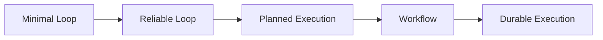

# Agent Loop 分层与机制选择

> **Freshness metadata**
> - `last_verified`: `2026-08-24`
> - `version_scope`: `stable engineering concepts`
> - `source_type`: `primary-paper + engineering synthesis`
> - `stability`: `stable-concept`

## 1. 五层演进

| 层 | 新增状态 | 主要目标 | 不是默认加入 |
|---|---|---|---|
| Minimal | messages、step、tool result | 跑通 observe-think-act | planner、memory |
| Reliable | budget、validation、error、stop reason | 可停止、可诊断 | 多 Agent |
| Planned | plan、dependency、progress、replan reason | 长任务分解与跟踪 | 每轮 reflection |
| Workflow | node、transition、approval、compensation | 确定性控制 | 开放式全自主 |
| Durable | checkpoint、lease、attempt、idempotency key | 崩溃恢复与至少一次执行治理 | 把数据库当消息队列随意轮询 |

## 2. 机制决策卡

### ReAct / Tool selection

- **Problem**：模型需要根据观察选择下一动作。
- **Mechanism**：在推理与行动之间循环，将 tool result 作为新 observation。
- **State**：messages、available tools、step、budget。
- **Failure Mode**：重复调用、错误工具、把工具输出当可信指令。
- **When To Use**：动作空间小到中等、每步结果影响下一步。
- **When Not To Use**：固定步骤可由普通程序稳定完成。
- **Minimal Example**：读取文件→定位符号→生成补丁→运行测试。
- **Production Boundary**：tool schema、permission、timeout、evidence、loop guard 由 Harness 强制。

### Plan / DAG / Scheduler

- **Problem**：任务有可描述依赖、并发机会或长时间进度。
- **Mechanism**：Plan 描述目标与依赖；DAG 表示静态偏序；Scheduler 选择 ready task 并分配资源；失败后按证据 replan。
- **State**：task status、dependencies、artifacts、attempt、owner、deadline。
- **Failure Mode**：计划过期、伪并行、共享文件冲突、完成状态没有证据。
- **When To Use**：多文件迁移、构建/测试/部署等具有独立验收点的工作。
- **When Not To Use**：两三步可直接完成的任务。
- **Minimal Example**：`edit -> unit tests -> build`，只有前置成功才解锁后续。
- **Production Boundary**：原子状态转移、lease、幂等、取消传播、并发资源锁。

### Output Parser / Validation

- **Problem**：自由文本不能直接驱动程序。
- **Mechanism**：优先使用 provider 原生 structured/tool output；随后 schema parse、语义校验、状态机校验。
- **State**：raw event、parsed decision、validation errors、repair count。
- **Failure Mode**：JSON 合法但语义错误、旧 schema、重复 tool call id。
- **When To Use**：任何会触发副作用或状态转移的模型输出。
- **When Not To Use**：纯展示文本可直接渲染，但仍需内容与引用检查。
- **Minimal Example**：`{type:"tool", name:"read_file", args:{path:"..."}}`。
- **Production Boundary**：解析失败不执行；错误作为受限 observation 回填，repair 次数有上限。

### Retry / Loop Guard / Termination

- **Problem**：暂时错误与无限循环需要不同处理。
- **Mechanism**：只对可重试错误退避；用 step/time/token/cost/duplicate-action/oscillation guard；以 final、goal validator、用户取消或预算耗尽停止。
- **State**：attempt、error class、next delay、budgets、last action fingerprint、stop reason。
- **Failure Mode**：重试副作用、把确定性错误重试到超时、停止后仍有子进程。
- **When To Use**：所有可靠 Agent。
- **When Not To Use**：不存在“无限预算”的例外。
- **Minimal Example**：网络 503 最多三次指数退避；schema 错误最多一次修复。
- **Production Boundary**：idempotency key、cancellation token、child cleanup、最终状态持久化。

### Reflection

- **Problem**：候选结果可能需要基于反馈修正。
- **Mechanism**：让 verifier、测试或独立 rubric 产生可执行反馈，再进入候选更新。
- **State**：candidate、evidence、feedback、revision。
- **Failure Mode**：同一模型无新证据地自我肯定，token 成本升高。
- **When To Use**：有测试、lint、judge 或清晰 rubric。
- **When Not To Use**：每轮机械反思或没有新 observation。
- **Production Boundary**：修订次数、回归集和 accept/reject 条件固定。

## 3. 状态机底线

允许状态集合必须封闭，例如 `ready → running → succeeded|failed|cancelled`；`failed → ready` 只能由明确 retry/replan 事件触发。每次转移记录 `who/when/input/evidence`，这样 trace 才能用于回归而不只是日志堆积。
