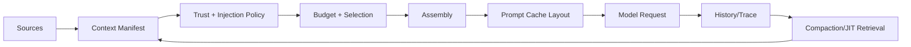

# Context Engineering 总览

> **Freshness metadata**
> - `last_verified`: `2026-08-24`
> - `version_scope`: `provider-neutral context architecture`
> - `source_type`: `official-docs + engineering synthesis`
> - `stability`: `version-sensitive`

Context Engineering 是在约束的 token、延迟、成本和信任边界内，决定**什么信息在何时以何种形式进入一次模型请求**。它不属于长期记忆，也不等于写 system prompt。

## 1. 输入源

- system/developer constraints；
- user goal 与验收条件；
- project instructions、skill manifest；
- tool definitions 与 runtime capability；
- repository/file/search observations；
- session history、working state、checkpoint；
- knowledge retrieval 与 memory retrieval；
- time、identity、permission、environment metadata。

源存在不代表应全部拼接。Context Builder 先产生 Manifest，记录来源、摘要、优先级、信任等级、token 估计、缓存策略和截断结果，再由 Assembly 形成最终有序消息。

## 2. 三个目标函数

1. **Relevance**：与当前 decision 直接相关，而非“可能有用”。
2. **Reliability**：权威指令、用户数据、外部网页、工具输出有清楚的信任级别。
3. **Efficiency**：稳定前缀利于 prompt cache；动态材料按需检索；旧历史压缩但保留可追溯源。

## 3. 与相邻系统的边界

- Memory 决定保存与召回；Context Engineering 决定本轮是否装入以及如何表达。
- RAG 决定从知识集合检索；Context Engineering 处理结果的预算、引用、信任与位置。
- Harness 调用 Context Builder、保存 manifest 并执行 policy；Harness 组织它，但不替代该领域。
- Model 的 context window 是硬容量；token budget 是应用在容量内分配给不同源的策略。

## 4. 验证

对每次请求保存可脱敏的 manifest：输入源、选择原因、token、截断、compaction 版本、cache 命中提示、未加载材料。用 ablation 测试删除某类上下文是否影响成功率，而不是根据 prompt 长度猜测质量。
