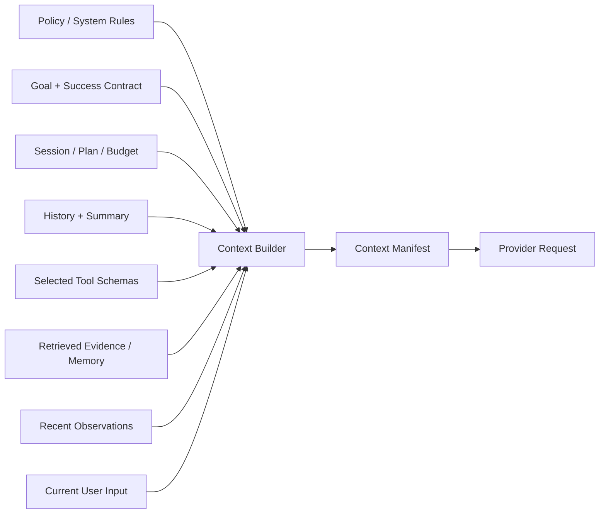
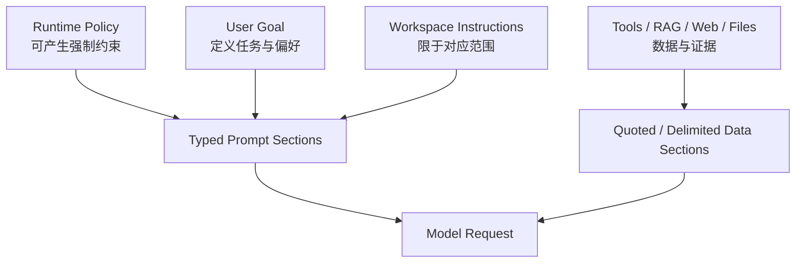

# Input Context Builder：把多源状态装配成一次模型请求

所谓 “input 大拼接 prompt” 如果只是把规则、聊天记录、工具说明、检索结果和日志依次连接，系统会很快遇到冲突、重复、协议断裂和 token 浪费。生产级 Context Builder 应把多源信息建模成**有类型、有信任层、有预算、有来源的本轮状态投影**。

## 1. Context Builder 的输入与输出



输入是各模块的权威状态，不是一份已经拼好的字符串。输出至少包括：

1. provider 可接受的 messages/content blocks；
2. 本轮开放的工具 schema；
3. `ContextManifest`：每段内容为何入选、来自哪里、用了多少 token、是否截断；
4. 被排除内容及原因的统计；
5. 用于 prompt snapshot、缓存与 trace 的内容 hash。

Context Builder 不生成新的任务事实。摘要、压缩和排序都可能有损，因此必须保留原始 artifact 或事件引用。

## 2. ContextFragment 数据契约

```python group=multi-3cbde5b88823 label=Python
from dataclasses import dataclass
from typing import Literal

@dataclass(frozen=True)
class ContextFragment:
    id: str
    kind: Literal[
        "policy", "instruction", "goal", "success_contract", "plan",
        "history", "tool_spec", "tool_result", "evidence", "memory",
        "user_input",
    ]
    source_ref: str
    trust: Literal["runtime", "user", "workspace", "external"]
    priority: int
    required: bool
    freshness: float
    token_count: int
    content_hash: str
    content: tuple["MessageBlock", ...]
    selection_reason: str | None = None
    truncated: bool = False
```

```rust group=multi-3cbde5b88823 label=Rust
enum FragmentKind {
    Policy,
    Instruction,
    Goal,
    SuccessContract,
    Plan,
    History,
    ToolSpec,
    ToolResult,
    Evidence,
    Memory,
    UserInput,
}

struct ContextFragment {
    id: String,
    kind: FragmentKind,
    source_ref: String,
    trust: String,
    priority: i32,
    required: bool,
    freshness: f64,
    token_count: usize,
    content_hash: String,
    selection_reason: Option<String>,
    truncated: bool,
    content: Vec<MessageBlock>,
}
```

```javascript group=multi-3cbde5b88823 label=JavaScript
/**
 * @typedef {{
 *   id: string,
 *   kind: 'policy'|'instruction'|'goal'|'success_contract'|'plan'|
 *     'history'|'tool_spec'|'tool_result'|'evidence'|'memory'|'user_input',
 *   sourceRef: string,
 *   trust: 'runtime'|'user'|'workspace'|'external',
 *   priority: number,
 *   required: boolean,
 *   freshness: number,
 *   tokenCount: number,
 *   contentHash: string,
 *   selectionReason?: string,
 *   truncated?: boolean,
 *   content: MessageBlock[]
 * }} ContextFragment
 */
```

```typescript group=multi-3cbde5b88823 label=TypeScript
type ContextFragment = {
  id: string
  kind:
    | 'policy'
    | 'instruction'
    | 'goal'
    | 'success_contract'
    | 'plan'
    | 'history'
    | 'tool_spec'
    | 'tool_result'
    | 'evidence'
    | 'memory'
    | 'user_input'
  sourceRef: string
  trust: 'runtime' | 'user' | 'workspace' | 'external'
  priority: number
  required: boolean
  freshness: number
  tokenCount: number
  contentHash: string
  selectionReason?: string
  truncated?: boolean
  content: MessageBlock[]
}
```

字段解释：

- `kind` 决定语义位置和允许的处理方式；
- `sourceRef` 指向数据库记录、事件、文件行、检索块或 tool call；
- `trust` 不是“真假分数”，而是告诉装配器该内容能否成为指令；
- `required` 表示本轮省略后会破坏协议或约束；
- `priority`、`freshness`、`tokenCount` 参与选择；
- `contentHash` 用于去重、缓存和审计；
- `truncated` 必须显式，避免模型把片段末尾当完整结论。

网页、邮件和仓库文件即使包含 “system message” 字样，仍属于外部数据层，不会上升为运行时 policy。

## 3. 推荐的装配顺序

下面顺序不是所有 provider 的唯一消息格式，而是一种稳定的语义分层：

```text
1. stable system / developer / policy prefix
2. selected tool and skill metadata
3. current goal + success contract
4. typed plan / task state / budget / stop conditions
5. compacted history + recent protocol-complete messages
6. retrieved evidence and recalled memory
7. latest tool observations
8. current user input or current worker task
```

### 稳定前缀与动态尾部

较稳定、跨轮不变的内容放在前部：核心规则、工具公共约定、项目固定说明。频繁变化的计划、观察和用户输入放在后部。这样做有三个工程收益：

- 便于 provider prompt caching；
- diff 和 snapshot 更容易理解；
- 旧状态不会与新输入交错。

缓存只提高延迟和成本表现，不自动保证语义一致。任何前缀内容更新后都应改变 cache key。

## 4. Token 预算不是最后才截断

设模型最大输入为 \(W\)，预留输出、工具调用与安全余量 \(R\)，本轮可装配预算为：

$$
B_{input}=W-R
$$

可以先为必需区分配硬预算，再在可选 fragment 中优化相关性：

```text
policy + protocol reserve
goal + success contract reserve
current task/plan reserve
recent tool-call/result reserve
retrieval + memory budget
older history budget
optional examples budget
```

选择算法的教学骨架：

```python group=multi-c0154ba14ac5 label=Python
def select_context(fragments, budget):
    required = [item for item in fragments if item.required]
    used = sum(item.token_count for item in required)
    if used > budget:
        raise ValueError("REQUIRED_CONTEXT_EXCEEDS_BUDGET")

    chosen = list(required)
    remaining = budget - used
    optional = sorted(
        (item for item in fragments if not item.required),
        key=lambda item: score(
            item.priority, item.freshness, item.token_count
        ),
        reverse=True,
    )
    for item in optional:
        if item.token_count <= remaining:
            chosen.append(item)
            remaining -= item.token_count
    return order_by_semantic_layer(chosen)
```

```rust group=multi-c0154ba14ac5 label=Rust
fn select_context(
    fragments: &[ContextFragment],
    budget: usize,
) -> Result<Vec<&ContextFragment>, ContextError> {
    let required: Vec<_> = fragments.iter().filter(|item| item.required).collect();
    let used: usize = required.iter().map(|item| item.token_count).sum();
    if used > budget {
        return Err(ContextError::RequiredContextExceedsBudget);
    }

    let mut chosen = required;
    let mut remaining = budget - used;
    let mut optional: Vec<_> = fragments.iter().filter(|item| !item.required).collect();
    optional.sort_by_key(|item| {
        std::cmp::Reverse(score(item.priority, item.freshness, item.token_count))
    });

    for item in optional {
        if item.token_count <= remaining {
            remaining -= item.token_count;
            chosen.push(item);
        }
    }
    Ok(order_by_semantic_layer(chosen))
}
```

```javascript group=multi-c0154ba14ac5 label=JavaScript
function selectContext(fragments, budget) {
  const required = fragments.filter((item) => item.required)
  const used = required.reduce((sum, item) => sum + item.tokenCount, 0)
  if (used > budget) throw new Error('REQUIRED_CONTEXT_EXCEEDS_BUDGET')

  const chosen = [...required]
  let remaining = budget - used
  const optional = fragments
    .filter((item) => !item.required)
    .sort(
      (a, b) =>
        score(b.priority, b.freshness, b.tokenCount) -
        score(a.priority, a.freshness, a.tokenCount),
    )

  for (const item of optional) {
    if (item.tokenCount <= remaining) {
      chosen.push(item)
      remaining -= item.tokenCount
    }
  }
  return orderBySemanticLayer(chosen)
}
```

```typescript group=multi-c0154ba14ac5 label=TypeScript
function selectContext(fragments: ContextFragment[], budget: number) {
  const required = fragments.filter((item) => item.required)
  const used = required.reduce((sum, item) => sum + item.tokenCount, 0)
  if (used > budget) throw new Error('REQUIRED_CONTEXT_EXCEEDS_BUDGET')

  const chosen = [...required]
  let remaining = budget - used
  const optional = fragments
    .filter((item) => !item.required)
    .sort(
      (a, b) =>
        score(b.priority, b.freshness, b.tokenCount) -
        score(a.priority, a.freshness, a.tokenCount),
    )

  for (const item of optional) {
    if (item.tokenCount <= remaining) {
      chosen.push(item)
      remaining -= item.tokenCount
    }
  }
  return orderBySemanticLayer(chosen)
}
```

真实实现还要处理分组约束、片段裁剪和多模态计费。“单位 token 价值”只是启发式；关键约束、最新错误或完整 tool result pair 不应因为文本较长就被拆散。

## 5. 选择、去重、压缩、裁剪

### 5.1 选择

- 工具按当前任务检索，只暴露可能需要的子集；
- 文件和知识按需读取，而不是预先注入整仓库；
- 计划只注入当前 ready task、必要依赖和全局成功条件；
- 长日志优先结构化诊断、首尾窗口和 artifact 引用。

### 5.2 去重

同一事实可能同时出现在用户输入、摘要、Memory 和 RAG 中。可用 `contentHash + sourceRef + semantic key` 去重，但要保留更高权威或更新版本，并在 manifest 记录被替代关系。

### 5.3 压缩

Compaction 输出结构化摘要：

```yaml
goal:
success_contract:
completed_steps:
pending_steps:
decisions:
constraints:
tool_calls_and_results:
evidence_refs:
side_effects:
known_failures:
next_action:
```

摘要中的推论必须标注为推论。重要的 call ID、文件 hash、部署 ID 和未验证状态不应被自然语言概括掉。

### 5.4 裁剪

裁剪发生在明确边界，例如日志事件、文件行、检索 chunk。返回开始/结束位置、原始大小与 `truncated=true`。不要在 JSON、UTF-8 字符或 tool call arguments 中间盲切。

## 6. 修复消息协议，而不是隐藏错误

模型 provider 往往要求 assistant tool call 与对应 tool result 配对。Context Builder 在压缩历史时必须维持：

- call ID 一致；
- 每个已执行调用恰好一个结果；
- 并行调用的结果可按 ID 关联；
- 未完成调用显式标为 pending/cancelled；
- handoff 或 resume 后的消息格式仍合法。

若历史数据库里本来就缺失 tool result，可以注入一个由运行时生成的结构化恢复事件，例如 `TOOL_RESULT_LOST`，并保留 trace 引用；不要凭空构造成功结果。

## 7. 不同来源的信任边界



数据层内容可以影响事实判断，但不可直接改变工具权限、预算或上层规则。实现上可以：

- 使用独立 content block 或清楚的 XML/JSON 边界；
- 附上来源类型和范围；
- 在 ToolResult 中将外部文本放入 `data` 字段；
- 由 Policy Engine 在模型之外强制执行敏感动作规则。

分隔符能帮助模型理解边界，但真正的权限仍由确定性运行时控制。

## 8. Just-in-time Retrieval 与 Progressive Disclosure

Context Builder 不需要预知整个任务未来会用到的内容。更有效的模式：

1. 先注入目录、符号索引、工具摘要等低成本地图；
2. Agent 选择相关区域；
3. 工具按需返回文件片段、技能正文或知识块；
4. 深层细节存入 artifact，通过引用再次读取；
5. 每轮只保留当前决策所需的最小高信号集合。

这样既减少注意力稀释，也保留可探索性。Anthropic 的 context engineering 指南把有限上下文视为应主动管理的资源，而不是越大越好的容器。

## 9. ContextManifest 与可观测性

```json
{
  "request_id": "req_123",
  "model": "MODEL_ID",
  "window_tokens": 128000,
  "reserved_output_tokens": 8000,
  "selected_tokens": 42116,
  "fragments": [
    {
      "id": "tool-result-88",
      "kind": "tool_result",
      "source_ref": "trace://run/turn/88",
      "tokens": 612,
      "required": true,
      "truncated": false,
      "selection_reason": "latest observation"
    }
  ],
  "excluded": { "duplicate": 8, "low_priority": 31, "stale": 4 }
}
```

Manifest 用于回答：

- 模型当时到底看到了什么；
- 某条约束为何丢失；
- 工具 schema 占了多少 token；
- 检索内容是否过多；
- compaction 前后成功率、成本和重复调用如何变化。

trace 可以保存 hash 和受控 artifact 引用，敏感内容的查看权限仍由存储层决定。

## 10. 测试方法

### 确定性测试

- 相同输入快照产生相同排序与 manifest；
- required fragment 超预算时显式报错；
- tool call/result 在压缩后仍完整；
- UTF-8、JSON 和代码块不会被中间切断；
- 同一来源的新版本替换旧版本；
- 外部文本保持在数据层；
- 缓存 key 随稳定前缀变更。

### 语义回归

- 第 1、20、50 轮的关键约束在 compaction 后仍生效；
- 大量无关工具加入目录时，实际暴露工具保持精简；
- 检索到互相矛盾的旧/新文件时优先当前版本并展示来源；
- 日志超长时 Agent 仍看到退出码、首个关键错误和尾部摘要；
- prompt snapshot 能解释模型行为变化，而不是只比较最终答案。

## 11. 常见误区

- 把 Context 等同于聊天历史；
- 直接把所有来源 `join('\n')`；
- 工具越多越好；
- 只按时间保留最新消息，破坏工具协议；
- 摘要没有来源，推断变成事实；
- 长窗口足够大就不做选择；
- 用自然语言提示替代运行时权限；
- 只记录总 token，不记录各 fragment 的选择原因。

## 参考资料

- [Anthropic：Effective context engineering for AI agents](https://www.anthropic.com/engineering/effective-context-engineering-for-ai-agents)
- [LangChain：Context engineering](https://docs.langchain.com/oss/python/langchain/context-engineering)
- [LangGraph：Persistence 与 checkpoint](https://docs.langchain.com/oss/python/langgraph/persistence)
- [OpenAI Agents SDK：Agents 与 runtime context](https://openai.github.io/openai-agents-python/agents/)
