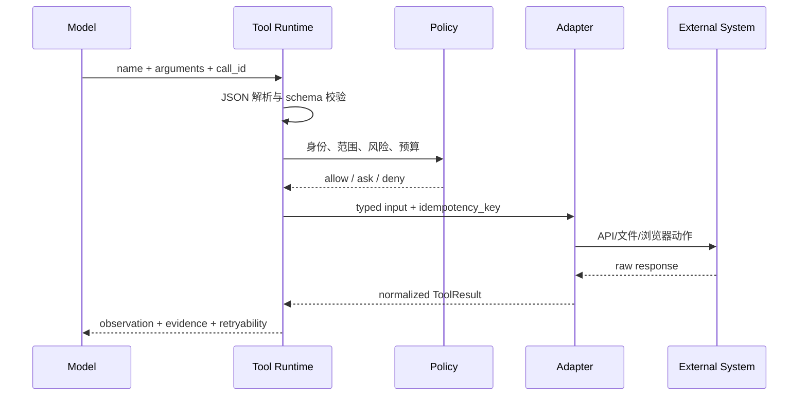

# Tools Call：从工具暴露到结果回填

## 1. 工具不是一段 prompt

Tool 是运行时可调用接口，至少包含：

- 稳定名称和版本；
- 用途与适用条件；
- 输入 JSON Schema；
- 输出 Schema；
- 权限和副作用级别；
- handler；
- 超时、重试、幂等规则；
- 观测和审计字段。

模型只负责提出调用。Registry、Router、Permission Gate 和 Executor 负责把调用变成真实动作。

## 2. 完整数据流

```text
ToolSpec
  -> Registry 注册
  -> 根据任务/权限选择可见工具
  -> Provider 格式转换
  -> Model ToolCall
  -> 参数解析与 Schema 校验
  -> Permission Gate
  -> Handler 执行
  -> ToolResult 规范化
  -> 证据抽取与日志
  -> 回填模型上下文
```

## 3. ToolSpec 示例

```python group=multi-94a205db3fdf label=Python
from dataclasses import dataclass
from typing import Awaitable, Callable, Generic, Literal, TypeVar

I = TypeVar("I")
O = TypeVar("O")

@dataclass(frozen=True)
class ToolSpec(Generic[I, O]):
    name: str
    version: str
    description: str
    input_schema: "JSONSchema"
    output_schema: "JSONSchema"
    side_effect: Literal["none", "reversible", "irreversible"]
    timeout_ms: int
    execute: Callable[[I, "ToolContext"], Awaitable["ToolResult[O]"]]
```

```rust group=multi-94a205db3fdf label=Rust
use std::{future::Future, pin::Pin};

enum SideEffect {
    None,
    Reversible,
    Irreversible,
}

trait ToolSpec<I, O> {
    fn name(&self) -> &str;
    fn version(&self) -> &str;
    fn description(&self) -> &str;
    fn input_schema(&self) -> &JsonSchema;
    fn output_schema(&self) -> &JsonSchema;
    fn side_effect(&self) -> SideEffect;
    fn timeout_ms(&self) -> u64;
    fn execute<'a>(
        &'a self,
        input: I,
        context: &'a ToolContext,
    ) -> Pin<Box<dyn Future<Output = ToolResult<O>> + Send + 'a>>;
}
```

```javascript group=multi-94a205db3fdf label=JavaScript
/**
 * @template I, O
 * @typedef {{
 *   name: string,
 *   version: string,
 *   description: string,
 *   inputSchema: JSONSchema,
 *   outputSchema: JSONSchema,
 *   sideEffect: 'none'|'reversible'|'irreversible',
 *   timeoutMs: number,
 *   execute(input: I, context: ToolContext): Promise<ToolResult<O>>
 * }} ToolSpec
 */
```

```typescript group=multi-94a205db3fdf label=TypeScript
type ToolSpec<I, O> = {
  name: string
  version: string
  description: string
  inputSchema: JSONSchema
  outputSchema: JSONSchema
  sideEffect: 'none' | 'reversible' | 'irreversible'
  timeoutMs: number
  execute(input: I, context: ToolContext): Promise<ToolResult<O>>
}
```

工具说明要写“何时用、返回什么、限制是什么”。模糊描述会让模型选错工具；过长描述又会挤占上下文。大规模工具目录可使用检索式 tool search，只暴露本轮最相关工具。

## 4. 统一 ToolResult

```json
{
  "ok": true,
  "data": { "path": "src/a.ts", "lines": ["..."] },
  "meta": {
    "tool": "read_file",
    "version": "1.2.0",
    "call_id": "call_123",
    "duration_ms": 18,
    "truncated": false
  },
  "evidence": [{ "type": "file", "path": "src/a.ts", "line_start": 20, "line_end": 36 }]
}
```

失败结果保留同一外壳并加入 `error.type`、`retryable`、`details`。不要把任意异常堆栈直接作为模型文本，也不要用空字符串表示失败。

## 5. 并行与顺序

只读且互不依赖的工具可并行；写操作、依赖前一步 ID 的操作或共享资源修改应串行。并行结果仍需通过 call ID 对应，不要依赖返回顺序猜测。

## 6. 完成验证

工具返回 `ok: true` 只说明 handler 没抛异常。对于写文件、部署、发送、数据库更新，应再读取目标状态：

```text
write_file -> read_file/diff -> test -> ValidationResult
deploy -> deployment status -> health check -> ValidationResult
```

这一步把“调用成功”提升为“任务状态已验证”。

<!-- agent-learning-expansion:v2 -->

## 7. 工具调用是一个受控 RPC 协议



工具说明同时服务于模型和运行时。给模型的描述要解释“何时用、何时不用、参数语义和结果含义”；运行时 schema 则负责类型、长度、枚举和格式。二者不一致时，会出现模型持续选错工具或运行时频繁拒绝参数。

## 8. 数据工具与动作工具

数据工具读取上下文，通常可自动执行；动作工具修改外部状态，需按影响分级。权限判断至少考虑：读/写、范围、可逆性、对象归属、金额或影响面、是否需要用户确认。确认应绑定规范化后的精确参数，避免确认后参数被替换。

## 9. ToolResult 应包含哪些信息

一个实用结果契约包含 `ok`、`data`、`error.type`、`retryable`、`call_id`、`duration_ms`、`truncated`、`evidence` 和 `side_effect`。空数组是“成功但无结果”，超时是“执行状态未知或失败”，两者不能混写成空字符串。

参考：[OpenAI Agent 构建指南的工具分类](https://openai.com/business/guides-and-resources/a-practical-guide-to-building-ai-agents/)。
