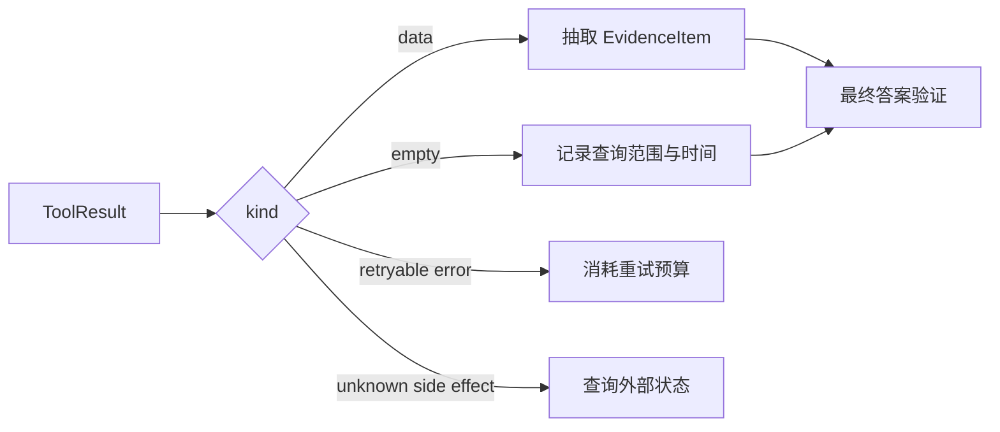

# 工具失败、空结果、重复调用与证据管理

## 1. 区分失败与空结果

以下状态语义完全不同：

- `success_with_data`：成功且有数据；
- `success_empty`：查询成功但没有匹配；
- `not_found`：指定资源不存在；
- `invalid_argument`：调用参数错误；
- `permission_denied`：策略阻止；
- `timeout`：结果未知或未完成；
- `partial`：返回了部分数据；
- `internal_error`：工具内部异常。

如果都变成“没有结果”，模型容易错误扩大结论或无意义重复调用。

## 2. 恢复策略

- 空搜索：改写关键词、放宽过滤、换数据源；
- 参数错误：给出字段级提示；
- 超时：缩小范围或按幂等规则重试；
- 部分结果：继续分页并保留已得数据；
- 权限拒绝：停止该动作，选择允许的读取或生成步骤；
- 内部异常：记录关联 ID，避免把完整栈泄漏到对话。

每类重试都要有次数和总预算。

## 3. 重复调用检测

保存最近 N 次：

```python group=multi-a62d0f80c89e label=Python
from dataclasses import dataclass
from typing import Any

@dataclass(frozen=True)
class InvocationFingerprint:
    tool: str
    canonical_arguments: Any
    result_digest: str
    state_digest: str
```

```rust group=multi-a62d0f80c89e label=Rust
use serde_json::Value;

struct InvocationFingerprint {
    tool: String,
    canonical_arguments: Value,
    result_digest: String,
    state_digest: String,
}
```

```javascript group=multi-a62d0f80c89e label=JavaScript
/**
 * @typedef {{
 *   tool: string,
 *   canonicalArguments: unknown,
 *   resultDigest: string,
 *   stateDigest: string
 * }} InvocationFingerprint
 */
```

```typescript group=multi-a62d0f80c89e label=TypeScript
{
  tool: string
  canonicalArguments: unknown
  resultDigest: string
  stateDigest: string
}
```

若参数、状态和结果摘要都相同，继续调用几乎不会产生新信息。Harness 可以注入显式观察，要求模型改变策略或结束。

## 4. EvidenceItem

```python group=multi-430f11ee4ed2 label=Python
from dataclasses import dataclass
from typing import Literal

@dataclass(frozen=True)
class EvidenceItem:
    id: str
    source_type: Literal["url", "file", "query", "screenshot", "test"]
    locator: str
    retrieved_at: str
    tool_call_id: str
    excerpt: str | None = None
    content_hash: str | None = None
```

```rust group=multi-430f11ee4ed2 label=Rust
enum SourceType {
    Url,
    File,
    Query,
    Screenshot,
    Test,
}

struct EvidenceItem {
    id: String,
    source_type: SourceType,
    locator: String,
    excerpt: Option<String>,
    retrieved_at: String,
    tool_call_id: String,
    content_hash: Option<String>,
}
```

```javascript group=multi-430f11ee4ed2 label=JavaScript
/**
 * @typedef {{
 *   id: string,
 *   sourceType: 'url'|'file'|'query'|'screenshot'|'test',
 *   locator: string,
 *   excerpt?: string,
 *   retrievedAt: string,
 *   toolCallId: string,
 *   contentHash?: string
 * }} EvidenceItem
 */
```

```typescript group=multi-430f11ee4ed2 label=TypeScript
type EvidenceItem = {
  id: string
  sourceType: 'url' | 'file' | 'query' | 'screenshot' | 'test'
  locator: string
  excerpt?: string
  retrievedAt: string
  toolCallId: string
  contentHash?: string
}
```

EvidenceItem 与对话文本分开保存。最终答案引用证据 ID，渲染层再转换为链接、文件行号或截图。这样可以检查引用是否真实来自工具结果，而不是模型生成的相似 URL。

## 5. 引用验证

1. 引用目标是否在 EvidenceItem 集合；
2. 引用内容是否支持对应陈述；
3. 来源时间和版本是否适用；
4. 截断内容是否遗漏相反信息；
5. 多来源结论是否分别标注事实与推断。

对 RAG 和研究 Agent，引用完整性是最终成功条件的一部分。

<!-- agent-learning-expansion:v2 -->

## 6. 统一结果的三值语义

调用结果至少要区分：

1. `success_with_data`：成功且存在结果；
2. `success_empty`：查询成功，当前条件下确实没有匹配；
3. `failure` 或 `unknown`：请求失败、超时，或副作用状态待确认。

把后两者都转换成 `[]` 会让 Agent 形成错误事实。证据项可使用 `source`、`locator`、`version`、`captured_at`、`content_hash` 和 `excerpt`，并保留从哪次 call 得到。



最终答案中的关键事实应能映射到证据；模型综合或推断的内容要与直接来源事实区分。大结果经过截断时必须携带 `truncated: true` 和继续读取方式，否则模型会误以为已看到全集。
