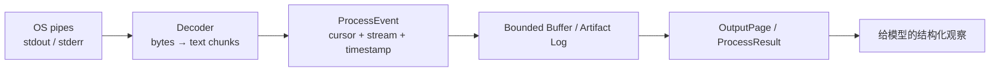
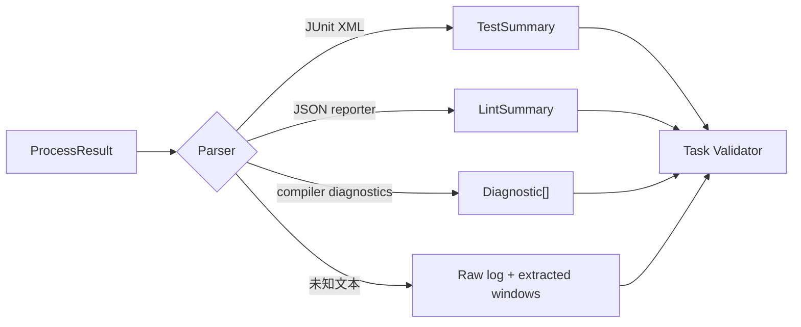

# Terminal 输出读取：stdout、stderr、事件流与有界观察

执行命令只是第一步。Agent 还需要知道命令正在做什么、是否卡住、哪些输出是结果、哪些是诊断，以及输出被截断后还能否追溯完整日志。可靠的 Terminal Tool 应把**字节流、进程状态和面向模型的观察**分成三层。

## 1. 三层数据模型



1. **传输层**：OS 提供的字节流，可能按任意边界分块；
2. **事件层**：为每一块数据添加进程 ID、流名称、单调递增序号和时间；
3. **观察层**：按调用游标读取有界页面，附带截断、退出状态和下一游标。

不要假定一次 `data` 事件等于一行，也不要对每个 chunk 单独调用 `toString()` 后立即丢弃解码状态：一个 UTF-8 字符可能跨越两个 chunk。

## 2. stdout、stderr 与退出码是三个独立信号

- stdout 通常承载正常输出，但具体含义由目标程序定义；
- stderr 通常承载诊断，也可能包含进度和普通日志；
- 退出码是程序对完成状态的约定，`0` 通常表示成功，具体仍以工具契约为准；
- spawn error 表示进程根本没有成功创建，此时没有退出码；
- 信号终止、超时和用户取消需要单独状态；
- “没有输出”是合法结果，不等同于执行失败。

因此，下面判断都是脆弱的：

```text
stderr 非空 => 失败
stdout 为空 => 没运行
进程已退出 => 输出已全部读完
日志里出现 "passed" => 测试成功
```

最终状态要由退出码、协议解析和任务级验证共同决定。

## 3. 为什么必须同时消费两条管道

stdout 与 stderr 都有有限缓冲区。如果父进程只读取 stdout，而子进程持续写 stderr，stderr 管道可能被写满，子进程阻塞；此时父进程又在等 stdout 或退出，形成死锁。

短命令可以使用同时处理两条管道的高层 API：

- Python：`subprocess.run(..., capture_output=True)` 或 `Popen.communicate()`；
- Node.js：为 `child.stdout`、`child.stderr` 都注册消费者，并等待 `close`；
- Rust：`Command::output()` 会等待并收集两条输出；流式场景使用 `spawn()` 后并发读取。

长命令必须持续 drain，即使模型只需要最后 20 KB。输出上限限制的是**内存保留量和返回量**，不是停止从管道读取。

## 4. 可恢复的输出事件协议

```python group=multi-2b574b43f4a5 label=Python
from dataclasses import dataclass
from typing import Literal

@dataclass(frozen=True)
class ProcessEvent:
    seq: int
    process_id: str
    type: Literal[
        "stdout", "stderr", "started", "exited", "timed_out", "cancelled"
    ]
    at: str
    bytes: int | None = None
    text: str | None = None
    exit_code: int | None = None
    signal: str | None = None

@dataclass(frozen=True)
class OutputPage:
    process_id: str
    from_cursor: int
    next_cursor: int
    events: tuple[ProcessEvent, ...]
    running: bool
    exit_code: int | None
    truncated_before_cursor: bool
    has_more: bool
```

```rust group=multi-2b574b43f4a5 label=Rust
enum ProcessEventKind {
    Stdout { bytes: usize, text: String },
    Stderr { bytes: usize, text: String },
    Started,
    Exited { exit_code: Option<i32>, signal: Option<String> },
    TimedOut,
    Cancelled,
}

struct ProcessEvent {
    seq: u64,
    process_id: String,
    at: String,
    kind: ProcessEventKind,
}

struct OutputPage {
    process_id: String,
    from_cursor: u64,
    next_cursor: u64,
    events: Vec<ProcessEvent>,
    running: bool,
    exit_code: Option<i32>,
    truncated_before_cursor: bool,
    has_more: bool,
}
```

```javascript group=multi-2b574b43f4a5 label=JavaScript
/**
 * @typedef {{
 *   seq: number,
 *   processId: string,
 *   type: 'stdout'|'stderr'|'started'|'exited'|'timed_out'|'cancelled',
 *   at: string,
 *   bytes?: number,
 *   text?: string,
 *   exitCode?: number|null,
 *   signal?: string|null
 * }} ProcessEvent
 *
 * @typedef {{
 *   processId: string,
 *   fromCursor: number,
 *   nextCursor: number,
 *   events: ProcessEvent[],
 *   running: boolean,
 *   exitCode: number|null,
 *   truncatedBeforeCursor: boolean,
 *   hasMore: boolean
 * }} OutputPage
 */
```

```typescript group=multi-2b574b43f4a5 label=TypeScript
type ProcessEvent =
  | {
      seq: number
      processId: string
      type: 'stdout' | 'stderr'
      bytes: number
      text: string
      at: string
    }
  | {
      seq: number
      processId: string
      type: 'started' | 'exited' | 'timed_out' | 'cancelled'
      at: string
      exitCode?: number | null
      signal?: string | null
    }

type OutputPage = {
  processId: string
  fromCursor: number
  nextCursor: number
  events: ProcessEvent[]
  running: boolean
  exitCode: number | null
  truncatedBeforeCursor: boolean
  hasMore: boolean
}
```

读取工具可以设计为：

```text
read_process(process_id, cursor, wait_ms, max_bytes)
```

- `cursor` 让调用者只取增量，避免每轮重复把全部日志塞入 context；
- `wait_ms` 支持短轮询：有新事件、进程结束或等待时间到期就返回；
- `max_bytes` 控制单页大小；
- `truncatedBeforeCursor` 明确提示旧事件已从内存环形缓冲移出；
- 完整原始日志存入 artifact，提供 checksum 与可分页引用。

## 5. 输出预算：Head、Tail 与错误窗口

简单地保留前 N 字节会丢掉最终错误；只保留后 N 字节又会丢掉命令、配置和早期告警。实用策略是：

```text
in-memory observation =
  first 8 KiB
  + selected error windows
  + last 24 KiB
  + truncation metadata
```

错误窗口可以由确定性规则提取，如失败测试名、堆栈顶部与底部、编译器 `file:line:column`、首次 fatal 行。它们是**索引**而不是新事实，完整日志仍是证据源。

结果必须记录：

- 每条流收到的总字节数；
- 返回给模型的字节数；
- 是否截断；
- 完整 artifact 的引用与 hash；
- 解码方式和替换字符数量；
- 行尾规范化是否发生。

## 6. 流式读取的多语言骨架

下面展示相同语义：并发消费两条流、逐行产生带来源的事件，并在管道关闭后完成。代码省略了持久化和完整的进程树取消。

```python group=terminal-stream label=Python
import asyncio

async def stream_process(executable: str, *args: str):
    process = await asyncio.create_subprocess_exec(
        executable, *args,
        stdout=asyncio.subprocess.PIPE,
        stderr=asyncio.subprocess.PIPE,
    )

    async def pump(name, reader):
        while chunk := await reader.readline():
            yield {
                "stream": name,
                "text": chunk.decode("utf-8", errors="replace"),
            }

    async def collect(name, reader, sink):
        async for event in pump(name, reader):
            sink.append(event)

    events = []
    await asyncio.gather(
        collect("stdout", process.stdout, events),
        collect("stderr", process.stderr, events),
    )
    return await process.wait(), events
```

```rust group=terminal-stream label=Rust
use std::{
    io::{self, BufRead, BufReader},
    process::{Command, Stdio},
    thread,
};

fn stream_process(exe: &str, args: &[&str]) -> io::Result<i32> {
    let mut child = Command::new(exe)
        .args(args)
        .stdout(Stdio::piped())
        .stderr(Stdio::piped())
        .spawn()?;
    let stdout = child.stdout.take().unwrap();
    let stderr = child.stderr.take().unwrap();

    let out = thread::spawn(move || {
        for line in BufReader::new(stdout).lines().map_while(Result::ok) {
            println!("[stdout] {line}");
        }
    });
    let err = thread::spawn(move || {
        for line in BufReader::new(stderr).lines().map_while(Result::ok) {
            eprintln!("[stderr] {line}");
        }
    });
    let status = child.wait()?;
    out.join().ok();
    err.join().ok();
    Ok(status.code().unwrap_or(-1))
}
```

```javascript group=terminal-stream label=JavaScript
import { spawn } from 'node:child_process'
import { StringDecoder } from 'node:string_decoder'

export function streamProcess(executable, args, onEvent) {
  const child = spawn(executable, args, { shell: false })
  for (const [name, stream] of [
    ['stdout', child.stdout],
    ['stderr', child.stderr],
  ]) {
    const decoder = new StringDecoder('utf8')
    stream.on('data', (chunk) => onEvent({ stream: name, text: decoder.write(chunk) }))
    stream.on('end', () => {
      const tail = decoder.end()
      if (tail) onEvent({ stream: name, text: tail })
    })
  }
  return child
}
```

```typescript group=terminal-stream label=TypeScript
import { spawn } from 'node:child_process'
import { StringDecoder } from 'node:string_decoder'

type StreamName = 'stdout' | 'stderr'
type OutputEvent = { seq: number; stream: StreamName; text: string }

export function streamProcess(
  executable: string,
  args: string[],
  emit: (event: OutputEvent) => void,
) {
  const child = spawn(executable, args, { shell: false })
  let seq = 0
  const attach = (stream: NodeJS.ReadableStream, name: StreamName) => {
    const decoder = new StringDecoder('utf8')
    stream.on('data', (chunk: Buffer) =>
      emit({ seq: seq++, stream: name, text: decoder.write(chunk) }),
    )
    stream.on('end', () => {
      const text = decoder.end()
      if (text) emit({ seq: seq++, stream: name, text })
    })
  }
  attach(child.stdout, 'stdout')
  attach(child.stderr, 'stderr')
  return child
}
```

### 关于事件顺序

单条流内可以维持读取顺序；stdout 与 stderr 之间没有天然的全局文本顺序。`seq` 表示 Harness 观察到事件的顺序，不代表两个文件描述符在 OS 内的绝对写入先后。需要严格业务顺序时，应让被执行程序输出统一的结构化事件流。

## 7. 从日志到结构化结果

Terminal Executor 返回原始进程事实，专门的 Parser 再理解工具协议：



优先使用机器可读 reporter，而不是用正则从彩色终端文本猜结果。Parser 要版本化并保留原始输入引用；解析失败不应修改真实退出码。

## 8. 读取循环与 Agent Loop 的配合

错误做法是每 100 ms 让模型调用一次 `read_process`。更合理的流程：

1. Harness 在后台持续采集；
2. 等到出现关键事件、一定输出量、进程结束或较长等待阈值；
3. 用 `OutputPage` 向 Agent 返回一次有界观察；
4. Agent 决定继续等待、取消、提供 stdin 或转向其他步骤；
5. 每次观察带游标，Context Builder 只保留最近结果和 artifact 引用。

这样把高频 I/O 留在确定性运行时，把低频决策留给模型。

## 9. 测试清单

- 一个 UTF-8 字符被拆到两个 chunk 时仍能正确解码；
- stdout 与 stderr 同时高频输出时不死锁；
- 没有尾部换行的最后一段仍被 flush；
- 超过内存上限后仍继续 drain，并能读取 tail；
- 旧 cursor 被淘汰时返回明确的截断标记；
- 进程退出后等待所有 stdio 关闭，再生成最终结果；
- `0`、非零、signal、spawn error、timeout、cancel 都有不同状态；
- parser 失败时保留原始日志、退出码和 artifact；
- trace 中的敏感值已脱敏，但原始证据的访问控制仍有效。

## 参考资料

- [Node.js `child_process`：流、`exit` 与 `close`](https://nodejs.org/api/child_process.html)
- [Python `subprocess`：pipes、`communicate()` 与 timeout](https://docs.python.org/3/library/subprocess.html)
- [Rust `std::process` 官方文档](https://doc.rust-lang.org/stable/std/process/index.html)
