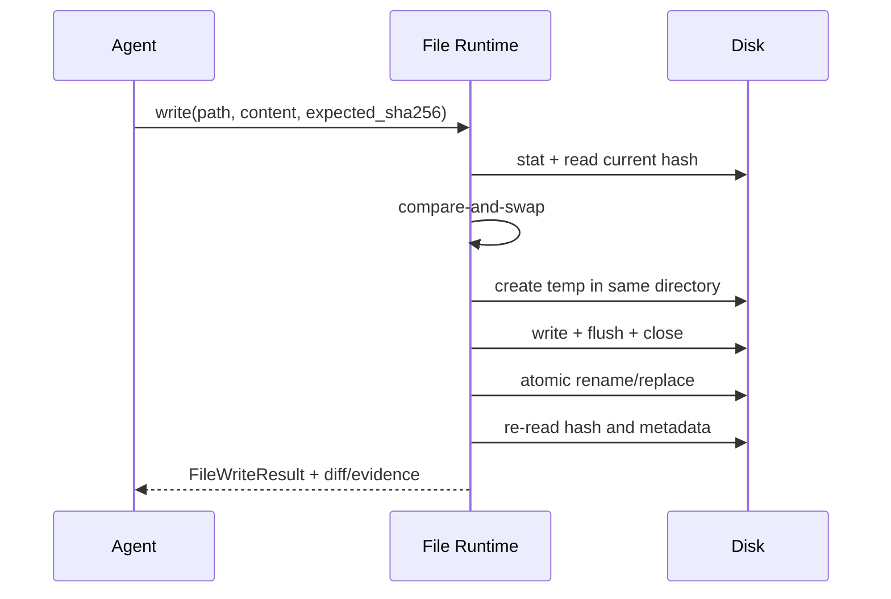

# File I/O：读取、写入、补丁、并发保护与证据

文件工具是 Coding Agent 与仓库交互的基础。可靠实现的目标不是“让模型拥有一个万能文件 API”，而是提供少量、语义明确、结果可验证的操作，使每次读取和变更都能定位、比较、回滚和测试。

## 1. 建议的最小工具集

| 工具             | 主要输入                                 | 主要输出                         | 默认副作用 |
| ---------------- | ---------------------------------------- | -------------------------------- | ---------- |
| `list_directory` | path、depth、cursor                      | typed entries、next cursor       | 无         |
| `stat_path`      | path、followSymlink                      | type、size、mtime、hash 可选     | 无         |
| `read_file`      | path、byte/line range、expected encoding | 内容片段、范围、hash、truncated  | 无         |
| `search_files`   | roots、glob、query、limits               | path + line/byte positions       | 无         |
| `write_file`     | path、content、expected hash、mode       | 新 hash、bytes、diff ref         | 写         |
| `apply_patch`    | path、hunks、expected hash               | applied hunks、rejects、new hash | 写         |
| `move_path`      | from、to、expected type                  | 最终位置、冲突状态               | 写         |
| `delete_path`    | path、expected hash/type、trash policy   | tombstone/backup ref             | 写         |

这些工具应返回结构化结果。不要用一个 `file(action, payload)` 工具承载所有语义；过多可选字段会让 schema 难以理解，也会让权限和测试变得模糊。

## 2. 路径解析是运行时逻辑

每次操作先把用户路径解析到一个已知 workspace root：

```text
requested path
  -> 统一分隔符与绝对/相对语义
  -> 连接 workspace root
  -> 解析现有父目录的真实位置
  -> 检查 symlink / junction / reparse point
  -> 确认最终目标仍属于允许根
  -> 执行
```

仅检查字符串是否以 workspace 路径开头并不充分，例如相似前缀、`..`、符号链接或 Windows junction 都可能改变真实目标。对于新文件，应解析最近的已存在父目录，再验证将创建的相对尾部。

结果中同时记录：

- 模型请求的路径；
- 规范化后的逻辑路径；
- 实际执行路径；
- workspace 标识；
- 是否穿过 link；
- 大小、类型和内容 hash。

## 3. 读取：有范围、有版本、有编码

读取大型文件时应支持：

```ts
type ReadFileRequest = {
  path: string
  startLine?: number
  endLine?: number
  startByte?: number
  maxBytes: number
  encoding?: 'utf-8' | 'binary' | 'auto'
}

type ReadFileResult = {
  path: string
  content: string
  startLine: number
  endLine: number
  totalBytes: number
  sha256: string
  encoding: string
  newline: 'lf' | 'crlf' | 'mixed' | 'none'
  bom: boolean
  truncated: boolean
}
```

行号适合人和模型定位，字节范围适合精确分页；两者的边界不可混用。读取结果携带 hash，让后续写入能够检测“从读取到修改之间文件是否已变化”。

### 编码与换行

- 默认可以优先尝试严格 UTF-8；解码失败时返回 typed error 或以 binary 方式读取，不要静默丢字节。
- 保留原文件的 LF/CRLF 和 BOM 策略，除非任务明确要求格式化。
- `read_file` 返回的行号应定义为 1-based 还是 0-based，并在整个工具族中保持一致。
- 二进制文件返回大小、MIME/魔数、hash 和有界十六进制预览，不把任意字节伪装成文本。

## 4. 写入：先比较，再原子替换

覆盖写的推荐流程：



`expected_sha256` 实现乐观并发控制：只有磁盘版本仍等于 Agent 阅读过的版本时才写入。若不相等，返回 `STALE_SNAPSHOT`，让 Agent重新读取和合并，而不是覆盖其他进程的修改。

临时文件放在目标同一目录，通常更容易保证 rename 位于同一文件系统。需要区分：

- 原子可见性：读者看到旧文件或新文件，不看到半写内容；
- 持久性：系统崩溃后数据是否已真正落盘；
- 元数据保留：权限、owner、ACL、扩展属性是否需要继承；
- 平台行为：目标已存在时 POSIX 与 Windows 的替换语义并不完全相同。

因此，工具实现应针对运行平台测试，而不是只依赖函数名里有 `rename`。

## 5. Patch 比整文件重写更适合局部修改

补丁请求应包含上下文、原始位置提示和读取版本：

```json
{
  "path": "src/agent.ts",
  "expected_sha256": "…",
  "hunks": [
    {
      "old_start": 40,
      "old_lines": ["const limit = 3"],
      "new_lines": ["const limit = config.maxSteps"]
    }
  ]
}
```

应用规则：

1. hash 匹配时在预期位置查找；
2. 不匹配或上下文缺失时返回 reject，不进行“最像位置”的猜测写入；
3. 多个 hunk 作为一个事务在内存中应用；
4. 写入临时文件并替换；
5. 返回每个 hunk 的状态、最终 hash 和统一 diff；
6. 随后运行 formatter、typecheck 或目标测试。

模糊匹配可能在重复代码块中改错位置。若支持 fuzz，必须返回实际命中的位置和置信条件，并让上层验证 diff。

## 6. 原子写入的多语言示例

下面是“同目录临时文件 + rename”的教学骨架。生产实现还应处理权限继承、fsync、Windows 替换行为、清理和 hash compare-and-swap。

```python group=atomic-write label=Python
from pathlib import Path
import os, tempfile

def atomic_write(path: Path, content: str) -> None:
    path.parent.mkdir(parents=True, exist_ok=True)
    fd, temp_name = tempfile.mkstemp(dir=path.parent, prefix=f".{path.name}.")
    try:
        with os.fdopen(fd, "w", encoding="utf-8", newline="") as file:
            file.write(content)
            file.flush()
            os.fsync(file.fileno())
        os.replace(temp_name, path)
    except BaseException:
        try:
            os.unlink(temp_name)
        except FileNotFoundError:
            pass
        raise
```

```rust group=atomic-write label=Rust
use std::{fs, io::{self, Write}, path::Path};

fn atomic_write(path: &Path, content: &[u8]) -> io::Result<()> {
    let parent = path.parent().ok_or_else(|| io::Error::other("missing parent"))?;
    fs::create_dir_all(parent)?;
    let temp = parent.join(format!(".{}.tmp", path.file_name().unwrap().to_string_lossy()));
    {
        let mut file = fs::File::create(&temp)?;
        file.write_all(content)?;
        file.sync_all()?;
    }
    fs::rename(temp, path)?;
    Ok(())
}
```

```javascript group=atomic-write label=JavaScript
import { mkdir, open, rename, rm } from 'node:fs/promises'
import { dirname, basename, join } from 'node:path'
import { randomUUID } from 'node:crypto'

export async function atomicWrite(path, content) {
  const parent = dirname(path)
  await mkdir(parent, { recursive: true })
  const temp = join(parent, `.${basename(path)}.${randomUUID()}.tmp`)
  try {
    const file = await open(temp, 'wx')
    try {
      await file.writeFile(content, 'utf8')
      await file.sync()
    } finally {
      await file.close()
    }
    await rename(temp, path)
  } catch (error) {
    await rm(temp, { force: true })
    throw error
  }
}
```

```typescript group=atomic-write label=TypeScript
import { mkdir, open, rename, rm } from 'node:fs/promises'
import { dirname, basename, join } from 'node:path'
import { randomUUID } from 'node:crypto'

export async function atomicWrite(path: string, content: string): Promise<void> {
  const parent = dirname(path)
  await mkdir(parent, { recursive: true })
  const temp = join(parent, `.${basename(path)}.${randomUUID()}.tmp`)
  try {
    const file = await open(temp, 'wx')
    try {
      await file.writeFile(content, { encoding: 'utf8' })
      await file.sync()
    } finally {
      await file.close()
    }
    await rename(temp, path)
  } catch (error) {
    await rm(temp, { force: true })
    throw error
  }
}
```

## 7. FileResult 与变更证据

```ts
type FileWriteResult = {
  ok: boolean
  path: string
  operation: 'create' | 'replace' | 'patch'
  oldSha256: string | null
  newSha256: string
  bytesWritten: number
  newline: 'lf' | 'crlf' | 'mixed' | 'none'
  diffRef: string
  backupRef?: string
  appliedHunks?: number
  rejectedHunks?: number
}
```

写工具的 `ok: true` 表示目标字节已按工具定义提交，不等于代码正确。推荐验证链：

```text
read snapshot
  -> write/apply_patch with expected hash
  -> read back + hash
  -> review bounded diff
  -> formatter/lint/typecheck/test
  -> git status/diff
  -> ValidationResult
```

## 8. 列目录、搜索与规模控制

- `list_directory` 返回类型化 entry，而不是一长段 `dir` 文本；
- 支持 cursor、depth、glob、隐藏文件开关和最大条目数；
- 目录计数与内容列表来自同一快照或标注可能变化；
- 搜索结果返回文件、行号、列号、匹配片段和截断状态；
- 默认忽略 `.git`、构建产物、大型依赖目录和二进制文件，同时允许显式调整；
- 遇到循环符号链接时通过文件身份或规范路径去重；
- 搜索 0 条是成功的空结果，不是工具故障。

## 9. 删除、移动和回滚

删除工具需要比写入更强的前置条件：

- 目标类型、hash 或目录快照匹配；
- 明确是单文件、空目录还是递归树；
- 支持 trash/quarantine/backup 引用；
- 递归操作先生成 manifest，再执行并返回逐项结果；
- 移动跨文件系统时，“复制 + 校验 + 删除”不应伪装成单一原子 rename；
- 部分成功必须列出已完成项和待处理项。

这些信息让 Agent 可以恢复，而不是根据一句“move failed”猜测磁盘状态。

## 10. 最小测试矩阵

| 类别     | 用例                                                         |
| -------- | ------------------------------------------------------------ |
| 路径     | `..`、相似前缀、symlink/junction、新文件父目录、Unicode 路径 |
| 读取     | 空文件、大文件分页、UTF-8 跨边界、CRLF、BOM、二进制          |
| 并发     | 读取后外部进程修改，expected hash 应拒绝覆盖                 |
| 写入     | 创建、替换、磁盘满、临时文件清理、重读 hash                  |
| Patch    | 重复上下文、部分 hunk 失败、多 hunk 事务性                   |
| 搜索     | 0 条、超上限、忽略目录、循环 link                            |
| 移动删除 | 已存在目标、跨卷、部分失败、backup 恢复                      |
| 验证     | diff 与最终文件一致，格式化/测试结果可追溯                   |

## 参考资料

- [Node.js File system 官方文档](https://nodejs.org/api/fs.html)
- [Python `pathlib` 官方文档](https://docs.python.org/3/library/pathlib.html)
- [Rust `std::fs` 官方文档](https://doc.rust-lang.org/std/fs/)
- [SWE-agent ACI Commands](https://swe-agent.com/0.7/config/commands/)
