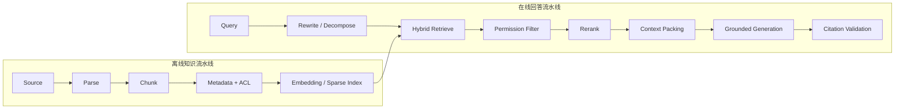

# RAG 完整链路：从数据摄取到带引用回答

RAG（Retrieval-Augmented Generation）把外部知识检索结果放入模型上下文，让回答基于可更新、可追溯的数据。生产链路不是“向量搜索 + prompt”两个步骤，而是多个可评测阶段。

## 1. 离线摄取

```text
source discovery
  -> permission/filter
  -> parse
  -> normalize
  -> chunk
  -> metadata enrichment
  -> embed/index
```

- **Source discovery**：文件、网页、数据库、代码仓库、工单等。
- **Parse**：提取正文、标题、表格、层级和链接，保留原始定位。
- **Normalize**：处理编码、重复空白、模板噪声和版本。
- **Chunk**：按语义与结构切片，而不是机械固定长度。
- **Metadata**：来源、路径、作者、时间、权限、版本、章节。
- **Index**：向量、关键词/BM25 或混合索引。

## 2. 在线检索

```text
user query
  -> query understanding/rewrite
  -> candidate retrieval
  -> filter
  -> rerank
  -> context packing
  -> grounded generation
  -> citation validation
```

查询重写应保留用户意图，不能悄悄加入未经确认的假设。候选召回追求 recall，rerank 再提高 precision。上下文打包要去重、平衡多来源、控制 token，并保留引用 ID。

## 3. Chunk 设计

Chunk 大小取决于问题粒度和文档结构：

- API 文档：按类、函数、参数段；
- 法规：按条款并保留上级标题；
- 代码：按符号和依赖关系；
- 表格：保留表头和行关系；
- 长文章：按章节、段落和语义窗口。

常见策略：

- 固定 token + overlap：简单，但容易切断语义；
- 结构切分：质量更好，需要解析器；
- 父子 chunk：子块用于召回，父块用于上下文；
- late chunking/上下文增强：在 embedding 时保留更长语境。

## 4. 混合检索

向量检索擅长语义相似，关键词检索擅长精确术语、编号和专有名词。混合检索可融合两者：

```text
score = α * dense_score + β * sparse_score + metadata_boost
```

不同分数尺度需要归一化，或使用 Reciprocal Rank Fusion。元数据过滤必须在权限语义正确的位置执行，避免先召回敏感内容再在展示层过滤。

## 5. Grounded Answer

生成阶段应明确：

- 只使用给定证据回答事实性问题；
- 证据不足时指出缺口；
- 每个关键陈述关联 citation ID；
- 区分来源事实、跨来源综合和模型推断；
- 不把检索片段中的指令当系统指令。

## 6. 评测

分层测量：

- 解析完整性；
- chunk 边界质量；
- Recall@K、MRR、nDCG；
- rerank 命中；
- context precision/recall；
- answer correctness；
- faithfulness/groundedness；
- citation correctness 与 completeness；
- 延迟、成本、索引新鲜度。

只测最终回答会掩盖问题来自解析、召回、排序还是生成。

## 参考资料

- [Retrieval-Augmented Generation 论文](https://arxiv.org/abs/2005.11401)
- [LlamaIndex RAG 文档](https://docs.llamaindex.ai/en/stable/understanding/rag/)
- [LangChain Retrieval 文档](https://docs.langchain.com/oss/python/langchain/retrieval)

<!-- agent-learning-expansion:v2 -->
## 7. 把 RAG 拆成两条可独立回归的流水线



离线链路的版本包括解析器、chunk 策略、embedding 模型和索引时间；在线链路的版本包括 query rewrite、过滤、排序、上下文模板和生成模型。只有把版本写入 trace，离线索引变化导致的回归才可定位。

## 8. 检索不是“越多越好”

候选集过小会漏掉答案，过大则引入相似但无关的片段并挤占上下文。一般先用 `Recall@K` 检查答案证据是否进入候选，再用 `MRR` 或 `nDCG` 检查排序；生成阶段再测 groundedness、引用精确率和完整率。不同层的失败需使用不同修复手段：

- 没召回：检查解析、chunk、query rewrite 和混合索引；
- 召回但排名低：训练或调整 reranker；
- 上下文有证据但答案错误：检查提示、上下文顺序与模型；
- 答案正确但引用错：单独验证 claim-to-citation 映射。

## 9. Agentic RAG 的额外控制面

Agentic RAG 允许模型决定是否检索、改写查询、选择数据源并进行多跳检索。它提高开放问题的适应性，也引入查询漂移、循环检索和成本膨胀。运行时应限制检索轮次、每轮候选数、允许的数据源、总 token，并让模型在最终回答中说明证据缺口。

参考：[原始 RAG 论文](https://arxiv.org/abs/2005.11401)与 [AI Agent 教程的上下文工程章节](https://bojieli.github.io/ai-agent-book/book/chapter1/)。
