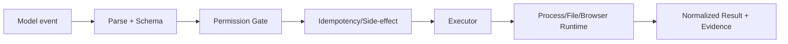

# Tool、Invocation、Execution 与 Runtime 边界

> **Freshness metadata**
> - `last_verified`: `2026-08-24`
> - `version_scope`: `provider-neutral tool runtime`
> - `source_type`: `official-SDK-docs + engineering synthesis`
> - `stability`: `stable-concept`

## 1. 四层不可混称

| 层 | 产物 | 失败示例 |
|---|---|---|
| Tool definition | name、description、input/output schema、side-effect class | schema 歧义、版本不兼容 |
| Tool invocation | call id、tool name、arguments | 参数缺失、重复 id、越权意图 |
| Tool execution | executor 接收已验证参数并产生 result | I/O、业务错误、取消 |
| OS process execution | pid、argv、cwd、env、stdin/stdout/stderr、exit code | spawn 失败、死锁、孤儿进程 |

模型产生 invocation，并不直接拥有文件系统或进程权限。Registry 解析版本，Policy Gate 判定 capability，Executor 负责执行，Result Normalizer 把结构化状态回填。

## 2. Runtime 最低契约

- deadline 与 cancellation token 向子操作传播；
- 同时消费 stdout/stderr，设置字节上限，避免 pipe backpressure 死锁；
- timeout 后先优雅终止，再回收进程树；
- 文件更新使用 temp→fsync（按需要）→atomic replace，并校验前置 hash；
- result 区分 `ok`、domain error、runtime error、cancelled、timed_out；
- 写操作有 idempotency key 或显式“不可安全重试”；
- evidence 包含命令摘要、exit code、changed paths、test result、artifact digest。

## 3. 何时不暴露通用 Shell

若业务动作可被窄 schema 表达，优先 `deploy({service, version})` 而不是 `shell({command})`。通用 shell 的组合能力强，但 permission、转义、环境漂移、注入与副作用分析成本更高。Coding Agent 可保留 shell，却应使用 sandbox、cwd allowlist、env 最小化、输出上限和确认门。

## 4. Verification

测试 spawn failure、超时、用户取消、stdout 洪水、stderr only、非零 exit、子进程遗留、并发写冲突、重复 invocation、部分成功与证据缺失。
