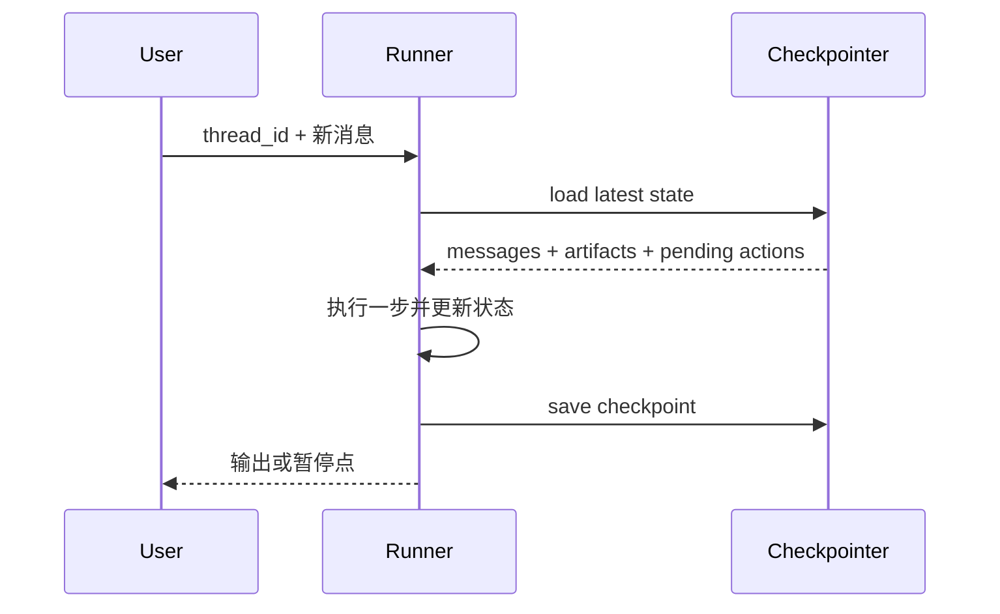

# Short-term Memory：短期状态与会话工作记忆

短期记忆服务于当前任务或会话，生命周期从几分钟到一次任务结束。它比原始对话更结构化，典型内容包括当前计划、临时变量、已尝试动作、最近观察、待办、检查点和用户临时偏好。

## 1. 与 Context 的区别

- Context：本轮发给模型的实际输入。
- Short-term Memory：可供 Context Builder 选择的会话状态。

短期记忆可以比当前上下文更大，例如完整工具 trace 保存在数据库中，本轮只装入摘要和最近几步。

## 2. 数据结构

```ts
type SessionMemory = {
  sessionId: string
  goal: string
  plan: PlanStep[]
  workingFacts: Fact[]
  attempts: Attempt[]
  evidenceRefs: string[]
  pendingConfirmations: Confirmation[]
  checkpoint: number
  updatedAt: string
}
```

`workingFacts` 应带来源和置信状态；`attempts` 保存失败原因与参数指纹；`pendingConfirmations` 防止恢复后跳过确认。

## 3. 写入时机

- 用户明确改变目标；
- 工具产生影响下一步的结果；
- 完成或阻塞一个子任务；
- 做出不可轻易撤销的架构决策；
- 创建检查点；
- Context Compaction 前。

不要把每个 token 或所有自然语言都重复写入状态库。

## 4. 恢复

崩溃恢复时：

1. 读取最后已提交检查点；
2. 核对外部副作用状态；
3. 恢复未完成步骤；
4. 对“执行完成但提交未知”的动作使用幂等键或查询确认；
5. 生成恢复观察，并进入正常 loop。

## 5. 清理

任务结束后，短期状态应：

- 保留必要 trace 和交付证据；
- 将可复用事实提炼为候选长期记忆；
- 丢弃临时 token、重复日志和过期页面状态；
- 按保留策略删除敏感中间数据。

## 6. 测试

- 中途重启能否从检查点继续；
- Compaction 后是否重复已完成工具；
- 并发子任务更新是否覆盖彼此；
- 用户撤销的偏好是否仍残留；
- 过期会话是否按策略清理。

<!-- agent-learning-expansion:v2 -->
## 6. 短期记忆的工程形态：Thread State + Checkpoint

短期记忆通常绑定 `thread_id`，包含消息、当前计划、工具结果、上传文件引用、待审批动作和阶段性产物。每个关键步骤写 checkpoint，恢复时从最后一个一致状态继续。



消息历史不是短期记忆的全部。若只保存文本而不保存 tool call ID、未完成事务和 artifact 版本，恢复后容易重复执行动作或丢失任务进度。

## 7. 长会话治理

常用策略包括滑动窗口、按相关性选择、结构化摘要和把旧产物移到外部存储。摘要需要可增量更新，并保留“已确认事实 / 未解决问题 / 已执行副作用 / 证据引用”。对被压缩掉的原始事件保存 trace 指针，以便审计和调试。

参考：[LangGraph Memory 概览](https://docs.langchain.com/oss/python/concepts/memory)。
