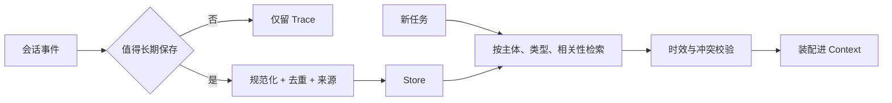

# Long-term Memory：跨会话可复用知识

长期记忆跨任务或跨会话保存，可能包含用户稳定偏好、项目约定、实体事实、成功策略、失败教训和历史摘要。它不是把所有聊天永久向量化，而是一个有写入门槛、来源、更新和遗忘策略的知识系统。

## 1. 记忆类型

- **Semantic memory**：稳定事实与概念，例如项目使用 Vue/Nuxt。
- **Episodic memory**：某次任务发生了什么、结果如何。
- **Procedural memory**：可复用流程、Skill 或操作步骤。
- **Preference memory**：用户明确表达且长期稳定的偏好。

不同类型的更新、检索和保留周期不同。

## 2. Memory Record

```ts
type MemoryRecord = {
  id: string
  kind: 'semantic' | 'episodic' | 'procedural' | 'preference'
  subject: string
  content: string
  sourceRefs: string[]
  confidence: number
  validFrom: string
  validUntil?: string
  supersedes?: string
  scope: 'user' | 'workspace' | 'project' | 'task'
  sensitivity: string
}
```

来源、适用范围和有效期非常重要。没有这些字段，旧项目事实可能污染新项目，临时偏好也可能被当成永久偏好。

## 3. 写入策略

候选记忆先经过：

1. 是否对未来任务有复用价值；
2. 是否来自明确陈述或可靠证据；
3. 是否与已有记忆重复或冲突；
4. 是否适合保存；
5. 适用 scope 与 TTL；
6. 是否需要用户确认。

模型提出候选，确定性规则或人工确认决定最终写入。

## 4. 检索策略

结合：

- 当前任务与 workspace scope；
- 语义相似度；
- 关键词/实体匹配；
- 新鲜度；
- 置信度；
- 使用频率；
- 冲突与 supersedes 关系。

返回给模型时标注“来源于历史记忆，可能需要刷新”，并尽量用当前工具验证容易变化的事实。

## 5. 更新与遗忘

- 新事实不应直接覆盖旧记录，而是建立版本或 supersedes；
- 对时间敏感事实设置 TTL；
- 低置信、长期未使用、已冲突的记忆降权；
- 支持按用户、项目、主题删除；
- 删除后同步清理向量索引与缓存；
- 记录谁在何时写入、读取和修改。

## 6. 风险

- 错误事实被长期放大；
- 跨项目泄漏；
- 用户临时要求被误当永久偏好；
- 记忆检索结果形成 prompt injection；
- 删除只删主表，向量副本仍存在；
- 过度记忆导致每轮上下文噪声。

## 参考资料

- [Generative Agents](https://arxiv.org/abs/2304.03442)
- [Mem0](https://github.com/mem0ai/mem0)
- [Letta](https://github.com/letta-ai/letta)

<!-- agent-learning-expansion:v2 -->
## 6. 长期记忆的三种语义

| 类型 | 保存内容 | 示例 | 主要风险 |
| --- | --- | --- | --- |
| Semantic | 稳定事实与偏好 | 用户偏好简洁回答、项目使用 TypeScript | 事实过期、主体混淆 |
| Episodic | 过去经历与结果 | 某次部署失败原因及修复结果 | 过度类比、噪声累积 |
| Procedural | 做事规则与经验 | 发布前必须运行哪些验证 | 与当前策略冲突、版本陈旧 |

长期记忆应有 namespace、主体、来源、时间、置信度、版本和过期策略。仅存一段无来源自然语言，会使后续系统难以判断该事实属于谁、是否仍有效。

## 7. 写入与读取是两套决策



写入可在响应热路径完成，也可由后台任务整理。热路径及时但增加延迟；后台整理能合并冲突和去重，但存在最终一致性。读取时不能只做向量相似度，还要过滤主体、权限、时间和任务范围。

参考：[LangGraph 长期记忆文档](https://docs.langchain.com/oss/python/langchain/long-term-memory)。
