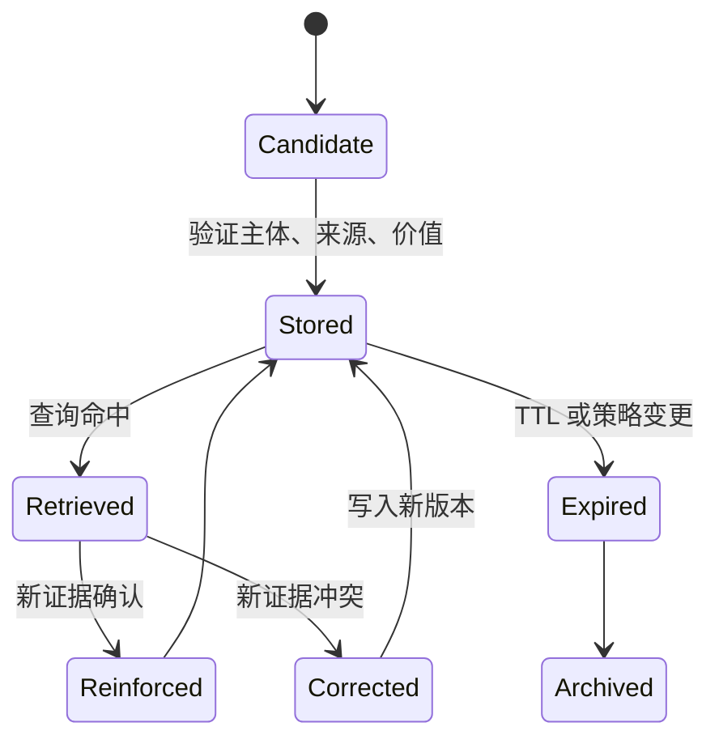

# Memory Pipeline：写入、检索、更新与遗忘

## 1. 写入 Pipeline

```text
event
  -> candidate extraction
  -> classification
  -> dedup/conflict check
  -> policy and sensitivity check
  -> user confirmation when needed
  -> structured storage
  -> index update
```

候选提取可以用模型，最终写入需要确定性验证。每条记忆保留来源事件 ID，便于追溯和删除。

## 2. 检索 Pipeline

```text
task + scope
  -> query construction
  -> metadata filter
  -> hybrid retrieval
  -> freshness/confidence rerank
  -> conflict resolution
  -> context selection
```

先按 user/workspace/project 做隔离，再做相似度检索。对版本、依赖、当前负责人等易变事实，在使用前主动刷新。

## 3. 冲突处理

当新旧记忆冲突：

- 比较来源权威性和时间；
- 查看适用 scope；
- 不确定时同时返回并标记冲突；
- 对明确更新建立 `supersedes`；
- 不把模型推断自动升级为确定事实。

## 4. 遗忘

遗忘不是只按时间删除：

- TTL 到期；
- 用户主动删除；
- 项目关闭；
- 被新版本取代；
- 低价值且长期未使用；
- 敏感数据达到保留期限。

清理需要覆盖主存储、向量索引、缓存、备份策略和派生摘要。

## 5. 质量指标

- 写入 precision：保存的记忆中真正有价值的比例；
- recall relevance：召回内容与当前任务相关程度；
- stale rate：过期事实比例；
- contradiction rate：冲突未被识别的比例；
- leakage rate：跨 scope 错误召回；
- memory utility：加入记忆后任务成功率的提升；
- token overhead：记忆占用上下文成本。

## 6. 最小实现建议

先用关系表保存结构化字段和全文索引，只有数据量和语义召回需求明确后再加向量索引。先实现可查看、可编辑、可删除和来源追踪，再追求自动化“无限记忆”。

<!-- agent-learning-expansion:v2 -->
## 6. Memory Lifecycle



更新不要原地覆盖并丢失历史。采用版本、`supersedes` 关系和变更原因，才能解释当前记忆从何而来。冲突时可按来源可靠性、时间和用户显式确认决定；仍不确定时把冲突显式带入 context。

## 7. 遗忘是质量机制

遗忘包括 TTL、低价值衰减、主体删除请求、策略迁移和冲突淘汰。系统应测量写入接受率、检索命中后的实际使用率、过期记忆比例、错误记忆导致的任务失败，以及单主体存储增长。记得越多并不等于效果越好。
