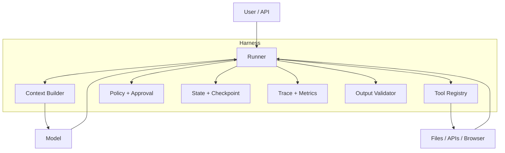

# Agent Harness 架构：模型之外的能力来源

Agent Harness 是承载模型执行任务的运行时。它决定模型能看到什么、能调用什么、如何执行、何时停止、如何记录、如何恢复。相同模型放入不同 Harness，实际能力和可靠性可能差异很大。

## 1. 典型模块

```text
CLI / Web / Message Gateway
  -> Session Manager
  -> Context Builder
  -> Agent Loop
  -> Model Adapter
  -> Tool Registry + Router
  -> Permission Gate
  -> Tool Executor / Sandbox
  -> Event Bus / Trace
  -> Compaction / Memory
  -> Validator / Finalizer
```

## 2. Agent Loop

Loop 负责模型请求、工具调用回填和终止；它不应独自承担所有逻辑。Provider 重试、工具超时、权限、状态提交和 final validation 最好拆成清晰模块。

## 3. Model Adapter

统一不同提供商的：

- 消息角色；
- tool schema；
- 流式事件；
- usage；
- stop reason；
- 错误分类；
- prompt caching；
- reasoning/structured output 能力。

Adapter 不能把 provider 差异全部抹平到最低能力，应保留可选 capability flags。

## 4. Session 与检查点

Session Manager 管理 task/thread/run/turn 的层级、并发 lane、取消和恢复。每次有副作用动作后应提交可恢复检查点，避免进程重启造成重复执行。

## 5. Context Builder 与 Compaction

Context Builder 从系统规则、当前任务、历史摘要、Memory、工具和 Evidence 中选择本轮输入。Compaction 是有损压缩，需要保留约束、决策、待办、失败、调用 ID 和证据引用。

## 6. Event 与 Trace

把运行过程建模为事件：

```text
run.started
model.requested
model.delta
tool.requested
permission.decided
tool.completed
state.checkpointed
context.compacted
validation.completed
run.completed
```

事件可驱动 UI、日志、回放、指标和调试。事件 schema 要版本化。

## 7. Finalizer

Finalizer 负责：

- 检查所有 tool call 已有结果；
- 汇总未完成事项；
- 运行任务级验证；
- 确认副作用状态；
- 保存最终产物与证据；
- 输出明确终止原因。

## 8. 研究 Harness 的方法

不要只看 README。沿一次完整任务追踪入口、session、loop、tool registry、permission、executor、trace、compaction、finalizer，并记录每个模块的输入输出契约。

<!-- agent-learning-expansion:v2 -->
## 6. 模型、Agent 与 Harness 的边界

模型负责基于当前上下文提出决策；Agent 是围绕目标持续运行的逻辑实体；Harness 是让这段逻辑可靠运行的确定性基础设施。



Harness 负责模型不擅长保证的事情：严格顺序、schema、权限、幂等、并发、预算、恢复、取消和审计。Prompt 能描述规则，但真正的强制边界必须在模型之外。

## 7. Harness 的最小模块

1. **Runner**：循环、事件分发、停止条件；
2. **Context Builder**：选择并压缩输入；
3. **Tool Registry/Executor**：定义、校验、执行和标准化结果；
4. **Policy Engine**：权限、审批、风险和配额；
5. **State Store**：会话、checkpoint、artifact；
6. **Observability**：trace、span、成本、错误与重放；
7. **Validator**：结构、语义和外部成功条件。

教程把一次模型请求理解为系统指令、项目约束、工具、历史和当前输入的组合，这正是 Context Builder 要解决的问题；Agent 的实际效果因此是“模型 + Harness”的联合结果。

参考：[AI Agent 开发教程](https://bojieli.github.io/ai-agent-book/book/chapter1/)。
