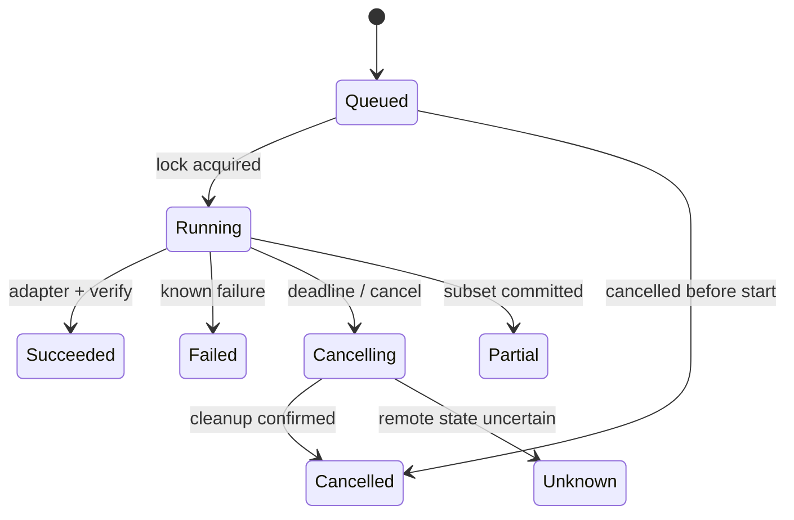

# Executor 执行器：从已解析决策到可恢复的真实动作

“Executor”在 Agent 资料中常被用于不同层次。先区分术语，才能正确设计边界：

| 名称                  | 调度单位           | 核心职责                                        |
| --------------------- | ------------------ | ----------------------------------------------- |
| Runner / Orchestrator | 一次 run / turn    | 驱动 Agent Loop、模型调用、停止和 finalization  |
| Workflow Executor     | 图中的 node / task | 按边和状态执行确定性或 Agent 节点               |
| Tool Executor         | 一个 `ToolCall`    | 校验、权限、超时、adapter、结果与证据           |
| OS Process Executor   | 一个子进程         | cwd/env、stdio、退出码、取消和进程树            |
| Worker                | 一个可租赁任务     | 从队列领取任务，heartbeat、checkpoint、提交结果 |

本章重点是 Tool Executor 与事件运行时，并说明它如何调用文件、进程、浏览器和 API adapter。

## 1. Executor 在完整链路中的位置


模型输出进入 Executor 之前，应已由 Provider Adapter 和 Output Parser 组装为规范化调用。Executor 不负责从自由文本里猜工具名，也不负责决定下一步计划。

## 2. 输入契约

```python group=multi-64750cbe13bf label=Python
from dataclasses import dataclass, field
from typing import Any

@dataclass(frozen=True)
class ToolExecutionRequest:
    run_id: str
    turn_id: str
    call_id: str
    tool: dict[str, str]
    arguments: Any
    actor: dict[str, str]
    workspace: dict[str, str]
    deadline: int
    cancellation_token: str
    idempotency_key: str | None = None
    approval_token: str | None = None
    expected_state: dict[str, str] = field(default_factory=dict)
```

```rust group=multi-64750cbe13bf label=Rust
use std::collections::HashMap;
use serde_json::Value;

struct ToolRef {
    name: String,
    requested_version: Option<String>,
}

struct Actor {
    user_id: String,
    agent_id: String,
}

struct Workspace {
    id: String,
    root: String,
}

struct ToolExecutionRequest {
    run_id: String,
    turn_id: String,
    call_id: String,
    tool: ToolRef,
    arguments: Value,
    actor: Actor,
    workspace: Workspace,
    deadline: u64,
    cancellation_token: String,
    idempotency_key: Option<String>,
    approval_token: Option<String>,
    expected_state: HashMap<String, String>,
}
```

```javascript group=multi-64750cbe13bf label=JavaScript
/**
 * @typedef {{
 *   runId: string,
 *   turnId: string,
 *   callId: string,
 *   tool: { name: string, requestedVersion?: string },
 *   arguments: unknown,
 *   actor: { userId: string, agentId: string },
 *   workspace: { id: string, root: string },
 *   deadline: number,
 *   cancellationToken: string,
 *   idempotencyKey?: string,
 *   approvalToken?: string,
 *   expectedState?: Record<string, string>
 * }} ToolExecutionRequest
 */
```

```typescript group=multi-64750cbe13bf label=TypeScript
type ToolExecutionRequest = {
  runId: string
  turnId: string
  callId: string
  tool: { name: string; requestedVersion?: string }
  arguments: unknown
  actor: { userId: string; agentId: string }
  workspace: { id: string; root: string }
  deadline: number
  cancellationToken: string
  idempotencyKey?: string
  approvalToken?: string
  expectedState?: Record<string, string>
}
```

重要不变量：

- `callId` 在一次 run 中唯一；
- 请求绑定 workspace、actor 和 deadline；
- 审批绑定规范化后的工具版本与精确参数；
- `expectedState` 可携带文件 hash、数据库版本等 compare-and-swap 条件；
- Adapter 接收的是校验后的 typed input，不再接触模型原始 JSON。

## 3. 十阶段执行管线

### 3.1 Resolve

从 Registry 解析确切工具版本和 capability。找不到、版本不兼容或工具已停用是 resolution error，尚未产生副作用。

### 3.2 Normalize

处理 schema 中定义的默认值、路径语义、枚举别名和 provider 表示差异。Normalize 前后都记录 hash，审批使用 normalize 后的参数。

### 3.3 Validate

分层校验：

1. JSON/schema：类型、required、长度、格式；
2. domain：对象存在、值域和跨字段约束；
3. state guard：预期文件 hash、资源版本和任务状态；
4. runtime：deadline、配额、并发槽位。

Schema 通过只说明输入形状合法，不代表业务允许执行。

### 3.4 Policy 与 Approval

Policy Engine 根据 actor、workspace、读写范围、可逆性、影响面和预算做出：

```text
allow | require_approval | deny
```

若暂停等待审批，Runner 保存 checkpoint；恢复时重新检查时效性条件。审批期间目标状态可能已改变。

### 3.5 Idempotency 与 Reservation

先查询 `idempotencyKey` 是否已有 committed 结果。对外部副作用可先创建 execution record 或 reservation，避免 worker 重试时重复发送、发布或扣费。

### 3.6 Resource Lock

根据工具声明获取锁，例如：

- workspace 写锁；
- 单文件/目录写入范围；
- 浏览器 session；
- 数据库迁移 lane；
- 同一部署环境的串行锁。

锁用于保护确定性资源冲突，不替代业务事务。

### 3.7 Adapter Execution

Adapter 封装具体系统：

```text
file adapter       -> read / patch / atomic replace
process adapter    -> spawn / stdout / stderr / exit
browser adapter    -> page/session/action/screenshot
database adapter   -> transaction/query/result
HTTP adapter       -> request/status/body/retry-after
```

统一注入 deadline、取消、trace context 和输出预算。

### 3.8 Normalize Result

原始 SDK 响应、异常和日志转换成稳定 `ToolResult`。不要把任意异常字符串直接回填模型。

### 3.9 Evidence 与 Verification

提取文件 hash、diff、HTTP response ID、截图、查询结果和测试报告。对重要副作用做独立 read-after-write：

```text
write -> read/hash
deploy -> status/health check
send -> provider message id/status
database mutation -> transaction result/query
```

### 3.10 Commit

在状态存储中原子记录 ToolResult、证据引用、幂等状态、锁释放和下一个 Runner 事件。随后才把 observation 交给模型。

## 4. Result 的成功、失败与未知

```python group=multi-261946e036f9 label=Python
from dataclasses import dataclass, field
from typing import Any, Generic, Literal, TypeVar

T = TypeVar("T")

@dataclass(frozen=True)
class ToolResult(Generic[T]):
    call_id: str
    tool_version: str
    outcome: Literal["succeeded", "failed", "partial", "unknown", "cancelled"]
    side_effect: dict[str, Any]
    evidence: tuple["EvidenceItem", ...]
    timing: dict[str, int]
    truncated: bool
    data: T | None = None
    error: dict[str, Any] | None = None
```

```rust group=multi-261946e036f9 label=Rust
struct ToolError {
    error_type: String,
    phase: String,
    retryable: bool,
    message: String,
}

struct SideEffect {
    attempted: bool,
    committed: Option<bool>,
    summary: Option<String>,
}

struct Timing {
    queued_ms: u64,
    running_ms: u64,
}

struct ToolResult<T> {
    call_id: String,
    tool_version: String,
    outcome: String,
    data: Option<T>,
    error: Option<ToolError>,
    side_effect: SideEffect,
    evidence: Vec<EvidenceItem>,
    timing: Timing,
    truncated: bool,
}
```

```javascript group=multi-261946e036f9 label=JavaScript
/**
 * @template T
 * @typedef {{
 *   callId: string,
 *   toolVersion: string,
 *   outcome: 'succeeded'|'failed'|'partial'|'unknown'|'cancelled',
 *   data?: T,
 *   error?: {
 *     type: string,
 *     phase: 'resolve'|'validate'|'policy'|'execute'|'verify'|'commit',
 *     retryable: boolean,
 *     message: string
 *   },
 *   sideEffect: {
 *     attempted: boolean,
 *     committed: boolean|null,
 *     summary?: string
 *   },
 *   evidence: EvidenceItem[],
 *   timing: { queuedMs: number, runningMs: number },
 *   truncated: boolean
 * }} ToolResult
 */
```

```typescript group=multi-261946e036f9 label=TypeScript
type ToolResult<T> = {
  callId: string
  toolVersion: string
  outcome: 'succeeded' | 'failed' | 'partial' | 'unknown' | 'cancelled'
  data?: T
  error?: {
    type: string
    phase: 'resolve' | 'validate' | 'policy' | 'execute' | 'verify' | 'commit'
    retryable: boolean
    message: string
  }
  sideEffect: {
    attempted: boolean
    committed: boolean | null
    summary?: string
  }
  evidence: EvidenceItem[]
  timing: { queuedMs: number; runningMs: number }
  truncated: boolean
}
```

### 为什么需要 `unknown`

请求超时不总等于远端没有执行。例如 HTTP 客户端在响应前断开，服务器可能已经提交订单。若没有幂等键或查询接口，真实副作用状态是 unknown。此时自动重试会放大问题，应先 reconcile。

### 为什么需要 `partial`

批量操作可能只更新了一部分对象。Result 应列出 committed 与 pending 项，并给出恢复/回滚引用；不应使用一个布尔值隐藏部分成功。

## 5. Timeout 与 Cancellation

Timeout 是预算到期；Cancellation 是外部请求停止。二者可以使用同一取消信号传播，但结果语义不同。



取消步骤：

1. 标记 execution record 为 cancelling；
2. 通知 adapter；
3. 终止子进程树、关闭流或调用 provider cancel；
4. 等待 grace period；
5. 查询实际副作用；
6. 提交 cancelled、partial 或 unknown。

## 6. “Exactly once” 与现实副作用

数据库事务内的状态提交可以原子化，但跨网络副作用与本地 checkpoint 很难天然形成单一事务。工程上通常组合：

- at-least-once worker delivery；
- stable idempotency key；
- execution record / outbox；
- provider-side idempotency；
- read-after-write reconciliation；
- checkpoint 记录 pending side effect；
- 人工处理真正 unknown 的状态。

所以“消息只执行一次”应拆成：相同逻辑请求有稳定身份；重复投递返回同一结果；未确认副作用可查询和恢复。

## 7. Event Runtime：yield、commit、resume

Runner 与 Executor 可以通过版本化事件交互：

```text
tool.requested
tool.resolved
tool.validation_failed
approval.requested
approval.resolved
tool.started
tool.output
tool.side_effect_observed
tool.completed
state.checkpointed
```

事件处理原则：

- `tool.output` 可高频、可单独存 artifact；
- 决定恢复语义的事件必须持久化；
- reducer 按 event ID 幂等；
- UI 消费事件不等于状态已提交；
- resume 从最后 committed checkpoint 开始，并 reconcile pending executions。

## 8. TypeScript 执行骨架

```python group=multi-dede09f69678 label=Python
async def execute_tool(request, runtime):
    spec = runtime.registry.resolve(request.tool)
    input_value = spec.input_schema.parse(request.arguments)
    await runtime.policy.assert_allowed(spec, input_value, request)

    prior = (
        await runtime.executions.find_committed(request.idempotency_key)
        if request.idempotency_key
        else None
    )
    if prior is not None:
        return prior.result

    async with runtime.locks.lock(spec.lock_key(input_value, request)):
        execution = await runtime.executions.begin(request, spec, input_value)
        try:
            raw = await spec.adapter.execute(
                input_value,
                deadline=request.deadline,
                signal=runtime.cancellation.signal(request.cancellation_token),
                emit=lambda event: runtime.events.append(execution.id, event),
            )
            result = await spec.normalize_and_verify(raw, input_value)
        except Exception as error:
            result = classify_execution_error(error, request, spec)
        return await runtime.executions.commit(execution.id, result)
```

```rust group=multi-dede09f69678 label=Rust
async fn execute_tool(
    request: ToolExecutionRequest,
    runtime: &Runtime,
) -> Result<ToolResult<Value>, RuntimeError> {
    let spec = runtime.registry.resolve(&request.tool)?;
    let input = spec.input_schema.parse(&request.arguments)?;
    runtime.policy.assert_allowed(spec, &input, &request).await?;

    if let Some(key) = &request.idempotency_key {
        if let Some(prior) = runtime.executions.find_committed(key).await? {
            return Ok(prior.result);
        }
    }

    runtime
        .locks
        .with_lock(spec.lock_key(&input, &request), || async {
            let execution = runtime.executions.begin(&request, spec, &input).await?;
            let result = match spec
                .adapter
                .execute(&input, request.deadline, &request.cancellation_token)
                .await
            {
                Ok(raw) => spec.normalize_and_verify(raw, &input).await?,
                Err(error) => classify_execution_error(error, &request, spec),
            };
            runtime.executions.commit(execution.id, result).await
        })
        .await
}
```

```javascript group=multi-dede09f69678 label=JavaScript
async function executeTool(request, runtime) {
  const spec = runtime.registry.resolve(request.tool)
  const input = spec.inputSchema.parse(request.arguments)
  await runtime.policy.assertAllowed(spec, input, request)

  const prior = request.idempotencyKey
    ? await runtime.executions.findCommitted(request.idempotencyKey)
    : null
  if (prior) return prior.result

  return runtime.locks.withLock(spec.lockKey(input, request), async () => {
    const execution = await runtime.executions.begin(request, spec, input)
    try {
      const raw = await spec.adapter.execute(input, {
        deadline: request.deadline,
        signal: runtime.cancellation.signal(request.cancellationToken),
        emit: (event) => runtime.events.append(execution.id, event),
      })
      const result = await spec.normalizeAndVerify(raw, input)
      return runtime.executions.commit(execution.id, result)
    } catch (error) {
      const result = classifyExecutionError(error, request, spec)
      return runtime.executions.commit(execution.id, result)
    }
  })
}
```

```typescript group=multi-dede09f69678 label=TypeScript
async function executeTool(
  request: ToolExecutionRequest,
  runtime: Runtime,
): Promise<ToolResult<unknown>> {
  const spec = runtime.registry.resolve(request.tool)
  const input = spec.inputSchema.parse(request.arguments)
  await runtime.policy.assertAllowed(spec, input, request)

  const prior = request.idempotencyKey
    ? await runtime.executions.findCommitted(request.idempotencyKey)
    : null
  if (prior) return prior.result

  return runtime.locks.withLock(spec.lockKey(input, request), async () => {
    const execution = await runtime.executions.begin(request, spec, input)
    try {
      const raw = await spec.adapter.execute(input, {
        deadline: request.deadline,
        signal: runtime.cancellation.signal(request.cancellationToken),
        emit: (event) => runtime.events.append(execution.id, event),
      })
      const result = await spec.normalizeAndVerify(raw, input)
      return await runtime.executions.commit(execution.id, result)
    } catch (error) {
      const result = classifyExecutionError(error, request, spec)
      return await runtime.executions.commit(execution.id, result)
    }
  })
}
```

代码刻意把 `resolve/parse/policy/idempotency/lock/adapter/commit` 分开，使每层可独立测试和注入故障。

## 9. Executor 不负责什么

- 不决定用户目标；
- 不自行生成计划；
- 不从散文猜工具调用；
- 不把 `ok: true` 宣称为任务完成；
- 不用重试掩盖 unknown side effect；
- 不把工具异常堆栈原样当成用户答案；
- 不依赖 prompt 强制权限；
- 不替 Finalizer 判断所有验收条件。

## 10. 故障注入测试

| 注入点                    | 预期                                            |
| ------------------------- | ----------------------------------------------- |
| schema 不合法             | adapter 未调用，返回 validate error             |
| 审批暂停后目标改变        | 恢复时 state guard 失败                         |
| 获取锁超时                | 无副作用，排队时间可观测                        |
| adapter 在写入前崩溃      | failed，幂等记录可重试                          |
| 写入后、commit 前崩溃     | resume 先 reconcile，再返回 committed/unknown   |
| stdout 超限               | 继续 drain，结果标 truncation + artifact        |
| 用户取消子进程            | 进程树结束，cancelled 与 timeout 分开           |
| provider 超时但远端已提交 | unknown → query by idempotency key              |
| verification 失败         | side effect 状态保留，outcome 为 failed/partial |
| 相同事件重复投递          | reducer 结果不重复                              |

## 参考资料

- [OpenAI Agents SDK：Running agents](https://openai.github.io/openai-agents-python/running_agents/)
- [OpenAI Agents SDK：Tools](https://openai.github.io/openai-agents-python/tools/)
- [Google ADK：Runtime event loop](https://adk.dev/runtime/event-loop/)
- [Microsoft Agent Framework：Workflows](https://learn.microsoft.com/en-us/agent-framework/workflows/)
- [LangGraph：Persistence](https://docs.langchain.com/oss/python/langgraph/persistence)
