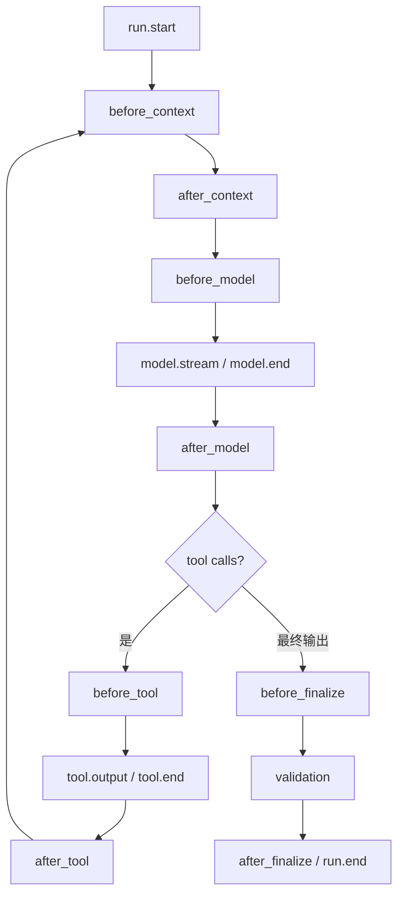

# Middleware、Hooks 与 Callbacks：横切能力的可控扩展点

Agent Runtime 需要日志、guardrail、上下文注入、缓存、重试、指标和审批，但把它们全部写进主 Loop 会形成难以测试的巨型函数。Middleware 与 hooks 提供扩展点；同时也可能引入隐藏控制流，所以必须规定顺序、输入输出、短路和异常语义。

## 1. 三个相近概念

| 概念             | 常见形态           | 适合用途                                  |
| ---------------- | ------------------ | ----------------------------------------- |
| Middleware       | 包裹 next 的链     | 可在调用前后修改请求/响应、短路或捕获异常 |
| Hook             | 某生命周期点的回调 | 观测、指标、轻量校验、事件记录            |
| Context Provider | 按需提供一类上下文 | 用户资料、权限、Memory、检索或项目状态    |

不同框架命名不一致，应先看真实调用契约，而不是根据名字推断能力。一个能改变结果的 hook 本质上已参与控制流；一个只记录 trace 的 middleware 也可能是纯观测。

## 2. 生命周期地图



常见扩展点：

- run：身份、trace、总预算；
- context：检索、Memory、tool selection、compaction；
- model：prompt snapshot、缓存、provider fallback、usage；
- tool：权限、审批、参数审计、结果脱敏；
- state：checkpoint、event reducer；
- final：输出 guard、验收与 artifact 保存。

## 3. Middleware 契约

```python group=multi-452b3f261fcf label=Python
from typing import Awaitable, Callable, Generic, Protocol, TypeVar

I = TypeVar("I")
O = TypeVar("O")
Next = Callable[[I], Awaitable[O]]

class Middleware(Protocol, Generic[I, O]):
    name: str
    order: int

    async def handle(
        self,
        input_value: I,
        context: "HookContext",
        next_call: Next[I, O],
    ) -> O: ...
```

```rust group=multi-452b3f261fcf label=Rust
use std::{future::Future, pin::Pin};

type Next<'a, I, O> = Box<
    dyn FnOnce(I) -> Pin<Box<dyn Future<Output = O> + Send + 'a>> + Send + 'a,
>;

trait Middleware<I, O> {
    fn name(&self) -> &str;
    fn order(&self) -> i32;
    fn handle<'a>(
        &'a self,
        input: I,
        context: &'a HookContext,
        next: Next<'a, I, O>,
    ) -> Pin<Box<dyn Future<Output = O> + Send + 'a>>;
}
```

```javascript group=multi-452b3f261fcf label=JavaScript
/**
 * @template I, O
 * @typedef {(input: I) => Promise<O>} Next
 *
 * @template I, O
 * @typedef {{
 *   name: string,
 *   order: number,
 *   handle(input: I, context: HookContext, next: Next<I, O>): Promise<O>
 * }} Middleware
 */
```

```typescript group=multi-452b3f261fcf label=TypeScript
type Next<I, O> = (input: I) => Promise<O>

interface Middleware<I, O> {
  name: string
  order: number
  handle(input: I, context: HookContext, next: Next<I, O>): Promise<O>
}
```

一个 middleware 可以：

1. 读取 input/context；
2. 在允许范围内生成新 input；
3. 调用 `next()` 恰好一次；
4. 对 output 做转换；
5. 显式短路并返回契约允许的结果；
6. 抛出分类异常。

若允许零次或多次 `next()`，必须在接口中明确。例如 retry middleware 会多次调用下游，但每次模型请求都需要新 attempt ID，副作用工具则不应被通用 retry 包裹。

## 4. 顺序不是实现细节

例如一次 model call：

```text
trace
  -> deadline
    -> context snapshot
      -> cache
        -> provider retry
          -> provider adapter
```

如果把 cache 放在 context snapshot 之前，命中时的真实请求会难以解释；把 retry 放在 trace 外面会丢失 attempt；把脱敏放在 provider 调用前后含义也不同。

建议：

- 每个扩展点有固定 phase；
- 同 phase 使用显式 `order` 和稳定排序；
- 启动时输出最终链；
- 检测重复名称和顺序冲突；
- 测试顺序，而不是依赖注册偶然性。

## 5. 状态修改：使用 patch，不共享可变对象

Hook 直接修改全局 `state` 会导致：

- 执行顺序改变结果；
- 并行 hook 产生数据竞争；
- trace 不知道谁改了什么；
- resume 难以重放。

更清晰的方式是返回 typed patch：

```python group=multi-d34ec94bfdd3 label=Python
from dataclasses import dataclass, field
from typing import Any

@dataclass(frozen=True)
class StatePatch:
    set_values: dict[str, Any] = field(default_factory=dict)
    append_events: tuple["RuntimeEvent", ...] = ()
    add_context_fragments: tuple["ContextFragment", ...] = ()
    remove_context_fragment_ids: tuple[str, ...] = ()
```

```rust group=multi-d34ec94bfdd3 label=Rust
use std::collections::HashMap;
use serde_json::Value;

struct StatePatch {
    set_values: HashMap<String, Value>,
    append_events: Vec<RuntimeEvent>,
    add_context_fragments: Vec<ContextFragment>,
    remove_context_fragment_ids: Vec<String>,
}
```

```javascript group=multi-d34ec94bfdd3 label=JavaScript
/**
 * @typedef {{
 *   set?: Record<string, unknown>,
 *   appendEvents?: RuntimeEvent[],
 *   addContextFragments?: ContextFragment[],
 *   removeContextFragmentIds?: string[]
 * }} StatePatch
 */
```

```typescript group=multi-d34ec94bfdd3 label=TypeScript
type StatePatch = {
  set?: Record<string, unknown>
  appendEvents?: RuntimeEvent[]
  addContextFragments?: ContextFragment[]
  removeContextFragmentIds?: string[]
}
```

Runtime 检查 patch 权限、版本与冲突，再通过 reducer 提交。每个 patch 记录 producer、base version 和 event ID。

## 6. 短路、暂停与拒绝

不要用 `undefined` 同时表示“继续”“没有结果”和“拒绝”。可使用：

```python group=multi-afd9a42c26a1 label=Python
from dataclasses import dataclass
from typing import Any, Literal

@dataclass(frozen=True)
class HookDecision:
    kind: Literal["continue", "replace", "pause", "stop"]
    patch: "StatePatch | None" = None
    value: Any | None = None
    reason: str | None = None
    resume_token: str | None = None
    outcome: Literal["failed", "cancelled"] | None = None
```

```rust group=multi-afd9a42c26a1 label=Rust
enum HookDecision<T> {
    Continue { patch: Option<StatePatch> },
    Replace { value: T, reason: String },
    Pause { resume_token: String, reason: String },
    Stop { outcome: StopOutcome, reason: String },
}

enum StopOutcome {
    Failed,
    Cancelled,
}
```

```javascript group=multi-afd9a42c26a1 label=JavaScript
/**
 * @template T
 * @typedef (
 *   { kind: 'continue', patch?: StatePatch } |
 *   { kind: 'replace', value: T, reason: string } |
 *   { kind: 'pause', resumeToken: string, reason: string } |
 *   { kind: 'stop', outcome: 'failed'|'cancelled', reason: string }
 * ) HookDecision
 */
```

```typescript group=multi-afd9a42c26a1 label=TypeScript
type HookDecision<T> =
  | { kind: 'continue'; patch?: StatePatch }
  | { kind: 'replace'; value: T; reason: string }
  | { kind: 'pause'; resumeToken: string; reason: string }
  | { kind: 'stop'; outcome: 'failed' | 'cancelled'; reason: string }
```

- `replace` 可用于命中确定性缓存；
- `pause` 可用于审批或外部事件；
- `stop` 是明确终止；
- policy denial 应是 typed outcome，不伪装成普通工具错误；
- resume 时重新验证 deadline 和目标状态。

## 7. 异常传播与 Retry 边界

Hook 异常至少分为：

- configuration error：启动时发现，拒绝启动该 runtime；
- transient dependency error：在该 hook 自身的重试策略内处理；
- model/provider error：由 model adapter retry；
- tool error：由 Tool Executor 分类；
- hook bug：记录 hook 名、phase 与输入 hash，停止或降级；
- cancellation：原样向上传播，不被普通 catch 转换为 retry。

通用 “catch all + retry” 会重复副作用，也会吞掉取消。重试策略应贴近了解幂等语义的 adapter。

## 8. 并发、异步与重入

- 纯观测 hook 可并发，但事件要带单调序号或父 span；
- 会修改相同 state key 的 hook 串行执行或交给 reducer 检测冲突；
- hook 可能被 retry，必须区分 invocation ID 与 attempt ID；
- hook 内再次调用 Agent 会产生嵌套 run，trace 和预算要建立父子关系；
- 一个 singleton hook 若保存可变字段，可能串扰不同用户 session；
- 取消信号与 deadline 必须传入每个异步 hook。

## 9. 典型实现

### 9.1 Context Provider

按当前 task 取回用户偏好或项目规则，返回 `ContextFragment[]`。Provider 不直接拼 prompt，并保持权限原状。

### 9.2 Tool Guard

在 Tool Executor normalize 后检查精确参数，返回 allow/pause/stop。审批恢复后再次运行时效性校验。

### 9.3 Observability Hook

记录 `on_llm_start/end`、`on_tool_start/end`、usage、duration 和 error type，不修改业务结果。

### 9.4 Model Routing Middleware

根据 capability、任务类别、上下文大小和预算选择 provider。Fallback 前确认目标模型支持所需 tool/structured output/multimodal 能力；route decision 进入 trace 和回归评测。

### 9.5 Evaluator Middleware

只适合有清晰验收输出的节点。它返回 ValidationResult 或反馈，不应无限触发模型重写；最大迭代和停止标准由 Workflow/Runner 控制。

## 10. TypeScript 示例：可观察的模型调用链

```python group=multi-82083ef4d7f7 label=Python
from dataclasses import dataclass
from typing import Any

@dataclass(frozen=True)
class ModelCall:
    request_id: str
    messages: list[Any]

@dataclass(frozen=True)
class ModelResult:
    raw: Any
    usage: dict[str, int]

class TraceMiddleware:
    name = "trace"
    order = 10

    async def handle(self, input_value, context, next_call):
        span = context.trace.start(
            "model.call",
            request_id=input_value.request_id,
            input_hash=hash_messages(input_value.messages),
        )
        try:
            result = await next_call(input_value)
            span.end(usage=result.usage)
            return result
        except Exception as error:
            span.end(error=classify(error))
            raise
```

```rust group=multi-82083ef4d7f7 label=Rust
struct ModelCall {
    request_id: String,
    messages: Vec<Message>,
}

struct ModelResult {
    raw: serde_json::Value,
    usage: Usage,
}

struct TraceMiddleware;

impl Middleware<ModelCall, Result<ModelResult, ModelError>> for TraceMiddleware {
    fn name(&self) -> &str { "trace" }
    fn order(&self) -> i32 { 10 }

    fn handle<'a>(
        &'a self,
        input: ModelCall,
        context: &'a HookContext,
        next: Next<'a, ModelCall, Result<ModelResult, ModelError>>,
    ) -> BoxFuture<'a, Result<ModelResult, ModelError>> {
        Box::pin(async move {
            let mut span = context.trace.start("model.call", &input.request_id);
            match next(input).await {
                Ok(result) => {
                    span.end_with_usage(&result.usage);
                    Ok(result)
                }
                Err(error) => {
                    span.end_with_error(&error);
                    Err(error)
                }
            }
        })
    }
}
```

```javascript group=multi-82083ef4d7f7 label=JavaScript
const traceMiddleware = {
  name: 'trace',
  order: 10,
  async handle(input, context, next) {
    const span = context.trace.start('model.call', {
      requestId: input.requestId,
      inputHash: hash(input.messages),
    })
    try {
      const result = await next(input)
      span.end({ usage: result.usage })
      return result
    } catch (error) {
      span.end({ error: classify(error) })
      throw error
    }
  },
}
```

```typescript group=multi-82083ef4d7f7 label=TypeScript
type ModelCall = { requestId: string; messages: unknown[] }
type ModelResult = { raw: unknown; usage: { input: number; output: number } }

const traceMiddleware: Middleware<ModelCall, ModelResult> = {
  name: 'trace',
  order: 10,
  async handle(input, context, next) {
    const span = context.trace.start('model.call', {
      requestId: input.requestId,
      inputHash: hash(input.messages),
    })
    try {
      const result = await next(input)
      span.end({ usage: result.usage })
      return result
    } catch (error) {
      span.end({ error: classify(error) })
      throw error
    }
  },
}
```

Middleware 记录 hash 与 usage，不把完整敏感 prompt 复制到普通日志；受控 prompt artifact 由专门存储处理。

## 11. 测试矩阵

| 测试             | 关注点                                         |
| ---------------- | ---------------------------------------------- |
| 顺序快照         | 注册顺序变化不影响显式 phase/order             |
| `next()` 次数    | 普通 middleware 恰好一次，retry 有独立 attempt |
| 短路             | 下游未执行，reason 和结果可追踪                |
| pause/resume     | checkpoint 完整，恢复后重新校验                |
| state patch 冲突 | reducer 拒绝或按声明合并                       |
| cancellation     | 不被 catch 转换成 retry                        |
| hook 抛错        | 显示 hook 名、phase、input hash                |
| 并行 session     | 无共享可变状态串扰                             |
| model fallback   | capability 不匹配时不切换                      |
| tool retry       | 有副作用调用不会被通用 middleware 重复         |

## 12. 选择原则

- 主流程清楚优先于扩展点数量；
- 只观测的 hook 默认不可修改状态；
- 会改变控制流的组件使用 typed decision；
- 顺序、错误和重试语义属于公共契约；
- 每个 middleware 都有独立测试、版本和 trace 名称；
- 可由普通函数清楚表达的业务步骤，优先放进显式 Workflow node。

## 参考资料

- [OpenAI Agents SDK：Lifecycle hooks](https://openai.github.io/openai-agents-python/ref/lifecycle/)
- [OpenAI Agents SDK：Running agents](https://openai.github.io/openai-agents-python/running_agents/)
- [LangChain：Context engineering 与 middleware](https://docs.langchain.com/oss/python/langchain/context-engineering)
- [Microsoft Agent Framework：Agent middleware](https://learn.microsoft.com/en-us/agent-framework/agents/middleware/)
