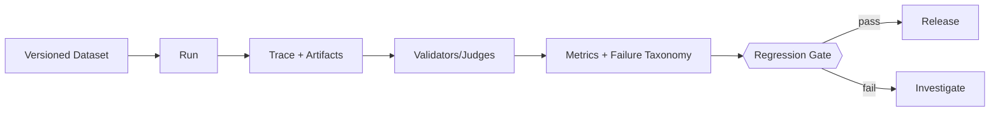

# Evaluation 闭环、Trace 与发布门

> **Freshness metadata**
> - `last_verified`: `2026-08-24`
> - `version_scope`: `stable evaluation architecture`
> - `source_type`: `engineering synthesis`
> - `stability`: `stable-concept`

## 最小数据模型

- Dataset：带版本的 case 集合；
- Task：goal、initial state、constraints、allowed actions；
- Environment：可重置的 repo/browser/API/sandbox；
- Trace：model/tool/control 事件与 artifact；
- Validator：确定性检查优先，judge 补充开放质量；
- Metrics：success、reliability、cost、latency、security；
- Run：代码、prompt、model、tool schema、dataset、environment 的完整版本组合。

## A/B 与回归

同一 case 使用相同初态和预算；随机模型至少重复运行并报告方差。对 paired case 比较，避免只看总体平均。发布门可表达为：关键任务成功率不下降、安全 violation 为零、p95 latency/cost 在预算内、已知故障不复现。

## Trace 不是越多越好

Trace 事件需有 `trace_id/span_id/event_type/timestamp/attempt/tool_call_id/state_before/state_after/evidence_ref`。敏感 prompt、secret 和用户数据按字段脱敏与 retention policy 管理。可观测性用于定位，不应成为新的数据泄漏面。
