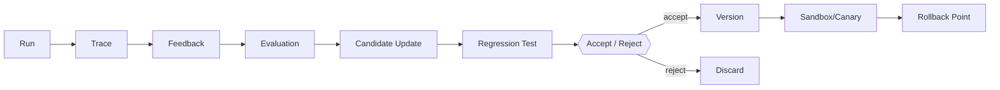

# Agent Evolution：受控改进闭环

> **Freshness metadata**
> - `last_verified`: `2026-08-24`
> - `version_scope`: `2026 agent-improvement architecture`
> - `source_type`: `primary-paper + official-repository + engineering synthesis`
> - `stability`: `version-sensitive`

Agent Evolution 指系统根据运行证据生成并筛选可版本化更新。它不等同于保存一次对话，也不意味着系统在生产中直接改写自己。

## 四类更新

1. **Context / Memory Evolution**：selection policy、summary、memory write/retrieval/forgetting；
2. **Skill Evolution**：新增/修改能力说明、脚本、examples、tests；
3. **Workflow / Program Evolution**：planner、routing、tool policy、代码或 DAG；
4. **Model / Parameter Evolution**：SFT、preference optimization、RL 或 tool-use training。

每类都要求 evaluator 与待更新组件隔离、候选有版本、在 sandbox 运行、明确 permission owner、回归集与 rollback。生产 trace 只能作为候选数据源，不能直接成为可信指令。

## Self-Evolution 与 Memory 的区别

Memory 更新的是任务/用户状态；Evolution 更新的是系统行为组件。读取“用户偏好 Java”是 memory；根据失败样本修改 tool schema 或 skill 是 evolution。二者都需 provenance，但审批、测试和发布流程不同。
