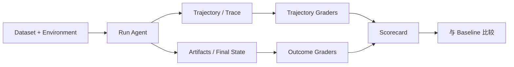

# Agent Eval：数据集、指标与回归测试

Demo 只能证明某一次路径可能成功，Eval 才能估计系统在任务分布上的可靠性。评测对象是完整 Agent 系统，包括模型、prompt、工具、检索、状态、权限和 Harness。

## 1. 任务集

每个 case 至少包含：

```yaml
id:
category:
input:
fixture:
allowed_side_effects:
expected_artifacts:
deterministic_checks:
rubric:
budget:
```

覆盖正常任务、边界、工具失败、空检索、权限确认、长上下文、取消和恢复。真实线上失败应脱敏后回灌回归集。

## 2. 指标

- task success / pass@1；
- deterministic check pass rate；
- rubric score；
- tool selection accuracy；
- invalid tool call rate；
- retry/loop rate；
- citation correctness/completeness；
- side-effect correctness；
- latency p50/p95；
- token 与金额；
- 人工干预率；
- 恢复成功率。

成功率必须配合预算，否则“无限重试”会制造虚假提升。

## 3. 评审方式

优先级：

1. 确定性验证：测试、schema、文件、数据库状态；
2. 规则验证：关键词、格式、引用覆盖；
3. 模型评审：开放文本质量；
4. 人工评审：关键、高价值样本。

LLM-as-judge 要固定 rubric、隐藏候选顺序、校准与人工一致性，并防止被待评内容中的指令影响。

## 4. 回归

保存：

- 代码 commit；
- 模型与参数；
- prompt/Skill/Tool schema 版本；
- fixture 版本；
- 每 case trace；
- 结果和差异。

PR 阶段跑小型 smoke 集，定期跑完整集。设定关键指标阈值，单独查看高风险 action 和引用正确性。

## 5. 失败分类

```text
context_missing
planning_error
tool_selection_error
invalid_arguments
tool_runtime_error
retrieval_miss
state_corruption
permission_error
validation_gap
final_answer_error
```

分类后才能知道应改 prompt、工具、索引、状态机还是产品定义。

## 6. 最小 20 题

Agent Learning Hub 建议至少 20 个任务。合理分配：5 个正常主路径、5 个工具异常、3 个权限/副作用、3 个长上下文/恢复、2 个空结果、2 个对抗或注入场景。

<!-- agent-learning-expansion:v2 -->
## 6. 评测对象是 Agent + Harness + Environment

只给模型一组问答题，测不到工具选择、状态迁移、权限、恢复和副作用。每个 eval case 至少应包含：

- 初始用户目标和环境 fixture；
- 可用工具、权限与预算；
- 可接受的多条成功轨迹或结果约束；
- 终态检查器；
- 质量、成本、延迟与副作用 rubric；
- 完整 trace 和产物。



## 7. Outcome、Trajectory 与 Efficiency

**Outcome** 检查任务最终是否完成，例如测试通过、记录写入正确；**Trajectory** 检查过程是否出现错误工具、无效循环、越权尝试或遗漏检查；**Efficiency** 测量轮次、token、工具次数、延迟和成本。结果正确但路径极不稳定的 Agent 仍有生产风险。

## 8. 构建可持续回归集

数据集应覆盖正常任务、边界条件、工具失败、权限差异、长上下文和历史生产事故。每个缺陷修复都加入最小复现 case；固定模型、prompt、工具与环境版本；对非确定输出运行多次并报告均值、分位数和方差；用确定性 grader 检查可程序化事实，再用人工或模型 rubric 评估开放质量。

[AI Agent 教程第 6 章](https://bojieli.github.io/ai-agent-book/book/chapter6/)强调评测需要同时考虑模型、Harness、环境、数据集和 rubric；[Anthropic 的 Agent eval 实践](https://www.anthropic.com/engineering/demystifying-evals-for-ai-agents)也将多轮轨迹、状态变化和最终结果作为核心评测对象。
