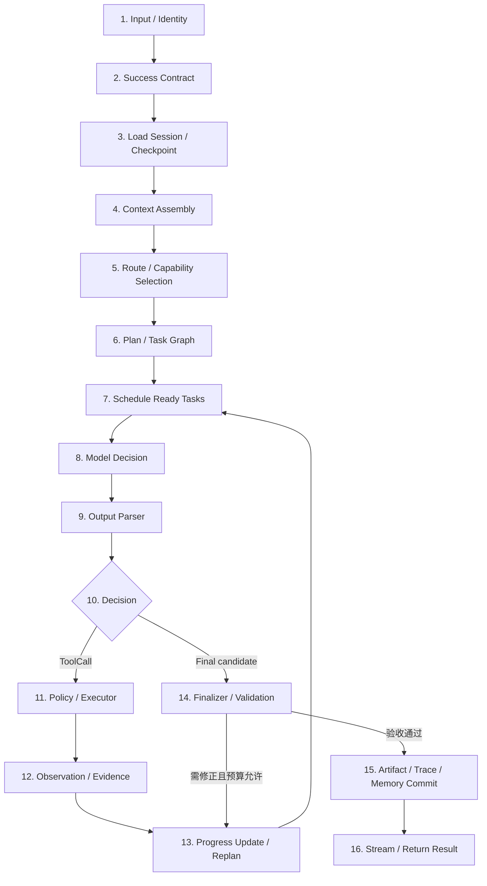
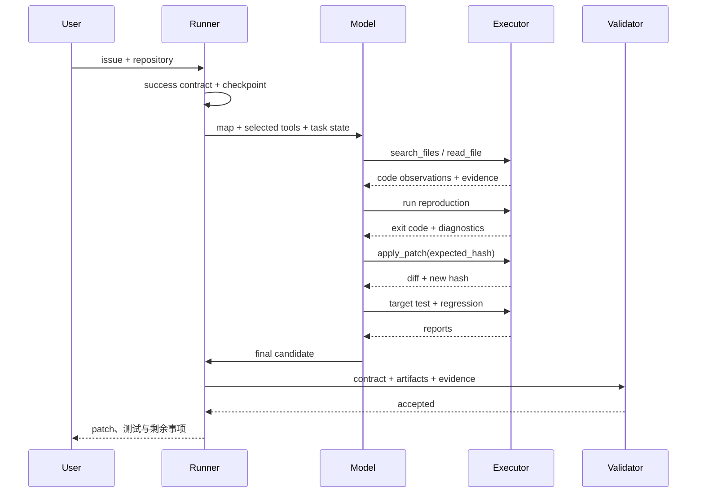

# 端到端 Agent 完整链路：从输入到证据化交付

一个可用的 Agent 不是单次模型请求，也不是只有 `while + tool call`。完整系统需要把用户目标、上下文、计划、调度、模型决策、解析、执行、验证、恢复和交付连接成一条可观测链路。

## 1. 总体链路



这张图里有三种不同性质的组件：

- **模型决策**：理解目标、提出计划、选择下一动作、综合结果；
- **确定性运行时**：身份、schema、调度、权限、执行、预算、状态提交和验证；
- **持久化边界**：session、checkpoint、event、artifact、Memory 与最终交付。

把三者分开，才能判断错误来自模型、协议、工具、环境还是状态管理。

## 2. 1～4：建立可执行输入

### 2.1 Input / Identity

入口把 Web、CLI、API 或消息平台输入规范化为：

```ts
type RunInput = {
  runId: string
  userId: string
  workspaceId: string
  locale: string
  request: MessageBlock[]
  attachments: ArtifactRef[]
  deadline: number
  budget: Budget
}
```

身份和 workspace 决定数据范围与工具权限。附件先成为受控 artifact，不直接把任意字节拼入 prompt。

### 2.2 Success Contract

把自然语言目标转成可检查契约：

```yaml
goal: 修复创建文件夹失败并补齐 Agent 学习内容
deliverables:
  - code changes
  - markdown documents
  - cloud data sync
acceptance:
  - folder create test passes
  - typecheck and unit tests pass
  - deployed page exposes new content
evidence:
  - git diff
  - test reports
  - database counts and hashes
  - deployment status and browser check
non_goals:
  - unrelated redesign
```

成功契约不一定全由模型生成。用户明确要求、仓库规则和 CI gate 具有更高确定性，应由运行时合并并保留来源。

### 2.3 Load Session / Checkpoint

新 run 建立初始 state；恢复 run 读取：

- 最近 committed event；
- 当前计划版本；
- ready/running/waiting task；
- pending tool call 和 side effect；
- artifact 与 EvidenceItem；
- 预算消耗；
- compaction summary；
- cancellation/approval 状态。

先 reconcile 未确认副作用，再继续调用模型，避免恢复后重复执行。

### 2.4 Context Assembly

Context Builder 从 policy、目标、计划、历史、工具、检索、Memory 和最新观察选择本轮最小充分集合，输出 provider request 和 ContextManifest。它不等于把数据库里的全部消息读出来。

## 3. 5～7：路线、计划与调度

### 3.1 Route / Capability Selection

Router 决定本轮使用：

- 普通确定性 workflow；
- 单 Agent loop；
- 专用模型/多模态模型；
- 某个 Skill 或 tool bundle；
- Agent-as-tool / specialist；
- 人工审批节点。

路由依据包括任务类型、模型 capability、上下文长度、工具需求、延迟和预算。Route decision 进入 trace 并通过固定任务集评测。

### 3.2 Plan / Task Graph

Planner 把目标变成可验收步骤，显式记录 dependency、input、output、write scope、budget 和 acceptance criteria。计划是可变假设，不是已经发生的事实。

### 3.3 Schedule Ready Tasks

Scheduler 使用确定性规则选择依赖已满足的任务：

```text
ready(task) =
  task.status == queued
  AND every dependency succeeded
  AND resource lock available
  AND concurrency/budget available
  AND task belongs to current plan version
```

Planner 回答“做什么”，Scheduler 回答“何时可以做、由谁做”。并发、背压、资源锁、lease 和失败传播不应只交给 prompt。

## 4. 8～10：模型请求与 Output Parser

### 4.1 Model Decision

Model Adapter 发送已经装配的请求，接收流式或非流式 provider events，并记录：

- model/provider 与 capability；
- request/response ID；
- token/缓存/延迟；
- stop reason；
- tool call content blocks；
- provider error 与 retry attempt。

### 4.2 Output Parser

Parser 依次执行：

```text
raw provider events
-> assemble content/tool deltas
-> protocol completeness
-> normalized ModelResponse
-> JSON/schema validation
-> domain/state validation
-> ToolDecision | FinalCandidate
```

它区分 native structured output、tool calling、JSON mode 和自由文本兼容路径。结构可解析只代表格式成立，不代表事实和业务成功。

### 4.3 Decision

规范化输出常见分支：

- 调用一个或多个工具；
- handoff / specialist；
- 请求必要输入；
- 更新计划；
- 给出 final candidate；
- provider 或 model behavior error。

每个分支都有显式 event 和预算变化。

## 5. 11～13：执行、观察与重规划

### 5.1 Policy / Executor

Tool Executor：

1. 解析工具版本；
2. normalize arguments；
3. schema/domain/state guard；
4. policy 与 approval；
5. idempotency、reservation 与 lock；
6. adapter 执行；
7. timeout/cancellation；
8. ToolResult 规范化；
9. evidence 抽取和独立验证；
10. state/trace commit。

文件、terminal、浏览器、数据库等 adapter 有各自语义；统一外壳不应抹掉退出码、HTTP 状态、事务或部分成功。

### 5.2 Observation / Evidence

Observation 是给 Agent 的有界事实；Evidence 是可追溯的原始或结构化证明：

```text
Observation:
  "typecheck failed: 2 diagnostics; first at app/a.ts:42"

Evidence:
  test-report://run_123/typecheck
  file://workspace/app/a.ts#L42-L48
  process://proc_88 { exit_code: 2, stdout_hash: ... }
```

观察可以压缩，证据引用必须稳定。

### 5.3 Progress Update / Replan

Reducer 根据 ToolResult 更新 task state。Planner 只在以下情况重规划：

- 原假设被环境观察推翻；
- 依赖或接口改变；
- 验收失败且原步骤不再合适；
- 预算/权限使原路径不可行；
- 新任务必须加入图。

计划变更产生新版本，并使依赖旧输出的下游任务失效。不要在每一轮无条件重写整份计划。

## 6. 14～16：Finalizer、持久化与返回

### 6.1 Finalizer / Validation

Final candidate 进入四层验证：

1. **协议**：所有 tool call 有结果，输出类型完整；
2. **结构**：必填字段、artifact 和格式；
3. **任务**：成功契约逐项满足；
4. **外部状态**：文件、数据库、部署或消息的真实状态。

可修复失败且预算允许时，ValidationResult 回到 Agent 成为 observation；deadline、硬失败或不可消解的 unknown 状态则以明确 stop reason 结束。

### 6.2 Artifact / Trace / Memory Commit

结束前提交：

- 最终回答和结构化结果；
- 文件、报告、diff、截图等 artifacts；
- EvidenceItem / ValidationResult；
- 完整 trace 与成本；
- plan/task 最终状态；
- 适合长期保存的 Memory 候选；
- 未完成、部分成功或 unknown side effect。

Memory 写入是经过策略筛选的派生动作，不是把整个 trace 永久保存。

### 6.3 Stream / Return Result

用户可在运行中接收进度事件，但最终响应只声明已验证状态。建议结构：

```ts
type RunResult = {
  outcome: 'completed' | 'partial' | 'failed' | 'cancelled'
  finalOutput: MessageBlock[]
  deliverables: ArtifactRef[]
  validation: ValidationResult[]
  unresolved: UnresolvedItem[]
  usage: UsageSummary
  traceRef: string
}
```

## 7. 端到端示例：修复一个仓库 issue



逐步解释：

1. 先定位和复现，避免依据 issue 文本直接改代码；
2. 文件读取带 hash，patch 使用 compare-and-swap；
3. Terminal 结果区分 stdout、stderr、退出码和 timeout；
4. 目标测试验证修复，相关回归减少邻近破坏；
5. Finalizer 还检查 diff 范围、产物和未提交文件；
6. 最终“完成”来自 ValidationResult，不来自模型一句话。

## 8. 跨模块不变量

1. 每个模型请求都有 ContextManifest；
2. 每个 provider 响应保留 raw ref 和 normalized result；
3. 每个 tool call 恰好对应一个 ToolResult；
4. 每个副作用都有幂等身份和验证；
5. Planner、Scheduler、Runner、Executor 分层；
6. Observation 不伪装成 Evidence；
7. 可修复验证失败回到 loop，而非立即丢弃；
8. deadline、取消和预算由运行时强制；
9. checkpoint 只在必要状态已持久化后前移；
10. final output 的完成声明能映射到成功契约。

## 9. 每层最常见的失败

| 层               | 失败                          | 诊断证据              |
| ---------------- | ----------------------------- | --------------------- |
| Input            | 目标歧义、附件缺失            | normalized input      |
| Success Contract | 验收过于主观                  | contract history      |
| Context          | 约束丢失、噪声过多            | ContextManifest       |
| Route            | capability 不匹配             | route decision        |
| Plan             | 步骤不可验收、依赖缺失        | plan versions         |
| Scheduler        | 写冲突、饥饿、重复领取        | queue/lease events    |
| Model            | 选错工具、循环                | response trace        |
| Parser           | delta 不完整、schema mismatch | raw response          |
| Executor         | timeout、partial、unknown     | ToolResult            |
| Observation      | 截断隐藏关键错误              | artifact + truncation |
| Replan           | 旧结果未失效                  | task graph versions   |
| Finalizer        | 把调用成功当任务完成          | ValidationResult      |
| Persistence      | checkpoint 与副作用错位       | event log             |

## 10. 学习与实现顺序

1. 先实现单 Agent `model -> tool -> observation -> final`；
2. 加入结构化 ToolResult、终止和预算；
3. 增加 ContextManifest 与 Output Parser；
4. 用 Success Contract 和 Finalizer 验证；
5. 加入 plan/task graph 与确定性 scheduler；
6. 再做 checkpoint、worker、middleware 和多 Agent；
7. 每增加一层，先加入 trace、故障注入和回归任务。

复杂框架替代不了清晰契约。最小可验证系统通常比一次加入所有组件更容易获得稳定成功率。

## 参考资料

- [Anthropic：Building effective agents](https://www.anthropic.com/engineering/building-effective-agents)
- [OpenAI Agents SDK：Running agents](https://openai.github.io/openai-agents-python/running_agents/)
- [LangGraph：Workflows and agents](https://docs.langchain.com/oss/python/langgraph/workflows-agents)
- [Google ADK：Runtime event loop](https://adk.dev/runtime/event-loop/)
- [Microsoft Agent Framework：Workflows](https://learn.microsoft.com/en-us/agent-framework/workflows/)
