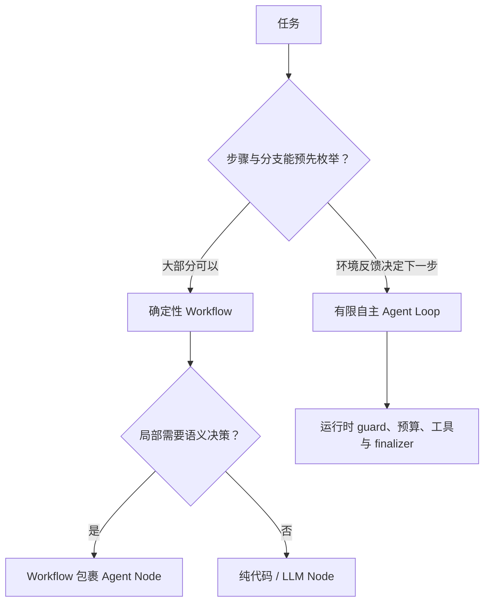

# 权威 Agent 路线横向对照：共同链路、控制权与适用边界

本章对照 Anthropic、OpenAI Agents SDK、LangChain/LangGraph、Google ADK、Microsoft Agent Framework 与 AutoGen 的官方材料。目的不是评选“唯一正确框架”，而是检查一条 Agent 学习路线是否遗漏关键层，并理解相似名词背后的控制权差异。

> 文档与框架会持续演进。本章以链接中的官方页面为准，关注长期稳定的架构概念；具体 API 使用前应再核对对应版本。

## 1. 六条路线分别强调什么

### 1.1 Anthropic：从简单组合模式逐步增加自主性

Anthropic 的 _Building effective agents_ 先区分：

- **Workflow**：LLM 和工具沿预定义代码路径运行；
- **Agent**：LLM 动态决定过程和工具使用。

其核心模式是 prompt chaining、routing、parallelization、orchestrator-workers、evaluator-optimizer 和 autonomous agent。它强调先寻找最简单可行方案，并把工具接口当成需要认真设计的 Agent-Computer Interface。

学习价值：**控制模式选择、复杂度成本和工具设计原则**。它不是完整的 durable runtime API 规范。

### 1.2 OpenAI Agents SDK：Agent + Runner + Tools + Handoffs

官方 SDK 把 Agent 定义为配置了 instructions、tools、guardrails、handoffs 和 structured output 的模型单元；Runner 驱动循环：

```text
invoke model
-> final output: stop
-> handoff: change active agent and continue
-> tool calls: execute, append results, continue
-> max turns: explicit error
```

SDK 同时提供 lifecycle hooks、sessions、tracing、Agent-as-tool 和 handoff 两类 orchestration。

学习价值：**清楚的 Runner loop、输出类型、工具与多 Agent 控制权**。

### 1.3 LangChain / LangGraph：状态图、节点、边与 persistence

LangGraph 把长运行、有状态的 Agent 工作流建模为 graph。官方 workflows/agents 教程覆盖：

- prompt chaining；
- parallelization；
- routing；
- orchestrator-worker 与动态 worker；
- evaluator-optimizer；
- Agent loop。

Persistence 通过 checkpoint 保存 graph state，支持暂停、恢复和故障处理。LangChain 的 context engineering 与 structured output 文档则说明 middleware、ProviderStrategy/ToolStrategy 等。

学习价值：**显式状态、图控制、动态 fan-out、checkpoint 与可组合节点**。

### 1.4 Google ADK：Agent、Tool、Graph 与 Runtime Event Loop

ADK 的文档把 Agent、Tool、代码节点组合到 graph/workflow，并由 Runner 处理 event loop。Graph 与 dynamic workflow 页面展示 sequence、loop、parallel、动态路由、checkpoint 和 resume。

学习价值：**事件驱动 runtime 与显式/动态工作流组合**。不要只根据早期 Sequential/Parallel/Loop 模板理解当前路线，应查看 graph 和 dynamic workflow 的最新页面。

### 1.5 Microsoft Agent Framework：Agent 与 Workflow 的统一工程面

Microsoft Agent Framework 的 Workflow 使用 executor、edge、message 和 checkpoint 表达多步系统，并把 middleware、context provider、tool 和 Agent 放在同一学习旅程中。

学习价值：**Executor/Workflow 的类型化边界、企业集成与持久执行**。注意它和 AutoGen 是不同项目路线，API 心智模型应以当前官方文档为准。

### 1.6 AutoGen：AgentChat teams 与 Core

AutoGen stable 文档提供 AgentChat 的 team presets、termination conditions 和较低层 Core。Team 可表达 round-robin、selector、swarm 等协作，但官方也提醒先确认复杂任务确实需要 team。

学习价值：**多 Agent 消息协作、team termination 与组件化 Agent**。2023 论文适合了解起源，当前实现应配套 stable 文档阅读。

## 2. 核心维度对照

| 维度              | Anthropic 模式                  | OpenAI Agents SDK                        | LangGraph                        | Google ADK                    | Microsoft Agent Framework | AutoGen                         |
| ----------------- | ------------------------------- | ---------------------------------------- | -------------------------------- | ----------------------------- | ------------------------- | ------------------------------- |
| 主要抽象          | workflow / agent 模式           | Agent + Runner                           | StateGraph / node / edge         | Agent + Tool + Graph + Runner | Agent + Workflow Executor | Agent / Team / Runtime          |
| 控制流            | 代码固定或模型动态              | Runner loop、handoff、code orchestration | 显式图 + 条件边 + 动态 Send      | 图、动态 workflow、event loop | edge 驱动 executor        | team manager / message runtime  |
| Task planning     | orchestrator-workers 概念       | 可由模型或代码实现                       | structured planner + graph state | Agent/graph 节点组合          | workflow executor 组合    | planning agent/team pattern     |
| Scheduling        | 模式级描述                      | tool 并发上限与代码 orchestration        | superstep/动态 worker            | runtime/graph                 | workflow runtime          | runtime/team message delivery   |
| Context           | 强调最小高信号、JIT、compaction | instructions、input、context、sessions   | state + context engineering      | session/state/event           | context providers         | message context / model context |
| Structured output | 作为可靠组合基础                | `output_type`                            | provider/tool strategy           | schema/tool results           | typed messages            | structured messages/tools       |
| Tool execution    | ACI 设计原则                    | function/hosted/runtime tools            | tool nodes                       | Tool + runtime                | Tool + executor           | tools/workbench                 |
| Persistence       | 原则与 harness 建议             | sessions + durable integrations          | checkpoint/pending writes        | session/checkpoint/resume     | checkpoint                | state save/load 依团队类型      |
| Multi-Agent       | orchestrator-workers            | Agent-as-tool / handoff                  | subgraph/worker patterns         | multi-agent/graph             | workflow + agents         | teams 是核心高层能力            |
| Observability     | eval 与 transcript 原则         | tracing/hooks                            | state/history/生态 trace         | events                        | workflow events           | message/events/logging          |

表格描述的是官方路线的关注点，不表示某框架缺少未列出的扩展。真正选型要深入目标版本和所需 capability。

## 3. Workflow 与 Agent：最重要的第一处分叉



选择依据：

- 固定审批、ETL、报表流水线优先 Workflow；
- 开放搜索、仓库诊断、动态工具使用适合 Agent；
- 多文件修改可用 orchestrator-workers，但任务拆分仍要可验收；
- 最常见的生产形态是确定性图包裹少数 Agent 节点，而不是所有控制都交给模型。

## 4. Task Decomposition 与 Scheduling 在框架中的位置

多个教程会展示 Planner 生成 section/task，但 Planner 输出不是 scheduler。

```text
LLM Planner:
  goal -> proposed TaskGraph

Deterministic Scheduler:
  TaskGraph + state + locks + budget
  -> ready tasks + worker leases

Workflow/Tool Executor:
  ready task -> actual actions/results
```

LangGraph 的 dynamic `Send` 展示了根据 planner 结果创建 worker；Microsoft Workflow 强调 executor/edge；OpenAI 文档更倾向由 Python 控制并发和循环。三种都说明：动态分解可以由模型完成，但依赖、并发、资源和停止应有代码层表达。

## 5. Context Engineering 的共同结论

不同路线措辞不同，共同点包括：

- Context 是当前请求的工作集，不是全部 Memory；
- 工具和技能按需暴露；
- 长任务需要 state/checkpoint/notes，而不是只依赖窗口；
- 历史需要 compaction，但必须保留目标、约束、失败和证据；
- 外部内容是数据，运行时规则是指令；
- 需要 trace 或 snapshot 解释模型当时看到了什么。

差异主要在承载位置：

- LangGraph 常把业务状态显式放进 graph state；
- OpenAI SDK 区分应用 context 与模型可见 input；
- Anthropic 更强调 token 注意力预算与 JIT retrieval；
- ADK、Microsoft 和 AutoGen 通过各自 runtime/session/message 抽象传递状态。

## 6. Output Parser 与 Structured Output 的共同边界

框架提供的 structured output 通常解决：

- provider 原生 schema；
- tool/function strategy；
- JSON 解析与类型校验；
- validation error 回传。

仍需应用自己解决：

- 业务合法性；
- 事实是否有证据；
- 状态版本是否仍有效；
- 多个工具副作用是否真实完成；
- final result 是否满足用户成功契约。

因此：

```text
structured output success
≠ domain validation success
≠ task completion
```

## 7. Multi-Agent：四种容易混淆的模式

| 模式             | 控制权                   | Context                       | 适合场景               |
| ---------------- | ------------------------ | ----------------------------- | ---------------------- |
| Router           | 代码或模型选择一次路线   | 通常交给一个 specialist       | 明确领域分类           |
| Agent-as-tool    | Manager 保持控制         | specialist 获得过滤后的子任务 | 子能力可返回结构化结果 |
| Handoff          | Specialist 接管后续 turn | 转移后的会话上下文            | 分诊到长期负责者       |
| Shared team/chat | 多成员轮流/选择发言      | 共享或广播消息                | 协作本身是任务结构     |

OpenAI SDK 明确区分 Agent-as-tool 与 handoff；AutoGen 主要展示 team；LangGraph 可用 subgraph/worker 表达；Anthropic 的 orchestrator-workers 更像 Manager + workers。术语相似时，应追问“谁决定下一步、谁拥有 final answer、上下文如何过滤”。

## 8. Durable Execution 的共同问题

长运行 Agent 迟早会遇到进程重启、审批等待和网络超时。无论框架是否提供内建 persistence，以下不变量依然成立：

1. checkpoint 与外部副作用之间要有恢复协议；
2. worker 可能重复领取任务；
3. tool call 需要稳定 ID 与幂等键；
4. pending side effect 恢复时先 reconcile；
5. pause/resume 保存的是可验证状态，不是仅保存 prompt；
6. 版本升级后旧 state/event schema 需要迁移策略。

LangGraph persistence、ADK runtime、Microsoft Workflow 和 OpenAI durable integrations 提供不同实现入口，但应用仍需定义自身副作用语义。

## 9. 对当前知识库路线的审计结论

审计原有 Agent 开发树后：

### 已有强覆盖

- Agent 类型与适用范围；
- Observe–Think/Decide–Act loop；
- tool schema、权限、幂等与证据；
- RAG、Memory、Harness；
- 多 Agent 基础；
- 浏览器、评测、可观测性与交付；
- 多个现代 Coding Agent 源码研究。

### 本轮补齐的关键缺口

- SWE Agent、SWE-agent、SWE-bench 与 ACI；
- terminal 进程执行、stdout/stderr 与 file I/O；
- Goal/Plan/Task/Action/ToolCall 分层；
- DAG scheduler、ready queue、lease、背压与重规划；
- prompt chaining 等六类控制模式；
- provider response 到 normalized decision 的 Output Parser；
- typed ContextFragment 与 Prompt Assembly；
- Runner/Workflow/Tool/Process Executor 分层；
- Middleware、hooks、typed pause/short-circuit；
- 一条可验证的端到端链路。

### 仍应持续迭代

- 用固定项目实践检验教程，而不是只扩充文字；
- 给 scheduler、parser、context builder 做故障注入；
- 记录框架页面和代码的版本/commit；
- 定期复核会快速演进的 API；
- 将评测结果和架构变更绑定。

## 10. 选型问题清单

在采用框架前回答：

1. 任务用确定性 Workflow 能完成多少？
2. 模型具体在哪些节点拥有控制权？
3. plan、task 和 tool call 的数据结构是什么？
4. scheduler 如何处理依赖、并发、锁和背压？
5. Context Builder 能解释每个 fragment 的来源吗？
6. provider stream 如何组装和解析？
7. Tool Executor 如何表示 partial/unknown？
8. checkpoint 与外部副作用如何恢复？
9. Agent-as-tool、handoff 和 team 哪个符合控制权需求？
10. final output 如何逐项验证成功契约？
11. trace 是否能重建一次失败 run？
12. 目标版本在部署平台、语言与 license 上是否合适？

## 参考资料

### Anthropic

- [Building effective agents](https://www.anthropic.com/engineering/building-effective-agents)
- [Effective context engineering for AI agents](https://www.anthropic.com/engineering/effective-context-engineering-for-ai-agents)
- [Effective harnesses for long-running agents](https://www.anthropic.com/engineering/effective-harnesses-for-long-running-agents)

### OpenAI Agents SDK

- [Agents](https://openai.github.io/openai-agents-python/agents/)
- [Running agents](https://openai.github.io/openai-agents-python/running_agents/)
- [Agent orchestration](https://openai.github.io/openai-agents-python/multi_agent/)
- [Lifecycle hooks](https://openai.github.io/openai-agents-python/ref/lifecycle/)

### LangChain / LangGraph

- [Workflows and agents](https://docs.langchain.com/oss/python/langgraph/workflows-agents)
- [Persistence](https://docs.langchain.com/oss/python/langgraph/persistence)
- [Context engineering](https://docs.langchain.com/oss/python/langchain/context-engineering)
- [Structured output](https://docs.langchain.com/oss/python/langchain/structured-output)

### Google ADK

- [Graph workflows](https://adk.dev/graphs/)
- [Dynamic workflows](https://adk.dev/graphs/dynamic/)
- [Runtime event loop](https://adk.dev/runtime/event-loop/)

### Microsoft

- [Microsoft Agent Framework：Workflows](https://learn.microsoft.com/en-us/agent-framework/workflows/)
- [Microsoft Agent Framework：Learning journey](https://learn.microsoft.com/en-us/agent-framework/journey/workflows)
- [AutoGen stable：Teams](https://microsoft.github.io/autogen/stable/user-guide/agentchat-user-guide/tutorial/teams.html)
- [AutoGen stable：Termination](https://microsoft.github.io/autogen/stable/user-guide/agentchat-user-guide/tutorial/termination.html)
