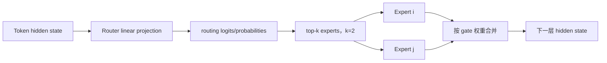
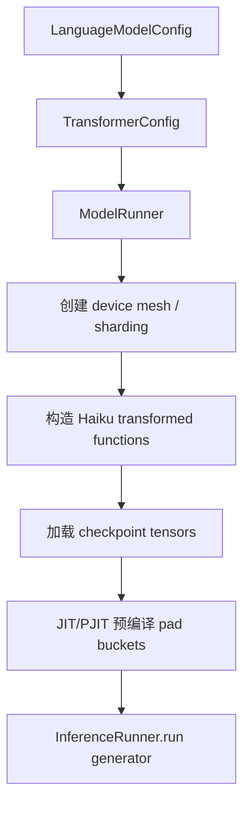
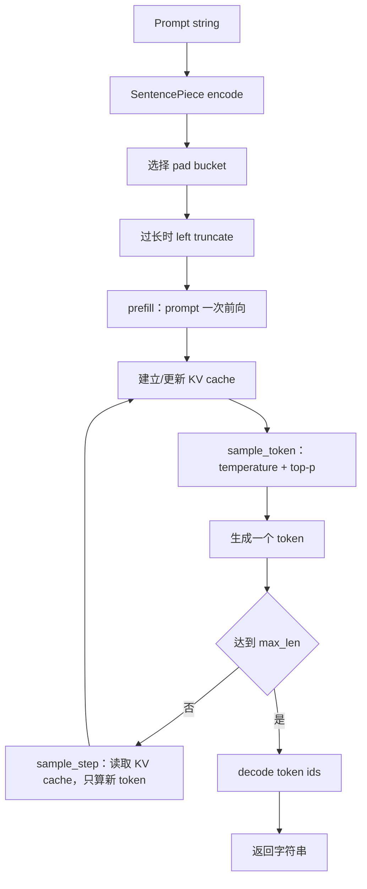
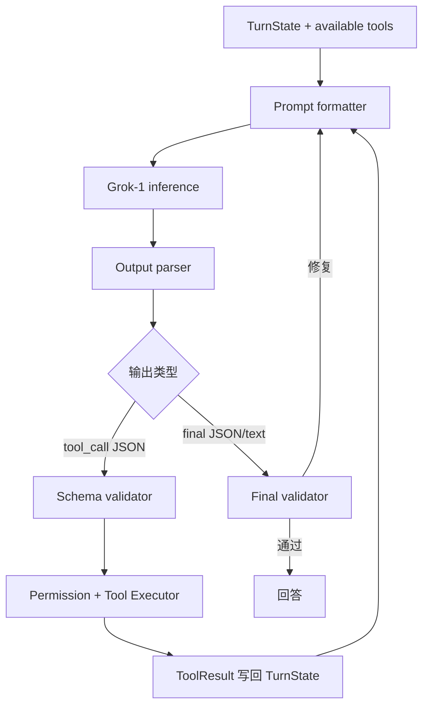
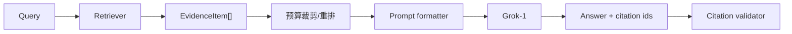

# xAI Grok-1 源码精读：模型推理循环与 Agent Harness 的边界

> **Freshness metadata**
> - `last_verified`: `2026-08-24`
> - `version_scope`: `analyzed snapshot inside document; historical model-backend comparison`
> - `source_type`: `official-repository`
> - `stability`: `fast-moving`


> 研究对象：[`xai-org/grok-1`](https://github.com/xai-org/grok-1)
> 固定源码快照：[`7050ed204b8206bb8645c7b7bbef7252f79561b0`](https://github.com/xai-org/grok-1/tree/7050ed204b8206bb8645c7b7bbef7252f79561b0)
> 快照日期：2024-03-19
> 定位：Grok-1 基础模型权重的 JAX 推理实现，不是 Codex、Claude Code、Hermes 或 OpenClaw 那类 agent harness。

## 0. 结论先行

把 Grok-1 和另外四个仓库放在一起时，最容易犯的错误是把：

```text
token generation loop
```

当成：

```text
agent observe-think-act loop
```

两者不是同一层。

Grok-1 公开仓库提供：

- 314B 参数 Mixture-of-Experts 模型结构；
- JAX/Haiku 推理；
- checkpoint 加载；
- SentencePiece tokenizer；
- KV cache；
- top-p/temperature sampling；
- 多设备 mesh/sharding；
- 一个本地 prompt 生成示例。

它没有提供：

- tool/function calling runtime；
- tool registry；
- skills；
- MCP；
- RAG；
- session store；
- conversation memory；
- LLM context compaction；
- permissions；
- agent planner；
- evidence/citation；
- semantic output validator；
- coding-agent harness。

这并不表示 Grok-1 没价值，而是它处于**模型层**。若要成为 agent，需要在外部增加完整 harness。

---

## 1. 仓库结构

该快照只有十余个 tracked files：

| 文件                    | 职责                                                   |
| ----------------------- | ------------------------------------------------------ |
| `model.py`              | Transformer、MoE、attention、RoPE、KV memory、量化权重 |
| `runners.py`            | JAX 编译、prefill、sampling、请求调度、mesh            |
| `checkpoint.py`         | tensor/checkpoint 恢复与共享内存辅助                   |
| `run.py`                | 构造模型配置并运行一个 prompt                          |
| `tokenizer.model`       | SentencePiece tokenizer                                |
| `checkpoints/README.md` | checkpoint 获取/放置说明                               |
| `requirements.txt`      | JAX/Haiku 等依赖                                       |
| `pyproject.toml`        | Ruff 配置                                              |

由于代码面非常小，本文可以明确区分“实现存在”和“agent 层缺席”。

---

## 2. 模型架构

### 2.1 `run.py` 中的公开配置

[`run.py`](https://github.com/xai-org/grok-1/blob/7050ed204b8206bb8645c7b7bbef7252f79561b0/run.py) 构造：

| 参数                   |                    值 |
| ---------------------- | --------------------: |
| vocabulary             | `128 * 1024 = 131072` |
| sequence length        |                `8192` |
| embedding size         |     `48 * 128 = 6144` |
| transformer layers     |                  `64` |
| query heads            |                  `48` |
| KV heads               |                   `8` |
| head/key size          |                 `128` |
| experts                |                   `8` |
| selected experts/token |                   `2` |
| widening factor        |                   `8` |
| pad token              |                   `0` |
| EOS token              |                   `2` |

README 把它描述为约 314B 参数的 MoE 模型。

### 2.2 MoE Router

`model.py` 中的 `Router`/`MoELayer` 做的是神经网络内部专家路由：



这里的 `Router` 与 agent 的 `chat/rag/tools/research Router` 只有名字相同：

- MoE Router：为每个 token 选择神经网络 expert；
- Agent Router：为用户意图选择执行路径或工具。

不要直接把前者的实现思路用于后者。

### 2.3 Attention

实现包括：

- grouped/multi-query attention：48 Q heads 对 8 KV heads；
- causal mask；
- RoPE；
- RMSNorm；
- KV cache；
- JAX sharding；
- bfloat16 等数据类型；
- 8-bit quantized weight 类型；
- transformer decoder stack。

---

## 3. 真正存在的 Chain：模型推理链

### 3.1 初始化链



### 3.2 单请求推理链



### 3.3 `InferenceRunner.run()` 是 generator scheduler

[`runners.py`](https://github.com/xai-org/grok-1/blob/7050ed204b8206bb8645c7b7bbef7252f79561b0/runners.py) 中 `run()` 返回一个 Python generator：

- `yield` 接收 `Request`；
- 从 free slots 中分配 batch slot；
- tokenizer 编码；
- pad/prefill；
- 多个 active request 共同执行 sample step；
- host 端收集 token；
- 达到每个 request 的 `max_len` 后 decode；
- 释放 slot。

这是推理服务中的动态 batch 思路，但仍然没有 tool-use/agent state。

### 3.4 Sampling

`sample_token()` 的主要步骤：

1. logits 除以 temperature；
2. mask 禁止 token；
3. `top_p_filter` 做 nucleus filtering；
4. categorical sample；
5. 同时保存 top-k token ids/probabilities。

`run.py` 的示例使用 `temperature=0.01`，近似确定性输出，但不是严格 deterministic contract：硬件、JAX、浮点与 sampling 实现仍会影响结果。

### 3.5 停止条件

本快照请求 loop 明确检查的是：

```python group=multi-d30e5469d1c1 label=Python
len(all_tokens) < request.max_len
```

```rust group=multi-d30e5469d1c1 label=Rust
all_tokens.len() < request.max_len
```

```javascript group=multi-d30e5469d1c1 label=JavaScript
allTokens.length < request.maxLen
```

```typescript group=multi-d30e5469d1c1 label=TypeScript
allTokens.length < request.maxLen
```

虽然 model config 有 `eos_token=2`，当前可见 `InferenceRunner.run()` 收集路径没有把 EOS 作为主要结束条件。将其封装成产品时应补：

- EOS；
- stop sequences；
- max new tokens；
- cancellation；
- timeout；
- client disconnect；
- bad token/NaN；
- context limit。

---

## 4. KV Memory 不是 Agent Memory

### 4.1 KV cache 的内容

`model.py` 中：

```python group=multi-af9e2263a260 label=Python
class KVMemory(NamedTuple):
    k: ...
    v: ...
    step: ...
```

```rust group=multi-af9e2263a260 label=Rust
struct KvMemory<T> {
    k: T,
    v: T,
    step: usize,
}
```

```javascript group=multi-af9e2263a260 label=JavaScript
/**
 * @template T
 * @typedef {{ k: T, v: T, step: number }} KvMemory
 */
```

```typescript group=multi-af9e2263a260 label=TypeScript
type KvMemory<T> = {
  k: T
  v: T
  step: number
}
```

每一层保存：

- attention key；
- attention value；
- 当前 step。

它用于避免每生成一个 token 都重新计算全部前缀。

### 4.2 与会话记忆的差异

| KV cache                      | Agent/session memory     |
| ----------------------------- | ------------------------ |
| 数值 tensor                   | 文本/结构化事实          |
| 单次生成加速                  | 跨 turn/session 恢复     |
| 模型层内部状态                | harness 层可检索状态     |
| context 被截断后相应部分消失  | 可有 summary/index/store |
| 并不解释“用户偏好是什么”      | 可保存偏好、任务、证据   |
| 生命周期通常是 request/stream | 生命周期可到项目/用户    |

把 KV cache 存盘并不会直接得到长期记忆。

### 4.3 Context 超限行为

`pad_to_size()`：

```python group=multi-ab5589404bc1 label=Python
if x.shape[0] > size:
    x = x[-size:]
```

```rust group=multi-ab5589404bc1 label=Rust
if x.len() > size {
    x = x[x.len() - size..].to_vec();
}
```

```javascript group=multi-ab5589404bc1 label=JavaScript
if (x.length > size) {
  x = x.slice(-size)
}
```

```typescript group=multi-ab5589404bc1 label=TypeScript
if (x.length > size) {
  x = x.slice(-size)
}
```

即保留末尾、左侧截断。它没有：

- LLM 摘要；
- system/user priority；
- tool-call pair repair；
- evidence preservation；
- key decisions；
- recent-turn/summary 分层；
- compaction event。

若 system prompt 在最左侧，简单 left truncate 还可能丢掉系统约束。因此外部 harness 必须在 tokenize 前管理上下文。

---

## 5. Tool / Function Call：仓库中的实际状态

### 5.1 没有 tool protocol

源码未定义类似：

- `tools=[...]`；
- JSON Schema；
- `tool_call_id`；
- `function_call`；
- `tool_result`；
- registry/executor；
- permission/hook。

模型只输出 token 字符串。

### 5.2 若把 Grok-1 接入 agent，需要补什么



最低需要：

```python group=multi-b286e80d16ab label=Python
class ModelResponse:
    kind: Literal["tool_call", "final", "invalid"]
    tool_call: ToolCall | None
    content: str | None
```

```rust group=multi-b286e80d16ab label=Rust
enum ModelResponse {
    ToolCall { tool_call: ToolCall },
    Final { content: String },
    Invalid,
}
```

```javascript group=multi-b286e80d16ab label=JavaScript
/**
 * @typedef {{
 *   kind: 'tool_call'|'final'|'invalid',
 *   toolCall?: ToolCall,
 *   content?: string
 * }} ModelResponse
 */
```

```typescript group=multi-b286e80d16ab label=TypeScript
type ModelResponse =
  | { kind: 'tool_call'; toolCall: ToolCall }
  | { kind: 'final'; content: string }
  | { kind: 'invalid' }
```

### 5.3 纯 prompt JSON tool call 的风险

Grok-1 公开推理代码没有原生 constrained decoding：

- JSON 可能缺括号；
- tool 名可能不存在；
- 参数类型可能错；
- 文本与 JSON 混合；
- 同时生成多个对象；
- schema 合法但行为错误。

因此需要 parser repair、schema validator、loop budget。更稳定的做法是模型/服务层支持 grammar/constrained decoding，再由宿主做语义验证。

---

## 6. Skills：仓库中的实际状态

Grok-1 没有 `SKILL.md` loader、skill metadata、scripts/references 或 progressive disclosure。

若在外部 harness 中加入 skills，Grok-1 只扮演“读取 skill 正文并按照它生成下一步”的模型。实现属于宿主：

```text
skill discovery
-> metadata index
-> explicit/implicit selection
-> body loading
-> tool dependency check
-> prompt injection
-> trace/eval
```

推荐不要把所有 skills 拼到 8192-token context。Grok-1 的窗口相对现代 harness 更紧，progressive disclosure 更重要：

```text
启动：name + 一句 description
命中：SKILL.md 摘要
执行：只读当前步骤需要的 reference
```

---

## 7. RAG：仓库中的实际状态与接入方式

### 7.1 没有 RAG

仓库没有：

- document ingestion；
- chunking；
- embedding；
- vector database；
- BM25；
- reranker；
- evidence registry；
- citation renderer。

### 7.2 外接 RAG



因为上下文仅 8192，建议：

- chunk 尽量小而完整；
- hybrid retrieve 后 rerank；
- 对 tool result 做 head-tail 或语义压缩；
- context 中只放高价值 evidence；
- citation 使用短 id；
- session summary 与 RAG evidence 分开预算；
- 超长原文保存在外部 store，模型只拿 locator/excerpt。

### 7.3 RAG 与模型不是同一组件

替换 Grok-1 为另一个模型，不应重写 retrieval。正确接口：

```text
Retriever -> Evidence schema -> ContextBuilder -> ModelAdapter
```

模型 adapter 只负责：

- tokenize/format；
- generate；
- parse provider response；
- usage/error。

---

## 8. Harness 架构：当前缺口与参考实现

### 8.1 需要新增的层

| 层            | 必要组件                              |
| ------------- | ------------------------------------- |
| Model adapter | `GrokModelAdapter`、stop/cancel/usage |
| Agent loop    | turn/step、follow-up、loop guard      |
| Tool layer    | schema、registry、executor、adapters  |
| Context       | role messages、budget、compaction     |
| Session       | transcript、summary、resume           |
| Memory        | short/session/long 分层               |
| RAG           | ingestion/retrieval/evidence          |
| Validation    | protocol/schema/semantic/citation     |
| Permissions   | filesystem/network/code execution     |
| Observability | events、trace、metrics                |
| Skills        | discovery、selection、loader          |

### 8.2 模型服务与 agent runtime 分离

推荐：

```text
Inference Service
  - load checkpoint once
  - batching
  - tokenize/generate
  - cancellation
  - health/metrics

Agent Runtime
  - sessions
  - tools
  - RAG
  - skills
  - compaction
  - validation
```

否则 checkpoint/JAX device 状态和用户 session/tool state 会过度耦合。

---

## 9. LLM 返回检查

### 9.1 仓库现有检查

Grok-1 的检查主要是数值推理不变量：

- tensor shape assertions；
- dtype assertions；
- attention heads 可整除；
- mask 维度；
- key/value shape；
- mesh config 维度；
- checkpoint path/key/tree 对齐；
- transformed function 已初始化；
- context/pad bucket 边界。

这些检查保证模型计算链相对一致，不验证自然语言事实。

### 9.2 没有的输出检查

仓库不检查：

- JSON schema；
- tool call；
- exact answer；
- citation；
- factuality；
- toxicity；
- task completion；
- repeated tool loop；
- evidence isolation。

### 9.3 给外部 Agent 的三层 validator

```text
Layer 1：协议
  UTF-8、JSON、字段、类型、枚举、无额外字段

Layer 2：确定性语义
  exact sequence、数值范围、ID 是否存在、tool/evidence 引用

Layer 3：开放语义
  claim 是否被 evidence 支持、任务是否完成、是否需要补查
```

例如必须返回 `1, 2, 3`：

```python group=multi-85edcc3f6bb7 label=Python
def validate_exact_items(value: object) -> bool:
    return value == {"items": [1, 2, 3]}
```

```rust group=multi-85edcc3f6bb7 label=Rust
fn validate_exact_items(value: &serde_json::Value) -> bool {
    value == &serde_json::json!({ "items": [1, 2, 3] })
}
```

```javascript group=multi-85edcc3f6bb7 label=JavaScript
function validateExactItems(value) {
  return JSON.stringify(value) === JSON.stringify({ items: [1, 2, 3] })
}
```

```typescript group=multi-85edcc3f6bb7 label=TypeScript
function validateExactItems(value: unknown): boolean {
  return JSON.stringify(value) === JSON.stringify({ items: [1, 2, 3] })
}
```

先用代码检查。只有“内容正确性”难以用代码判断时，再调用第二个 LLM。

### 9.4 重试

```text
parse fail -> 修复 prompt，最多 N 次
schema fail -> 只反馈字段错误
exact fail -> 反馈 expected/received
missing evidence -> 返回 planner/retriever
semantic phrasing fail -> 返回 generator
budget exhausted -> 用现有证据收敛并记录原因
```

---

## 10. 可观测性、权限与评测

这些都属于 Grok-1 外部 harness：

### 10.1 Trace

```text
request_id
prompt token count
truncated token count
temperature/top_p/rng_seed
prefill time
tokens/sec
generated token ids
stop reason
parse/schema result
agent turn/step/tool call ids
```

### 10.2 权限

基础模型没有权限概念。只要宿主给它工具，就必须由宿主检查：

- path；
- network；
- DB role；
- subprocess；
- browser profile；
- secret exposure；
- approval；
- timeout/resource quota。

### 10.3 Evals

分开评测：

| 测试层     | 指标                                      |
| ---------- | ----------------------------------------- |
| 模型推理   | perplexity/任务准确率、吞吐、显存、稳定性 |
| 输出协议   | JSON/schema/tool-name 一次通过率          |
| tool use   | 参数正确率、成功恢复率、重复率            |
| RAG        | recall@k、citation precision/recall       |
| agent      | 任务完成率、步数、成本、权限错误          |
| compaction | 关键信息保留率、继续执行成功率            |

---

## 11. 代码格式与风格

### 11.1 Ruff

[`pyproject.toml`](https://github.com/xai-org/grok-1/blob/7050ed204b8206bb8645c7b7bbef7252f79561b0/pyproject.toml)：

```toml
[tool.ruff]
indent-width = 4
line-length = 100

[tool.ruff.lint]
select = ["ISC001"]
ignore = ["E722", "E731", "E741", "F405", "E402", "F403"]
```

因此不应声称该仓库启用了完整 Ruff 默认规则。它只显式选择 `ISC001`，同时保留了若干旧代码例外。

### 11.2 源码风格

可观察特征：

- 4 空格缩进、100 字符线；
- 大量 `NamedTuple` 表示 JAX pytree/state；
- config 使用 `dataclass`；
- 类型注解使用 `Optional`、`List`、`Any` 等当时常见形式；
- JAX functional transform、`pjit`、`vmap`、`shard_map`；
- shape/dtype 通过 assert 贴近计算点；
- 小函数封装 tensor 变换；
- 配置与 runtime 分离；
- 版权头完整；
- format string 新旧写法并存；
- 测试目录缺席，主要靠运行时 invariants。

### 11.3 对现代 Python agent 项目的取舍

可以借鉴：

- immutable state；
- config dataclass；
- shape/invariant 就近检查；
- model runner 与 request scheduler 分离。

不建议照搬：

- 过少 lint 规则；
- 用 assert 校验外部用户输入；
- 只有单文件 demo、缺少 test suite；
- 业务 schema 使用任意 dict；
- agent 状态与推理 tensor 混在一起。

---

## 12. Datawhale 学习路线映射

根据 [Agent Learning Hub](https://datawhalechina.github.io/Agent-Learning-Hub/)：

| Stage                | Grok-1 能提供什么         | 仍需外部实现                           |
| -------------------- | ------------------------- | -------------------------------------- |
| 0 Agent 概念         | 展示“模型不等于 agent”    | observe/act loop                       |
| 1 最小 loop          | 只有 token loop           | tool parse/execute/retry               |
| 2 RAG/memory         | tokenizer/context 基础    | 全部 RAG/memory                        |
| 3 Harness            | model backend             | registry/permission/session/compaction |
| 4 Multi-agent        | 无                        | supervisor、隔离、停止                 |
| 5 Skills/protocol    | 无                        | Skills/MCP/A2A/ACP                     |
| 6 Browser            | 无                        | browser/computer tools                 |
| 7 Eval/observability | 推理性能可测              | agent trace/quality/security           |
| 8 产品交付           | checkpoint inference demo | 部署、权限、session、SLA               |

---

## 13. 关键源码索引

- [`README.md`](https://github.com/xai-org/grok-1/blob/7050ed204b8206bb8645c7b7bbef7252f79561b0/README.md)
- [`run.py`](https://github.com/xai-org/grok-1/blob/7050ed204b8206bb8645c7b7bbef7252f79561b0/run.py)
- [`model.py`](https://github.com/xai-org/grok-1/blob/7050ed204b8206bb8645c7b7bbef7252f79561b0/model.py)
- [`runners.py`](https://github.com/xai-org/grok-1/blob/7050ed204b8206bb8645c7b7bbef7252f79561b0/runners.py)
- [`checkpoint.py`](https://github.com/xai-org/grok-1/blob/7050ed204b8206bb8645c7b7bbef7252f79561b0/checkpoint.py)
- [`pyproject.toml`](https://github.com/xai-org/grok-1/blob/7050ed204b8206bb8645c7b7bbef7252f79561b0/pyproject.toml)

## 14. 最终评价

Grok-1 在这五个项目里的对照价值很高：

```text
Grok-1：Model + Inference Loop
Codex/Claude Code/Hermes/OpenClaw：Model Adapter + Agent Harness
```

它清楚说明：模型规模、MoE、KV cache 和采样本身不会自动产生工具、RAG、记忆、权限、证据与自恢复。你的 `agent_learing` 当前主要建设的是后者；模型应通过 adapter 替换，而不应成为 chain 的中心数据结构。
