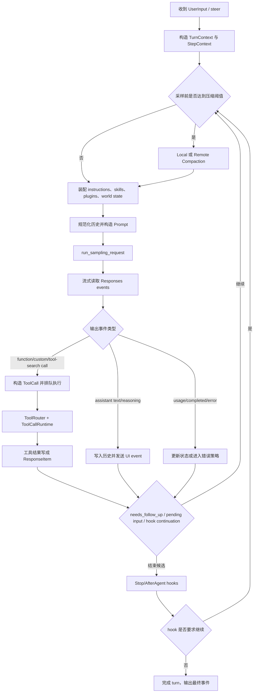
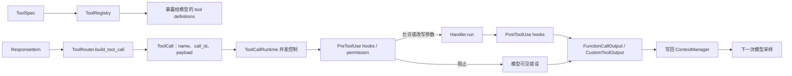
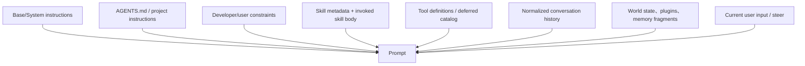
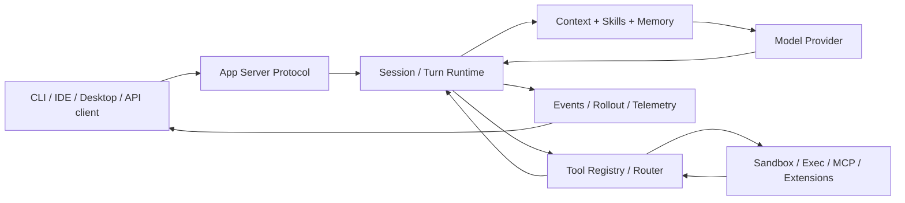
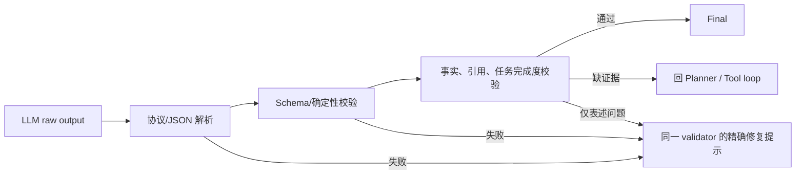

# OpenAI Codex 源码精读：Agent Loop、工具、Skills、上下文与 Harness

> **Freshness metadata**
> - `last_verified`: `2026-08-24`
> - `version_scope`: `analyzed snapshot inside document; HEAD rechecked 40b7560169c7274147a47f9b0c75db89fe016d34`
> - `source_type`: `official-repository`
> - `stability`: `fast-moving`


> 研究对象：[`openai/codex`](https://github.com/openai/codex)
> 固定源码快照：[`4c43465133428898aa84f0bfc02c306ed65fb66a`](https://github.com/openai/codex/tree/4c43465133428898aa84f0bfc02c306ed65fb66a)
> 快照日期：2026-07-25
> 定位：面向真实代码库的交互式 coding-agent harness，而不是单一的模型 SDK。

## 0. 阅读口径与结论先行

本文把“源码已经证明的机制”“官方文档描述的产品行为”和“基于实现做出的工程判断”分开：

- **源码事实**：能在上述 commit 的 Rust/TypeScript/Python/Markdown 中定位。
- **官方行为**：以 [Codex 文档](https://learn.chatgpt.com/docs/codex) 为补充。
- **工程判断**：明确写成“建议”“适合借鉴”或“推断”，不把推断冒充实现。

最重要的结论：

1. Codex 的核心不是一次 `LLM(prompt) -> answer`，而是一个**事件驱动、可中断、可重试、可压缩、带权限和工具生命周期的回合循环**。
2. 一次用户 turn 内可发生多次模型采样；模型只要发出工具调用、显式要求继续、存在用户 steer，或 hook 阻止结束，外层循环就会继续。
3. 工具并非散落的 Python 函数。它们经过 `ToolSpec -> ToolRegistry -> ToolRouter -> ToolCallRuntime -> lifecycle/hooks -> ResponseItem` 这条统一路径。
4. Skills 是**按元数据发现、按需加载正文的能力包**；Skills、tools、MCP、plugins 是四个不同层次。
5. Codex 的“RAG”重点不是传统向量知识库，而是代码/工具/skills/memory 的**按需检索与上下文装配**。其 memory search 在本快照中主要是本地词法检索。
6. 上下文管理包含输入规范化、工具调用与结果配对、单项截断、自动压缩、本地/远端 compaction 和长程 memory；这比“保存最近 N 条消息”完整得多。
7. `output_schema` 解决的是**结构合法性**，不等于事实正确、引用可靠或任务完成。Codex 还利用流完整性检查、hook、审批、工具错误回灌与专用 reviewer 补足一部分语义检查。

---

## 1. 系统边界与主要模块

### 1.1 这套仓库实际包含什么

Codex 是一个大型 Rust workspace。核心关系可以简化为：

| 层                 | 主要职责                               | 代表路径                                              |
| ------------------ | -------------------------------------- | ----------------------------------------------------- |
| CLI/TUI/App Server | 接收用户操作、渲染事件、对外协议       | `codex-rs/cli`、`codex-rs/tui`、`codex-rs/app-server` |
| Core session       | thread、turn、采样、状态与生命周期     | `codex-rs/core/src/session/`                          |
| Tool runtime       | 工具定义、发现、路由、并发、审批、执行 | `codex-rs/core/src/tools/`                            |
| Context            | 历史规范化、注入、裁剪、token 预算     | `codex-rs/core/src/context*`                          |
| Compaction         | 本地摘要、远端压缩、自动触发           | `codex-rs/core/src/compact*.rs`                       |
| Skills             | skills 发现、校验、呈现、调用          | `codex-rs/core-skills/`、`codex-rs/ext/skills/`       |
| Memories           | rollout 提炼、全局整合、读取工具       | `codex-rs/memories/`、`codex-rs/ext/memories/`        |
| Protocol           | app-server RPC、事件和 schema 导出     | `codex-rs/app-server-protocol/`                       |
| Sandbox/exec       | shell、patch、进程、权限与隔离         | `codex-rs/exec*`、`codex-rs/core/src/tools/runtimes/` |
| Extensions/plugins | 动态能力、额外工具和上下文             | `codex-rs/ext/`                                       |

### 1.2 四个容易混淆的概念

| 概念             | 本质                                         |              是否直接执行副作用 | 注入模型的内容                 |
| ---------------- | -------------------------------------------- | ------------------------------: | ------------------------------ |
| Tool             | 原子执行接口                                 |                              是 | name、description、JSON schema |
| Skill            | 可复用操作知识与附属资源                     | 正文本身否；可指导调用工具/脚本 | 启动时元数据，使用时正文       |
| MCP server       | 跨进程/远端工具与资源协议端点                |                      取决于工具 | 经过适配的 MCP tool schema     |
| Plugin/extension | 能同时贡献工具、skills、上下文或 UI 的封装层 |                  取决于贡献内容 | 按扩展能力装配                 |

这一区分值得直接用于 `agent_learing`：**tool 是执行能力，skill 是做事方法，MCP 是接入协议，plugin 是分发/组合单位。**

---

## 2. Agent Chain 与 Loop

### 2.1 一次 turn 的主链路

核心入口是 [`codex-rs/core/src/session/turn.rs`](https://github.com/openai/codex/blob/4c43465133428898aa84f0bfc02c306ed65fb66a/codex-rs/core/src/session/turn.rs) 中的 `run_turn`。抽象后的链路如下：



### 2.2 为什么是“两层循环”

可以把实现理解成两层：

1. **外层 turn loop**
   - 管理用户这一轮何时真正完成；
   - 在每次采样前重新捕获 step context；
   - 合并新输入、tool result、hook feedback；
   - 判断压缩、上下文窗口和结束条件。
2. **内层 sampling stream**
   - 发起一次模型请求；
   - 消费 SSE/WebSocket response events；
   - 立即记录 output item；
   - 对工具调用创建 future；
   - 统计 usage、finish state 和 `needs_follow_up`。

这种分层避免把“模型请求完成”错误地等同为“用户任务完成”。

### 2.3 继续循环的条件

本快照中，以下情况会使当前 turn 再采样：

- 模型发出一个或多个 tool call；
- response 表示还需要 follow-up；
- response completed 但 `end_turn` 为假；
- 工具结果已经写回，需要模型观察；
- pending user input/steer 已到达；
- stop hook 阻止结束并提供继续提示；
- 压缩后需要在新窗口恢复执行；
- 某些可恢复错误被规范化为模型可见结果。

因此，建议在自己的链路里显式保存：

```text
turn_id
step_id
sampling_attempt
tool_call_count
needs_follow_up
pending_input_count
stop_reason
compaction_count
```

只保存 `history` 会丢失大量可观测信息。

### 2.4 并发与取消

Codex 不把所有 tool call 都盲目并行：

- 工具声明自己是否支持并发；
- `ToolCallRuntime` 内部使用 `RwLock`：
  - 支持并发的工具取得读锁；
  - 必须串行的工具取得写锁；
- 同一批调用可并发执行，但串行工具会形成屏障；
- cancellation token 会终止排队或运行中的工作；
- 工具事件仍按生命周期上报，便于 UI 和 trace 知道“开始、完成、失败、取消”。

这比在 `for tool_call in calls:` 中直接执行更适合浏览器、代码运行、MCP 等异构工具。

### 2.5 重试不是一个统一的“再来一次”

Codex 至少区分：

- provider/stream 的瞬时错误；
- context window/usage limit；
- 流在 `response.completed` 前断开；
- 工具参数或工具名错误，可反馈给模型修正；
- 工具执行的可恢复错误；
- fatal runtime error；
- hook block；
- approval/permission 状态；
- compact 自身失败。

这一设计的关键是：**每种错误有不同的恢复层级**。模型 API 重试不应该重新执行已经成功的有副作用工具；工具参数错则适合把错误写回当前 turn，让模型重新生成参数。

---

## 3. Tool / Function Call 实现

### 3.1 工具数据流



### 3.2 `ToolSpec`、schema 与 handler

工具定义不是只有函数指针，通常包含：

- 模型可见名称；
- namespace/别名；
- description；
- 参数 JSON Schema；
- 输入种类：普通 function JSON、custom/freeform、tool-search 等；
- 是否支持并行；
- 暴露级别；
- 实际 handler；
- lifecycle payload；
- 审批、sandbox 或网络策略所需信息。

工具参数的 JSON schema 只定义**语法与类型边界**。handler 内仍要做语义校验，例如：

- path 是否在允许根目录；
- `timeout_ms` 是否在上限内；
- 进程/session id 是否存在；
- 两个互斥字段是否同时出现；
- 枚举组合是否支持；
- 工具当前运行环境是否具备依赖。

### 3.3 Registry 与 exposure

[`registry.rs`](https://github.com/openai/codex/blob/4c43465133428898aa84f0bfc02c306ed65fb66a/codex-rs/core/src/tools/registry.rs) 负责：

- 注册工具并拒绝冲突/重复；
- 由模型名找到工具；
- 维护 matcher aliases；
- 判断 payload 类型是否与工具匹配；
- 统计调用；
- 进入 pre/post hooks；
- 统一生成模型可观察的成功或失败结果。

工具存在并不代表每轮都把完整 schema 塞进 prompt。Codex 有 `Hidden`/`Deferred` 一类 exposure，结合 tool search 使大工具集可以延迟暴露。

### 3.4 Router

[`router.rs`](https://github.com/openai/codex/blob/4c43465133428898aa84f0bfc02c306ed65fb66a/codex-rs/core/src/tools/router.rs) 把模型响应统一为内部 `ToolCall`，处理的 response item 包括：

- `FunctionCall`；
- `CustomToolCall`；
- `ToolSearchCall`；
- 动态/MCP/extension tool。

Router 的职责应该保持“**解析、定位、分派**”，不要在这里写具体业务逻辑。这一点与你当前项目的 Router 设计直接相关：知识路由与工具路由也应拆开，避免一个函数既判断 `rag`，又解析 calculator 参数，还执行检索。

### 3.5 参数错误如何反馈

Codex 的很多 handler 会把 JSON 反序列化错误、缺字段、非法枚举等转成 `FunctionCallError::RespondToModel`。这意味着：

1. 错误保留在当前 turn；
2. 模型看到精确的失败原因；
3. 模型可以修正 tool call；
4. 整个 agent 不因一次参数错退出。

推荐的工具错误结构：

```json
{
  "status": "error",
  "error": {
    "code": "INVALID_ARGUMENT",
    "message": "parameter `limit` must be between 1 and 100",
    "field": "limit",
    "retryable": true
  },
  "call_id": "call_x",
  "tool": "search"
}
```

不要只返回 Python traceback，也不要仅返回 `False`。

### 3.6 Hook 链

pre/post tool hooks 使控制逻辑位于统一 choke point：

- **PreToolUse**
  - 检查工具和参数；
  - 阻止调用；
  - 修改参数；
  - 要求审批；
  - 加入额外上下文。
- **PostToolUse**
  - 读取执行结果；
  - 替换/清理返回内容；
  - 注入反馈；
  - 阻止把原始结果继续传递；
  - 记录审计。

这对后续加入数据库、浏览器和代码执行特别重要：权限、脱敏、结果大小、trace 不应各自在工具函数中重复实现。

### 3.7 Tool search 与大规模工具目录

当工具数量变多时，每个 schema 都进入 prompt 会产生固定 token 税。Codex 已存在 deferred tool/tool-search 路径：

1. 初始上下文只给模型工具目录或命名空间摘要；
2. 模型表达工具搜索意图；
3. 系统用词法/BM25 等方式找候选工具；
4. 仅把候选定义放进后续模型上下文；
5. 模型再生成正式调用。

这与传统 RAG 的思想相同，但检索对象是 **tool metadata/schema**。

### 3.8 MCP

Codex 把 MCP tool 转成统一工具定义，再走相同 registry/router/runtime：

- MCP server 提供 tool list/schema；
- Codex 做名称规范化和 namespace 隔离；
- tool call 被适配为 MCP request；
- result 被适配为模型可见 output item；
- 权限、并发、hook、trace 仍由宿主掌控。

因此你后续接 MCP 时，不要新增一条平行的“特殊 MCP 链路”。更稳妥的结构是：

```text
MCP adapter -> ToolDefinition/ToolResult -> Unified Tool Executor
```

---

## 4. Skills：发现、调用、规范与实现

### 4.1 Skill 的目录形态

Codex 支持的能力包遵循 Agent Skills 方向，典型结构：

```text
my-skill/
├── SKILL.md
├── scripts/
├── references/
├── assets/
└── agents/
    └── openai.yaml
```

`SKILL.md` 的 YAML frontmatter 至少需要：

```yaml
---
name: my-skill
description: When and why this skill should be used.
---
```

实现中有明确边界，例如：

- `name` 长度上限；
- qualified name 长度上限；
- `description` 长度上限；
- skill 目录递归深度；
- 每个 root 扫描目录数；
- plugin skill 的目录 containment；
- 重名、失效和依赖告警。

这些限制不是文档装饰，而是防止 prompt 膨胀、路径逃逸和名称冲突。

### 4.2 发现顺序

本快照中的来源涵盖：

- 项目配置指定的 skills；
- 仓库祖先目录中的 `.agents/skills`；
- 用户级 `~/.agents/skills`；
- Codex home 下的 skills；
- 系统 skills；
- `/etc/codex/skills`；
- plugin/extension 贡献的 skills；
- 显式 extra roots。

发现层负责“有哪些 skill”，不等于把全部正文注入模型。

### 4.3 Progressive disclosure

Codex 的 skills 采用两阶段上下文：

1. **目录阶段**
   - 给模型 `name + description + path/identifier`；
   - 有统一字符/token 预算；
   - 超预算时截断描述或省略低优先条目并发出 warning。
2. **使用阶段**
   - 用户显式 `$skill-name`，或模型根据描述选中；
   - 读取完整 `SKILL.md`；
   - 再按 skill 指示读取 `references`、执行 `scripts`、使用 `assets`。

如果启动时加载所有正文，几十个 skill 就会占满上下文，还会降低模型对真正任务的注意力。

### 4.4 显式与隐式调用

- **显式调用**：用户输入结构化 skill mention、`$name` 或资源链接。
- **隐式调用**：模型依据 skill 元数据与任务匹配。
- 配置可声明某个 skill 是否允许隐式调用。
- 同名、connector/plugin 冲突需要在装配层解析，而不是任意取第一个。
- skill 调用通常只对当前 turn/task 生效，不应默认跨轮偷偷保持。

### 4.5 `agents/openai.yaml`

可选 metadata 可承载：

- 展示名、图标、颜色；
- 默认 prompt；
- tool dependencies；
- implicit invocation policy；
- product/host 限定。

这说明成熟 skill 不只是“一段提示词”，而是：

```text
可发现元数据
+ 操作说明
+ 资源
+ 脚本
+ 依赖
+ 宿主策略
+ 评测
```

### 4.6 Skill 与工具依赖

Skill 可以声明其任务依赖某类工具/MCP server。系统在调用前检查依赖：

- 已存在：继续；
- 可安装/可连接：进入宿主交互；
- 缺失：向模型或用户暴露明确状态。

这比 skill 运行到一半才碰到 `command not found` 更可观测。

### 4.7 对 `agent_learing` 的最小规范建议

```python group=multi-c21f640c551f label=Python
@dataclass(frozen=True)
class SkillMetadata:
    name: str
    description: str
    path: Path
    allowed_tools: tuple[str, ...] = ()
    required_tools: tuple[str, ...] = ()
    allow_implicit: bool = True
    version: str | None = None
```

```rust group=multi-c21f640c551f label=Rust
use std::path::PathBuf;

#[derive(Debug, Clone)]
struct SkillMetadata {
    name: String,
    description: String,
    path: PathBuf,
    allowed_tools: Vec<String>,
    required_tools: Vec<String>,
    allow_implicit: bool,
    version: Option<String>,
}
```

```javascript group=multi-c21f640c551f label=JavaScript
/**
 * @typedef {{
 *   name: string,
 *   description: string,
 *   path: string,
 *   allowedTools?: string[],
 *   requiredTools?: string[],
 *   allowImplicit?: boolean,
 *   version?: string
 * }} SkillMetadata
 */
```

```typescript group=multi-c21f640c551f label=TypeScript
type SkillMetadata = {
  name: string
  description: string
  path: string
  allowedTools: string[]
  requiredTools: string[]
  allowImplicit: boolean
  version?: string
}
```

再把：

- `discover_skills()`
- `select_skills(user_input, metadata)`
- `load_skill_body(skill)`
- `validate_skill(skill)`

分开。不要让 `main.py` 在一处扫描目录、解析 YAML、选择并注入。

---

## 5. RAG、搜索与证据

### 5.1 Codex 有没有传统 RAG

如果“RAG”特指：

```text
文档切块 -> embedding -> vector store -> top-k -> rerank -> 引用回答
```

那么 Codex core 并不是以这个通用知识库管线为主。它更突出：

- 仓库文件/代码搜索；
- shell/`rg` 等工具检索；
- web/MCP/app 连接器；
- deferred tool search；
- dynamic skill selection；
- memory lexical search；
- 通过上下文注入把结果交给模型。

所以更准确的称呼是**工具增强检索与上下文装配**，其中若干子系统具有 RAG 特征。

### 5.2 检索对象不止“文档”

| 检索对象          | 查询                       | 返回            | 后续用途    |
| ----------------- | -------------------------- | --------------- | ----------- |
| repo 文件         | 路径/文本/符号             | 行号、片段      | 代码证据    |
| tool catalog      | 用户意图/工具描述          | tool candidates | 延迟 schema |
| skill catalog     | 任务文本                   | skill metadata  | 按需正文    |
| memory            | 关键词/路径                | memory fragment | 跨会话经验  |
| MCP resource/tool | server/resource/tool query | 外部内容或能力  | 进一步操作  |
| web/app           | 搜索词或资源 id            | 页面/结构化数据 | 外部证据    |

### 5.3 证据链上的缺口

Codex 的工具结果通常进入 transcript，具备 call id 和事件关联；但这并不自动保证最终自然语言中的每个事实都有 citation。一个完整研究型 RAG 仍需额外构建：

```text
ToolResult
  -> EvidenceItem(source_id, uri/path, locator, quote/hash, freshness)
  -> EvidenceRegistry
  -> ContextBuilder
  -> Draft claim IDs
  -> Claim/Evidence validator
  -> Citation renderer
```

这正是你理想链路中 `Current-turn Evidence Registry` 的价值。Codex 的 transcript 是原料，不等于结构化 evidence registry。

### 5.4 Memory search 不是向量数据库

本快照 `codex-rs/ext/memories/src/local/search.rs` 的本地 memory 搜索主要是词法/行级匹配。不要因为目录叫 `memories` 就把它描述为 embedding RAG。

如果移植到你的项目，建议保留统一接口：

```python group=multi-fd042b49ba11 label=Python
class Retriever(Protocol):
    def retrieve(self, query: RetrievalQuery) -> list[EvidenceItem]: ...
```

```rust group=multi-fd042b49ba11 label=Rust
trait Retriever {
    fn retrieve(
        &self,
        query: &RetrievalQuery,
    ) -> Result<Vec<EvidenceItem>, RetrievalError>;
}
```

```javascript group=multi-fd042b49ba11 label=JavaScript
class Retriever {
  /**
   * @param {RetrievalQuery} query
   * @returns {Promise<EvidenceItem[]>}
   */
  async retrieve(query) {
    throw new Error('implement retrieve(query)')
  }
}
```

```typescript group=multi-fd042b49ba11 label=TypeScript
interface Retriever {
  retrieve(query: RetrievalQuery): Promise<EvidenceItem[]>
}
```

这样 local vector RAG、BM25、web、session search 可共用下游证据处理，但各自保留不同的召回实现。

---

## 6. Context、Compaction、Session 与 Memory

### 6.1 一次模型请求中的上下文组成



官方 [AGENTS.md 说明](https://learn.chatgpt.com/docs/agent-configuration/agents-md) 还明确了：

- global 到 project/current directory 的层级发现；
- 近目录规则后出现，因而覆盖更早规则；
- 每目录至多取一个指导文件；
- `project_doc_max_bytes` 默认总预算。

### 6.2 `ContextManager` 做什么

上下文管理不仅 append：

- 保存模型可见历史；
- 在重写时增加 version；
- 规范化不同 response item；
- 保证 tool call 与 output 配对；
- 为缺失 output 插入可解释占位；
- 对超长 function output 截断；
- 按模型能力构造 prompt；
- 让 compaction 替换一段历史后仍保持协议合法。

“配对修复”很重要：很多 provider 要求工具结果紧跟对应调用，孤儿 result、重复 call id、顺序错误会直接触发 4xx。

### 6.3 自动 compaction

Codex 在 turn 开始及 loop 中都可能检查 token 状态：

1. 计算当前 active context；
2. 与模型/配置的 auto-compact 阈值比较；
3. 根据 provider/feature 选择 local 或 remote compact；
4. 建立新的 model-visible history；
5. 注入恢复执行所需的 initial context；
6. 继续当前 turn，而不是结束任务。

### 6.4 本地摘要压缩

[`compact.rs`](https://github.com/openai/codex/blob/4c43465133428898aa84f0bfc02c306ed65fb66a/codex-rs/core/src/compact.rs) 的本地路径会：

- 用专门 summarization prompt 请求模型总结；
- 保留关键用户消息/任务信息；
- 将 summary 作为新窗口的高密度历史；
- 如果“生成摘要的请求本身”仍超窗，继续从最旧部分收缩；
- 重新注入必要的初始上下文。

这里的摘要是执行状态压缩，不应只写聊天主题。高质量摘要至少包含：

```text
目标
用户约束
已完成
重要决策及原因
工具调用的有效结论
文件及修改
失败尝试
待完成
下一步
```

### 6.5 远端 compaction

部分 provider 可使用远端 compact endpoint：

- 服务端返回 compacted transcript；
- 客户端过滤/重组 response items；
- 保持必要边界与初始上下文；
- 再按本地上下文预算处理超长工具历史。

这说明 compaction 是一个可替换策略，而不是硬编码一个 `summarize(history)`。

### 6.6 Pre-turn 与 mid-turn 的区别

- **Pre-turn compact**：新一轮正式采样前压缩，之后可按正常顺序注入项目/环境上下文。
- **Mid-turn compact**：工具循环中途压缩；summary/compaction item 已在队尾，恢复上下文必须插在正确边界，否则模型会把恢复信息误解成任务的新消息。

你的上下文模块应保存 `compression_reason` 和 `resume_point`，不要只替换字符串列表。

### 6.7 Session 与 thread

Codex 的 thread 是持久对话/rollout 边界，turn 是用户回合，step/sampling 是内部执行步。三者建议严格区分：

```text
Thread/Session
└── Turn 1
    ├── Sampling 1
    ├── Tool calls
    ├── Sampling 2
    └── Final
└── Turn 2
```

App Server 通过结构化 RPC 和通知把这些状态交给前端，而不是解析 CLI 文本。

### 6.8 长期 memory 的两阶段写入

[`codex-rs/memories/README.md`](https://github.com/openai/codex/blob/4c43465133428898aa84f0bfc02c306ed65fb66a/codex-rs/memories/README.md) 描述的 memory writer 是异步两阶段：

#### Phase 1：从 rollout 提取候选

- 选择符合条件、已经 idle 的近期交互 rollout；
- lease 防止多 worker 重复处理；
- 有并行上限；
- 过滤无价值/不适合沉淀的消息；
- 用严格 schema 让 LLM 返回：
  - `raw_memory`
  - `rollout_summary`
  - `rollout_slug`
- `serde(deny_unknown_fields)` 与 `additionalProperties: false` 限制结构；
- 做 secret redaction；
- 写入状态数据库；
- 失败使用退避。

#### Phase 2：全局整合

- 取得全局锁；
- 按使用/最近程度选 top-N；
- 在 memory workspace 建立 git baseline；
- 聚合 raw memories 和 rollout summaries；
- 启动受限的内部 consolidation agent；
- 该 agent 关闭网络、审批、协作递归、memory recursion、MCP/apps/plugins 等不必要能力；
- 校验产物；
- 维护 lease heartbeat；
- 更新 `MEMORY.md`、`memory_summary.md`、skills 等高层产物。

这是“先收集事实，再全局蒸馏”的典型长期记忆写入链，优于每轮直接 append `MEMORY.md`。

### 6.9 Memory 读取

- 启动/请求时注入有硬预算的 `memory_summary.md`；
- 详细记忆通过 namespaced memory tools 按需 list/read/search；
- 可写 ad-hoc note；
- memory citation 可在内部使用路径和行号描述，渲染前移除内部标记。

所以长期记忆也遵循 progressive disclosure：

```text
短摘要常驻 + 详细记忆按需检索
```

---

## 7. Harness 架构

### 7.1 Harness 的定义

模型只完成“基于输入生成下一步”。Codex harness 承担：

- session/thread/turn 状态；
- prompt/context assembly；
- tools 和 MCP；
- shell/文件/patch；
- sandbox、权限与审批；
- streaming 与 UI events；
- retries、timeouts、cancellation；
- compaction；
- skills/plugins；
- memory；
- telemetry/rollout；
- app-server protocol；
- multi-agent 协作。

### 7.2 Harness 链路



### 7.3 App Server schema

`codex-rs/app-server-protocol/src/protocol/v2/` 按领域拆分：

- thread、turn、item；
- permissions；
- MCP、apps、plugins；
- model、review；
- process、fs、environment；
- hook、notification；
- realtime、remote control 等。

协议设计特征：

- Rust 类型作为协议事实源；
- `serde` 负责 wire serialization；
- `schemars` 生成 JSON Schema；
- 可导出 TypeScript 类型；
- tagged union 表示不同事件/item；
- RPC params/response/notification 分开；
- wire 侧常用 camelCase，配置文件仍可能保留 snake_case；
- ID 使用字符串；
- nullable 与缺失字段语义要区分；
- cursor pagination 用于列表。

这类 schema 的价值是让前端、CLI 和 runtime 不靠“约定字符串”通信。

### 7.4 Multi-agent

多 agent 在 Codex 中仍被视为工具化能力：

- 主 agent 通过协作工具 spawn/send/wait；
- 子 agent 有自己的任务边界和上下文；
- 宿主管理 agent id、状态、消息和取消；
- 结果以结构化事件回到主任务；
- memory/skills/权限可根据 agent 类型限制。

关键原则是**上下文隔离 + 结果回传**，而不是复制主 agent 全量 history 给每个子 agent。

---

## 8. LLM 返回检查、约束与二次校验

### 8.1 流协议检查

Codex 对模型流不是“有字符串就算成功”：

- 识别不同 response event；
- output item 到达时立即记录；
- 统计 usage；
- 流在 `response.completed` 前关闭会成为明确错误；
- response error 与传输错误分类；
- retryable stream error 受 provider 配置与上限控制；
- tool call、reasoning、assistant text 分类型处理。

### 8.2 Tool call 检查

每个模型 tool call 至少经过：

1. response item 类型解析；
2. name/namespace 解析；
3. registry 查找；
4. payload kind 检查；
5. JSON 参数反序列化；
6. handler 语义校验；
7. permission/hook；
8. result 类型化；
9. call/result 配对写回。

这正是你要实现“让模型返回 1、2、3，确认必须是 1、2、3”的分层思路：先定义可机器验证的契约，再做语义 validator。

### 8.3 Final output JSON Schema

turn context 可以携带 `final_output_json_schema`。请求构造时转换为 Responses API 的 structured output 配置，并可设置 strict。

适合：

- 分类器只允许 `"chat" | "rag" | "tools" | "research"`；
- 返回固定字段；
- 确保数字/数组/枚举类型；
- 禁止额外字段；
- 让下游不解析自然语言。

示例：

```json
{
  "type": "object",
  "properties": {
    "items": {
      "type": "array",
      "prefixItems": [{ "const": 1 }, { "const": 2 }, { "const": 3 }],
      "items": false
    }
  },
  "required": ["items"],
  "additionalProperties": false
}
```

### 8.4 Schema 校验的边界

以下输出都可能通过 schema，但仍然错误：

- citation 指向不存在的行；
- 计算结果类型正确但数值错；
- Router 给出合法 enum，但意图分错；
- 工具结果是合法 JSON，但来自旧 turn；
- `success: true`，实际只完成一半；
- 答案引用了 evidence registry 中没有的事实。

因此至少应有三层：



### 8.5 专用 reviewer 与 hook

Codex 的 reviewer/guardian/stop hook 等路径说明：最终结束可由宿主二次决定。常见做法：

- reviewer 使用单独 prompt/schema；
- parse 失败按受限次数重试；
- 返回 allow/deny/feedback；
- deny 时把可执行反馈注入主 loop；
- 每次重试记录 attempt、原因和原输出 hash；
- 达到预算后按明确收敛策略结束。

不要让 validator 只返回布尔值。推荐：

```json
{
  "status": "fail",
  "category": "citation_missing",
  "retry_target": "planner",
  "message": "claim c_4 has no current-turn evidence",
  "failed_claim_ids": ["c_4"],
  "retryable": true
}
```

---

## 9. 权限、失败处理、可观测性与评测

### 9.1 权限层

成熟 coding agent 的工具权限至少包含：

- filesystem read/write root；
- network access；
- shell sandbox；
- command risk/approval；
- process/session ownership；
- tool-specific policy；
- user approval decision；
- pre-tool hook；
- inherited/subagent policy。

模型提出调用，宿主决定执行。权限决策不应只写在 prompt 中。

### 9.2 Tool failure policy

可按以下状态统一：

| 状态              | 含义             | 下一步                        |
| ----------------- | ---------------- | ----------------------------- |
| `success`         | 完成且结果可用   | 写 evidence，继续             |
| `partial`         | 部分结果可用     | 写 evidence + 缺口，决定补查  |
| `empty`           | 调用成功但零结果 | 换 query/tool，受重试预算限制 |
| `retryable_error` | 瞬时或可修参数   | 精确修复后重试                |
| `fatal_error`     | 当前工具路径终止 | planner 选替代工具或收敛      |
| `cancelled`       | 用户/上层取消    | 结束本分支                    |
| `blocked`         | 权限/hook 阻止   | 等待决定或选择别的计划        |

### 9.3 Trace

至少记录：

```text
session_id / turn_id / step_id
model/provider/request_id
prompt token categories
tool_name / call_id / args_hash
approval decision
started_at / duration / status
result size / truncation / evidence ids
retry count / retry reason
compaction before-after tokens
validator result
final stop reason
```

Codex 中散布的 events、rollout 与 telemetry 可以看成三种视角：面向 UI、面向恢复、面向观测。自己的项目不必一次复制全部，但事件结构应先稳定。

### 9.4 Datawhale 路线补充

依据 [Agent Learning Hub](https://datawhalechina.github.io/Agent-Learning-Hub/)，除 loop/tools/RAG/memory 外，还应关注：

- 最大步数、总时间、API 与工具重试预算；
- permission gate；
- session store；
- trace/replay；
- multi-agent 的停止条件、环路与上下文漂移；
- skills 与 tools/MCP 的边界；
- browser/computer-use 的状态观测；
- prompt injection 与工具滥用；
- eval 数据集、任务完成率、引用正确率、回归测试；
- 成本、延迟、部署和产品成功条件。

---

## 10. Codex 代码格式与工程风格

### 10.1 Rust 风格

根 `AGENTS.md` 与源码显示的主要约定：

- 使用 `rustfmt`/`just fmt` 保持统一格式；
- format 参数能内联就内联；
- 可折叠的条件分支保持简洁；
- 能用方法引用时避免冗余 closure；
- 避免含义不清的裸 `bool`/`Option` 参数；
- 必要时调用参数旁写精确的 `/*param_name*/` 注释；
- 对 enum 做 exhaustive match；
- 新 trait/API 写文档；
- async trait 倾向语言原生能力；
- 测试比较完整对象，减少逐字段脆弱断言；
- 模块默认私有，缩小公开 API；
- 生产模块目标约 500 行，超过约 800 行应拆分；
- `just test`、`just fix`、集成测试与 TUI snapshots 共同构成验证。

### 10.2 Context 相关风格

Codex 对 context-sensitive 代码有额外纪律：

- 尽量增量更新，避免无意义重写整个 history；
- 重写会改变 version/cache 行为，需要明确理由；
- 所有注入必须有预算和硬上限；
- 单项超大上下文需审查；
- 注入数据用专门 fragment struct，而不是随处拼字符串；
- 工具调用与结果是一个协议单元，变换时成对处理。

### 10.3 Protocol 风格

- v2 请求/响应/通知命名一致；
- 资源与 method 语义稳定；
- wire camelCase 与配置 snake_case 分清；
- tagged union 比“type + 任意 dict”更可靠；
- ID 不混用整数与字符串；
- cursor pagination；
- schema 和生成类型进入 CI。

### 10.4 适合迁移到 Python 项目的部分

不必复制 Rust 语法，可以复制设计：

- `dataclass(frozen=True)` 表示不可变 schema；
- `Enum`/`Literal` 表示状态；
- `Protocol` 表示 registry/executor/retriever 接口；
- Pydantic/JSON Schema 只放在边界；
- 内部使用强类型 `TurnState`、`ToolResult`、`EvidenceItem`；
- 函数短、职责单一；
- parser/validator/executor 分开；
- integration tests 覆盖完整 loop；
- 每个注入项有预算与来源。

---

## 11. 对 `agent_learing` 的可落地借鉴顺序

### 第一优先级

1. 稳定 `TurnState`、`ToolCall`、`ToolResult`、`EvidenceItem` schema；
2. 统一 Tool Executor；
3. tool 参数 schema + handler 语义校验；
4. 工具错误结构与 retry policy；
5. turn/step/call 级 trace；
6. current-turn evidence 隔离；
7. validator 返回结构化失败原因。

### 第二优先级

1. Input Context Builder；
2. Answer Context Builder；
3. token budget 与 tool-output truncation；
4. LLM 结构化摘要 compaction；
5. tool call/result 配对修复；
6. session store；
7. final output schema。

### 第三优先级

1. Skills progressive disclosure；
2. MCP adapter；
3. deferred tool search；
4. reviewer/stop-hook；
5. multi-agent；
6. 长期 memory writer。

长期 memory 放后是合理的：如果当前 turn evidence、工具失败和 compaction 还没稳定，长期记忆会把短期错误永久化。

---

## 12. 关键源码索引

| 主题                    | 源码                                                                                                                                                                          |
| ----------------------- | ----------------------------------------------------------------------------------------------------------------------------------------------------------------------------- |
| 主 turn loop            | [`core/src/session/turn.rs`](https://github.com/openai/codex/blob/4c43465133428898aa84f0bfc02c306ed65fb66a/codex-rs/core/src/session/turn.rs)                                 |
| Tool router             | [`core/src/tools/router.rs`](https://github.com/openai/codex/blob/4c43465133428898aa84f0bfc02c306ed65fb66a/codex-rs/core/src/tools/router.rs)                                 |
| Tool registry/hooks     | [`core/src/tools/registry.rs`](https://github.com/openai/codex/blob/4c43465133428898aa84f0bfc02c306ed65fb66a/codex-rs/core/src/tools/registry.rs)                             |
| Tool 并发               | [`core/src/tools/parallel.rs`](https://github.com/openai/codex/blob/4c43465133428898aa84f0bfc02c306ed65fb66a/codex-rs/core/src/tools/parallel.rs)                             |
| Context history         | [`core/src/context_manager/history.rs`](https://github.com/openai/codex/blob/4c43465133428898aa84f0bfc02c306ed65fb66a/codex-rs/core/src/context_manager/history.rs)           |
| Local compaction        | [`core/src/compact.rs`](https://github.com/openai/codex/blob/4c43465133428898aa84f0bfc02c306ed65fb66a/codex-rs/core/src/compact.rs)                                           |
| Skill loader            | [`core-skills/src/loader.rs`](https://github.com/openai/codex/blob/4c43465133428898aa84f0bfc02c306ed65fb66a/codex-rs/core-skills/src/loader.rs)                               |
| Skill model             | [`core-skills/src/model.rs`](https://github.com/openai/codex/blob/4c43465133428898aa84f0bfc02c306ed65fb66a/codex-rs/core-skills/src/model.rs)                                 |
| Skill dynamic selection | [`ext/skills/src/dynamic_skill_selector.rs`](https://github.com/openai/codex/blob/4c43465133428898aa84f0bfc02c306ed65fb66a/codex-rs/ext/skills/src/dynamic_skill_selector.rs) |
| Memory architecture     | [`memories/README.md`](https://github.com/openai/codex/blob/4c43465133428898aa84f0bfc02c306ed65fb66a/codex-rs/memories/README.md)                                             |
| Memory phase 1          | [`memories/write/src/phase1.rs`](https://github.com/openai/codex/blob/4c43465133428898aa84f0bfc02c306ed65fb66a/codex-rs/memories/write/src/phase1.rs)                         |
| Memory phase 2          | [`memories/write/src/phase2.rs`](https://github.com/openai/codex/blob/4c43465133428898aa84f0bfc02c306ed65fb66a/codex-rs/memories/write/src/phase2.rs)                         |
| Memory local search     | [`ext/memories/src/local/search.rs`](https://github.com/openai/codex/blob/4c43465133428898aa84f0bfc02c306ed65fb66a/codex-rs/ext/memories/src/local/search.rs)                 |
| App protocol v2         | [`app-server-protocol/src/protocol/v2/`](https://github.com/openai/codex/tree/4c43465133428898aa84f0bfc02c306ed65fb66a/codex-rs/app-server-protocol/src/protocol/v2)          |
| Repository conventions  | [`AGENTS.md`](https://github.com/openai/codex/blob/4c43465133428898aa84f0bfc02c306ed65fb66a/AGENTS.md)                                                                        |

## 13. 最终评价

Codex 最值得学习的并不是某个 prompt，而是以下工程组合：

```text
强类型状态
+ 可持续的 turn loop
+ 统一工具运行时
+ 权限/审批 choke point
+ 增量上下文与 compaction
+ progressive disclosure
+ 结构化协议与事件
+ 可恢复失败
+ trace 与测试
```

如果把这些机制全部塞进 `main.py`，会重现你当前担心的链路杂乱。更接近 Codex 的改造方式，是先稳定跨模块 schema，再让 Router、Planner、Executor、Context、Evidence、Validation 围绕 schema 协作。
