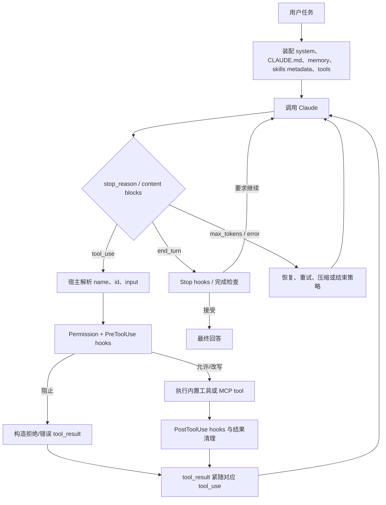
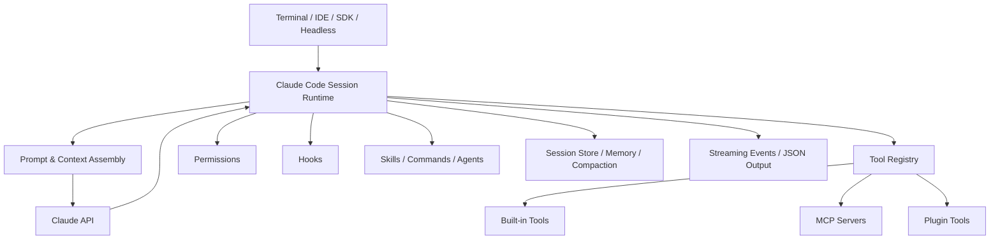

# Anthropic Claude Code 精读：公开仓库、官方运行契约与 Agent Harness

> **Freshness metadata**
> - `last_verified`: `2026-08-24`
> - `version_scope`: `analyzed snapshot inside document; HEAD rechecked 45bdfa96ca415da92e62b6ca85a1d6e29adf3c44`
> - `source_type`: `official-repository`
> - `stability`: `fast-moving`


> 研究对象：[`anthropics/claude-code`](https://github.com/anthropics/claude-code)
> 固定仓库快照：[`7ef6eec9d9ba84ea6f233f26c45f1df5c5991843`](https://github.com/anthropics/claude-code/tree/7ef6eec9d9ba84ea6f233f26c45f1df5c5991843)
> 快照日期：2026-07-25
> 主要补充证据：[Claude Code 官方文档](https://code.claude.com/docs/en/overview) 与 [Claude Agent SDK 文档](https://platform.claude.com/docs/en/agent-sdk/overview)

## 2026-08-24 HEAD 新鲜度审计

公开仓库 HEAD 复核到 [`45bdfa9`](https://github.com/anthropics/claude-code/tree/45bdfa96ca415da92e62b6ca85a1d6e29adf3c44)。README、CHANGELOG、plugins、skills、hooks、agents 与配置示例仍是公开证据主体；核心产品 runtime 仍不是一套可逐行审计的完整开源实现。本文保留 `7ef6eec9...` 作为可复现快照，并用当前官方文档校验产品契约。任何关于内部 loop class、调度算法或私有 executor 的描述，仍保持在“官方行为”或“推断”层，不升级成源码事实。

## 0. 一个必须先说明的源码边界

`anthropics/claude-code` 的公开仓库在本快照中主要包含：

- README、LICENSE、SECURITY、超长 CHANGELOG；
- 官方 plugins；
- commands、agents、skills、hooks 示例；
- GitHub issue 自动化和维护脚本；
- MDM/Dev Container 等示例。

它**不是 Claude Code 核心 runtime 的完整源码仓库**。核心 agent loop、内置工具执行器、上下文管理器等实现细节没有以完整可审计源文件公开在此仓库中。

所以本文采用三层证据：

| 证据层             | 能回答什么                                        | 局限                         |
| ------------------ | ------------------------------------------------- | ---------------------------- |
| 公开仓库           | plugin/skill/hook 实例、版本行为、可见脚本风格    | 看不到全部核心 runtime       |
| 官方产品文档       | agent loop、工具、权限、上下文、memory 的正式契约 | 不一定披露内部类与算法       |
| Agent SDK/API 文档 | tool-use 消息协议、structured output、宿主 loop   | SDK 与产品内部实现不完全相同 |

下文不会把文档行为冒充“某个私有函数的源码”。

---

## 1. 系统定位

Claude Code 是 coding-agent 产品及 harness。模型只负责提出下一步；宿主提供：

- 文件、搜索、编辑、shell、web 等工具；
- permissions；
- hooks；
- skills、subagents、plugins；
- MCP；
- session、resume、fork；
- context tracking 与 compaction；
- streaming UI/headless JSON；
- structured output；
- IDE/terminal 集成。

可把它分成：

```text
Claude model
    ↑↓ tool_use / tool_result
Claude Code agent runtime
    ↑↓ hooks / permission / session / context
Built-in tools + MCP + plugins + subagents
    ↑↓
filesystem / shell / browser / services / user
```

---

## 2. Agent Chain 与 Loop

### 2.1 官方行为层面的主循环

[How Claude Code works](https://code.claude.com/docs/en/how-claude-code-works) 把工作方式描述为循环，而非固定 workflow。结合 tool-use 协议可还原为：



### 2.2 Observe–Think–Act–Observe

用 Datawhale 的基本模型表述：

1. **Observe**：用户输入、工作区、历史、tool results；
2. **Think**：模型产生文本、计划或 tool use；
3. **Act**：宿主执行工具；
4. **Observe**：结果作为 `tool_result` 回到模型；
5. 重复到模型结束、hook 阻止、预算耗尽或用户中断。

需要注意，“think”不代表宿主获得或保存完整私有推理。工程上应依赖可观察的 tool calls、assistant messages、state 和 trace，而不是依赖隐藏推理链。

### 2.3 Client tools 与 server tools

Claude tool use 分两类：

- **Client tools**
  - 模型返回 `tool_use` block；
  - 客户端/Claude Code 执行；
  - 客户端发回 `tool_result`；
  - agent loop 的控制权在宿主。
- **Server tools**
  - 平台服务端完成工具循环；
  - 客户端看到相应内容块或最终结果；
  - 不需要自己执行该工具。

Claude Code 的本地文件、Bash、MCP 等更符合 client-tool 模式。

### 2.4 停止条件

至少要区分：

- `end_turn`：正常完成候选；
- `tool_use`：宿主还有动作；
- `max_tokens`：输出被截断，不应直接当最终答案；
- provider/transport error；
- user interrupt；
- permission denial；
- stop hook 要求继续；
- subagent/background task 仍在运行；
- structured output 校验最终失败。

Claude Code 的 hook 系统中，`Stop`/`SubagentStop` 可以检查结束并返回继续反馈。这表明“是否结束”是 harness 决策的一部分。

### 2.5 Subagent

Subagent 是隔离的执行分支：

- 有独立 system prompt/agent definition；
- 可限制工具；
- 有独立 context；
- 完成后将结果摘要返回父 agent；
- 前台或后台运行；
- 适合探索、审查、测试等可以隔离的任务。

不要把 subagent 理解为“在同一个 history 里多加一个角色”。真正价值是**上下文隔离、职责边界和结果汇聚**。

---

## 3. Tool / Function Call 协议

### 3.1 模型侧 schema

标准 tool definition：

```json
{
  "name": "search",
  "description": "Search indexed documents.",
  "input_schema": {
    "type": "object",
    "properties": {
      "query": { "type": "string" },
      "limit": { "type": "integer", "minimum": 1, "maximum": 20 }
    },
    "required": ["query"],
    "additionalProperties": false
  }
}
```

模型可能返回：

```json
{
  "type": "tool_use",
  "id": "toolu_...",
  "name": "search",
  "input": { "query": "agent context compaction", "limit": 5 }
}
```

宿主随后发送：

```json
{
  "role": "user",
  "content": [
    {
      "type": "tool_result",
      "tool_use_id": "toolu_...",
      "content": "{\"status\":\"success\",\"items\":[]}"
    }
  ]
}
```

### 3.2 消息顺序是协议约束

[Handle tool calls](https://platform.claude.com/docs/en/agents-and-tools/tool-use/handle-tool-calls) 强调：

- `tool_result` 必须关联正确 `tool_use_id`；
- 对应结果应立即跟在工具调用之后；
- 一个 user message 内如同时有 tool results 和普通文本，tool-result blocks 应放前；
- 并行 tool uses 要返回完整匹配结果；
- 不要在中间插入无关 assistant/user 消息。

很多“模型偶尔空回复”实际是历史消息结构错误。

### 3.3 工具参数校验

成熟实现要经过：

```text
JSON parse
-> input_schema
-> tool name/id
-> semantic validation
-> permission
-> runtime execution
-> output normalization
-> size/truncation
-> tool_result pairing
```

其中 input schema 仍不足以验证：

- 文件路径是否在当前 workspace；
- shell command 是否需要审批；
- URL/domain 是否受策略限制；
- session id 是否归当前用户；
- DB query 是否只读；
- 浏览器 tab 是否存在；
- 工具是否已经连续返回相同结果。

### 3.4 内置工具与 MCP

Claude Code 的能力来源包括：

- 内置 Read/Write/Edit/Glob/Grep/Bash/Web 等；
- MCP server tools/resources/prompts；
- plugin 贡献；
- subagent/Task；
- AskUserQuestion 等交互工具；
- skill 指导下的脚本。

MCP 工具进入 Claude Code 后仍受 permission 和 hooks 影响。MCP 是传输/发现协议，不是绕开宿主 policy 的执行后门。

### 3.5 MCP Tool Search

[MCP 文档](https://code.claude.com/docs/en/mcp) 描述了 tool search 的延迟加载：

1. session 启动时不注入所有 MCP schema；
2. 初始上下文保留 server/tool 名称或概览；
3. 需要时搜索工具；
4. 再加载候选 schema；
5. 模型生成正式调用。

官方文档给出的默认触发思路是：MCP tool descriptions 和 server instructions 达到一定上下文规模时，使用 Tool Search。具体阈值属于版本行为，应从当前文档/配置确认，而不是写死进业务代码。

### 3.6 Hooks

[Hooks reference](https://code.claude.com/docs/en/hooks) 暴露多个生命周期点，例如：

- `SessionStart`、`SessionEnd`；
- `UserPromptSubmit`；
- `PreToolUse`、`PostToolUse`、`PostToolUseFailure`；
- `PermissionRequest`；
- `SubagentStart`、`SubagentStop`；
- `PreCompact`；
- `Stop`；
- notification/config/worktree 等事件。

Hook handler 从 stdin 读结构化 JSON，并用：

- exit code；
- stdout JSON；
- stderr；
- `decision`/`reason`；
- `additionalContext`；
- updated input

影响宿主行为。

### 3.7 Permission 是确定性层

[Permissions](https://code.claude.com/docs/en/permissions) 中的规则不依赖模型自觉。核心优先级为：

```text
deny > ask > allow
```

并根据工具及参数匹配。重要设计：

- 规则在宿主执行；
- hook 可补充决策；
- bare tool 被拒绝时，相关能力可从模型可见上下文移除；
- compound shell command 需要逐段理解，而不是只比较整个字符串；
- project/user/managed settings 有作用域和优先级。

### 3.8 推荐的统一 ToolResult

Claude 原生 `tool_result.content` 可以是文本或内容块，但项目内部不应只传字符串：

```python group=multi-94093b55a98f label=Python
@dataclass(frozen=True)
class ToolResult:
    call_id: str
    tool_name: str
    status: Literal[
        "success", "partial", "empty",
        "retryable_error", "fatal_error", "blocked", "cancelled"
    ]
    content: str
    evidence_ids: tuple[str, ...]
    error_code: str | None
    retryable: bool
    duration_ms: int
    truncated: bool
```

```rust group=multi-94093b55a98f label=Rust
enum ToolStatus {
    Success,
    Partial,
    Empty,
    RetryableError,
    FatalError,
    Blocked,
    Cancelled,
}

struct ToolResult {
    call_id: String,
    tool_name: String,
    status: ToolStatus,
    content: String,
    evidence_ids: Vec<String>,
    error_code: Option<String>,
    retryable: bool,
    duration_ms: u64,
    truncated: bool,
}
```

```javascript group=multi-94093b55a98f label=JavaScript
/**
 * @typedef {{
 *   callId: string,
 *   toolName: string,
 *   status: 'success'|'partial'|'empty'|'retryable_error'|
 *     'fatal_error'|'blocked'|'cancelled',
 *   content: string,
 *   evidenceIds: string[],
 *   errorCode?: string,
 *   retryable: boolean,
 *   durationMs: number,
 *   truncated: boolean
 * }} ToolResult
 */
```

```typescript group=multi-94093b55a98f label=TypeScript
type ToolResult = {
  callId: string
  toolName: string
  status:
    | 'success'
    | 'partial'
    | 'empty'
    | 'retryable_error'
    | 'fatal_error'
    | 'blocked'
    | 'cancelled'
  content: string
  evidenceIds: string[]
  errorCode?: string
  retryable: boolean
  durationMs: number
  truncated: boolean
}
```

最后再由 provider adapter 映射成 Claude `tool_result`。

---

## 4. Skills：调用、实现和规范

### 4.1 Skills 与 slash commands 的关系

Claude Code 已把可复用能力统一到 skills 方向。一个 skill 是目录，不只是 command：

```text
.claude/skills/my-skill/
├── SKILL.md
├── scripts/
├── references/
└── assets/
```

Plugin 也可携带 `skills/`。

### 4.2 `SKILL.md`

典型 frontmatter：

```yaml
---
name: research-report
description: Research a topic, preserve evidence, and write a cited report.
allowed-tools:
  - WebSearch
  - WebFetch
  - Read
context: fork
---
```

公开仓库的 `plugins/plugin-dev/skills/skill-development/SKILL.md` 给出大量编写规范：

- description 用第三人称；
- 写清精确 trigger phrases；
- 正文采用命令式/不定式表达；
- 核心 `SKILL.md` 保持精炼；
- 详细 schema、示例、参考材料移到 `references/`；
- 脚本放 `scripts/`；
- 避免正文与 references 重复；
- 测试 skill 的触发、流程和结果；
- 迭代时根据真实失败改写。

### 4.3 Progressive disclosure

Claude Code 启动时加载：

- skill 名称；
- description；
- 选择所需的元数据。

匹配后才加载正文。正文再指示读取 references/scripts/assets。

这带来三层：

```text
L0：名称和 description
L1：SKILL.md 核心流程
L2：references / scripts / assets
```

### 4.4 显式与隐式调用

- 用户可以通过 `/skill-name` 等方式显式调用 user-invocable skill；
- Claude 根据 description 隐式选择；
- frontmatter 可控制可见性/调用；
- `context: fork` 让 skill 在 subagent context 中执行；
- plugin/nested `.claude` 同名资源有作用域优先级。

### 4.5 `allowed-tools` 的准确含义

`allowed-tools` 可以为 skill 预先授权匹配工具，减少交互；它不应被误读成“该 skill 唯一能看到的工具列表”。如果要严格隔离，使用 subagent 的工具限制、permission policy 或宿主 tool registry。

### 4.6 Compaction 后的 skill

[Context window](https://code.claude.com/docs/en/context-window) 描述了 compaction 后的恢复：

- 被调用 skill 的内容可重新注入；
- 单 skill 和合计内容有预算；
- 超出时较旧 skill 可能被丢弃；
- 目标是让当前任务仍保留关键操作说明。

这说明 skill invocation 应进入结构化 session state，不应只作为一段普通历史文本。

### 4.7 Skill 质量检查清单

```text
[ ] name 唯一、稳定、kebab-case
[ ] description 包含具体触发条件
[ ] 正文只保留核心执行流程
[ ] references 按需可定位
[ ] scripts 有明确输入输出与退出码
[ ] 声明工具/环境依赖
[ ] 路径不依赖当前 shell 偶然 cwd
[ ] 失败时给出可执行诊断
[ ] 有正向触发、负向触发和端到端 eval
[ ] 不把 secrets 写入 skill
```

---

## 5. RAG 与证据能力

### 5.1 产品本身的检索形态

Claude Code 不是通用文档 RAG server，但它广泛使用 retrieval：

- Glob/Grep/Read 对代码仓库按需读取；
- WebSearch/WebFetch；
- MCP 连接企业搜索、数据库、文档库；
- tool search 检索 schema；
- skills progressive disclosure；
- CLAUDE.md scoped instructions 按路径加载；
- session/history 搜索与 resume；
- subagent 探索后压缩回传。

这是一种 **agentic retrieval**：模型可根据观察多轮调整查询和工具，而不是一次 top-k 后直接回答。

### 5.2 传统 RAG 需要你自己补齐的组件

若构建知识库回答，仍需：


Claude Code 可作为 tool-using harness，但不会替你自动定义 chunk、embedding、rerank 和 citation contract。

### 5.3 证据与引用

工具结果进入 transcript 不等于稳定 citation。建议 evidence schema：

```json
{
  "evidence_id": "ev_12",
  "turn_id": "turn_8",
  "source_type": "file",
  "uri": "src/router.py",
  "locator": { "start_line": 31, "end_line": 48 },
  "content_hash": "sha256:...",
  "excerpt": "...",
  "retrieved_at": "2026-07-25T...",
  "tool_call_id": "toolu_...",
  "trust": "primary"
}
```

Final validator 检查回答 citation 是否指向**当前 turn registry**，可解决历史 evidence 污染。

---

## 6. Context、Compaction、Memory 与 Session

### 6.1 上下文构成

Claude Code 的模型输入可包含：

```text
system prompt
+ output style
+ CLAUDE.md / scoped rules
+ auto memory
+ active skill metadata/body
+ tool definitions
+ MCP server/tool metadata
+ conversation history
+ tool calls/results
+ subagent summaries
+ current user input
+ hook additionalContext
```

### 6.2 `CLAUDE.md`

[Memory 文档](https://code.claude.com/docs/en/memory) 区分由人维护的 instruction memory：

- managed policy；
- project `CLAUDE.md`；
- user `~/.claude/CLAUDE.md`；
- nested/scoped rules；
- import 其他文件。

特点：

- 根规则启动时加载；
- scoped instruction 在访问对应文件/目录时生效；
- 近路径规则优先；
- 适合代码规范、命令、架构约束；
- 不适合塞入大量可检索资料。

### 6.3 Auto memory

Auto memory 位于类似：

```text
~/.claude/projects/<project>/memory/
├── MEMORY.md
└── topic-files.md
```

其设计是：

- `MEMORY.md` 索引/摘要在启动时进入上下文；
- 有行数/字节预算；
- topic files 按需读取；
- 模型可维护经验；
- project 隔离。

它是长期项目记忆，不等同于当前会话 history。

### 6.4 Session memory

会话层包含：

- 当前 transcript；
- session id；
- resume/fork 信息；
- active tools/skills/plugins；
- permissions；
- context usage；
- background agents/tasks；
- compaction summaries。

应区分：

| 层             | 生命周期             | 示例                            |
| -------------- | -------------------- | ------------------------------- |
| 当前 step      | 一次模型请求         | tool candidates                 |
| 当前 turn      | 一次用户输入到 final | evidence registry、重试计数     |
| session        | 多轮对话             | transcript、summary、未完成任务 |
| project memory | 跨 session           | 代码库惯例、长期经验            |
| user memory    | 跨项目               | 用户偏好                        |

### 6.5 Compaction

Claude Code 在接近上下文窗口时会压缩旧历史，保留：

- 任务目标；
- 关键决策；
- 修改状态；
- 重要工具结果；
- 未完成事项；
- 必要 rules/memory；
- 最近对话。

压缩后会重新注入：

- system/output-style；
- 根 `CLAUDE.md` 和适用 rules；
- auto memory；
- 活跃 skill 的受限正文。

可手动 `/compact`，也可自动触发。

### 6.6 Prompt caching

稳定的 system、tools、instructions 有利于 prompt cache。工程上意味着：

- 不要每轮随机排序 tool definitions；
- output style 在 session 内保持稳定；
- 把变化频繁内容放 prompt 尾部；
- ephemeral hook context 避免写入永久 history；
- compaction 后重建前缀时保持可缓存结构。

### 6.7 大输出处理

CHANGELOG 和文档反映出 Claude Code 会针对：

- MCP large output；
- WebFetch 页面噪声；
- Read 重复内容；
- tool result 大小；
- file-modified reminder；
- image 大小

进行截断、去重或提示。Datawhale 的四阶段观点可用于理解：

1. 工具入口截断；
2. 旧 tool result 压缩；
3. history compaction；
4. summary/memory 恢复关键状态。

---

## 7. Harness 架构

### 7.1 组件图



### 7.2 Plugins

公开仓库可精读的重点正是 plugins。典型 plugin 可包含：

```text
plugin/
├── .claude-plugin/
│   └── plugin.json
├── commands/
├── agents/
├── skills/
├── hooks/
├── scripts/
├── settings.json
└── README.md
```

Plugin manifest 提供名称、版本、描述等；各目录遵循约定式发现。

### 7.3 Commands、agents、skills、hooks 的职责

| 组件     | 适合做什么                | 不适合做什么        |
| -------- | ------------------------- | ------------------- |
| Command  | 用户显式启动固定入口      | 大量隐式领域知识    |
| Agent    | 隔离角色、工具和 context  | 原子副作用          |
| Skill    | 可复用知识/流程、按需加载 | 直接替代 permission |
| Hook     | 确定性生命周期控制        | 长篇开放式推理      |
| Tool/MCP | 原子读取或动作            | 编排整项复杂任务    |

### 7.4 Harness 与 SDK 的关系

Agent SDK 让开发者复用 Claude Code 风格的 loop/tools/session 能力。SDK 用户仍需要决定：

- allowed tools；
- permission mode；
- hooks；
- MCP；
- max turns；
- budget；
- structured output；
- resume/session；
- error handling；
- event consumption。

“用了 SDK”不代表这些产品决策自动正确。

---

## 8. LLM 返回检查与要求

### 8.1 协议级

- content blocks 必须可解析；
- `stop_reason` 决定下一步；
- `tool_use.id` 唯一并与 result 对应；
- tool name 必须注册；
- input 必须符合 schema；
- tool result 顺序必须合法；
- streaming block start/delta/stop 必须完整；
- max_tokens 不当作正常 final。

### 8.2 Structured outputs

Claude Agent SDK 支持 `outputFormat`/JSON Schema 一类结构化输出。系统会：

- 要求最终结果匹配 schema；
- 校验返回；
- 在受限次数内修复/重试；
- 成功时给出 parsed structured output；
- 达到重试上限时给出明确错误状态。

适合 Router：

```json
{
  "type": "object",
  "properties": {
    "route": {
      "type": "string",
      "enum": ["chat", "rag", "tools", "research"]
    },
    "confidence": { "type": "number", "minimum": 0, "maximum": 1 },
    "reason_code": { "type": "string" }
  },
  "required": ["route", "confidence", "reason_code"],
  "additionalProperties": false
}
```

### 8.3 公开 CHANGELOG 可见的修复

本快照 CHANGELOG 记录过：

- 无效 `--json-schema` 导致非结构输出的问题；
- schema `format` 关键字兼容；
- workflow/structured output 的多次 schema 尝试；
- tool schema、空响应、stream-json、tool search 后停止等边界修复。

这些记录说明 structured output 仍需明确：

- schema 本身先校验；
- parse attempt 有上限；
- 每次失败原因可观察；
- 最终错误不应伪装成空成功；
- 版本升级需要回归测试。

### 8.4 语义级 validator

结构校验之后再检查：

| 检查           | 例子                                 |
| -------------- | ------------------------------------ |
| 枚举/确定值    | 必须恰好返回 `[1, 2, 3]`             |
| 引用存在       | citation id 在 current-turn registry |
| 引用支持 claim | excerpt 与 claim 有蕴含关系          |
| 工具新鲜度     | DB/web result 未超过 TTL             |
| 任务完成       | 所有 plan completion criteria 已满足 |
| 副作用确认     | 写操作确有成功 result                |
| 历史隔离       | 不引用前 turn 的临时 evidence        |

### 8.5 修复提示应最小化

验证失败后不要把整段原任务无限重放。建议：

```json
{
  "validator": "exact_sequence",
  "expected": [1, 2, 3],
  "received": [1, 3, 2],
  "retry_scope": "final_generation",
  "attempt": 1,
  "max_attempts": 2
}
```

缺证据时返回 planner/tool loop；只有格式错时返回 generator。这与你的理想流程图一致。

---

## 9. 工具失败、空结果、重复调用与环路

Claude Code 提供 hook/permission/session 基础，但你自己的 agent 仍应实现统一策略：

### 9.1 失败分类

```text
invalid_arguments -> 让模型修参数
permission_denied -> 等待用户或选其他计划
timeout/transient -> 同工具受限重试
empty -> 改 query 或换工具
partial -> 保存 evidence，补查缺口
fatal -> planner 重新规划
cancelled -> 终止分支
```

### 9.2 重复检测

计算：

```text
fingerprint = hash(tool_name + canonical_json(args))
result_fingerprint = hash(normalized_result)
```

若同 turn 连续出现相同 `(tool, args, result)`：

1. 第一次记录；
2. 第二次提示模型结果未变化；
3. 第三次阻止并交 planner；
4. 超预算后基于现有证据收敛。

### 9.3 空结果

空数组不是 exception。`status="empty"` 应携带：

- query；
- filters；
- source；
- 是否可扩大范围；
- 建议替代工具；
- 已使用次数。

---

## 10. 可观测性与评测

### 10.1 Headless/SDK events

Claude Code 支持 text/json/stream-json 一类输出。生产接入应消费结构化事件，而不是抓 ANSI 终端：

- init/session；
- assistant message；
- tool use/result；
- permission；
- rate limit；
- usage；
- subagent；
- final/error。

### 10.2 关键指标

```text
任务完成率
平均 turns / tool calls
无效 tool-call 比例
参数一次通过率
空结果后恢复率
重复调用率
permission block 率
compaction 次数与摘要恢复正确率
引用存在率/支持率
structured-output 修复次数
token、成本、延迟
```

### 10.3 Evals

按照 [Agent Learning Hub](https://datawhalechina.github.io/Agent-Learning-Hub/) Stage 7：

- 固定任务集与 workspace fixture；
- 记录 trace；
- 比较最终文件和行为，不只比较文本；
- 工具错误注入；
- prompt injection 测试；
- permission regression；
- context 超限/compaction 测试；
- 多轮 session 记忆污染测试；
- schema 破坏测试；
- 引用 hallucination 测试。

---

## 11. 代码格式与风格

### 11.1 可证明的公开仓库风格

因为核心 runtime 源码不在公开仓库，不应从该仓库总结其内部 TypeScript 全量 lint 规则。可以准确观察到：

- 文档、commands、agents、skills 大量使用 Markdown + YAML frontmatter；
- plugin 和 hook 使用约定目录；
- manifest 使用 JSON；
- automation 脚本使用 TypeScript；
- hook handlers 常用 shell/Python；
- 示例强调 schema 验证与脚本测试；
- skill 文风强调第三人称 description、命令式正文、progressive disclosure；
- plugin 名称通常 kebab-case，版本遵循 semver；
- shell 脚本可见 `shellcheck` 抑制注释；
- 代码审查插件明确把项目自身 `CLAUDE.md`、lint、format 作为事实源。

### 11.2 公开 plugin 的内容风格

- frontmatter 只放机器读取元数据；
- 正文标题层级稳定；
- 用 `<example>` 或明确样例增强触发；
- 长参考拆到 `references/`；
- 工具/输入/输出写清；
- hook 用 JSON schema 和脚本验证器；
- README 包含安装、目录树、使用、测试、故障排查；
- 不把一般 lint 建议冒充高价值 code review finding。

### 11.3 给 Python 项目的对应规范

可以把 Claude Code 的“约定优于随意拼装”转成：

```text
context/       上下文与 compaction
tool/          registry、schema、executor、adapters
validation/    deterministic + LLM validators
rag/           ingestion、retrieval、evidence
skills/        discovery、loader、SKILL.md
session/       store、turn records
chain/         orchestration only
```

代码层继续用 Ruff/Black 风格，但真正重要的是：

- schema 在边界；
- 生命周期 hook 统一；
- Markdown skill 有校验器；
- 工具结果结构统一；
- 测试真实行为而非字符串片段。

---

## 12. 对 `agent_learing` 的直接借鉴

1. **Router 输出 strict schema**，并保存 `reason_code/confidence`；
2. **工具结果一定回到 loop**，不要工具调用后直接打印；
3. **ToolResult 和 EvidenceItem 分开**；
4. **permission/hook/executor 分层**；
5. **当前轮 evidence registry**，结束后只写精简 TurnRecord；
6. **LLM 摘要是 session compaction，不是长期 memory**；
7. **Skills 先 metadata 后正文**；
8. **MCP 适配到同一 executor**；
9. **格式 validator 与事实 validator 分开**；
10. **Stop hook/loop guard** 统一控制最大步数、时间、重试和重复调用。

---

## 13. 证据索引

### 官方文档

- [How Claude Code works](https://code.claude.com/docs/en/how-claude-code-works)
- [Tools reference](https://code.claude.com/docs/en/tools-reference)
- [Skills](https://code.claude.com/docs/en/skills)
- [Memory](https://code.claude.com/docs/en/memory)
- [Context window](https://code.claude.com/docs/en/context-window)
- [Permissions](https://code.claude.com/docs/en/permissions)
- [Hooks](https://code.claude.com/docs/en/hooks)
- [MCP](https://code.claude.com/docs/en/mcp)
- [Agent SDK agent loop](https://platform.claude.com/docs/en/agent-sdk/agent-loop)
- [Agent SDK structured outputs](https://platform.claude.com/docs/en/agent-sdk/structured-outputs)
- [Tool use overview](https://platform.claude.com/docs/en/agents-and-tools/tool-use/overview)
- [Handle tool calls](https://platform.claude.com/docs/en/agents-and-tools/tool-use/handle-tool-calls)

### 公开仓库

- [CHANGELOG](https://github.com/anthropics/claude-code/blob/7ef6eec9d9ba84ea6f233f26c45f1df5c5991843/CHANGELOG.md)
- [Plugin development](https://github.com/anthropics/claude-code/tree/7ef6eec9d9ba84ea6f233f26c45f1df5c5991843/plugins/plugin-dev)
- [Skill development skill](https://github.com/anthropics/claude-code/blob/7ef6eec9d9ba84ea6f233f26c45f1df5c5991843/plugins/plugin-dev/skills/skill-development/SKILL.md)
- [Code review plugin](https://github.com/anthropics/claude-code/tree/7ef6eec9d9ba84ea6f233f26c45f1df5c5991843/plugins/code-review)
- [Hookify plugin](https://github.com/anthropics/claude-code/tree/7ef6eec9d9ba84ea6f233f26c45f1df5c5991843/plugins/hookify)
- [Agent SDK development plugin](https://github.com/anthropics/claude-code/tree/7ef6eec9d9ba84ea6f233f26c45f1df5c5991843/plugins/agent-sdk-dev)

## 14. 最终评价

Claude Code 对你的项目最有价值的设计不是“让模型自由选工具”，而是：

```text
标准 tool-use 消息协议
+ 确定性 permissions
+ 丰富 hooks
+ session/context/compaction
+ skills progressive disclosure
+ MCP 统一接入
+ subagent 隔离
+ structured output
+ headless events
```

公开仓库非常适合学习 skills/plugins/hooks 的成品规范；核心 runtime 的精确源码结论则应以官方公开契约为上限。
