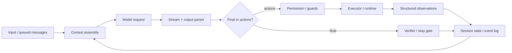
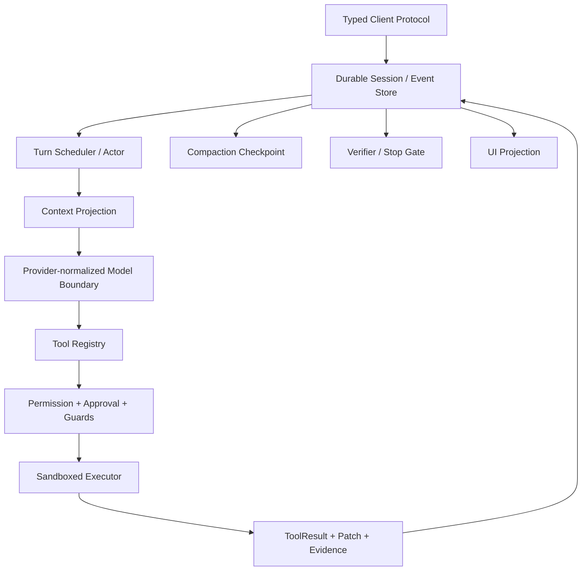

# 现代 Agent 架构与实现细节对比：十个 Coding Agent / Harness

> **Freshness metadata**
> - `last_verified`: `2026-08-24`
> - `version_scope`: `pinned source snapshots + same-day HEAD audits listed below`
> - `source_type`: `official repositories / official documentation / local source audit`
> - `stability`: `fast-moving`

## 1. 对比对象与版本口径

本章只比较 Coding Agent 产品或 Agent Harness，不再把基础模型推理后端混入同一表格。

| 项目 | 本文详细分析快照 | 2026-08-24 HEAD/边界复核 | 主要抽象层 |
|---|---|---|---|
| OpenAI Codex | `4c434651...` | `77b30a21...` | Rust coding-agent runtime + TUI/App Server |
| Claude Code | `7ef6eec9...` | `45bdfa96...`，核心 runtime 非完整开源 | 产品契约 + plugins/hooks/SDK |
| Hermes Agent | `760112ad...` | `057dcdf2...` | Python 长运行个人 Agent Harness |
| OpenClaw | `6e604438...` | `dea053e3...` | Gateway + 多 channel + 多 runtime 平台 |
| Aider | `5dc9490b...` | 同分析快照 | Repo Map + Edit Format + Git loop |
| Goose | `2eb3ab10...` | 同分析快照 | Rust state machine + MCP extensions |
| OpenCode | `105b398c...` | `2a6be0a0...` | Effect server/session runtime |
| DeepSeek Harness Web | 本地 `141eb6fe...` | 远端 `b150a551...` | Cordis Host/Browser 双插件树 |
| pi-agent | `dcd46192...` | 同分析快照 | 极小 core loop + 可组合 coding harness |
| Grok Build | `07b2f714...` | `SOURCE_REV=956313d4...` | Rust session actor + TUI/headless/ACP |

对应报告：

- [Codex](./AGENT_SOURCE_01_CODEX.md)
- [Claude Code](./AGENT_SOURCE_02_CLAUDE_CODE.md)
- [Hermes Agent](./AGENT_SOURCE_04_HERMES_AGENT.md)
- [OpenClaw](./AGENT_SOURCE_05_OPENCLAW.md)
- [Aider](./AGENT_SOURCE_07_AIDER.md)
- [Goose](./AGENT_SOURCE_08_GOOSE.md)
- [OpenCode](./AGENT_SOURCE_09_OPENCODE.md)
- [DeepSeek Harness Web](./AGENT_SOURCE_10_DEEPSEEK_HARNESS_WEB.md)
- [pi-agent](./AGENT_SOURCE_11_PI_AGENT.md)
- [Grok Build](./AGENT_SOURCE_12_GROK_BUILD.md)

## 2. 先统一术语



| 术语 | 准确定义 |
|---|---|
| Agent Loop | 决定何时请求模型、执行动作、回填观察、继续或停止 |
| Harness | Loop 之外的 tools、context、session、permission、UI、telemetry 等宿主能力 |
| Runtime/Executor | 把已批准动作变成真实文件、进程、浏览器或远程调用 |
| Session | 可恢复任务事实和执行状态，不只是 messages 数组 |
| Context | 某一次模型请求可见的投影，不等于 Session 全量数据 |
| Memory | 跨较长时间检索/提炼的知识，不等于 KV cache 或聊天历史 |
| Skill | 可发现、按需加载的知识/流程包，不等于 Tool |
| MCP | 外部 capability 协议，不自动解决权限、隔离与可信度 |

## 3. 产品边界对比

| 项目 | 最强代表性 | 主要界面 | 最明显的边界 |
|---|---|---|---|
| Codex | 完整、事件驱动 coding runtime | CLI/TUI/App Server | Rust workspace 较大，协议高频变化 |
| Claude Code | 成熟产品行为契约和扩展生态 | CLI/IDE/headless/SDK | 核心 runtime 不是完整公开源码 |
| Hermes | 自托管、memory/skills、长期个人 Agent | CLI/Gateway/Web | Python 长运行组件组合复杂 |
| OpenClaw | channel/Gateway/context engine/memory 平台 | 多 channel/Web/CLI | 平台面广，配置与插件组合多 |
| Aider | 代码结构压缩与确定性 patch | CLI | 动作空间主要围绕编辑/Git |
| Goose | Operation state machine 与 MCP | CLI/Desktop/Gateway | policy ordering 状态空间大 |
| OpenCode | server-first session + snapshot patch | TUI/Desktop/Web/ACP | Effect/多包学习成本高 |
| DeepSeek Harness | 一切插件化、Host/Browser 同构插件树 | Web/headless/ACP | developer preview、装配图复杂 |
| pi | 最小 core 与产品 Harness 清晰分离 | TUI/print/RPC/SDK | AgentSession 仍承载大量产品编排 |
| Grok Build | Rust actor、worktree subagent、并行工具 | TUI/headless/ACP | 周期同步 monorepo，开源/托管边界 |

## 4. Agent Loop 对比

| 项目 | Loop owner | 继续条件 | 重要停止/失败机制 |
|---|---|---|---|
| Codex | core session/turn runtime | tool calls、steer、hook/continuation | cancel、retry、compaction、reviewer/hook |
| Claude Code | 产品 runtime（行为契约公开） | tool use、subagent、hooks | permissions、max turns、stop hooks |
| Hermes | conversation loop | tools、verification continuation | finalizer、compression、provider/tool error |
| OpenClaw | selected agent runtime | runtime-specific + channel queue | lane、loop detection、policy/hook |
| Aider | `Coder.run_one/send_message` | edit/lint/test failure reflection | `max_reflections=3` |
| Goose | StateMachine Operations | inference/tool/steer/retry/compact operations | max turns、stop-hook cap、typed effects |
| OpenCode | session `while(true)` + Processor | `continue` 或 `compact` | `stop`、doom-loop ask、interrupt |
| DeepSeek Harness | core agent-loop plugin | tool/input、inbox、agent contract | lifecycle guards、cancel、compaction |
| pi | 双层 core loop | inner tools/steering；outer follow-up | stopReason、shouldStopAfterTurn、abort |
| Grok Build | session actor + turn/sampler modules | tool batches、queue/interjection、goals | stop gate、hooks、cancel、rate-limit/auth retry |

### 4.1 三种典型 Loop 形态

1. **最小函数型**：pi。最适合学习循环不变量和嵌入 SDK。
2. **State machine/actor 型**：Goose、Grok Build、OpenCode。适合大量异步政策与多客户端。
3. **事件/插件树型**：Codex、DeepSeek Harness、OpenClaw。适合可替换 runtime 与复杂产品面。

Aider 是第四种：它把动作空间限制为 Edit Format，以 reflection 驱动修复循环。

## 5. Context Assembly 对比

| 项目 | 主要 context 来源 | 结构压缩/检索特色 |
|---|---|---|
| Codex | instructions、history、tools、skills、memory、environment | compaction + memory/skill 按需发现 |
| Claude Code | system/project rules、tools、skills、memory、subagent context | 官方契约定义优先级与 compaction 行为 |
| Hermes | provider-normalized history、MEMORY/USER、skills、session search | SQLite FTS + compressor + message repair |
| OpenClaw | channel/session、context engine、skills/tools/memory plugins | context engine 与 memory/pruning/compaction 分开 |
| Aider | selected files、chat、Repo Map、Git/lint/test | tree-sitter tag graph + token budget |
| Goose | system/project/recipe/skill/conversation/extensions | visibility + whole/tool-pair compaction |
| OpenCode | instructions、MessageV2、files/MCP、skills/tools | part projection、MIME/size guards、summary+tail |
| DeepSeek Harness | prompt sections、event-derived history、preset tools | durable log → model projection |
| pi | system、AgentMessages、tools、extensions/skills | LLM boundary transform + JSONL compaction checkpoint |
| Grok Build | agent/project/skills/plugins/hooks/MCP/goals/session | recap/summary/compaction/memory 类型分层 |

### 5.1 最有代表性的设计

- **代码结构压缩**：Aider Repo Map。
- **事件事实投影**：DeepSeek Harness。
- **Message/Part 投影**：OpenCode。
- **可替换 Context Engine**：OpenClaw。
- **Core 自定义 transform**：pi。
- **多类型任务摘要**：Grok Build。

没有一种方式在所有任务都最佳。代码导航、长会话、跨会话记忆和多模态附件是四种不同检索问题。

## 6. Tool Protocol 与 Executor

| 项目 | Tool/动作协议 | Executor 特点 |
|---|---|---|
| Codex | ToolSpec → Registry → Router → Runtime | shell/patch/MCP 等统一 lifecycle |
| Claude Code | 内置 tools + MCP + SDK tools | 产品 runtime 强制 permission/hooks |
| Hermes | 自注册 Tool Registry | 并行与顺序敏感工具分段 |
| OpenClaw | policy-filtered tool surface | runtime/harness 可替换、approval/hooks |
| Aider | Edit Format parser | deterministic patch + Git/lint/test |
| Goose | MCP Extension tools + frontend tools | confirmation/security inspectors + tool stream |
| OpenCode | built-in/plugin/MCP registry | Effect tool、truncation/span、snapshot patch |
| DeepSeek Harness | tool plugins over capability seams | pre/execute/post waterfall + runtime plugin |
| pi | typed AgentTool | schema validation；parallel/sequential；truncation guard |
| Grok Build | Rust tool definitions | prepare、冲突感知 batch、workspace executor |

### 6.1 共同不变量

```text
ToolCall(id, name, arguments)
  -> resolve exact implementation
  -> validate complete arguments
  -> evaluate permission and workspace boundary
  -> execute with cancel/deadline
  -> normalize success/error/progress
  -> persist ToolResult with the same id
  -> only then continue the model loop
```

值得特别迁移的保护：pi 对 `stopReason=length` 的 tool calls 全部禁执行；OpenCode 预先 snapshot 并把 patch 绑定到 turn；Grok Build 对同文件 edits 串行；Aider 对 SEARCH block 唯一匹配；Goose 把 MCP extension lifecycle 纳入管理。

## 7. Permission、Approval、Sandbox

| 项目 | Permission 强制点 | Approval | Isolation 关注点 |
|---|---|---|---|
| Codex | tool runtime/policy | TUI/App Server protocol | platform sandbox + exec policy |
| Claude Code | 产品 runtime rules | ask/allow/deny 与 hooks | 产品 sandbox/permission mode |
| Hermes | tool/runtime 配置 | interface-dependent | self-host environment |
| OpenClaw | tool policy + approval | Gateway/channel surface | runtime-specific sandbox |
| Aider | 文件/Git workflow 配置 | 主要由用户工作流控制 | 不是通用 sandbox harness |
| Goose | PermissionManager + inspectors | ToolConfirmationRouter | extension/process trust |
| OpenCode | last-match rules + Deferred ask | once/always/reject | child process + directory fence |
| DeepSeek Harness | interaction/policy plugins | Web permission UI | runtime plugin + trusted-host fence |
| pi | core tool contract不等于完整权限 | coding harness/host 注入 | custom operations responsibility |
| Grok Build | permission resolver + folder trust | TUI/headless/ACP adapter | sandbox/worktree/container modes |

**Permission、approval、sandbox 是三层：**策略决定可否，交互决定如何得到用户选择，sandbox 决定即使执行时能触及什么。三个词不可互换。

## 8. Session 与 Persistence

| 项目 | 真相源 | Branch/Fork | UI 投影 |
|---|---|---|---|
| Codex | thread/turn items + rollout/session state | thread/resume/fork 能力 | typed protocol events |
| Claude Code | 产品 session | resume/fork 行为公开 | terminal/headless/SDK streams |
| Hermes | SQLite session/conversation | session search/continuation | CLI/Gateway/Web events |
| OpenClaw | Gateway-owned durable sessions | runtime/platform dependent | multi-channel protocol |
| Aider | chat history + Git repository/commits | Git branch/undo，而非对话树 | terminal/diff |
| Goose | SessionManager + Conversation | session load/replace | AgentEvents/Gateway |
| OpenCode | DB message/part/session + snapshots | parent/child/revert | EventV2/server API |
| DeepSeek Harness | append-only session event log | replay/resume/fork projection | session projections + WebSocket |
| pi | JSONL entry tree | branch、fork、clone | typed events/TUI/RPC |
| Grok Build | events.jsonl + workspace checkpoints | rewind/worktree/subagent snapshot | TUI/headless/ACP updates |

### 8.1 三种优秀事实模型

- **Append-only event log**：DeepSeek Harness，适合多种 projection/replay。
- **Tree entries**：pi，天然表达对话分支。
- **Message parts + workspace snapshot**：OpenCode，把对话和磁盘 patch 关联。

Grok Build 进一步将 session events 与 worktree/checkpoint 结合；Aider 则让 Git 自身承担大量 artifact history。

## 9. Compaction 与 Memory

| 项目 | Compaction | Long-term memory |
|---|---|---|
| Codex | local/remote compaction + normalization | rollout 提炼/检索 |
| Claude Code | 产品 context compaction | CLAUDE.md/auto memory 等公开契约 |
| Hermes | structured compressor、head/middle/tail、repair | MEMORY/USER + session FTS |
| OpenClaw | compaction 与 pruning 独立 | 可插拔 hybrid/vector/external memory |
| Aider | 主要控制 chat/files/Repo Map context | Git/仓库事实，不是通用长期记忆 |
| Goose | whole conversation + tool-pair compaction | session/project/skills；实现面不同 |
| OpenCode | summary + retained tail + prune tool outputs | skills/session，非单独统一 memory 子系统 |
| DeepSeek Harness | lifecycle compaction + durable event | capability/plugin 可组合 |
| pi | summary checkpoint + recent tail + file tracking | session tree/skills，核心不强绑 memory |
| Grok Build | compaction、recap、turn summary 分型 | memory dream/skills/project facts |

关键不变量：tool call/result 配对、用户约束、当前计划/任务状态、未提交 workspace 事实、summary 范围和版本都要保留。压缩只是对模型输入的投影，不应销毁审计真相。

## 10. Skills、MCP、Plugins、Subagents

| 项目 | Skills | MCP/Plugins | Subagent 形态 |
|---|---|---|---|
| Codex | progressive discovery | MCP/extensions | thread/agent roles 与并行任务 |
| Claude Code | skills/commands | plugins/hooks/MCP | 官方 subagents/Agent SDK |
| Hermes | metadata/依赖/验证较完整 | tools/providers/gateway | delegation/长运行能力依版本 |
| OpenClaw | SKILL.md 多来源 | plugins/tools/context/memory | 多 agent/runtime/channel |
| Aider | 非核心 Skill 系统 | 非通用 MCP 主线 | Architect → Editor 固定 pipeline |
| Goose | skills/recipes/projects | MCP extensions 是主线 | 当前更多依赖 recipe/extension 组合 |
| OpenCode | Skill tool | plugins/MCP/ACP | Task tool → child session |
| DeepSeek Harness | skill plugins/UI | capability seams/自修改/ACP | per-session presets + subagent backend |
| pi | skills/templates/packages | extensions | 可由 extension/runtime 构造，不强绑 core |
| Grok Build | skills | plugins/hooks/MCP | shared/worktree/container 子 Agent |

Grok Build 的 worktree subagent、OpenCode 的 child session、Claude/Codex 的官方 subagent contract、OpenClaw 的多 runtime 是四种不同层级。不要只比较“是否有 subagent”布尔值。

## 11. UI 与协议

| 项目 | 核心 UI/协议思想 |
|---|---|
| Codex | typed App Server protocol；TUI 只是一个客户端 |
| Claude Code | terminal/IDE/headless/SDK 行为契约 |
| Hermes | CLI/Gateway/Web 共享 agent/session 能力 |
| OpenClaw | Gateway protocol 统一多 channel |
| Aider | CLI commands、diff、Git feedback 紧密结合 |
| Goose | CLI/Desktop/Gateway 通过 AgentEvent/confirmation |
| OpenCode | server-first API + EventV2 + ACP |
| DeepSeek Harness | Host/Browser 双 Cordis tree，React 是 projection |
| pi | typed EventStream 供 TUI/print/RPC/SDK |
| Grok Build | session runtime 适配 TUI/headless/ACP |

共同方向是把 loop truth 从 UI 中移出。浏览器刷新、TUI 重绘或 ACP 客户端断线都不应重新执行已经提交的工具副作用。

## 12. Observability

生产 trace 的最小关联层次：

```text
request/user
  -> session/thread
  -> turn
  -> model request/attempt
  -> step
  -> tool call
  -> approval wait
  -> executor/process
  -> tool result
  -> patch/checkpoint
  -> compaction/verification/final
```

不同项目的代表做法：Codex/DeepSeek 的 typed events；OpenCode 的 Effect spans + EventV2 + snapshots；Grok Build 的 events.jsonl 与 checkpoint；pi 的 EventStream + JSONL tree；Aider 的 Git diff/commit/lint/test；Goose 的 tracing + state effects。

## 13. 如何选择研究样本

| 目标 | 优先阅读 |
|---|---|
| 学最小 Agent Loop | pi |
| 学完整 Rust coding runtime | Codex |
| 学插件化 runtime | DeepSeek Harness |
| 学 state-machine policy | Goose |
| 学 session server 与 snapshot | OpenCode |
| 学 worktree subagents | Grok Build |
| 学 repository map/edit parser | Aider |
| 学 Gateway/channel 平台 | OpenClaw |
| 学长期个人 Agent/memory | Hermes |
| 学成熟产品扩展契约 | Claude Code |

## 14. 推荐组合架构

不是把十个项目代码拼在一起，而是组合经过验证的边界：



建议的工程契约：

1. Session 是 durable truth，Context 是可重建 projection。
2. ToolCall、ToolResult、Patch、Approval 都有稳定 ID。
3. Scheduler 对同 session 串行，安全的只读工具可批量并发。
4. Permission 在 executor 之前强制，sandbox 是第二道边界。
5. Compaction 生成带范围的 checkpoint，不删除原事实。
6. Subagent 有预算、深度、workspace isolation 和结果合并契约。
7. UI 只消费 events/projections，不拥有执行真相。
8. 结束前运行 verifier/acceptance tests，而不是只相信 final text。

## 15. 反模式

1. 把模型 `finish_reason` 当任务完成证明。
2. 把 KV cache、聊天记录、长期 memory 混为一谈。
3. 只在 system prompt 写权限，没有 executor policy。
4. 并行所有 tool calls，不分析同文件/进程冲突。
5. Compaction 直接删除旧消息，导致 tool pair 和用户约束丢失。
6. UI 断线后重发请求，重复执行有副作用工具。
7. Subagent 共享工作树却没有写冲突和 merge 规则。
8. Plugin、Skill、MCP 共用一个信任开关。
9. 只记录最终答案，不记录 tool errors、approval、patch 与 retries。
10. 用 fast-moving HEAD 的目录名支持精确行为结论，却不固定 commit。

## 16. 验证清单

- 正常 final-only turn；
- 单工具与多工具；
- 截断/畸形 tool arguments；
- 同文件并发 edits；
- permission allow/ask/deny 与客户端断线；
- shell timeout、cancel 和 child process 清理；
- provider retry 不重复副作用；
- context overflow、compaction、resume；
- branch/fork/rewind 后 workspace 与 session 一致；
- subagent 深度、预算、取消和 worktree cleanup；
- event replay 不重复执行；
- headless/TUI/ACP 对同一终态解释一致。

## 17. 最终结论

十个项目的共同趋势已经很清晰：现代 Agent 架构从“Prompt + Tools”进化为**带持久 Session、显式控制流、确定性权限、可恢复执行器、结构化事件与多客户端协议的运行时系统**。

最小可用闭环是：

```text
Input
  -> Context Projection
  -> Model Stream
  -> Structured Actions
  -> Permission/Executor
  -> ToolResults + Workspace Evidence
  -> Durable Session
  -> Continue/Compact/Verify/Stop
```

评价一个 Agent 的关键不在工具数量，而在这条闭环遇到失败、取消、压缩、并发、断线和恢复时是否仍保持同一组不变量。
