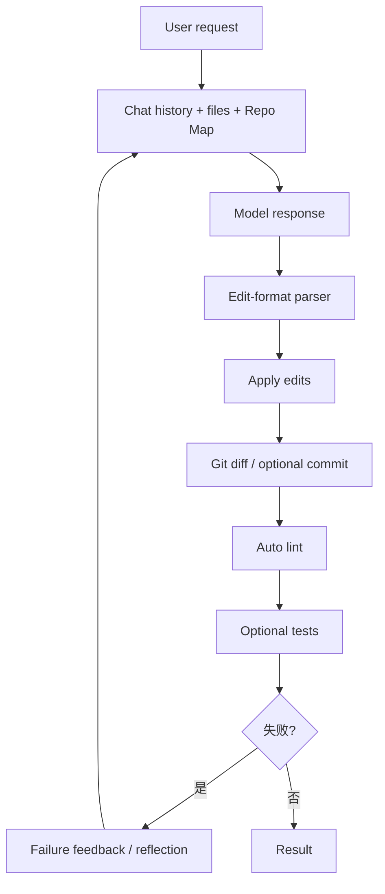
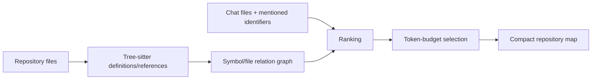
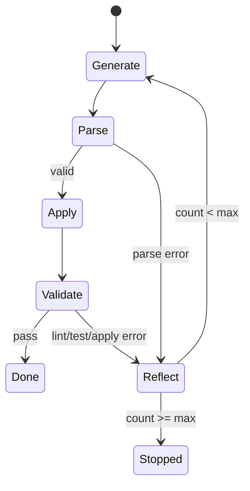

# Aider 源码研究：Repo Map、Edit Format 与 Git-aware 修复循环

> **Freshness metadata**
> - `last_verified`: `2026-08-24`
> - `version_scope`: `5dc9490bb35f9729ef2c95d00a19ccd30c26339c`
> - `source_type`: `official-repository + source-audit`
> - `stability`: `mature / active`

## 1. 定位

- 官方仓库：[Aider-AI/aider](https://github.com/Aider-AI/aider)
- 固定快照：[`5dc9490`](https://github.com/Aider-AI/aider/tree/5dc9490bb35f9729ef2c95d00a19ccd30c26339c)
- 主体：Python CLI、Git-aware pair programming、以文件编辑和验证为中心。

Aider 与通用 tool-calling Agent 的核心差异是：**主动作协议不是任意 Tool Registry，而是受约束的 Edit Format。** 模型输出被 parser 转成文件修改，由 Git、lint、test 和 reflection 形成闭环。

## 2. 总体链路



主要入口是 [`aider/coders/base_coder.py`](https://github.com/Aider-AI/aider/blob/5dc9490bb35f9729ef2c95d00a19ccd30c26339c/aider/coders/base_coder.py) 的 `Coder`。`run()` 负责交互输入，`run_one()` 管理一次请求和 reflection，`send_message()` 管理 prompt/response/edit/validation，`send()` 才进入模型 API。

## 3. Context：把仓库压缩成可选择的证据

一次模型请求通常包含：

1. system/edit-format instructions；
2. 对话历史；
3. 用户明确加入 chat 的文件全文；
4. read-only files 或图片等附件；
5. Repo Map；
6. Git/diff、lint/test 错误等反馈。

### 3.1 Repo Map

[`aider/repomap.py`](https://github.com/Aider-AI/aider/blob/5dc9490bb35f9729ef2c95d00a19ccd30c26339c/aider/repomap.py) 的 `RepoMap` 使用 tree-sitter tags 提取定义/引用，再依据文件关系与用户当前关注点做排名，并受 token budget 约束。



Repo Map 不是向量数据库，也不是完整 AST；它是针对 Coding Agent 的结构化检索/压缩层。它的目标是让模型知道“哪些符号在哪里、哪些文件相关”，再决定是否把某文件加入全文 context。

## 4. Edit Format：Output Parser 就是动作协议

Aider 支持多种 coder/edit format，例如 whole-file、search/replace edit block、unified diff、patch，以及 architect/editor 双模型流程。共同模式是：

1. prompt 明确要求一种可解析格式；
2. parser 提取目标路径、old/new 区块或 patch；
3. executor 验证文件存在性、匹配唯一性与路径；
4. 应用成功后记录 changed files；
5. parser/apply 失败形成可供模型修正的错误。

### 4.1 Search/Replace 的关键不变量

- SEARCH 必须在目标文件中找到；
- 通常要求唯一匹配，否则模型需补充更多上下文；
- REPLACE 只替换该块，不接受模糊意图；
- 文件创建、删除和重命名需要明确协议；
- 模型文字说明不能被误当代码 patch。

这种协议比任意 shell 命令更容易做 diff review 和失败修复，但能力边界也更窄。

## 5. Reflection Loop

`Coder.max_reflections = 3`。当 edit parser、apply、lint 或 test 产生可恢复失败时，Aider 把错误作为新反馈再请求模型；达到上限后停止自动反思。



reflection 与 provider retry 不同：provider retry 处理网络/限流；reflection 是把**任务级失败证据**交还模型重新决策。两者的计数、backoff 和日志应分开。

## 6. Git 是状态与审计边界

Aider 的 Git 集成负责：

- 识别 repository、tracked/dirty files；
- 在修改前后形成 diff；
- 可选自动提交；
- 用 commit message 记录本轮变更；
- 避免把用户已有 dirty work 静默混成 Agent commit；
- 支持 undo/恢复工作流。

自动 commit 是运行配置，不是模型能力。`dry_run`、`auto_commits`、repository dirty state 与用户显式 git 操作共同决定真实行为。

## 7. Lint 与 Test 闭环

`auto_lint` 默认开启，`auto_test` 默认关闭。修改后：

1. 只对相关文件或配置的 linter 执行检查；
2. lint 失败可触发 reflection；
3. test 命令由用户/配置决定；
4. test 输出裁剪后回填，避免无限放大 context；
5. 成功结果与失败结果都要对应本轮 changed files。

正确性边界：lint 通过不等于测试通过，测试通过也不等于任务完成。Aider 提供执行反馈层，但最终 acceptance 仍需要项目特定的验证门。

## 8. Architect/Editor 双模型

`ArchitectCoder` 先用 architect model 形成解决方案，再由 editor model 按可执行 edit format 落地。它体现了“规划文本”和“补丁协议”的分离：

- Architect 擅长推理、范围与方案；
- Editor 接收方案和文件 context，负责严格格式；
- 结果仍进入同一 apply/lint/test/Git 链路。

这不是通用多 Agent 调度：它更像固定两阶段 pipeline，没有任意任务图、共享黑板或动态 subagent topology。

## 9. 模型适配

Aider 的 model metadata 决定 context window、edit format、reasoning/stream 参数、provider 设置与 Repo Map token 策略。模型名称相同并不保证 provider 行为完全一致，因此 source audit 应检查：

- model settings 来源和覆盖顺序；
- prompt/edit format 是否与模型能力匹配；
- tool/function calling 与文本 patch 是否混用；
- token/cost 与 cache metadata；
- truncated response 对 parser 的影响。

## 10. UI/命令层

CLI commands 处理 `/add`、`/drop`、`/read-only`、`/diff`、`/undo`、`/test`、`/lint`、`/commit` 等控制面动作。命令层改变 context 或运行配置，不应伪装成普通用户 message 交给模型解释。

## 11. 错误分类

| 错误 | Owner | 正确恢复方式 |
|---|---|---|
| provider/network | model client | retry/backoff/换模型 |
| output parse | edit-format parser | reflection，要求重发合法 patch |
| block 不匹配 | edit executor | 返回目标文件证据后 reflection |
| Git dirty/conflict | GitRepo/user | 显式处理工作区，不覆盖 |
| lint/test failure | validation runner | 结构化回填模型 |
| context overflow | context builder | 缩减 map/files/history |

## 12. 源码索引

| 文件 | 阅读问题 |
|---|---|
| [`aider/coders/base_coder.py`](https://github.com/Aider-AI/aider/blob/5dc9490bb35f9729ef2c95d00a19ccd30c26339c/aider/coders/base_coder.py) | 主 loop、context、reflection、lint/test/commit |
| [`aider/repomap.py`](https://github.com/Aider-AI/aider/blob/5dc9490bb35f9729ef2c95d00a19ccd30c26339c/aider/repomap.py) | tag graph 与 token-budget Repo Map |
| `aider/coders/editblock_coder.py` | search/replace parser 与 apply |
| `aider/coders/udiff_coder.py` | unified diff 变体 |
| `aider/coders/architect_coder.py` | architect/editor pipeline |
| `aider/repo.py` | Git repository 与 commit 边界 |
| `aider/linter.py` | language-aware lint |
| `aider/models.py` | model metadata/配置 |

## 13. 与 Tool-calling Agent 的对照

| 维度 | Aider | 通用 Tool Agent |
|---|---|---|
| 动作空间 | 主要是 edit format + CLI control | 任意 registry tools |
| Repository context | Repo Map 是核心 | 实现差异大 |
| 文件修改 | parser + deterministic apply | edit tool 调用 |
| 修复循环 | reflection 上限明确 | 通常依赖 Agent Loop |
| Git | 一等工作流 | 可能只是 shell tool |
| 多 Agent | architect/editor 固定 pipeline | 可动态 spawn/delegate |

## 14. 值得学习与限制

### 值得学习

1. Repo Map 将代码结构检索与 token budget 结合。
2. Edit Format 把自由文本变成确定性修改协议。
3. parser/apply/lint/test 失败进入有限 reflection。
4. Git diff/commit/undo 是工作流主干。
5. 明确区分 provider retry 与任务反思。

### 限制

1. edit format 对复杂非文件工具工作流不如通用 registry 灵活。
2. Repo Map 的静态关系不等于动态调用和运行时证据。
3. 自动提交策略需适应团队分支/CI 规则。
4. reflection 上限避免死循环，但不保证最后一次修改正确。

## 15. 未验证项

- 所有 provider/model 对每种 edit format 的当前质量；
- 超大 monorepo 中 Repo Map 的延迟、缓存和排名效果；
- 不同语言 linter/test runner 的完整覆盖；
- 用户已有复杂 dirty state、submodule/worktree 下的所有 Git 边界。

## 16. 最终心智模型

```text
Repository → Repo Map + selected files
  → model response constrained by Edit Format
  → parser → deterministic patch apply
  → Git diff/commit
  → lint/test evidence
  → bounded reflection
```

Aider 展示了一条与“模型随意调用 shell”不同的 Coding Agent 路线：缩小动作协议，强化 repository context、补丁确定性与验证反馈。
