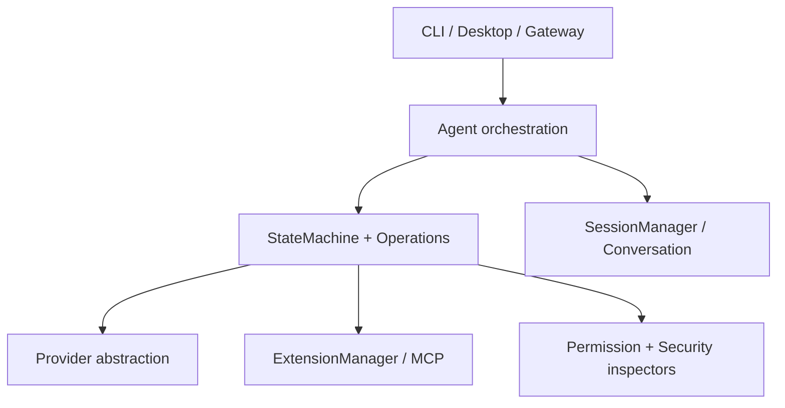
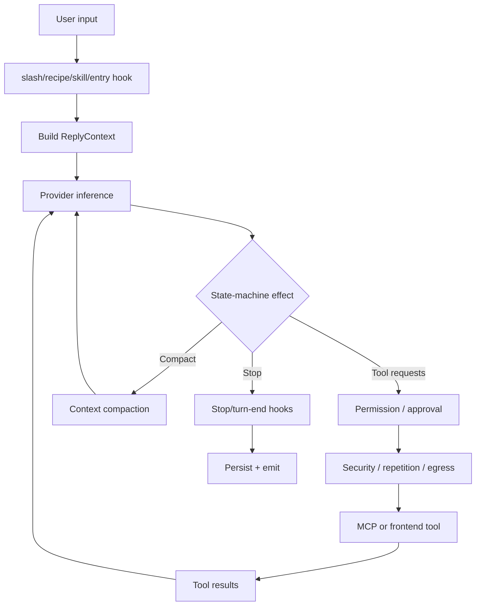
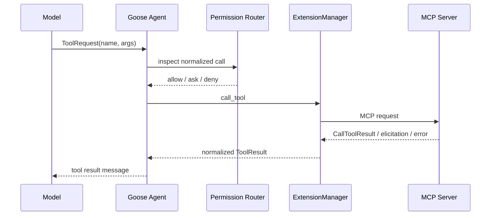
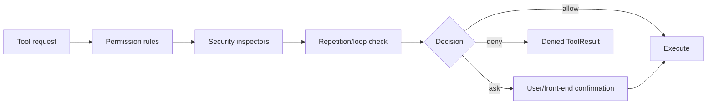

# Goose 源码研究：Rust State Machine、MCP Extensions 与安全检查链

> **Freshness metadata**
> - `last_verified`: `2026-08-24`
> - `version_scope`: `2eb3ab1001dedb5ab09a6ed60158adfc248bac56`（workspace version `1.47.0`）
> - `source_type`: `official-repository + source-audit`
> - `stability`: `active`

## 1. 项目定位

- 官方仓库：[block/goose](https://github.com/block/goose)（当前源码 metadata 也出现 `aaif-goose/goose` 命名，固定 commit 是本文身份锚点）。
- 固定快照：[`2eb3ab1`](https://github.com/block/goose/tree/2eb3ab1001dedb5ab09a6ed60158adfc248bac56)
- 主体：Rust agent runtime、CLI/Desktop/Gateway、多 provider、MCP extension、recipe 与 session。

Goose 的核心不是一个简单 `while(tool_calls)`。当前实现将 reply orchestration 拆成一组 `Operation`，由 state machine 根据 `Step` 与 `GooseEffect` 推进；tool approval、compaction、retry、steering、skills、recipes 和 hooks 都是显式操作。

## 2. 架构层次



| 模块 | 责任 |
|---|---|
| `agents/agent.rs` | reply context、provider/tool/session wiring、事件 |
| `agents/state_machine` | step/effect/operation 调度与停止条件 |
| `providers` / `goose-providers` | 模型协议、stream、usage、thinking |
| `agents/extension*` | MCP clients、tools/prompts/resources、生命周期 |
| `permission` / `security` | allow/ask/deny、检查器与确认 |
| `context_mgmt` | token threshold 与 compaction |
| `session` | conversation、extension state、usage 与恢复 |
| `gateway` | 多客户端/服务化入口 |

## 3. ReplyContext 与一次请求

`ReplyContext` 包含 conversation、tools、toolshim tools、system prompt、Goose mode、tool-call cut-off 和 model config。它是一次推理执行的快照，而长期可变 owner 仍在 Agent/SessionManager。



## 4. State Machine：把 Policy 从 Loop 中抽出来

当前源码导入的 Operations 包括：

- `InferenceRunner`
- `ToolApprovalOperation`
- `ToolExecutionOperation`
- `ToolPairCompactionOperation`
- `CompactionOperation`
- `RetryOperation`
- `SteerOperation`
- `MaxTurnsOperation`
- `SkillOperation`
- `RecipeOperation`
- `ProjectOperation`
- `EntryHookOperation` / `StopHookOperation`
- `UnknownToolOperation`
- `DoctorOperation` / `BangShellOperation` / `SlashCommandOperation`

这表明“下一步做什么”不完全由模型回答决定。State machine 根据当前 conversation、工具请求、审批、错误、指令与配置选择 operation；operation 产生 effect 和新 state。

### 4.1 为什么 Operation 化

1. 每种政策有单独测试入口；
2. provider retry 不与 tool retry 混淆；
3. steering、hook、max turns 可以在稳定顺序插入；
4. UI 可从 effect/event 得知当前等待原因；
5. 未来扩展不必不断膨胀一个循环函数。

代价是 operation 顺序本身成为公共语义，新增 operation 要做组合回归。

## 5. Provider 与 Conversation

Provider abstraction 接收规范化 conversation/tools/system prompt，返回 stream、usage、thinking 和 provider metadata。请求前会修复/合并 conversation，例如处理连续消息和 provider 对 tool request/result 邻接的要求。

必须区分：

- `Conversation`：当前模型可见消息及其 visibility；
- `Session`：还包含持久化 metadata、extensions、usage、配置；
- `AgentEvent`：给 frontend/gateway 的运行时更新；
- `ProviderMetadata`：特定 provider 的响应事实。

这些对象合并成一个 JSON 会让 resume、跨 provider 切换和 UI 投影相互污染。

## 6. Extensions 与 MCP

Goose 将外部能力主要建模为 Extension。Extension config 支持 built-in、stdio、streamable HTTP 等 MCP 连接，ExtensionManager 负责：

1. 读取 enabled extension 配置；
2. 启动/连接 MCP server；
3. 协商 protocol/capabilities；
4. 聚合 tools/prompts/resources；
5. 将 tool name 映射到 extension；
6. session 恢复时重新装载；
7. shutdown 时清理 client/process。

固定快照使用 `MCP_PROTOCOL_VERSION = 2025-11-25`。协议版本是运行时兼容事实，不宜在文档里只写“支持 MCP”而省略 negotiation/error path。

### 6.1 MCP Tool 链



## 7. Tool 分类、确认与执行

源码把工具粗分为 Shell、Read、Write、Other；分类基于规范化后的 tool 名称。这一层用于权限/安全路由，不应取代精确 schema 和参数级判断。

Tool execution stream 会发送开始、进度、结果；frontend tools 还可以由前端执行并回传。所有路径都应最终生成 ToolCallResult/ToolResult，而不是因某个前端断线让 conversation 永远缺失 tool result。

### 7.1 Final Output Tool

Goose 支持专门的 final output tool，用 schema 约束最终产物。若 provider 不支持结构化输出，需要显式 continuation/error 语义。它把“最终答复”从普通文本升级为可验证结果，但 schema 通过仍不等于业务正确。

## 8. Permission 与 Security Inspectors

当前执行链包含：

- `PermissionManager` / `PermissionInspector`
- `ToolConfirmationRouter`
- `AdversaryInspector`
- `EgressInspector`
- `SecurityInspector`
- `RepetitionInspector`
- extension malware check



这些层分别处理策略、可疑内容/外传、重复动作和人机交互。它们都是 deterministic runtime guard；system prompt 中的规则只是辅助，不是最终强制点。

## 9. Context Compaction

`context_mgmt` 提供 `check_if_compaction_needed` 与 `compact_messages`。自动路径先检查 threshold，再生成摘要并更新消息 visibility；手动 `/compact` 也走同一核心压缩逻辑，再由 SessionManager 替换 conversation 和记录 usage。

重要不变量：

1. compact operation 与 ordinary inference 的 usage 分开；
2. tool request/result 对保持有效；
3. visibility 变化要持久化，否则 resume 会重新暴露旧内容；
4. manual 与 automatic compaction 的保留规则可能不同；
5. context overflow 属于 compaction/模型窗口策略，不是普通网络 retry。

`ToolPairCompactionOperation` 说明工具输出体积可以先做局部压缩，再决定是否总结整段对话。

## 10. Steering、Queue 与停止

`SteerQueue` 允许运行中插入方向修正。停止流程还会经过 stop hooks；hook 可暂时阻止结束并给 Agent 注入修正上下文，但源码设置连续阻断上限，防止 hook 造成无限循环。默认 max turns 也作为独立 operation 存在。

空 assistant response 有有限重试；未知工具走 `UnknownToolOperation`；max-turn、取消、provider error、tool error 和用户拒绝都有不同结束含义。

## 11. Recipes、Skills 与 Project Context

- **Recipe**：可复用、可参数化的任务过程与设置；
- **Skill**：按需加载的领域说明/资源；
- **Project**：工作区级指令和上下文；
- **Slash command**：用户控制面命令；
- **Extension**：可执行的 MCP 能力。

State machine 为这些输入分别设置 operation，避免它们全部被预处理成无类型文本。

## 12. Session 与 Gateway

SessionManager 保存 conversation、session config、enabled extensions、usage 和名称等信息。Gateway handler 在客户端请求时取得/创建 Agent，加载 session 所需 extensions，再把 Agent events 推给外部客户端。

Gateway 部署要验证：

- session id 与用户/连接的映射；
- 同一 session 是否允许并发 turn；
- client disconnect 是否取消执行；
- extension process 是 session 私有还是共享；
- tool confirmation 在无交互客户端中的行为；
- resume 后 model/provider/tool roster 是否与原 session 一致。

## 13. Observability

Goose 记录 model/provider usage、inference metadata、tool events 和 tracing。有效 trace 应串联 session → turn/step → inference → tool call → extension/server。只看总 token 或最终文本定位不了 approval wait、MCP latency 或 compaction 开销。

## 14. 源码索引

| 文件/目录 | 阅读问题 |
|---|---|
| [`crates/goose/src/agents/agent.rs`](https://github.com/block/goose/blob/2eb3ab1001dedb5ab09a6ed60158adfc248bac56/crates/goose/src/agents/agent.rs) | orchestration、ReplyContext、tool/security wiring |
| `crates/goose/src/agents/state_machine` | operations、steps、effects |
| `crates/goose/src/agents/extension.rs` | MCP transport/config |
| `crates/goose/src/agents/extension_manager.rs` | capability/tool lifecycle |
| `crates/goose/src/context_mgmt` | compaction 与 threshold |
| `crates/goose/src/permission` | permission inspection/confirmation |
| `crates/goose/src/security` | adversary/egress/security inspectors |
| `crates/goose/src/session` | persistence 与 extension state |
| `crates/goose/src/gateway` | service/client boundary |
| `crates/goose-providers` | provider adapters 与 usage |

## 15. 事实、推断与未知

### CONFIRMED

- Rust state-machine operations 架构；
- MCP extension manager 与 2025-11-25 protocol version；
- permission、confirmation、security、egress、repetition 检查面；
- compaction、steering、retry、hooks、recipes/skills；
- CLI/Desktop/Gateway 表面与 session manager。

### INFERRED

- Operation 化主要用于固定政策顺序并降低主 Loop 分支复杂度；
- Gateway + ExtensionManager 让 Goose 更接近可服务化的 Agent runtime，而非单一 TUI；
- ToolPairCompaction 是控制工具观察膨胀的局部 context policy。

### UNKNOWN

- 所有 provider 对 tool stream/thinking/usage 的完全等价性；
- 各 MCP server 的故障隔离与恶意实现边界；
- Desktop 与 Gateway 在大并发 session 下的资源上限；
- 所有 security inspector 的生产误报/漏报特征。

## 16. 值得学习与限制

### 值得学习

1. 将 Loop policies 拆成可测试 Operations。
2. MCP extension 具有完整 lifecycle，而不只是 tool list。
3. permission、security、egress、repetition 分层。
4. manual/automatic compaction 复用同一核心。
5. stop hook 有阻断上限，避免策略死循环。

### 限制

1. operation 数量多时，顺序组合的状态空间会增大。
2. 工具名称粗分类只能辅助策略，仍需参数级规则。
3. MCP 把进程和远程系统带入信任边界，schema 合法并不代表实现可信。
4. Gateway 化要求更严格的 session 隔离、取消与认证。

## 17. 最终心智模型

```text
CLI / Desktop / Gateway
  -> Agent + Session
  -> StateMachine Operations
  -> Provider inference
  -> Permission/Security/Confirmation
  -> MCP or frontend Tool execution
  -> ToolResult + Conversation
  -> Compaction/Steering/Hooks/Retry
  -> durable session + events
```

Goose 的代表性在于：它把工具型 Agent 的控制政策提升为显式状态机，而把 MCP extension 当成带生命周期、权限和错误语义的运行时能力。
