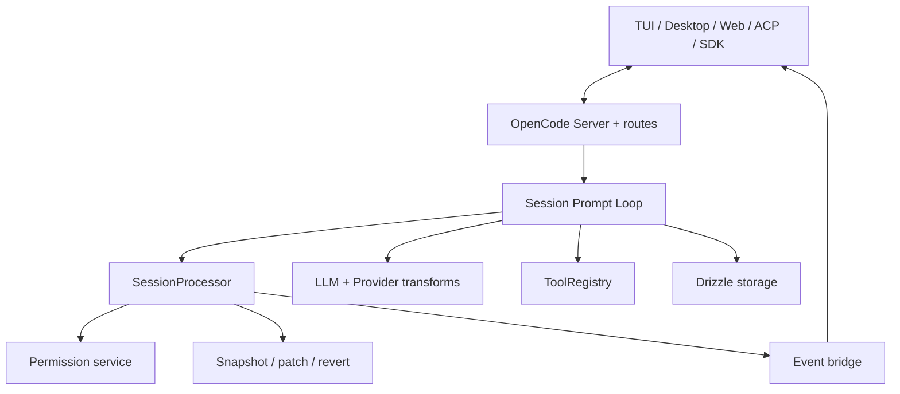
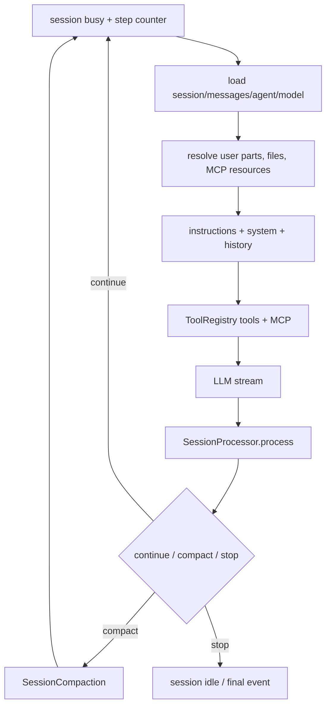
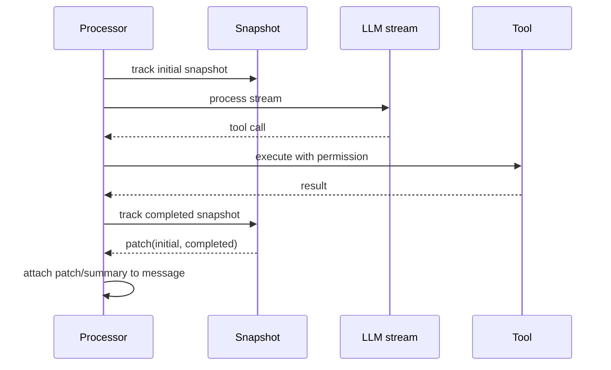
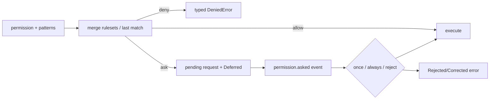
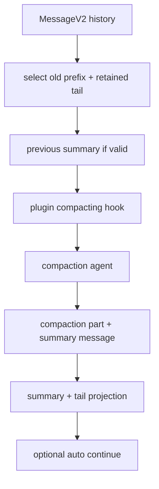

# OpenCode 源码研究：Effect Runtime、Server/Client 与 Snapshot-aware Session Loop

> **Freshness metadata**
> - `last_verified`: `2026-08-24`
> - `version_scope`: `analyzed snapshot 105b398c2a9ff2f16eaae409836e1dbc4d37671a; HEAD audit 2a6be0a03b93a6734070e10a6c3b56863475f214`
> - `source_type`: `official-repository + source-audit`
> - `stability`: `fast-moving`

## 1. 项目定位

- 官方仓库：[anomalyco/opencode](https://github.com/anomalyco/opencode)
- 固定快照：[`105b398`](https://github.com/anomalyco/opencode/tree/105b398c2a9ff2f16eaae409836e1dbc4d37671a)
- 核心：TypeScript/Bun + Effect，server/client 分离，多 provider、TUI/Desktop/Web/ACP、plugins/MCP/skills/subagents。

OpenCode 的核心不是某个 TUI 组件，而是可通过 SDK/API 驱动的 session service。`packages/opencode/src` 把 agent、provider、session、tool、permission、snapshot、storage、server、ACP 等拆为 Effect services/layers。

## 2026-08-24 HEAD 新鲜度审计

官方 `dev` HEAD 复核到 [`2a6be0a`](https://github.com/anomalyco/opencode/tree/2a6be0a03b93a6734070e10a6c3b56863475f214)。重新检查后，`session/prompt.ts` 的循环、`SessionProcessor` 的 `continue | compact | stop`、pre-stream snapshot、last-match permission 与 ToolRegistry 分层仍存在。正文继续固定 `105b398...` 以保持详细链接可复现；HEAD audit 不把生成提交中的未审阅字段当作新结论。

## 2. 总体架构



### 2.1 Effect Layer 的作用

Agent、Provider、ToolRegistry、Permission、MCP、Config、SessionProcessor 等通过 Effect `Context.Service` 和 Layer 装配。这样可以：

- 在一次 directory/project instance 中共享服务；
- 用 scoped finalizer 清理 pending permission、process、watcher；
- 让测试替换 fs/provider/child process/event service；
- 用 typed error、interrupt、span 而非全局异常协调异步流程。

代价是调用链要沿 `yield* Service`、Layer deps 与 runtime bridge 一起阅读；只搜普通 class constructor 会漏掉真实依赖图。

## 3. Session Prompt Loop

[`session/prompt.ts`](https://github.com/anomalyco/opencode/blob/105b398c2a9ff2f16eaae409836e1dbc4d37671a/packages/opencode/src/session/prompt.ts) 中的核心 loop 持续处理一个 session：



每次迭代重新解析 agent/model/tools/permission 和 history，允许配置或 session state 在边界生效。step 上限、用户取消、错误、compaction 和 tool calls 都不应被压成同一个 finish reason。

## 4. MessageV2：Message 与 Part 分离

消息 metadata 与具体 part 分开存储。Part 类型覆盖 text、reasoning、file、tool、step、snapshot、patch、compaction、subtask 等。好处包括：

1. streaming 时只更新对应 part；
2. tool call 可经历 pending/running/completed/error 状态；
3. file/media 有独立体积与可见性策略；
4. compaction 和 subtask 是结构化 marker；
5. UI 可按 part 渲染，不解析 assistant 文本。

模型 boundary 再把 MessageV2 转为 provider messages，并处理 tool/result 邻接、media stripping、compaction tail 等规则。

## 5. SessionProcessor：流、工具和 Workspace 变化的汇合点

[`session/processor.ts`](https://github.com/anomalyco/opencode/blob/105b398c2a9ff2f16eaae409836e1dbc4d37671a/packages/opencode/src/session/processor.ts) 的 `process()` 消费 LLM stream：

- reasoning/text start/delta/end 更新 parts；
- tool-input delta 组装 call；
- tool call 在执行前进入 running state；
- permission ask 在 runtime 强制；
- tool progress/metadata 持续更新；
- tool success/error 写入 completed state；
- finish 时计算 usage/cost、snapshot patch 和 summary；
- context overflow 或阈值命中时返回 `compact`；
- normal/tool continuation 返回 `continue` 或 `stop`。

### 5.1 Snapshot before stream

Processor 在 LLM stream 开始前先 `snapshot.track()`。当工具修改工作区后，再取 completed snapshot 并计算 patch。这样一次 assistant turn 的文件变化可以和 message/tool call 关联，而不是事后仅运行一次 `git diff` 猜测归属。



## 6. ToolRegistry

[`tool/registry.ts`](https://github.com/anomalyco/opencode/blob/105b398c2a9ff2f16eaae409836e1dbc4d37671a/packages/opencode/src/tool/registry.ts) 聚合 built-in、config directory tools 和 plugin tools。

固定快照的 built-ins 包括：

- shell、read、glob、grep；
- edit、write、apply_patch；
- task（subagent）；
- webfetch、websearch；
- todo、skill、question；
- optional LSP、plan、experimental code-mode execute；
- invalid-tool fallback。

### 6.1 注册与暴露不是同一件事

registry 可以知道所有工具，但 `tools(model, agent, permission)` 会依据客户端能力、feature flag、模型、agent ruleset 和 permission 隐藏或重写工具。MCP tools 也在 prompt 组装阶段加入。

Plugin tool 兼容 Zod args 与 legacy schema，registry boundary 把它们规范化成 JSON Schema/Effect tool，再统一加 truncation 和 tracing span。这样第三方 promise API 不会让核心 Processor 丢掉 context/span。

## 7. Permission：last matching rule 与 Deferred 交互

Permission rule 由 `permission + pattern + action` 组成；多个 ruleset 展平后，**最后一个匹配规则生效**，无匹配默认 `ask`。



`always` 会把用户批准的 patterns 加入当前 state，并自动放行同 session 中已 pending 且完全匹配的新请求；`reject` 会清理该 session 其他 pending 请求。service finalizer 也会 reject 尚未完成的 Deferred，避免 instance teardown 后请求永久挂起。

Permission 既可隐藏整类 tools，也会在 tool context `ask` 时做参数级决策。隐藏 schema 只是减少动作面，executor 前的 ask 才是确定性强制。

## 8. Agent 与 Subagent

Agent 配置包含 mode、model、prompt、temperature/topP、steps 与 permission ruleset。Primary agent 和 subagent 共享统一 info，但 subagent 通过 Task tool 创建 child session。

当前实现会：

- 只向 Task tool 描述 `mode !== primary` 的可用 agents；
- 过滤 parent permission 禁止的 task target；
- 从 parent session permission 派生 child ruleset；
- 建立 parent/child session 关联；
- child result 作为结构化 subtask part 回到 parent。

这避免 child 仅靠 prompt 继承权限。派生规则仍需检查 external directory、write、network 和 recursive task 等关键动作。

## 9. Context Assembly

请求上下文来自：

1. provider/model-specific system prompt；
2. agent prompt 与 mode；
3. `AGENTS.md`/项目 instruction 的目录向上解析；
4. session history 和 compaction projection；
5. selected file/directory、LSP symbol、MCP resource；
6. skills；
7. tool schemas；
8. reminders/max-step prompt；
9. plugin hook 注入。

文件 part 不总是原样 base64 进入模型：文本/目录调用 read tool 形成 synthetic parts；MCP blob 有 MIME allowlist 与体积上限；过大或不支持的 binary 变成说明文本。这是 context ingestion 的防膨胀边界。

## 10. Compaction

[`session/compaction.ts`](https://github.com/anomalyco/opencode/blob/105b398c2a9ff2f16eaae409836e1dbc4d37671a/packages/opencode/src/session/compaction.ts) 负责：

- 根据 provider limit 与 reserved tokens 判断 overflow；
- 选择 retained tail / tail turns；
- 查找先前成功 summary；
- 允许 plugin 注入 context 或替换 compaction prompt；
- 使用专门 compaction agent 生成 summary；
- 标记旧 tool outputs `time.compacted` 以便 prune；
- 处理 oversized media；
- 可选自动 continuation。



MessageV2 转换会识别 compaction marker、summary child 和 `tail_start_id`，把 summary 与保留尾部重排为 provider 可接受的上下文。它不是简单数组 slice。

## 11. Storage、Bus 与 Server

Storage 使用 Drizzle ORM，底层 DB 通过运行时条件选择 Bun/Node adapter。Session/message/part 与项目状态落盘，EventV2 bridge 将 domain events 推给 server/client。

Server/client 分离带来：

- TUI、Desktop、Web、SDK 和 ACP 可共享 session API；
- 客户端断线不必立即丢失 session；
- permission/question 等交互可以协议化；
- 但必须增加 API auth、directory isolation、event cursor/replay 与多客户端并发控制。

## 12. Provider Layer

Provider service 统一大量 AI SDK providers，同时保留 provider transform：消息格式、cache hints、reasoning、tool choice、headers 与 options 在 boundary 处理。Core 不应假设每个 provider 都支持相同的 tool delta、usage、system message 或 structured output。

OpenCode 每次请求记录 providerID/modelID；session 恢复时可以从 user/assistant 消息找最近选择。分析 usage 时要按 provider 原始语义归一，而不是只累计一个 `tokens` 字段。

## 13. MCP、Plugin、Skill 与 ACP

- MCP 支持 tools/resources、OAuth callback 与 pending provider commit；
- Plugin 可注册 tools 和 lifecycle hooks；
- Skill tool 按需载入 skill content；
- ACP 将 OpenCode session 映射到 editor/client protocol，包含 model/agent/command/config snapshot 与 permission request。

这些扩展共用 server/session，但信任边界不同：MCP 是外部协议，Plugin 是本地运行时代码，Skill 是 context 内容，ACP 是客户端控制通道。

## 14. Doom Loop 与失败控制

Processor 会检测重复 tool call，并通过 `doom_loop` permission 询问；这不是让模型自己判断“我是否卡住”。同时还存在：

- retry policy；
- orphaned interrupted tool 修复；
- context overflow → compaction；
- invalid tool fallback；
- pending permission cleanup；
- abort/interrupt 到 child process 的传播。

每种失败都应形成 MessageV2 part/event，不能只在 server log 打印。

## 15. Observability

Effect spans 为 LLM/tool/session 操作携带 session id、message id、tool call id 等 attributes；Event bridge 给 UI 实时状态；snapshot patch 记录文件影响；usage/cost 写回 assistant message。

建议监控：loop steps、LLM latency、tool wait/execute、permission wait、compaction rate、context fill ratio、snapshot time、event subscriber lag、child session count。

## 16. 源码索引

| 文件/目录 | 研究问题 |
|---|---|
| [`session/prompt.ts`](https://github.com/anomalyco/opencode/blob/105b398c2a9ff2f16eaae409836e1dbc4d37671a/packages/opencode/src/session/prompt.ts) | session loop 与 context/tool 装配 |
| [`session/processor.ts`](https://github.com/anomalyco/opencode/blob/105b398c2a9ff2f16eaae409836e1dbc4d37671a/packages/opencode/src/session/processor.ts) | stream、tools、snapshot、finish reason |
| [`session/message-v2.ts`](https://github.com/anomalyco/opencode/blob/105b398c2a9ff2f16eaae409836e1dbc4d37671a/packages/opencode/src/session/message-v2.ts) | message/part 与 LLM projection |
| [`session/compaction.ts`](https://github.com/anomalyco/opencode/blob/105b398c2a9ff2f16eaae409836e1dbc4d37671a/packages/opencode/src/session/compaction.ts) | summary、tail、prune、auto continue |
| [`tool/registry.ts`](https://github.com/anomalyco/opencode/blob/105b398c2a9ff2f16eaae409836e1dbc4d37671a/packages/opencode/src/tool/registry.ts) | built-in/plugin/MCP tool 边界 |
| [`permission/index.ts`](https://github.com/anomalyco/opencode/blob/105b398c2a9ff2f16eaae409836e1dbc4d37671a/packages/opencode/src/permission/index.ts) | allow/ask/deny 与 Deferred |
| `snapshot` / `session/revert.ts` | patch、revert 与 workspace state |
| `agent` / `tool/task.ts` | primary/subagent 与 child session |
| `server` / `acp` | 客户端协议与 session service |
| `storage` | Drizzle DB 与 persistence |

## 17. 事实、推断与未知

### CONFIRMED

- `while(true)` session loop + Processor 的 continue/compact/stop；
- Effect services/layers、MessageV2 parts、Snapshot patch；
- ToolRegistry、plugin tools、MCP、skills、Task subagents；
- last-match permission、pending Deferred、always/once/reject；
- compaction summary + retained tail；
- server/client/ACP/storage 架构。

### INFERRED

- Snapshot-aware Processor 用于将每个 assistant turn 与具体 workspace patch 关联；
- server-first session API 是多客户端与远程/嵌入模式的架构基础；
- Message/Part 分离降低 streaming UI 对 provider 原始事件的耦合。

### UNKNOWN

- 各官方客户端与 server 在版本不一致时的兼容窗口；
- 多客户端同时控制同 session 的完整仲裁规则；
- 所有 provider 的 tool/reasoning/usage 语义差异；
- 大型 SQLite/Drizzle session 数据库的长期迁移和性能。

## 18. 值得学习与限制

### 值得学习

1. SessionProcessor 统一流式内容、工具状态与 workspace snapshot。
2. Permission 用 typed Deferred 连接 runtime 与客户端。
3. MessageV2 parts 使 compaction/subtask/tool/patch 都可结构化。
4. 注册工具与按 agent/model/permission 暴露工具分离。
5. server/client/ACP 共享一个 session domain。

### 限制

1. Effect 与多 package 层次提高源码学习成本。
2. fast-moving schema/API 要固定 commit 研究。
3. 本地 plugin tools 是执行代码，需要独立供应链治理。
4. Snapshot/DB/Event 三种状态必须有一致性和恢复测试。

## 19. 最终心智模型

```text
Client / SDK / ACP
  -> Server session API
  -> Prompt Loop
  -> MessageV2 context + Agent + Provider + ToolRegistry
  -> SessionProcessor stream state machine
  -> Permission + Tool execution
  -> Snapshot patch + durable parts/events
  -> continue | compact | stop
```

OpenCode 的代表性在于：它把 Coding Agent 建成可服务化的 session runtime，并将模型流、tool lifecycle、permission 和 workspace patch 汇合到同一个可观察处理器中。
