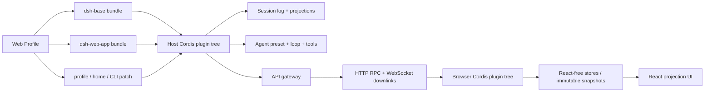
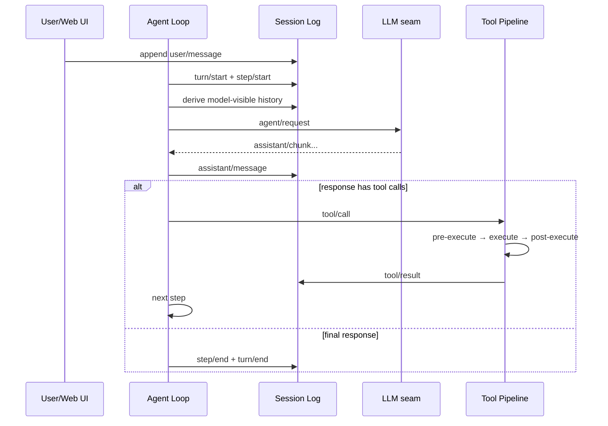
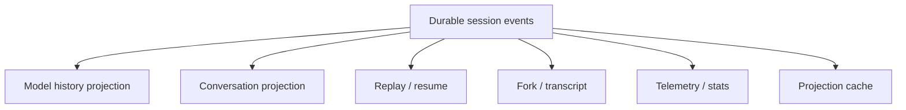
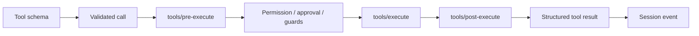

# DeepSeek Harness Web 源码研究：Cordis 插件树、事件日志与双端运行时

> **Freshness metadata**
> - `last_verified`: `2026-08-24`
> - `version_scope`: 本地 Web 仓库 `141eb6fef83422698aef7a981029e843e8161534`；远端 HEAD 复核至 `b150a551b8d465e31e418e1b2eaf5e79bbb7d28e`
> - `source_type`: `official-repository + local-source-audit`
> - `stability`: `developer-preview / fast-moving`

## 1. 研究对象与结论边界

- **本地源码**：`D:\deepseek harness\deepseek-harness`，即用户指定的 Web 版本，不是 `deepseek-harness-tui`。
- **官方仓库**：[deepseek-ai/deepseek-harness](https://github.com/deepseek-ai/deepseek-harness)。
- **固定分析快照**：[`141eb6f`](https://github.com/deepseek-ai/deepseek-harness/tree/141eb6fef83422698aef7a981029e843e8161534)，本地版本为 `0.1.0-rc.8`。
- **新鲜度检查**：远端在复核时已经推进到 `b150a551...`。因此本文把“本地快照中的已确认实现”与“远端仍在继续变化”分开表达，不把远端 HEAD 自动等同于已逐行审阅范围。

一句话概括：**DeepSeek Harness 不是一个写死的 Agent 类，而是一棵由 Cordis 插件、服务、事件和可撤销副作用组成的运行时插件树；Web 产品又由 Host 插件树与 Browser 插件树共同构成。**

## 2. 证据等级

| 标记 | 含义 | 本文使用方式 |
|---|---|---|
| **CONFIRMED** | 固定 commit 的源码、配置或测试直接支持 | 描述真实控制流、事件、持久化和传输 |
| **INFERRED** | 由多个实现点组合得到 | 明确写成架构推断，不冒充维护者承诺 |
| **UNKNOWN** | 静态审阅没有覆盖 | 保留问题，给出验证入口 |

官方架构文档说明“everything is a plugin”，并把 session、system prompt、tools、agent、agent-loop、scope、LLM 作为核心骨架；这不是宣传语，而是配置组合和依赖方向的真实约束。

## 3. 总体架构：两个 Cordis 世界



### 3.1 Cordis 提供什么

**CONFIRMED**：Cordis context 承载 typed services、typed events 和 reversible effects。插件注册服务、监听事件或安装能力时会产生可撤销效果；插件卸载时这些注册随 fiber 生命周期回收。由此得到三个重要后果：

1. **组合优先于继承**：新增模型、工具、存储或界面能力通常是挂载插件，而不是修改中心类。
2. **配置就是装配图**：`cordis.yml` / `cordis.patch.yml` 决定哪些节点出现、节点参数是什么、覆盖顺序如何。
3. **生命周期是架构的一部分**：注册和清理对称，热更新或 profile 切换才有清晰边界。

### 3.2 Profile、Bundle 与 Patch

Web 运行树不是单一配置文件。空 entry list 依次叠加：

1. profile 列出的 bundles；
2. profile 自己的 `cordis.patch.yml`；
3. Harness home 级 patch；
4. 命令行 `--patch` overlay。

patch 以 row id 定位，替换该 row 的完整 config，或插入新 row。`dsh --profile web --dump-config` 因而比只看某个 YAML 更接近实际运行真相。

## 4. Web 启动链：入口很薄，能力在 Bundle

`apps/web/src/main.ts` 只查找 `#root`，创建 `AppWebEntry` 并执行 `run()`。这意味着：

- Vite/React 入口不是业务架构中心；
- module table、boot page、插件装载和 renderer handoff 归 `@deepseek-ai/dsh-client-web`；
- 只复制 Web 静态产物并不会得到完整 Harness，因为 Host 还要注入启动图、提供 API、事件下行和会话运行时。

### 4.1 Web Host 面

[`packages/bundle/web-app/cordis.patch.yml`](https://github.com/deepseek-ai/deepseek-harness/blob/141eb6fef83422698aef7a981029e843e8161534/packages/bundle/web-app/cordis.patch.yml) 追加了以下层次：

| 层 | 代表组件 | 职责 |
|---|---|---|
| 持久化/领域 | storage-json、storage-domain、session projection cache | JSON backend、领域存储、投影快照 |
| 工作区 | workspace、file-reference-local、directory-picker | cwd、文件引用、目录交互 |
| API | host-apiproxy、api-remotes | transport-independent dispatch 与浏览器 remote |
| Web carrier | host-webserver、web-runtime | HTTP carrier、静态 SPA、启动参数、可信 Host |
| 模块装载 | client-modules、client-hmr | 生成 `window.__DSH_BOOT__`、分发 client bundles |
| 浏览器运行时 | connection、client-runtime、cordis-client-runner | 建立 Browser Cordis 树和双端通信 |
| UI | theme/layout/conversation/tool/plan/permission/subagent 等 | 按插件占用 UI slot |

### 4.2 Browser 面

浏览器不是“一个 React 全局 store”。官方 Web 架构笔记显示：Browser 自己运行第二棵 Cordis 插件树；业务状态保存在 React-free 对象层，React 通过不可变 snapshot 和 `useSyncExternalStore` 订阅。其目的包括：

- token 流不会迫使所有业务状态散落在组件树；
- UI 插件通过 service/slot 组合，而非彼此 value import；
- 更换渲染实现时，session/event/connection 状态机仍可复用；
- client bundle 的 CSS、模块和 fiber 生命周期可以单独管理。

## 5. 一次 Turn 的确定性主路径



**CONFIRMED** 的生命周期顺序包含：`turn/start`、收取 inbox、`agent/pre-step`、`step/start`、用户消息、history 派生、`agent/request`、LLM stream、assistant message、tool call/result、`step/end`，最终 `agent/turn-stopping` 与 `turn/end`。

### 5.1 为什么要区分 Turn 与 Step

- **Turn** 对应一次外部输入推动的完整交互。
- **Step** 对应一次模型请求及其产生的动作阶段。
- 一个 Turn 可以有多个 Step：模型请求工具，工具结果回填，再发起下一个 Step。
- 取消、预算、最大步数、压缩、审批都可以在更准确的生命周期边界生效。

### 5.2 停止不是“模型没再说话”

结束条件由 Loop 与 Agent contract 共同解释。至少要区分：最终答复、仍有 tool/input、取消、请求错误、guard 命中、等待交互。把这些压成一个布尔值会丢失恢复语义，也不利于 Web UI 展示“执行中、等待批准、失败或完成”。

## 6. Session Log：事实源而不是聊天缓存

核心设计是 append-only session event log。模型上下文由 `deriveMessages()` 一类投影过程从日志派生，而不是把某个可变 messages 数组当唯一状态。



关键不变量：**任何希望模型以后看见的信息，都必须进入可重放事实流，或由事实流确定性派生。** 临时 UI 状态、live chunk 和 durable event 要分层，否则刷新页面后会出现“用户看到过、模型却忘了”或“模型看到了、审计日志却没有”的分叉。

### 6.1 Durable event、Live event 与 Capability event

| 类型 | 主要用途 | 是否应作为长期事实 |
|---|---|---|
| Durable session event | 消息、工具结果、turn/step 边界 | 是 |
| Live agent event | 流式 chunk、瞬时进度 | 通常不是完整事实；结束时应归并 |
| Capability event / waterfall | 允许插件拦截或转换请求 | 取决于最终提交结果 |

Web 端的 session projection cache 配置为按事件数量和时间周期写入，它是**加速可重建视图**，不是替代原始日志的新事实源。

## 7. Context Engineering

一次请求的上下文不是简单拼接聊天记录，至少包含：

1. Web profile 的 persona 与 surface context；
2. 当前 agent preset 注册的 prompt sections；
3. session log 派生出的、符合可见性规则的历史；
4. 当前可用 tools 的 schema/description；
5. workspace、skill、plan、memory 或 reference 插件贡献的片段；
6. compaction 后保留的摘要与近期事实。

**INFERRED**：这种“prompt section registry + event-derived history + per-session preset”的组合，比在入口一次性拼超长 system prompt 更容易确定每段内容的所有者、顺序和卸载行为。代价是调试必须记录“最终生效配置与最终请求投影”，仅看源码默认值不够。

## 8. Tools：协议、策略、执行器分层

Harness 的核心 tool pipeline 可以抽象为：



应分清四类所有权：

- tool 插件拥有模型可见名称、参数 schema、结果格式；
- capability/provider 插件拥有外部后端与错误翻译；
- policy/interaction 插件拥有是否执行、是否询问、超时和拒绝语义；
- loop 只消费规范化 ToolResult 并决定是否进入下一 Step。

例如 Web Access 把 `ctx.web` 定义、search/fetch providers 与 `web_search`/`web_fetch` 模型工具拆开。Provider 注册 capability 而不直接注册模型工具，避免更换搜索后端时改变 prompt-facing contract。

## 9. Runtime、审批与信任边界

Web bundle 中存在 code runtime worker thread、workspace、permission preset、trusted-host fence 和 directory picker。这里有三个不同问题：

1. **网络入口是否可信**：Host header、loopback/LAN 与额外 trusted hosts 由 Web runtime/connection 层约束。
2. **模型动作是否获准**：permission/interaction 插件在 executor 之前做确定性判断。
3. **动作在哪里运行**：code runtime、process/file capability 决定实际隔离与资源边界。

“有审批 UI”不等于“已隔离执行”；“worker thread”也不自动等于操作系统级沙箱。评估部署时必须分别检查访问控制、策略强制点和 executor isolation。

## 10. Web 传输：RPC 上行与事件下行

固定快照的测试与实现显示：

- unary RPC 通过 `/api/<method>` 的 HTTP `fetch` 上行；
- multiplexed session events 与 Host events 使用两个 WebSocket downlink；
- HTTPS origin 映射到 `wss://`；
- abort 会关闭 downlink；
- Host 端在升级前执行 trusted-host 检查。

`cordis.patch.yml` 中仍有“fetch/SSE client”的旧注释，而同一快照的 connection 测试已经断言 WebSocket 下行。这里以可执行测试与实现为准，并把注释记录为文档漂移点。这也是源码研究中“不要只复制 README 结论”的具体例子。

## 11. Agent Preset 与 Subagent

Web bundle 会把一批 agent-plane 工具、prompt 和 delegation 能力从共享 base row 移到 per-session agent preset 后面。Host-plane registry 继续共享，但每个 session 的 agent composition 可不同。

这带来两个边界：

- **宿主共享能力**：存储、API gateway、模型 registry、Web server 等；
- **Agent 私有组合**：该 Agent 获得的 tools、prompt sections、subagent backend、guard。

UI 侧存在 subagent、plan、goal、jobs、trajectory 等插件，它们消费 Host 暴露的 projection/remote，而不应成为执行真相的所有者。

## 12. Compaction、恢复与失败语义

Compaction 应理解为 session history 的受控投影变换，不是直接删除旧消息。正确性检查至少覆盖：

- tool call 与 tool result 保持配对；
- 审批结果、用户约束、当前任务状态不能在摘要中静默消失；
- 摘要写入 durable event 后才可用于 resume；
- request error、tool error、cancel、timeout 有不同的可重试语义；
- live stream 中断后，最终 assistant message 不能伪装成完整成功结果。

DeepSeek Harness 把 compaction 放在 pre-step/request-error 等生命周期接缝，说明它是 Loop policy，而不是 UI 的“清空聊天”按钮。

## 13. 可观测性与可测试性

架构上最值得学习的不是日志数量，而是**统一关联键**：session、turn、step、message、tool call、RPC id。只要事件和投影保留这些身份，Web UI、导出、telemetry、失败回放和统计才能描述同一次执行。

建议验证矩阵：

| 场景 | 应观察的不变量 |
|---|---|
| 正常工具调用 | call/result 配对，step 顺序稳定 |
| 参数校验失败 | executor 未运行，错误可回填模型 |
| 等待批准后刷新 | durable interaction 可恢复 |
| 工具超时/取消 | runtime 终止，状态不伪装成功 |
| WebSocket 重连 | 通过 projection 恢复，不重复提交动作 |
| compaction 后继续 | 约束、任务状态、最近证据仍可见 |
| 插件卸载 | service/listener/effect 一并撤销 |

## 14. 源码导航图

| 入口 | 阅读目的 |
|---|---|
| [`docs/architecture.md`](https://github.com/deepseek-ai/deepseek-harness/blob/141eb6fef83422698aef7a981029e843e8161534/docs/architecture.md) | 总体 plugin tree、event taxonomy、turn flow |
| [`docs/agent-lifecycle.md`](https://github.com/deepseek-ai/deepseek-harness/blob/141eb6fef83422698aef7a981029e843e8161534/docs/agent-lifecycle.md) | step/turn、工具并发、barrier、compaction |
| [`apps/web/src/main.ts`](https://github.com/deepseek-ai/deepseek-harness/blob/141eb6fef83422698aef7a981029e843e8161534/apps/web/src/main.ts) | Web 薄启动入口 |
| [`packages/bundle/web-app/cordis.patch.yml`](https://github.com/deepseek-ai/deepseek-harness/blob/141eb6fef83422698aef7a981029e843e8161534/packages/bundle/web-app/cordis.patch.yml) | 真实 Web 装配图 |
| `packages/core/session` | append-only session contract 与历史派生 |
| `packages/core/agent-loop` | Loop 决策与事件顺序 |
| `packages/core/tools` | tool registry、schema 与执行瀑布 |
| `packages/client/connection` | HTTP RPC、WebSocket downlink、可信 Host |
| `packages/host/apiproxy` | API route 到 capability/session 的 dispatch |
| `packages/client/ui-*` | slot、store、projection 到 React 的边界 |

## 15. 可迁移设计与代价

### 值得学习

1. 用 durable event log 统一 replay、resume、UI projection 和 model context。
2. 把 tool-facing contract 与 provider capability 分开。
3. 用 per-session preset 组合 Agent，而不是污染全局 registry。
4. Host 与 Browser 各有运行时，通过明确 wire contract 连接。
5. 配置可导出最终装配图，降低“默认配置幻觉”。

### 需要谨慎评估

1. 全插件化会增加启动图、依赖注入和调试成本。
2. 动态 client module tree 对构建、类型边界和 HMR 提出更高要求。
3. 开发者预览期格式和 API 变化快，部署前必须固定 commit 与 profile dump。
4. projection cache、live event 和 durable log 三层若缺少一致性测试，会产生很隐蔽的 UI 漂移。

## 16. 未验证项

- 本地快照与远端 `b150a551...` 之间每项行为差异；
- 各平台 sandbox 的操作系统级隔离强度与默认开启状态；
- 高并发多 session 下 projection cache、WebSocket 背压和内存上限；
- 所有 provider 对 cancel、tool-call partial stream、usage 的一致语义；
- 第三方插件在热卸载与异常初始化下的资源回收完整性。

这些问题应通过固定 commit 的测试、profile dump、故障注入和运行时 trace 回答，而不是由目录命名推断。

## 17. 最终心智模型

```text
Profile / Bundle / Patch
  -> Host Cordis tree
  -> per-session Agent preset
  -> append-only Session Log
  -> Agent Loop (turn / step)
  -> capability-aware Tool Pipeline
  -> projections and RPC gateway
  -> HTTP request + WebSocket event bridge
  -> Browser Cordis tree
  -> immutable stores
  -> React UI
```

理解这条链路后，才适合讨论 DeepSeek Harness 的“Web 前端”。它本质上是可组合 Agent Runtime 的一个投影面，而不是把 Loop 写在页面组件里的聊天应用。
