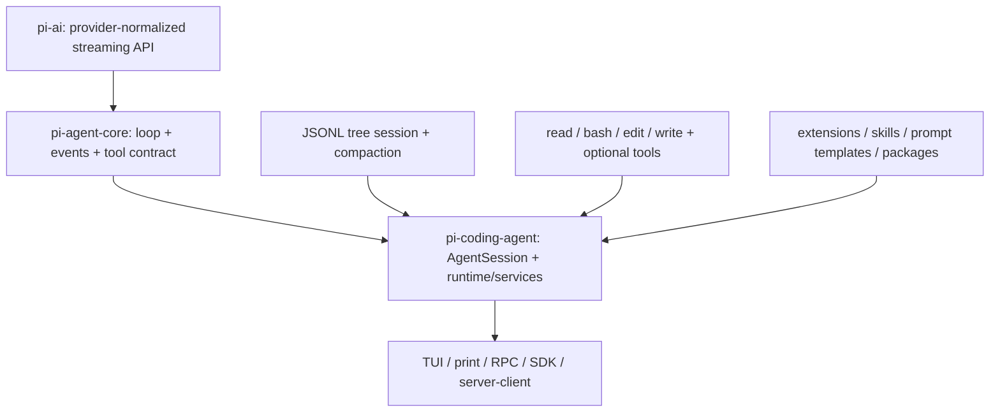
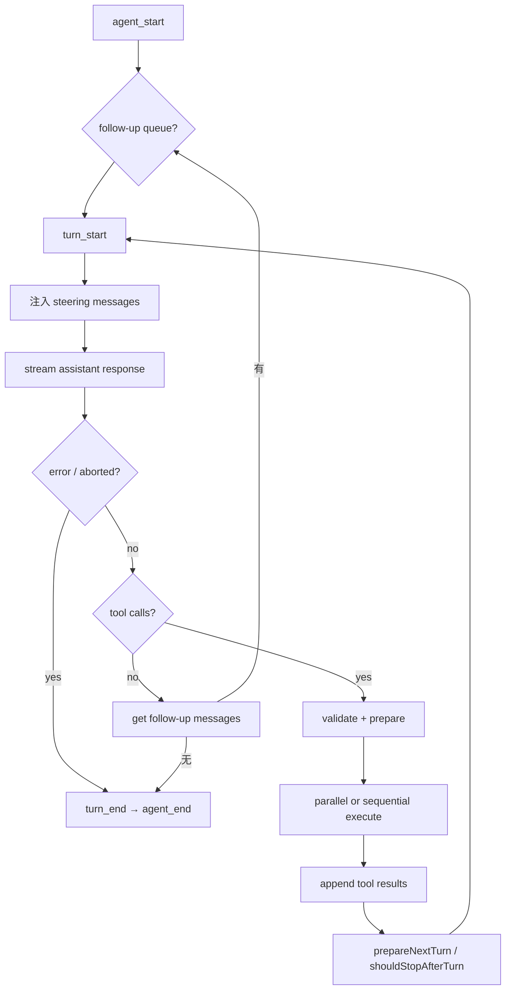
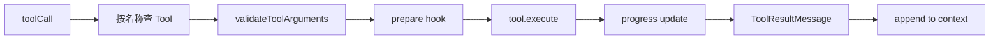
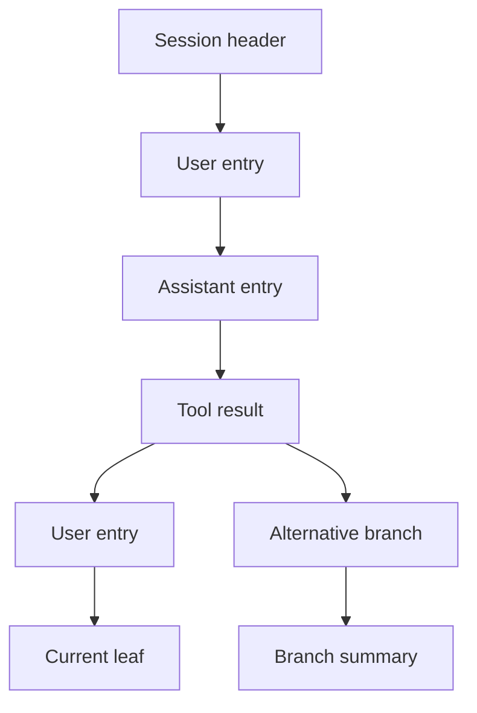

# pi-agent 源码研究：极小 Loop、可组合 Harness 与树形 Session

> **Freshness metadata**
> - `last_verified`: `2026-08-24`
> - `version_scope`: `dcd461925db2edf69a43c8135db1180d418afd54`
> - `source_type`: `official-repository + source-audit`
> - `stability`: `fast-moving`

## 1. 项目身份

- **官方仓库**：[earendil-works/pi-mono](https://github.com/earendil-works/pi-mono)
- **固定快照**：[`dcd4619`](https://github.com/earendil-works/pi-mono/tree/dcd461925db2edf69a43c8135db1180d418afd54)
- **主要语言与运行时**：TypeScript；仓库要求 Node.js `>=22.19.0`
- **当前包名**：`@earendil-works/pi-*`。旧资料中的 `badlogic/pi-mono` 与 `@mariozechner/pi-*` 属于历史命名，阅读时应先核对链接和 package scope。

pi 不是只有一个 CLI。monorepo 至少分为统一模型 API、Agent Core、Coding Agent Harness、TUI、Web UI、session backend/protocol/client/server 等层。最重要的阅读方法是：**先看小而纯的 `pi-agent-core`，再看 `pi-coding-agent` 如何补齐 session、tools、extensions、compaction 与多种交互模式。**

## 2. 架构分层



| 层 | 主要职责 | 不应承担的职责 |
|---|---|---|
| `pi-ai` | provider/model 统一、流事件、消息与 tool schema | coding workflow |
| `pi-agent-core` | turn loop、stream、tool dispatch、steering/follow-up | 文件系统、Git、TUI |
| `pi-coding-agent` | coding tools、session、compaction、extensions、运行模式 | provider 私有协议 |
| TUI/Web/RPC | 输入、展示、脚本/嵌入接口 | 成为执行状态唯一事实源 |

## 3. Agent Core：双层循环

[`packages/agent/src/agent-loop.ts`](https://github.com/earendil-works/pi-mono/blob/dcd461925db2edf69a43c8135db1180d418afd54/packages/agent/src/agent-loop.ts) 是理解 pi 的最佳入口。



### 3.1 外层与内层各解决什么

- **内层循环**：只要还有 tool calls 或 steering messages，就继续一次模型—工具迭代。
- **外层循环**：当 Agent 原本要停下时，再检查 follow-up queue；有新消息则重新进入内层。

steering 与 follow-up 的语义不同：

- steering 是运行期间插入、在下一次 assistant response 前消费的用户方向修正；
- follow-up 是 Agent 正常结束边界之后排队的新工作。

这比把所有异步输入都塞进一个 messages 数组更清楚，因为它保留了“何时允许干预”的调度语义。

### 3.2 EventStream 是稳定 API

`agentLoop()` 返回 `EventStream<AgentEvent, AgentMessage[]>`，事件包括 agent/turn/message/tool execution 的开始、更新和结束。UI、SDK 或持久化层消费事件，而不是侵入 Loop 内部。

事件的价值不只是逐 token 显示：

1. 能精确区分 partial assistant message 与 final message；
2. tool start/update/end 可映射进度；
3. abort/error 具有明确终态；
4. 同一个核心可被 TUI、RPC 与嵌入式 SDK 复用。

## 4. 模型边界：只在最后一步转换

Core 全程使用 `AgentMessage[]`；只有调用模型前才：

1. 执行可选 `transformContext`；
2. 调用 `convertToLlm` 转换为 provider-compatible messages；
3. 组装 system prompt、messages、tools；
4. 每次请求重新解析 API key，以支持短期凭证；
5. 调用可替换 `streamFn`。

这种设计保留 Harness 私有消息，例如 extension message、compaction marker 或自定义 UI 事件；它们不必污染 provider API 类型。转换函数必须决定哪些消息真正进入模型上下文。

## 5. 流式消息状态机

模型返回 `start` 后，partial assistant message 先加入 context；text/thinking/toolcall delta 到来时替换最后一条 partial；`done` 或 `error` 时再以 final result 覆盖。

必须维护的不变量：

- `message_start` 与 `message_end` 成对；
- context 中只有一个对应本次请求的 assistant 占位；
- error 也是 final message，不应丢掉已知 usage/partial 信息；
- tool calls 只从最终 assistant message 解析执行。

## 6. Tool 执行：并行不是默认正确答案

pi 支持全局 `toolExecution` 策略，也支持工具自己的 `executionMode: sequential`。一批 calls 中只要存在 sequential tool，就走顺序路径；否则可并行执行。



### 6.1 截断响应保护

当 assistant `stopReason === "length"` 时，pi 会把该消息中的**全部 tool calls 标记为失败而不是执行**。原因是流式 JSON salvage 可能让被截断的参数仍然“能解析且通过 schema”，但语义已经不完整。这个保护比单纯 JSON Schema 校验更接近真实执行风险。

### 6.2 ToolResult 是协议对象

错误、文本、图片、metadata 与 `toolCallId` 都要归一成 tool result message 再写回 context。Loop 不依赖某个 bash/read 工具的内部异常类型，下一轮模型也能看到结构化失败事实。

## 7. Agent 类与 AgentSession 的分工

`packages/agent/src/agent.ts` 提供有状态 Agent wrapper：持有当前 state、工具、消息和 steering/follow-up queue。Coding Agent 的 [`AgentSession`](https://github.com/earendil-works/pi-mono/blob/dcd461925db2edf69a43c8135db1180d418afd54/packages/coding-agent/src/core/agent-session.ts) 则把它扩展成完整产品 Harness。

`AgentSession` 负责：

- model/thinking/tool 激活状态；
- session manager 与消息落盘；
- prompt 入口、abort/retry 与 auto-compaction；
- extension runner 与 hook 生命周期；
- tool registry、prompt snippet/guideline；
- branch/fork/resume/export；
- usage/cache/cost 统计；
- 向 TUI/RPC/SDK 广播 session events。

文件很大并不代表所有逻辑写在一个函数里：新版本又把 cwd 绑定的 services、session runtime、model runtime、resource loader、package manager、tools 与 compaction 拆成独立模块。审阅时应同时检查 orchestration 类和这些实际 owner。

## 8. Coding Tools 与 Executor

默认激活工具是 `read`、`bash`、`edit`、`write`；另有 `grep`、`find`、`ls` 等可选工具。工具由 definition registry 和 runtime wrapper 分层：

| 层 | 作用 |
|---|---|
| Tool definition | 名称、schema、描述、prompt snippet/guideline |
| Allow/Deny selection | 决定本 session 对模型暴露哪些工具 |
| Runtime wrapper | extension hook、事件、异常归一、输出裁剪 |
| Operation | 实际文件或进程 I/O，可被自定义 runtime 覆盖 |

`bash-executor` 与 tool output truncation 是两个不同环节：前者管理进程执行，后者约束进入 UI/模型的体积。生产实现还应单独增加 deadline、child process tree 清理、cwd fence 和资源限额。

## 9. Session：JSONL 中的树，而非线性聊天

[`session-manager.ts`](https://github.com/earendil-works/pi-mono/blob/dcd461925db2edf69a43c8135db1180d418afd54/packages/coding-agent/src/core/session-manager.ts) 用 JSONL 保存 session header 与 entries；entry 通过 `id`、`parentId` 形成树。



由此自然支持：

- 在同一文件里切换 branch；
- 从历史 leaf 创建新的 session fork；
- clone/export 当前 branch；
- 对放弃分支生成 branch summary；
- 按当前 leaf 重建 Agent context。

线性数组通常需要复制整段历史才能 fork；树结构只需改变 parent/leaf 关系，但所有投影函数都必须明确“当前 branch”而非遍历全部 entries。

## 10. Compaction：摘要加近期尾部

默认设置在固定快照中是 `reserveTokens: 16384`、`keepRecentTokens: 20000`。触发判断是：当前 context tokens 超过 `contextWindow - reserveTokens`。

流程并非把前 N 条消息随意截掉：

1. 估算 entries 的 token；
2. 从后向前寻找约保留 `keepRecentTokens` 的合法 cut point；
3. 不在 tool result 前切断，保证 tool call/result 成对；
4. 对较旧前缀生成 summary；
5. 提取 read/write/edit 等文件操作事实；
6. 写入 compaction entry；
7. 从新 checkpoint + retained tail 重建 Agent 状态。

还支持 split-turn compaction：cut point 可以落在 assistant message，但它后面的 tool results 必须一起保留。branch summary 与 compaction 共享摘要请求的 retry choke point，并给摘要请求新的 routing id，避免和主对话缓存/路由身份混用。

## 11. Extensions、Skills 与 Packages

pi 把定制面分为多类：

- **extensions**：注册工具、命令、事件处理和 UI 行为的可执行扩展；
- **skills**：按约定发现的说明和资源，按需进入 context；
- **prompt templates**：参数化常用指令；
- **themes**：纯展示；
- **packages**：分发并组合上述资源。

必须避免把它们都叫“插件”：Skill 更接近可加载知识与流程，Tool 是可执行协议，Extension 是运行时代码，Package 是交付单元。其信任模型和版本治理不同。

## 12. 多种运行模式

同一 AgentSession 可用于：

| 模式 | 特点 | 验证重点 |
|---|---|---|
| Interactive TUI | 流式 UI、快捷键、branch/permission 交互 | event 顺序、取消、重绘 |
| Print/headless | 单任务输出，适合脚本 | exit code、结构化输出、无 TTY |
| RPC | 外部进程控制 session | request id、backpressure、生命周期 |
| SDK | 直接嵌入代码 | resource cleanup、typed events |
| Server/client | 将 session backend 与客户端分开 | 认证、并发、断线恢复 |

Core 没有把 readline/TUI 写进 Loop，因此这些模式不是复制五套 Agent 实现。

## 13. 错误、取消与重试

错误要按层处理：

- model stream error/aborted：结束当前 turn 和 agent；
- context overflow：交给 compaction，不进入普通 provider retry；
- tool 参数失败：生成 error ToolResult，不运行 executor；
- tool 执行失败：完成 tool event 并回填模型；
- compaction/branch summary 短暂失败：走独立摘要 retry；
- 用户 abort：同时终止主响应、compaction 或 branch summary 的 AbortController。

特别注意 streaming 状态下延迟插入某些自定义消息，避免破坏 provider 要求的 `tool_use` / `tool_result` 邻接顺序。

## 14. 可观测性

一次完整 trace 至少关联：session file/id、entry id/parent id、agent turn、message、tool call、model/provider、tokens/cost/cache 和 compaction boundary。pi 的事件与 JSONL entry 已提供大部分锚点；部署层仍应增加 wall time、queue time、tool timeout、process exit 与资源使用。

## 15. 源码阅读索引

| 文件 | 研究问题 |
|---|---|
| [`packages/agent/src/agent-loop.ts`](https://github.com/earendil-works/pi-mono/blob/dcd461925db2edf69a43c8135db1180d418afd54/packages/agent/src/agent-loop.ts) | 双层 loop、stream、tool dispatch |
| [`packages/agent/src/agent.ts`](https://github.com/earendil-works/pi-mono/blob/dcd461925db2edf69a43c8135db1180d418afd54/packages/agent/src/agent.ts) | stateful wrapper 与消息队列 |
| [`packages/coding-agent/src/core/agent-session.ts`](https://github.com/earendil-works/pi-mono/blob/dcd461925db2edf69a43c8135db1180d418afd54/packages/coding-agent/src/core/agent-session.ts) | 产品 Harness orchestration |
| [`packages/coding-agent/src/core/session-manager.ts`](https://github.com/earendil-works/pi-mono/blob/dcd461925db2edf69a43c8135db1180d418afd54/packages/coding-agent/src/core/session-manager.ts) | JSONL tree、branch、fork |
| [`packages/coding-agent/src/core/compaction/compaction.ts`](https://github.com/earendil-works/pi-mono/blob/dcd461925db2edf69a43c8135db1180d418afd54/packages/coding-agent/src/core/compaction/compaction.ts) | 阈值、cut point、summary、file tracking |
| `packages/coding-agent/src/core/tools` | read/bash/edit/write 与输出约束 |
| `packages/coding-agent/src/core/extensions` | extension discovery/hook/runtime |
| `packages/coding-agent/src/core/sdk.ts` | 嵌入式构造入口 |

## 16. 与现有开源解读的交叉核验

公开的 `pi-mono-docs` 与 `ai-agent-architectures` 对 core/coding-agent 的层次、AgentSession 和扩展面提供了有用导航，但版本更新很快。本文采用的方法是：先用这些解读定位问题，再回到固定 commit 的 `agent-loop.ts`、`agent-session.ts`、`session-manager.ts` 与 compaction 源码确认；包名、默认值、循环细节以源码为准。

## 17. 值得学习与不应照搬

### 值得学习

1. 小型纯 Loop 与大型产品 Harness 分离。
2. 在 LLM boundary 才做消息转换。
3. steering 与 follow-up 两种队列语义。
4. 对截断 tool arguments 的明确禁执行规则。
5. JSONL tree 让 branch/fork/compaction 具备可审计结构。
6. TUI、RPC、SDK 共享 typed events。

### 不应直接照搬

1. 默认 tool 集不是完整的权限或 sandbox 策略。
2. 单个 `AgentSession` 的复杂度需要结合团队维护能力评估。
3. 默认 compaction token 数适合的模型窗口和任务分布并不普适。
4. extension 执行代码与 skill 文本的供应链风险不同，部署前要独立治理。

## 18. 未验证项

- 当前 server/session-backend 在大规模并发与断线恢复下的完整一致性；
- 各 provider 对 thinking、tool delta、usage 与 abort 的等价程度；
- Windows/Linux/macOS bash 和文件语义的全部差异；
- 第三方 extensions 的隔离、签名与更新策略；
- 长 session 中 JSONL 文件增长、索引和迁移成本。

## 19. 最终抽象

```text
Provider-normalized Stream
  -> minimal Agent Loop
  -> typed events and ToolResults
  -> AgentSession harness
  -> JSONL session tree + compaction checkpoints
  -> tools / extensions / skills
  -> TUI | print | RPC | SDK | server-client
```

pi 的价值不在于“代码少”，而在于它把最小 Loop 的责任压得很窄，再把真实 Coding Agent 所需的复杂度放到可替换的 Harness 层中。
