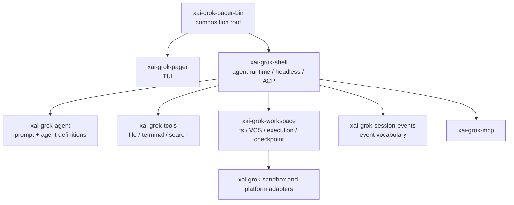
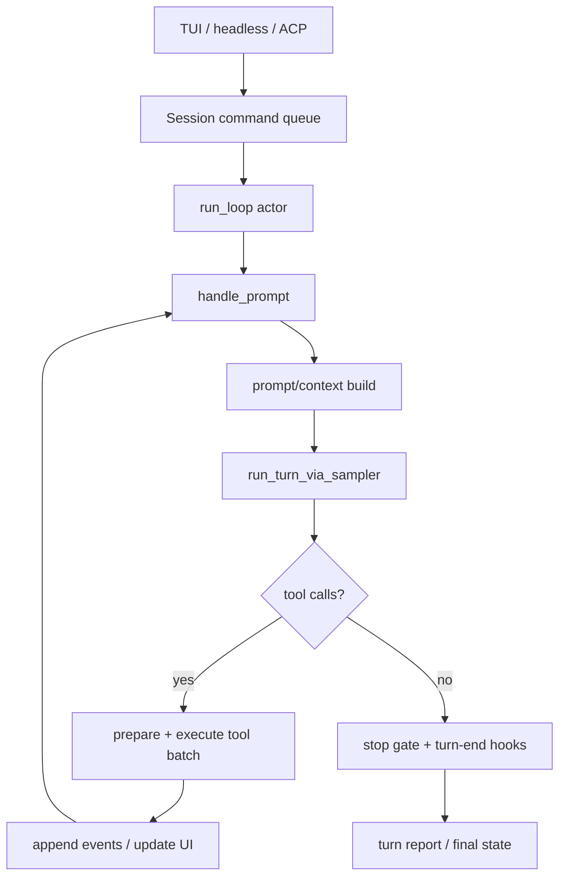
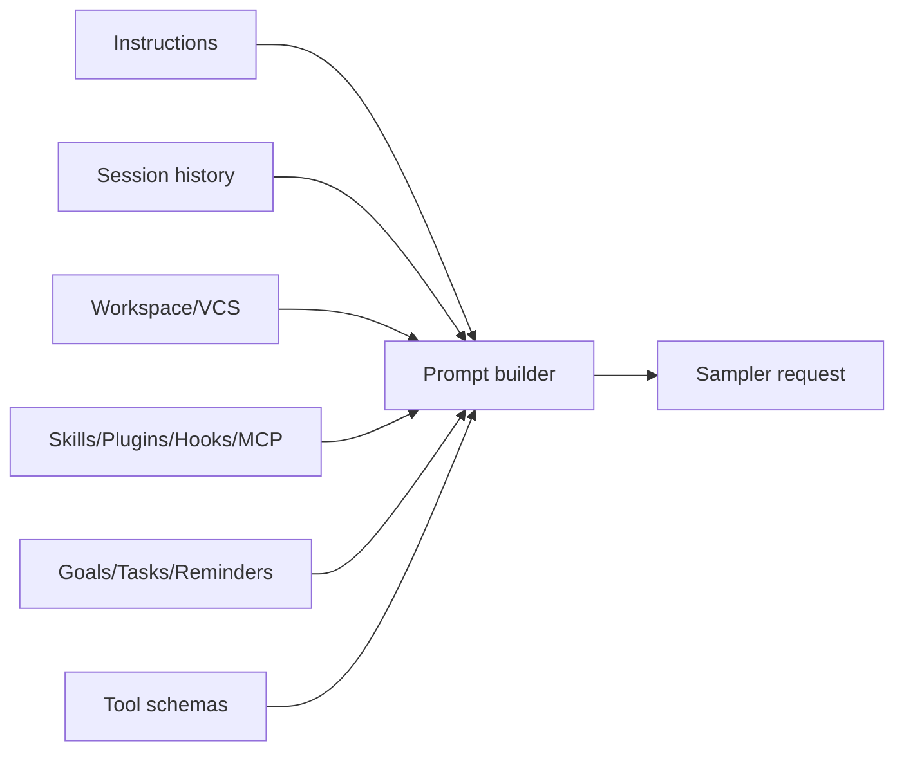
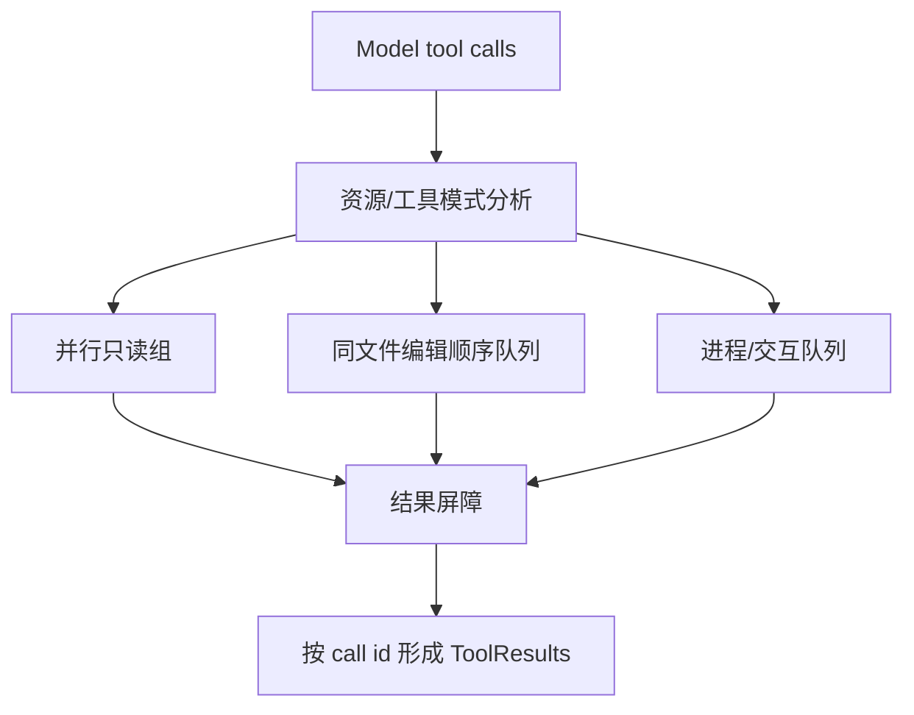
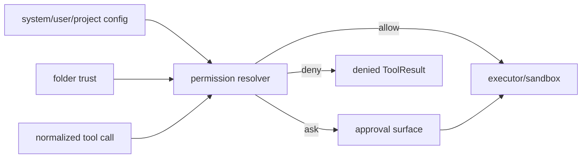
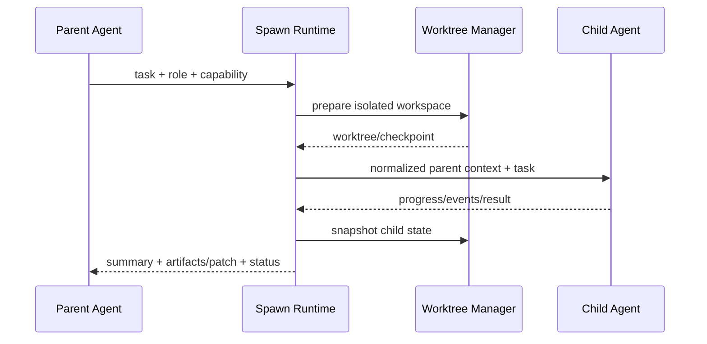

# Grok Build 源码研究：Rust Agent Runtime、并行工具与 Worktree Subagent

> **Freshness metadata**
> - `last_verified`: `2026-08-24`
> - `version_scope`: GitHub `07b2f7144fd5c5c9d3dd1966937a87852d2dbdb8`；上游 monorepo `SOURCE_REV=956313d459bee15ae8f17bf73e0633605e18dddd`
> - `source_type`: `official-repository + official-documentation + source-audit`
> - `stability`: `fast-moving / periodically-synced`

## 1. 为什么替换 Grok-1 Model Backend 研究

本章研究的是用户指定的 [xai-org/grok-build](https://github.com/xai-org/grok-build)，即真实 Coding Agent Harness，而不是 Grok-1 基础模型推理后端。两者解决的问题不同：

| Grok-1 模型后端 | Grok Build Agent Harness |
|---|---|
| 权重、张量、推理并行、KV cache | context、agent loop、tools、permissions、session、subagents、TUI |
| 解释模型如何生成 token | 解释 token 如何被解析成动作并可靠执行 |
| 不拥有工作区与审批 | 直接管理文件、命令、diff、checkpoint 与交互 |

因此现代 Agent 架构目录移除了原 `Model Backend` 文件夹，用本章研究替代；基础模型 cache 也不再被误写成 Agent Memory。

## 2. 研究身份与发布边界

- **固定 commit**：[`07b2f71`](https://github.com/xai-org/grok-build/tree/07b2f7144fd5c5c9d3dd1966937a87852d2dbdb8)
- **上游身份**：仓库由 SpaceXAI monorepo 定期同步，根目录 `SOURCE_REV` 记录对应的完整 monorepo commit。
- **主要语言**：Rust，workspace 使用 edition 2024。
- **产品表面**：fullscreen TUI、headless scripting/CI、Agent Client Protocol（ACP）嵌入。
- **许可边界**：一方代码 Apache-2.0；仓库明确列出从 Codex、OpenCode 等移植的第三方实现，阅读和复用时要保留各自 notice。

官方开源说明把 context assembly、model response parsing、tool dispatch、TUI、skills/plugins/hooks/MCP/subagents 作为公开源码的核心范围。本文只确认固定快照中可追踪的实现，不把托管服务行为自动外推到仓库代码。

## 3. Crate 拓扑



| Crate | 主要所有权 |
|---|---|
| `xai-grok-pager-bin` | wiring/composition root，不承载全部业务 |
| `xai-grok-pager` | scrollback、prompt、modal、plan/diff review、rendering |
| `xai-grok-shell` | session actor、turn、sampler、tool dispatch、headless/ACP |
| `xai-grok-agent` | agent config、prompt 构建、发现与 system reminders |
| `xai-grok-tools` | 终端、文件编辑、搜索等工具及 bridge |
| `xai-grok-workspace` | 文件系统、VCS、命令、checkpoint、worktree、folder trust |
| `xai-grok-session-events` | 持久化/传输的 session 事件类型 |

根 `Cargo.toml` 是生成文件；真正修改依赖应从每个 crate 的 manifest 和同步流程入手。这也说明开源树是 monorepo closure 的投影，不适合凭目录总数判断核心复杂度。

## 4. Session Actor 与命令循环

`xai-grok-shell/src/session/acp_session_impl/run_loop.rs` 是 session actor 的命令泵。它接收 prompt、cancel、interjection、配置更新、MCP/goal/workflow/subagent 等命令，并把状态变更串行化到 session owner。



actor 的主要价值是明确**谁可以改变 session 状态**。模型流、工具任务、UI 输入、后台通知可以并发发生，但持久化顺序、当前 turn、取消 token 和 prompt queue 不能由多个线程随意改写。

## 5. Turn 主链

`turn.rs` 的 `handle_prompt` 管理一次外部请求，`sampler_turn.rs` 管理一次模型采样与流处理，`tool_calls.rs` 管理工具批次。一次典型链路是：

1. 接收并规范化 prompt/attachments；
2. 载入 agent、workspace、model、skills、hooks、MCP 与 session facts；
3. 构建 system/user context；
4. 调 sampler，消费 reasoning/text/tool-call 流；
5. 将 tool calls 解析、验证和 prepare；
6. 依据依赖/资源冲突形成执行批次；
7. 写入 tool request/result 与 UI update；
8. 有新工具结果则继续采样；
9. 通过 stop gate、turn-end hooks、recap/goal 检查后结束。

### 5.1 控制流不是一个 while true

Grok Build 把大循环拆为多个政策接缝：

- prompt queue / queue mutation；
- interjection；
- model switch 与 auth retry；
- rate-limit wait；
- stop gate；
- turn-end hooks；
- goal planner/verifier/summarizer；
- recap、memory dream、reminders；
- rewind/checkpoint。

这种拆分让每种“继续”有原因码与 owner，但文件/状态面也随之增大。架构评审要检查这些接缝的顺序，而不是只寻找一个名为 `agent_loop` 的函数。

## 6. Context Assembly

模型请求包含的内容由 `xai-grok-agent` 与 shell 的 `prompt_build` 共同组织，来源可能包括：

- agent persona 与 mode（plan/execute 等）；
- 用户/开发者/项目指令和 `AGENTS.md`；
- workspace 与 VCS 状态；
- tool definitions；
- skills、plugins、hooks、MCP snapshot；
- parent/subagent context；
- goal/task/reminder；
- session history、recap、compaction summary；
- 运行中任务通知与 interjection。



Context Engineering 的核心不是“尽量全部放进去”，而是确定优先级、可见性、token budget 与 compaction 后的重建规则。Grok Build 通过 snapshot/recap/reminder 等结构化层保留长期任务事实，避免只依赖聊天文本。

## 7. Tool Dispatch 与并发调度

`tool_calls.rs` 的 `execute_tool_calls` 与 `prepare_tool_call` 是关键入口。Tool dispatch 需要完成：

1. tool name 到实现的解析；
2. arguments 解析与验证；
3. permission/approval；
4. path/workspace 规范化；
5. 批次调度与并发；
6. progress/result/error 事件；
7. session context 回填。

### 7.1 为什么要做冲突感知

多个只读搜索可以并行，而同一文件上的多个 edit 必须保持确定顺序；终端命令还可能与文件编辑共享外部状态。实现中的 dispatch 层会对批次进行分组，并对同文件编辑串行化。



并发的正确性条件包括：结果仍和原 call id 对应；取消传播到所有未完成任务；一次失败不会让其他 tool result 永远缺席；冲突资源有稳定顺序；UI 进度与最终事件不重复。

## 8. Workspace、Diff 与 Checkpoint

`xai-grok-workspace` 把宿主操作从模型协议中分离，拥有：

- filesystem adapter；
- VCS 状态与 diff；
- command execution；
- workspace discovery/trust；
- checkpoint/rewind；
- linked/standalone/CoW worktree；
- subagent worktree snapshot 与 rehydrate。

这使 TUI 的 diff review、session rewind 与 subagent isolation 可以基于同一 workspace truth。Checkpoint 不是聊天书签，而是文件/VCS 可恢复点；恢复时必须同时处理 session 事件与 workspace 状态，避免界面历史和磁盘内容错位。

## 9. Permission、Folder Trust 与 Sandbox

权限解析支持 allow/deny/ask 等规则，并带来源 provenance。项目级 `.grok/config.toml`、`.claude/settings.json` 兼容配置、MCP、plugins、hooks 与 subagent definitions 都可能来自工作区，因此先有 folder trust，再允许这些项目配置影响执行。



四个概念要分开：

- **discovery**：找到了项目配置；
- **trust**：允许项目配置参与解析；
- **permission**：某个动作 allow/ask/deny；
- **sandbox**：获准动作的 OS/runtime 隔离。

任一层都不应由 prompt 中一句“请谨慎”替代。

## 10. Session Events 与持久化

`xai-grok-session-events` 定义持久化事件词汇，`events.jsonl` 构成可回放记录。事件范围包括消息、工具、权限、MCP、goal classifier/planner/strategist/verifier/summarizer 等。

事件溯源带来：

1. TUI/ACP 能从同一事实重建状态；
2. tool/approval/goal 决策可审计；
3. rewind、resume 和 recap 有确定输入；
4. 运行指标可按 session/turn/tool 关联。

要避免把所有高频 token delta 都永久写入同一日志；live rendering event 与 durable semantic event 应有不同 retention 策略。

## 11. Compaction 与 Recap

固定快照中 compaction 实现位于 session 层，并包含两阶段处理与自动压缩测试。它与 `recap.rs` 的职责不同：

- compaction 解决模型 context window 与历史投影；
- recap 为用户/系统提供任务进展和关键状态的结构化总结；
- memory dream 处理另一类后台记忆加工；
- turn summary 是单轮级别的摘要。

多种摘要如果没有类型与边界，很容易互相覆盖。Grok Build 通过不同模块和 event type 保留用途差异；设计自己的 Harness 时也应记录 summary 的 source、range、version 与是否可替代原事实。

## 12. Subagent：递归 Agent 加隔离策略

Grok Build 的 subagent 不只是“再调用一次模型”。`spawn.rs` 与 workspace config 表明它包含：

- 子 Agent role/definition 解析；
- parent context 规范化；
- recursion depth 限制；
- 独立 prompt/session owner；
- capability mode；
- shared、copy-on-write worktree 或 sandbox/container 隔离模式；
- 并行任务、状态与取消；
- 完成后结果/patch 汇总；
- worktree snapshot、销毁与恢复。



隔离模式决定并行语义：共享工作树速度快但写冲突高；worktree 隔离更清晰但需要 merge/cleanup；container 又增加环境与依赖同步成本。

## 13. Skills、Plugins、Hooks 与 MCP

| 扩展面 | 作用 | 生命周期/风险 |
|---|---|---|
| Skills | 提供可加载流程与知识 | context 污染、版本漂移 |
| Plugins | 注册运行时能力/UI/命令 | 本地代码执行、依赖供应链 |
| Hooks | 在生命周期边界检查/修改行为 | 顺序、超时、阻断语义 |
| MCP | 连接外部 tool/resource/prompt server | 远程信任、OAuth、schema 漂移 |
| Subagents | 委派独立任务 | 预算、递归、workspace 冲突 |

统一“发现、来源、启用、信任、超时、卸载、审计”字段，比单独为每种扩展写一套无关联配置更利于治理。

## 14. TUI、Headless 与 ACP

官方表面有三种：

- fullscreen TUI：鼠标/键盘交互、plan review、inline diff、scrollback；
- headless：`-p` 运行并支持结构化 streaming output；
- ACP：作为 editor 或其他应用中的 Agent server。

三种模式共用 shell/session runtime，差异在输入输出 adapter。正确性验证应覆盖：

| 能力 | TUI | Headless | ACP |
|---|---|---|---|
| permission ask | modal | 明确策略/失败 | protocol request |
| progress | render updates | streaming JSON | ACP updates |
| cancel | keyboard | signal | protocol cancel |
| final output | conversation | stdout/result | response event |
| session persistence | events.jsonl | 可配置 | client/session mapping |

## 15. Goal、Workflow 与长运行任务

源码存在 goal support、workflow、tasks cancel、notifications、reminders 和 status line。这里的架构重点是把长期工作从“单次模型一直不结束”升级为：

- 任务有显式状态；
- 后台执行有 owner/session id；
- progress 可查询；
- cancel 可传播；
- verifier/stop gate 决定完成质量；
- 结果通过事件重新进入主 Agent，而不是偷偷修改 context。

## 16. 源码阅读索引

| 文件/目录 | 研究问题 |
|---|---|
| [`README.md`](https://github.com/xai-org/grok-build/blob/07b2f7144fd5c5c9d3dd1966937a87852d2dbdb8/README.md) | 产品与 crate 边界、同步与许可 |
| `crates/codegen/xai-grok-pager-bin` | composition root |
| `xai-grok-shell/src/session/acp_session_impl/run_loop.rs` | session actor command loop |
| `.../turn.rs` | prompt/turn orchestration |
| `.../sampler_turn.rs` | model streaming state machine |
| `.../tool_calls.rs` | tool prepare、batch 与 result |
| `.../spawn.rs` | subagent runtime |
| `.../compaction.rs` | history compaction |
| `.../hooks_plugins.rs` | hooks/plugins lifecycle |
| `crates/codegen/xai-grok-workspace/src` | fs/VCS/execution/checkpoint/worktree |
| `crates/codegen/xai-grok-pager/docs/user-guide` | 官方行为契约 |

固定链接示例：[`xai-grok-shell`](https://github.com/xai-org/grok-build/tree/07b2f7144fd5c5c9d3dd1966937a87852d2dbdb8/crates/codegen/xai-grok-shell)、[`xai-grok-tools`](https://github.com/xai-org/grok-build/tree/07b2f7144fd5c5c9d3dd1966937a87852d2dbdb8/crates/codegen/xai-grok-tools)、[`xai-grok-workspace`](https://github.com/xai-org/grok-build/tree/07b2f7144fd5c5c9d3dd1966937a87852d2dbdb8/crates/codegen/xai-grok-workspace)。

## 17. 事实、推断与未知

### CONFIRMED

- Rust crate 分层、TUI/headless/ACP 三种入口；
- session actor、turn/sampler/tool-call 模块边界；
- permissions/folder trust/sandbox/worktree/checkpoint 实现面；
- skills/plugins/hooks/MCP/subagents 的源码和用户指南；
- 同步仓库的 `SOURCE_REV` 身份；
- 第三方移植代码有 notice。

### INFERRED

- actor 模型的主要目标之一是把并发输入串行化到 session owner；
- worktree subagent 是为并行写冲突、恢复和隔离提供的工程解法；
- 多种 summary 类型是为了避免将 context 压缩、用户 recap 与长期记忆混为一谈。

### UNKNOWN

- 托管服务与本地开源版在 feature flags、telemetry、远程 workflow 上的全部差异；
- 所有平台 sandbox backend 的等价隔离强度；
- 极大规模并行 subagent 的生产调度、配额和远端控制面；
- monorepo 未同步部分的实现与开源 closure 之间是否还有行为差异。

## 18. 值得学习与谨慎迁移

### 值得学习

1. composition root、TUI、runtime、tools、workspace 分 crate。
2. session actor 对并发状态的单所有者约束。
3. tool batch 的冲突感知，而不是盲目 `join_all`。
4. permission、trust 与 sandbox 分层。
5. subagent worktree 可 snapshot/rehydrate。
6. `SOURCE_REV` 让导出仓库可追溯到 monorepo。

### 谨慎迁移

1. 大量政策接缝会增加状态组合和回归矩阵。
2. 从其他项目移植实现时必须同步 notice、修订记录与上游漏洞。
3. worktree/subagent 清理失败会占用磁盘并留下隐含状态。
4. TUI 行为不应反向定义 headless/ACP 的核心语义。
5. 开源同步树不是完整托管系统，分析结论必须标注 product boundary。

## 19. 最终心智模型

```text
TUI | Headless | ACP
  -> Session actor / prompt queue
  -> Context + agent definition + extensions
  -> Sampler turn
  -> conflict-aware Tool batches
  -> Workspace executor / permission / sandbox
  -> events.jsonl + checkpoint + recap/compaction
  -> optional Subagents in shared/worktree/container isolation
  -> turn-end hooks / goal verification / final result
```

Grok Build 最值得研究的部分不是绑定哪个 Grok 模型，而是它如何把一次模型输出变成可审批、可并行、可恢复、可回放并能跨 TUI/headless/ACP 使用的工程执行过程。
