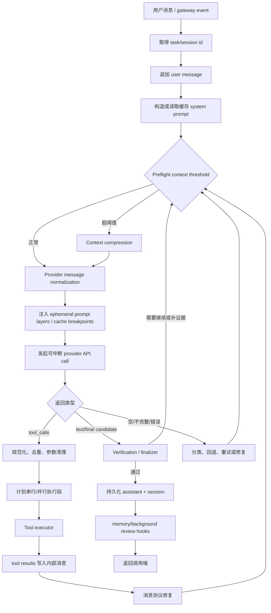
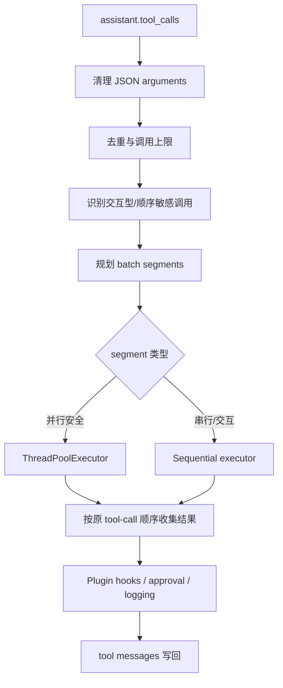
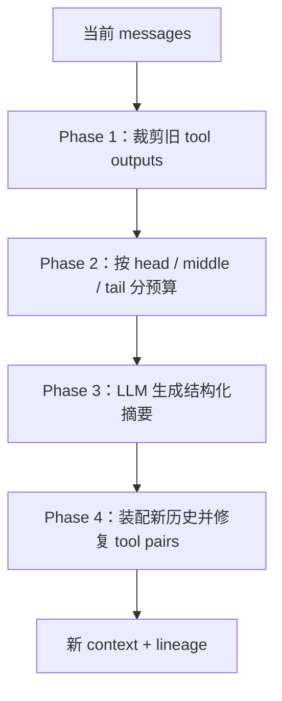
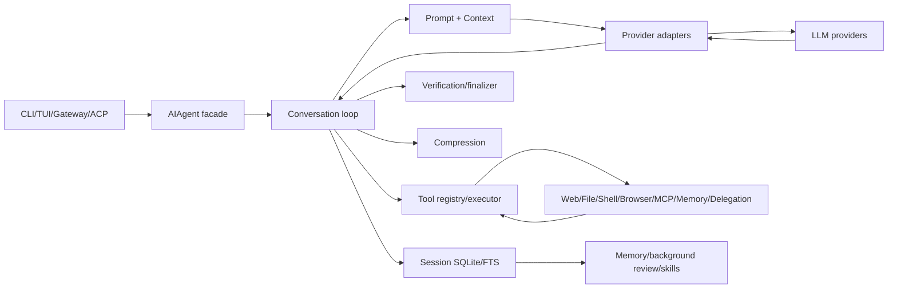
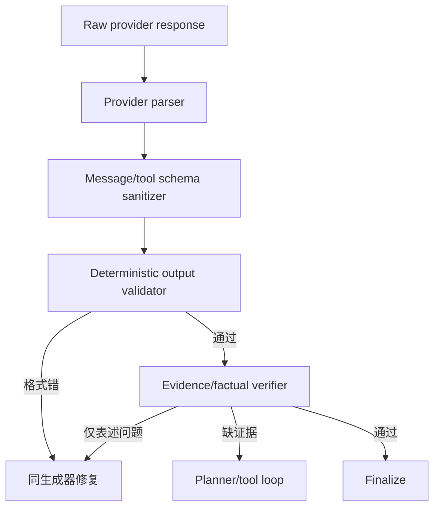

# NousResearch Hermes Agent 源码精读：长运行、自改进 Agent Harness

> 研究对象：[`NousResearch/hermes-agent`](https://github.com/NousResearch/hermes-agent)
> 固定源码快照：[`760112adb6458417da8614d2269e5325f0739ed5`](https://github.com/NousResearch/hermes-agent/tree/760112adb6458417da8614d2269e5325f0739ed5)
> 快照日期：2026-07-25
> 定位：Python 为主、支持多 provider、多工具、skills、持久 session、压缩和自改进的个人 agent harness。

## 0. 总体结论

Hermes Agent 与 Codex/Claude Code 相比更像“可自托管的长运行个人 agent”：

- 核心内部历史尽量保持 OpenAI-compatible message 形态；
- provider adapter 负责 OpenAI chat completions、Codex Responses、Anthropic 等差异；
- 工具通过 registry 自注册；
- 多工具调用可并发，也会为交互型/顺序敏感工具建立串行段；
- session 持久化到 SQLite，并有 FTS5 搜索；
- context compressor 同时做工具输出裁剪、head/middle/tail 选择、LLM 结构化摘要和消息结构修复；
- MEMORY/USER 常驻摘要与 session search 按需检索并存；
- skills 有较完整的 metadata、依赖、验证、信任和脚本规范；
- verification/finalizer 能在最终候选后继续补证据或重进循环；
- background review 可以把经验沉淀到 memory/skills。

Hermes 值得学习的核心不是“允许很多工具”，而是：

```text
Provider normalization
+ Tool registry/executor
+ Durable session
+ Compression and repair
+ Progressive skill loading
+ Verification continuation
+ Background improvement
```

---

## 1. 目录与模块边界

### 1.1 关键模块

| 层                  | 代表路径                                                      | 职责                                  |
| ------------------- | ------------------------------------------------------------- | ------------------------------------- |
| Agent facade        | `run_agent.py`                                                | `AIAgent`、兼容入口、生命周期编排     |
| Agent loop          | `agent/conversation_loop.py`                                  | 多轮模型/工具循环                     |
| 初始化              | `agent/agent_init.py`                                         | provider、tools、memory、config 装配  |
| Tool executor       | `agent/tool_executor.py`                                      | 串行/并行/分段执行                    |
| Tool registry       | `tools/registry.py`                                           | schema、handler、availability、自注册 |
| Context compression | `agent/context_compressor.py`、`conversation_compression.py`  | 预算、摘要、重建、修复                |
| Prompt              | `agent/prompt_builder.py`                                     | system/ephemeral/cache 等装配         |
| Provider adapters   | `agent/anthropic_adapter.py`、`codex_responses_adapter.py` 等 | wire format 互转                      |
| Session state       | `hermes_state.py` 等                                          | SQLite、FTS、迁移、lineage            |
| Memory              | `agent/memory_manager.py`、memory tools                       | MEMORY/USER、外部 provider            |
| Skills              | `skills/`、skill tooling/docs                                 | 发现、安装、验证、执行                |
| Background review   | `agent/background_review.py`                                  | 经验复盘和改进提案                    |
| Gateway/platforms   | `gateway/`                                                    | Telegram、Discord、Slack 等入口       |
| Tests               | `tests/` + `scripts/run_tests.sh`                             | 隔离测试与行为回归                    |

### 1.2 `run_agent.py` 很大，但正逐步做 facade

本快照 `run_agent.py` 仍然庞大，同时已有大量逻辑转移到：

- `conversation_loop.py`
- `tool_executor.py`
- `agent_runtime_helpers.py`
- `agent_init.py`
- `context_compressor.py`

并保留 forwarding methods 兼容旧调用。这个迁移说明：大型 agent 入口不应长期同时承担初始化、loop、工具、压缩、provider 修复和 UI。

---

## 2. Agent Chain 与 Loop

### 2.1 主链路

依据 [`agent-loop.md`](https://github.com/NousResearch/hermes-agent/blob/760112adb6458417da8614d2269e5325f0739ed5/website/docs/developer-guide/agent-loop.md)、`conversation_loop.py` 与 `run_agent.py`：



### 2.2 迭代预算

源码/文档中的默认值属于本快照行为：

- 主 agent 最大迭代预算较高，默认可到约 90；
- subagent 使用较小独立预算，默认约 50；
- provider API retry、compression retry、verification continuation 等还有自己的局部预算。

不应把所有 retry 都计为同一个整数，否则会出现：

- 一次 provider 网络重试耗尽整个工具步骤预算；
- 工具重复调用没有单独限制；
- validator 修复形成隐藏无限循环。

推荐预算模型：

```python
@dataclass
class LoopBudget:
    max_steps: int
    max_wall_time_ms: int
    max_model_attempts: int
    max_tool_retries_per_call: int
    max_replans: int
    max_validation_repairs: int
    max_compactions: int
```

### 2.3 内部消息格式

Hermes 倾向以 OpenAI 风格消息作为 provider-neutral internal representation：

```text
system
user
assistant(content and/or tool_calls)
tool(tool_call_id, content)
```

随后 adapter 转成：

- OpenAI Chat Completions；
- OpenAI/Codex Responses；
- Anthropic content blocks；
- 其他兼容 provider。

这比在业务 loop 中散布 `if provider == ...` 更易维护。

### 2.4 消息规范化与修复

`agent_runtime_helpers.py` 处理大量真实 provider 边界：

- 非法 role；
- 空 `tool_calls: []`；
- tool call 缺 name；
- orphan tool result；
- tool call 缺 result 时插入 stub；
- 重复 `tool_call_id`；
- 连续同 role 合并/拆分；
- reasoning-only message；
- provider-specific unsupported fields；
- Unicode surrogate/non-ASCII 问题；
- transcript 恢复后的重复；
- incomplete continuation；
- verification candidate 不应被错误合并。

这是生产 agent 与 demo loop 的显著差别：**历史记录本身也需要 schema repair**。

### 2.5 Provider fallback

错误分类会考虑：

- 429/rate limit；
- 5xx/transient；
- authentication；
- malformed stream；
- context window；
- unsupported field/schema；
- provider-specific finish reason；
- incomplete generation。

部分失败可以切换 credential/provider route，但必须避免重放已经产生副作用的 tool call。

---

## 3. Tool Registry 与调用路径

### 3.1 自注册

Hermes 的工具模块通常在 import 时调用：

```python
registry.register(
    name="my_tool",
    toolset="...",
    schema=MY_TOOL_SCHEMA,
    handler=my_tool,
    check_fn=_check_requirements,
)
```

`model_tools.py`/discovery 触发工具模块导入。文档明确把这称为 self-registering tools。

### 3.2 Registry entry

一个工具 entry 不只是 name/handler，可包含：

- OpenAI function-style schema；
- handler；
- `check_fn`；
- toolset；
- 环境变量/依赖；
- async 标记；
- 是否是 agent-intercept tool；
- platform/config availability；
- 可能的 plugin/trust 信息。

`get_definitions()` 只暴露当前可用工具。availability check 的结果可缓存；检查抛异常时视为不可用并记录，而不是让整个 agent 初始化失败。

### 3.3 工具定义示例

仓库 CONTRIBUTING 给出的模式：

```python
MY_TOOL_SCHEMA = {
    "type": "function",
    "function": {
        "name": "my_tool",
        "description": "...",
        "parameters": {
            "type": "object",
            "properties": {
                "param1": {"type": "string"},
                "param2": {"type": "integer", "default": 10},
            },
            "required": ["param1"],
        },
    },
}
```

值得借鉴的是 schema、handler、requirements check 在一个工具模块附近，registry/executor 保持通用。

### 3.4 Tool executor



关键点：

- 只有一个调用时直接执行；
- 多个安全调用可并发；
- 交互型或互相依赖工具串行；
- 混合批次切成 segment；
- 即使并发完成顺序不同，写回时保持原 call 顺序；
- worker thread 有追踪/取消；
- tool result 统一进入 transcript。

### 3.5 Agent-intercept tools

有些“工具”不是普通外部函数，而由 agent runtime 截获：

- todo/state 更新；
- memory；
- session search；
- delegation/subagent。

这样模型仍使用统一 tool-call interface，宿主可执行特殊状态变更。

### 3.6 参数清理与容错

Hermes 对真实模型输出做了很多修复：

- arguments 本应是 JSON string，但可能被 provider 二次编码；
- 可能有尾逗号/损坏结构；
- Responses 与 Chat Completions 的字段形态不同；
- function name 可能为空；
- 同一调用在 retry/resume 后重复出现；
- delegate call 数量需要额外上限；
- provider 可能报告 `finish_reason=tool_calls`，但数组为空。

原则是：

```text
可以确定性修复 -> 修复并记录
语义不明确 -> 返回模型可见错误
副作用可能已经发生 -> 先查 call id/幂等记录
```

### 3.7 工具错误结构

很多旧工具返回字符串/JSON string；从你的项目角度，建议进一步标准化：

```json
{
  "status": "partial",
  "data": { "items": [] },
  "error": null,
  "meta": {
    "tool": "search",
    "call_id": "call_...",
    "duration_ms": 123,
    "truncated": false,
    "source_ids": ["ev_1"]
  }
}
```

Provider adapter 最后再把它转为 tool message content。

### 3.8 Plugin hooks 与审批

工具执行链支持：

- 危险操作审批；
- plugin pre/post hooks；
- 结果规范化；
- 日志；
- toolset enable/disable；
- dependency lazy install/check；
- platform guard。

所有 DB/File/Browser/Code/MCP 工具应进入这条统一路径。

---

## 4. Skills：实现、调用和规范

### 4.1 Skill 目录

Hermes 的 skill 典型结构：

```text
skill-name/
├── SKILL.md
├── scripts/
├── references/
├── assets/
└── tests/ or verification metadata
```

### 4.2 Frontmatter

[`creating-skills.md`](https://github.com/NousResearch/hermes-agent/blob/760112adb6458417da8614d2269e5325f0739ed5/website/docs/developer-guide/creating-skills.md) 描述的元数据可覆盖：

```yaml
---
name: example-skill
description: What this skill does and when Hermes should use it.
version: 1.0.0
author: ...
license: MIT
platforms: [linux, macos, windows]
metadata:
  hermes:
    tags: [search, research]
    related: [...]
    requires:
      bins: [...]
      env: [...]
    fallback: ...
    config: ...
    blueprint: ...
---
```

具体字段随版本演进，读取本地 schema/文档是事实源。

### 4.3 Progressive disclosure

Hermes 不应把所有正文永久注入 system prompt：

1. 扫描 metadata；
2. 给模型可用 skill 摘要；
3. 模型/用户选中；
4. 读取 `SKILL.md`；
5. 按需访问 scripts/references；
6. 结果仍通过 tool/executor 或 shell。

### 4.4 Scripts 与路径 token

Skill 脚本执行需要：

- 基于 skill root 解析相对路径；
- 不依赖任意 cwd；
- 参数清楚；
- stdout/stderr/exit code 可观察；
- 环境依赖在 metadata 声明；
- secrets 通过 credential/env 注入；
- inline shell 受显式 opt-in；
- 文件路径做 containment。

### 4.5 Trust 与安全检查

Hermes skills 生态考虑：

- security scan；
- trust level；
- 外部下载/安装；
- inline shell；
- env/credential files；
- platform availability；
- verification。

Skills 会给模型执行说明和脚本入口，所以它是供应链边界，不应只校验 YAML 是否能 parse。

### 4.6 Skill 与 Tool 的选择

仓库 CONTRIBUTING 明确要求新增 tool 前先判断是否更适合 skill：

| 需求                   | Tool |      Skill |
| ---------------------- | ---: | ---------: |
| 原子读取/副作用        |    ✓ |            |
| 稳定结构化参数         |    ✓ |            |
| 需要权限/超时          |    ✓ |            |
| 多步骤最佳实践         |      |          ✓ |
| 文档/模板/参考资料     |      |          ✓ |
| 可组合调用多个现有工具 |      |          ✓ |
| 新外部 API 原子操作    |    ✓ | 可附 skill |

### 4.7 Self-improvement

Hermes 的 background review 可以观察经验并提出：

- memory 更新；
- skill 创建/改进；
- 失败模式总结。

正确设计应经过：

```text
候选经验
-> 去重/价值判断
-> 变更提案
-> 验证/审批
-> 应用
-> 回归 eval
```

不要让每次失败直接永久改写 skill。

---

## 5. RAG、Search 与检索

### 5.1 Hermes 的检索能力分层

Hermes 没有唯一固定的“一个向量库 RAG”，而是多来源检索：

- web/search toolsets；
- file tools；
- session FTS5；
- MEMORY/USER prompt memory；
- 可选 Hindsight/Honcho/mem0/Supermemory 等 memory backend；
- skills/references；
- browser；
- MCP/外部 integrations。

### 5.2 Session search

SQLite session store 使用 FTS5 支持：

- 按关键词找旧会话；
- 返回 session/message 摘要；
- 按需加载，不把所有历史常驻 prompt。

这是词法 session retrieval，不应和 embedding vector search 混称。

### 5.3 外部 memory provider

可选 provider 适合：

- semantic recall；
- user/profile memory；
- event/fact storage；
- 跨会话检索。

但 adapter 结果仍应转换为统一 evidence/memory item，避免 provider-specific dict 渗透整个 loop。

### 5.4 Evidence registry 仍应显式增加

Hermes 有 transcript、tool calls 和 verification，但若建设“每个回答都可溯源”的研究 agent，建议加入：

```python
@dataclass(frozen=True)
class EvidenceItem:
    evidence_id: str
    turn_id: str
    source_type: str
    source_uri: str
    locator: str | None
    excerpt: str
    content_hash: str
    retrieved_at: datetime
    tool_call_id: str
```

工具结果与 evidence 的关系：

- `ToolResult`：这次调用的执行状态；
- `EvidenceItem`：最终回答可引用的最小事实单元；
- 一个 ToolResult 可产生 0..N 个 EvidenceItem；
- empty/error ToolResult 不自动成为事实证据。

---

## 6. Context Compression

### 6.1 两个触发层

本快照文档/实现有不同阶段阈值：

- gateway/外围预检可在较高占用率（如约 85%）触发；
- agent loop 内可能在更保守占用（如约 50%）主动压缩。

这些数值是版本/配置相关，应从当前配置读取。重要的是分层：

```text
接近危险线前的预防性压缩
+ loop 内为后续工具调用预留空间的主动压缩
```

### 6.2 四阶段处理

根据 [`context-compression-and-caching.md`](https://github.com/NousResearch/hermes-agent/blob/760112adb6458417da8614d2269e5325f0739ed5/website/docs/developer-guide/context-compression-and-caching.md) 与 compressor 源码：



#### Phase 1：Prune

- 旧工具大输出优先瘦身；
- 最近 tail 保护；
- 保留识别工具结果所需元数据；
- 避免将大段原始输出带入摘要请求。

#### Phase 2：Budget selection

- head：任务起点、系统/初始目标；
- middle：压缩候选；
- tail：最近完整交互；
- `protect_last_n` 一类参数保护近期消息；
- 首部和尾部不应由简单 FIFO 随意丢失。

#### Phase 3：Structured LLM summary

摘要模板关注：

- Goal；
- Constraints；
- Progress；
- Decisions；
- Files/Artifacts；
- Failures；
- Next steps；
- Critical facts。

若已经存在 prior summary，新摘要应做增量更新，避免 summary-of-summary 快速退化。

#### Phase 4：Assemble/repair

- 插入结构化摘要；
- 保留头尾；
- 保证 assistant tool call 与 tool result 成对；
- 移除 orphan；
- 修复 provider role alternation；
- 建立 compression lineage。

### 6.3 为什么摘要后还要 repair

摘要模型可能保留语义，却破坏 wire protocol。例如：

```text
assistant(tool_calls=[call_1])
```

对应 tool result 被压掉。下次 API 可能直接 400。Hermes 把“语义压缩”和“协议修复”分开，这是值得直接借鉴的设计。

### 6.4 Prompt caching

Hermes 对支持的 provider 设置 cache breakpoints：

- 稳定 system prompt；
- 在最近若干非 system 消息附近打断点；
- ephemeral 层只在请求时注入；
- 不把临时 provider 提示持久化到 DB；
- 尽量保持缓存前缀稳定。

### 6.5 Context sanitation

除 token 预算外，还做：

- surrogate/non-ASCII 修复；
- 图片/大内容处理；
- provider 字段白名单；
- reasoning 格式映射；
- orphan/duplicate call 修复；
- empty message 清理。

上下文管理因此包含三件事：

```text
信息预算
+ 协议合法
+ provider 兼容
```

---

## 7. Memory 与 Session

### 7.1 MEMORY 与 USER

Hermes 的常驻 memory 主要分：

- `MEMORY.md`：agent/项目/长期经验；
- `USER.md`：用户偏好与稳定信息。

它们在 system prompt 中有固定字符预算，例如本快照默认量级约：

- MEMORY：2200 chars；
- USER：1375 chars。

具体值可配置。固定小预算能保持 prompt 前缀稳定；详细内容再由工具检索。

### 7.2 Session store

Hermes 用 SQLite 作为主 session store：

- 完整会话消息；
- 唯一 session/title；
- FTS5；
- schema migrations；
- WAL；
- 并发写重试和 jitter；
- task/session lineage；
- compression child/parent；
- 可选 JSON snapshot 兼容外部工具。

本快照 config schema 版本处于较高迭代值；版本号本身会变化，不应在测试里断言固定常量。

### 7.3 Ephemeral injection

系统提示、临时 prefill、provider cache 指示等在 API 请求时注入，并避免进入永久 DB/log。收益：

- resume 时不重复；
- 切 provider 时可重新适配；
- session transcript 保留语义消息；
- 减少缓存污染。

### 7.4 Session lineage

压缩后不只是覆盖原消息：

- 原 session/片段可作为 parent；
- 新压缩 context 建立 child lineage；
- 便于恢复、审计和 session search；
- 避免“摘要替换后原证据彻底消失”。

### 7.5 记忆写入策略

不应该把所有对话写到长期 memory。适合沉淀：

- 稳定用户偏好；
- 反复出现的环境事实；
- 已验证的项目约定；
- 有复用价值的成功流程；
- 明确失败模式；
- skill 候选。

不适合：

- 当前 turn 临时结果；
- 未验证猜测；
- secrets；
- 已过期搜索结果；
- 工具 traceback 全文；
- 摘要模型尚未确认的推断。

### 7.6 三层记忆

```text
Short-term context
  当前 turn、最近消息、tool calls、evidence

Session memory
  structured summary、unfinished tasks、constraints、turn records

Long-term memory
  MEMORY/USER、skills、外部 memory backend
```

你当前先实现前两层、暂缓长期 memory，是合理顺序。

---

## 8. Harness 架构

### 8.1 全景



### 8.2 Provider-neutral harness

Provider adapter 需要统一：

- tool definitions；
- messages；
- system/developer role；
- reasoning fields；
- stream events；
- usage；
- finish reasons；
- structured output；
- images；
- cache controls；
- error categories。

内部 loop 不应知道 Anthropic block 的每个细节。

### 8.3 Gateway

Hermes 支持多个消息平台。Gateway 负责：

- channel/user/session routing；
- inbound event normalize；
- attachment；
- outbound format；
- background run；
- dedup；
- delivery；
- platform limits。

长运行 personal agent 还要处理“消息入口不等于 session 边界”。

### 8.4 Delegation

子任务通过 delegation tool 进入：

- 独立 agent/预算；
- 上下文裁剪；
- 结果返回父任务；
- 并发限制；
- call 数量限制；
- session lineage。

Supervisor 仍需防止循环委派与任务漂移。

---

## 9. LLM 返回检查与二次校验

### 9.0 Hermes 中的 schema 层次

Hermes 没有把所有边界统一到单一 schema 技术，但实际存在多类契约：

| Schema/契约       | 载体                                        | 作用                           |
| ----------------- | ------------------------------------------- | ------------------------------ |
| Tool input        | OpenAI function-style JSON Schema           | 限定模型生成的参数             |
| Internal messages | `role/content/tool_calls/tool_call_id` 约定 | provider-neutral loop          |
| Provider response | SDK 类型 + adapter/sanitizer                | 转成内部消息                   |
| Config            | YAML/Python/Pydantic 与版本迁移             | 初始化 provider、tools、memory |
| Session           | SQLite tables + migration version           | 持久化和升级                   |
| Skill             | YAML frontmatter +目录约定                  | 发现、依赖和调用               |
| Trajectory        | 结构化记录格式                              | 回放、分析和评测               |

一个字段通过 JSON Schema 只表示输入形状合法。跨字段规则仍应在 handler/Pydantic validator 中表达，例如：

```text
provider=anthropic 时要求对应 credential
browser action=click 时要求 element reference
tool result role 必须关联先前 assistant tool call
compression child 必须记录 parent lineage
```

对新模块，建议逐步把任意 dict 收敛成：

```python
ToolCall
ToolResult
ProviderResponse
ValidationResult
TurnRecord
SessionSummary
```

并在 provider、DB、plugin 等边界做一次显式转换，减少 sanitizer 继续膨胀。

### 9.1 Provider response normalization

先检查：

- response 对象存在；
- message/content/tool_calls 形态；
- finish reason；
- stream 是否完整；
- incomplete；
- reasoning/content fields；
- provider 特有空响应；
- token usage/context overflow。

### 9.2 Tool call sanitation

`agent_runtime_helpers.py` 体现了一条强健管线：

```text
parse
-> sanitize argument string
-> remove empty arrays
-> repair missing names where deterministically possible
-> deduplicate IDs
-> pair with results
-> normalize roles
-> provider-specific strip
```

### 9.3 Empty/incomplete response

源码有专门处理：

- 空 assistant；
- `finish_reason=tool_calls` 但调用数组为空；
- provider 把截断错误报告为 stop；
- 不完整生成；
- 临时 synthetic nudge；
- synthetic message 不应污染持久 transcript。

### 9.4 Verification candidate

Hermes 的 verification/finalizer 允许：

1. 主模型给出 final candidate；
2. validator/hook 检查任务/证据；
3. 若需继续，把候选保留为 provisional；
4. 注入结构化反馈；
5. 回 tool/model loop；
6. 新结果完成后再 final。

历史 sanitizer 必须识别 provisional candidate，避免把它错误合并成普通 assistant 消息。

### 9.5 格式、事实、证据分层



### 9.6 精确值校验

若要求返回 `[1, 2, 3]`，代码 validator 应先执行：

```python
def validate_expected(value: object) -> tuple[bool, str | None]:
    expected = {"items": [1, 2, 3]}
    if value != expected:
        return False, f"expected={expected!r}, received={value!r}"
    return True, None
```

第二个 LLM 更适合：

- claim 是否被多段 evidence 支持；
- 回答是否完成开放式要求；
- 引用与语义是否一致。

### 9.7 Validator 可观测性

每次记录：

```text
validator_name
candidate_hash
attempt
status
reason_code
message
failed_claim_ids
retry_target
evidence_ids_seen
latency/tokens
```

只写“validation failed”会重现你 README 中所列的“拒绝原因日志缺失”。

---

## 10. 工具失败、空结果和重复调用

### 10.1 统一策略

| 状态              | 处理                         |
| ----------------- | ---------------------------- |
| `success`         | 结果进入 current-turn state  |
| `partial`         | 保存有效证据，planner 补剩余 |
| `empty`           | 改 query/filter 或换工具     |
| `retryable_error` | 指数退避或修参，计数         |
| `fatal_error`     | 停止该路径，replan           |
| `blocked`         | 等审批或选择替代             |
| `repeated`        | 阻止相同调用，反馈已有结果   |

### 10.2 幂等性

对于代码执行、发消息、写文件：

- call id；
- canonical args hash；
- side-effect id；
- persisted completion；
- retry 前查完成状态。

网络错误后直接重放“发送消息”可能重复发送。

### 10.3 工具结果预算

工具入口就处理：

- full result 外存；
- context 只放摘要/预览；
- 保留 source locator；
- 错误尾部保留；
- 结构化 JSON 按字段裁剪；
- truncated 标志。

这与 Datawhale [上下文压缩章节](https://datawhalechina.github.io/hello-generic-agent/part2/chapter11/) 的“先控制单工具增量，再压缩历史”一致。

---

## 11. 可观测性与评测

### 11.1 轨迹

Hermes 有 trajectory/session/logging 文档与实现。推荐轨迹事件：

```text
session_started
turn_started
prompt_assembled
model_request_started/completed
tool_call_started/completed
approval_requested/resolved
compression_started/completed
verification_started/completed
memory_candidate_created
turn_completed
```

### 11.2 行为 eval

- 工具 schema 参数生成；
- tool-call pair repair；
- provider 切换；
- 空响应恢复；
- context compression 后续执行；
- session resume；
- FTS search；
- skill trigger；
- dangerous tool approval；
- subagent budget；
- citation/evidence；
- background review 不应写入错误 memory。

### 11.3 测试隔离

根 `AGENTS.md` 要求使用：

```bash
scripts/run_tests.sh
```

而非直接依赖本机 `pytest` 状态。脚本强调：

- 清理 provider credentials；
- 临时 HOME；
- UTC；
- 固定 locale；
- 每个 test file 新 subprocess；
- xdist；
- flaky file retry 明确报告；
- 避免写入真实 `~/.hermes`。

这对会读取用户配置、凭据、SQLite 的 agent 项目很重要。

---

## 12. Hermes 代码格式与风格

### 12.1 Python

CONTRIBUTING 的明确规则：

- PEP 8，实际不严格限制行长；
- 注释解释意图、权衡或 API quirks，不逐句复述代码；
- 捕获具体异常；
- unexpected error 记录 `exc_info=True`；
- 跨平台，不假定 Unix；
- 新工具 schema/handler/check 同模块；
- 测试行为和 invariant，不测试源码文本形状。

### 12.2 Ruff 与 type checker

`pyproject.toml`：

- Python `>=3.11,<3.14`；
- `ty` 目标 Python 3.13；
- Ruff preview；
- 当前 lint 主要启用 `PLW1514`，强制文本 I/O 显式 encoding；
- tests/skills/plugins 对该规则有例外。

因此“使用 Ruff”不等于“启用完整 Ruff 风格集”。该仓库目前对跨平台 encoding 的约束强于通用 lint。

### 12.3 依赖风格

本快照 core dependencies 大量 exact pin：

- 供应链可复现；
- provider-specific/heavy deps 放 extras；
- lazy deps 与 extras 版本需一致；
- 跨平台 markers；
- 安全升级注释保留原因。

这是产品化 agent 常被忽视的部分：browser、MCP、memory provider 会迅速扩大依赖面。

### 12.4 测试风格

明确反对：

- 断言会自然变化的模型 catalog 固定值；
- 断言 config version 固定常数；
- 读取 `.py` 源文件再用 regex 判断调用存在；
- 时间敏感的负向等待；
- 测试写用户 home。

鼓励：

- invariant；
- end-to-end behavior；
- migration relationship；
- 临时目录；
- platform-specific skip；
- subprocess isolation。

### 12.5 当前结构的负担

部分模块仍有数千行，说明成熟功能积累也会造成维护成本。你的项目应更早设定：

- orchestration 文件只管链路；
- provider adapter 独立；
- sanitizer 独立；
- schemas 独立；
- tool functions 不引用 agent facade；
- context compression 不引用 UI。

---

## 13. 对 `agent_learing` 的借鉴顺序

### 立即借鉴

1. provider-neutral internal message/response；
2. tool registry + availability check；
3. 分段并发 executor；
4. tool-call/result pair repair；
5. session SQLite schema；
6. validator reason log；
7. current-turn evidence；
8. tool output 入口截断。

### 上下文阶段

1. head/middle/tail；
2. recent tail protection；
3. LLM structured summary；
4. prior summary 增量更新；
5. compaction lineage；
6. summary 后协议修复；
7. ephemeral injection。

### 后续阶段

1. skill progressive disclosure；
2. skill verification/trust；
3. session FTS；
4. provider fallback；
5. background review；
   6.长期 memory。

---

## 14. 关键源码与文档索引

| 主题               | 证据                                                                                                                                                                                               |
| ------------------ | -------------------------------------------------------------------------------------------------------------------------------------------------------------------------------------------------- |
| 架构               | [`architecture.md`](https://github.com/NousResearch/hermes-agent/blob/760112adb6458417da8614d2269e5325f0739ed5/website/docs/developer-guide/architecture.md)                                       |
| Agent loop         | [`agent-loop.md`](https://github.com/NousResearch/hermes-agent/blob/760112adb6458417da8614d2269e5325f0739ed5/website/docs/developer-guide/agent-loop.md)                                           |
| Tools runtime      | [`tools-runtime.md`](https://github.com/NousResearch/hermes-agent/blob/760112adb6458417da8614d2269e5325f0739ed5/website/docs/developer-guide/tools-runtime.md)                                     |
| Prompt assembly    | [`prompt-assembly.md`](https://github.com/NousResearch/hermes-agent/blob/760112adb6458417da8614d2269e5325f0739ed5/website/docs/developer-guide/prompt-assembly.md)                                 |
| Compression/cache  | [`context-compression-and-caching.md`](https://github.com/NousResearch/hermes-agent/blob/760112adb6458417da8614d2269e5325f0739ed5/website/docs/developer-guide/context-compression-and-caching.md) |
| Session storage    | [`session-storage.md`](https://github.com/NousResearch/hermes-agent/blob/760112adb6458417da8614d2269e5325f0739ed5/website/docs/developer-guide/session-storage.md)                                 |
| Trajectory         | [`trajectory-format.md`](https://github.com/NousResearch/hermes-agent/blob/760112adb6458417da8614d2269e5325f0739ed5/website/docs/developer-guide/trajectory-format.md)                             |
| Skill 创建         | [`creating-skills.md`](https://github.com/NousResearch/hermes-agent/blob/760112adb6458417da8614d2269e5325f0739ed5/website/docs/developer-guide/creating-skills.md)                                 |
| 主 facade          | [`run_agent.py`](https://github.com/NousResearch/hermes-agent/blob/760112adb6458417da8614d2269e5325f0739ed5/run_agent.py)                                                                          |
| Conversation loop  | [`conversation_loop.py`](https://github.com/NousResearch/hermes-agent/blob/760112adb6458417da8614d2269e5325f0739ed5/agent/conversation_loop.py)                                                    |
| Tool executor      | [`tool_executor.py`](https://github.com/NousResearch/hermes-agent/blob/760112adb6458417da8614d2269e5325f0739ed5/agent/tool_executor.py)                                                            |
| Runtime sanitation | [`agent_runtime_helpers.py`](https://github.com/NousResearch/hermes-agent/blob/760112adb6458417da8614d2269e5325f0739ed5/agent/agent_runtime_helpers.py)                                            |
| Context compressor | [`context_compressor.py`](https://github.com/NousResearch/hermes-agent/blob/760112adb6458417da8614d2269e5325f0739ed5/agent/context_compressor.py)                                                  |
| Memory manager     | [`memory_manager.py`](https://github.com/NousResearch/hermes-agent/blob/760112adb6458417da8614d2269e5325f0739ed5/agent/memory_manager.py)                                                          |
| Background review  | [`background_review.py`](https://github.com/NousResearch/hermes-agent/blob/760112adb6458417da8614d2269e5325f0739ed5/agent/background_review.py)                                                    |
| Contributing/style | [`CONTRIBUTING.md`](https://github.com/NousResearch/hermes-agent/blob/760112adb6458417da8614d2269e5325f0739ed5/CONTRIBUTING.md)                                                                    |

## 15. 最终评价

Hermes 展示了一条非常接近你目标的完整链路：

```text
Input
-> session/context
-> provider-neutral loop
-> tool registry/executor
-> result sanitation
-> compression
-> verification
-> durable session
-> memory/skill improvement
```

它也展示了复杂度代价：兼容 provider、平台、工具和长期 session 后，sanitizer、repair、migration、retry 会比基础 prompt 代码多得多。因此最值得复制的是**边界和 schema**，不是复制一个超大的 `AIAgent` 类。
