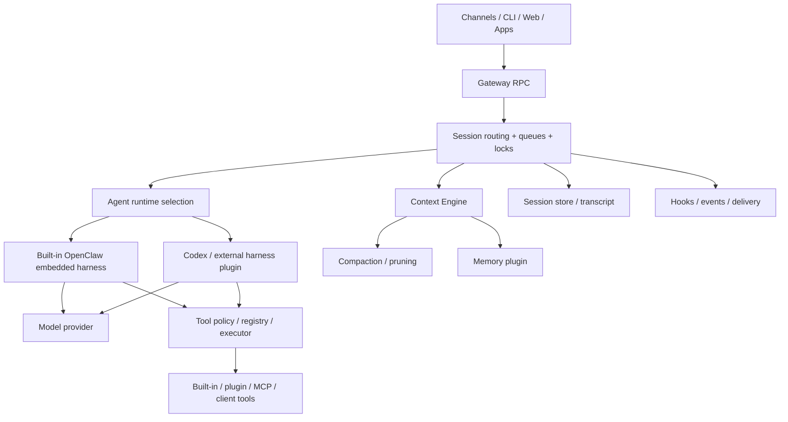
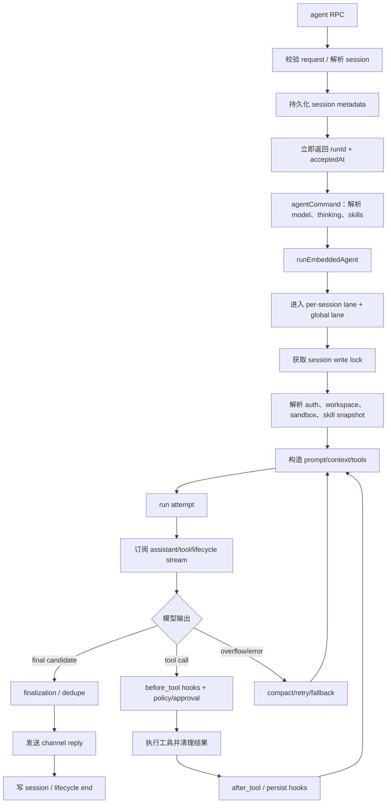
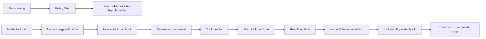
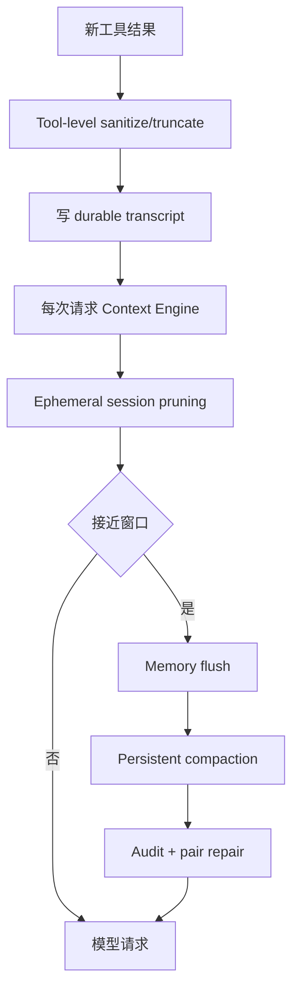
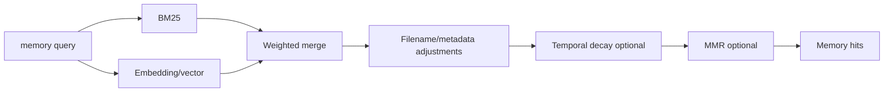
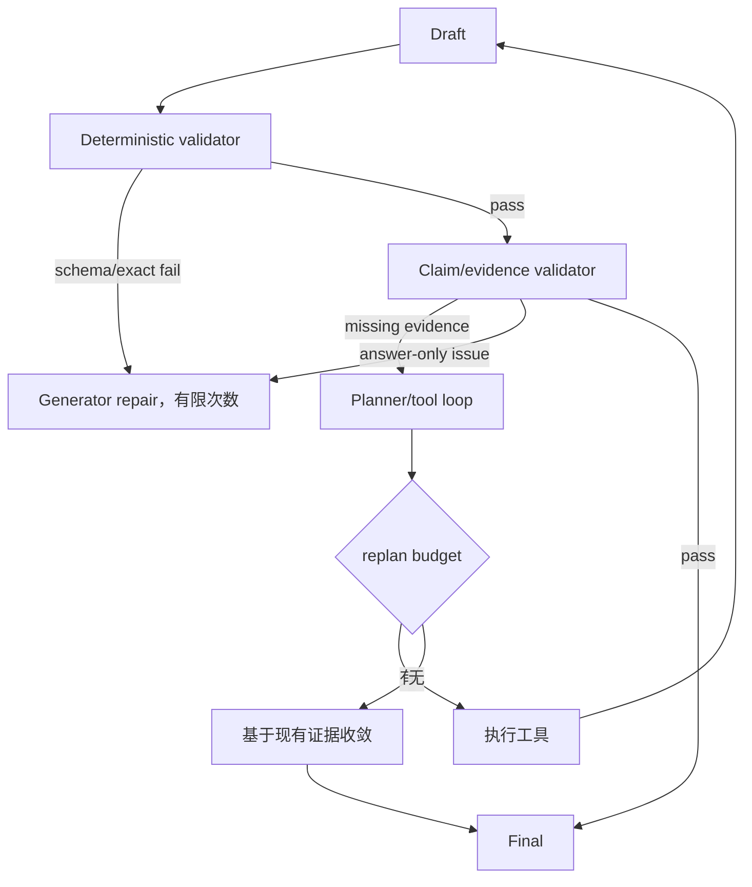

# OpenClaw 源码精读：Gateway、Agent Harness、Tools、Memory 与 Context Engine

> 研究对象：[`openclaw/openclaw`](https://github.com/openclaw/openclaw)
> 固定源码快照：[`6e604438b6a2274145bae60aef053afa78d9170d`](https://github.com/openclaw/openclaw/tree/6e604438b6a2274145bae60aef053afa78d9170d)
> 快照日期：2026-07-25
> 定位：local-first、长运行、多 channel、多 agent runtime、可插拔 memory/context/tools 的个人 agent 平台。

## 0. 结论先行

OpenClaw 是五个项目中平台边界最广的：

- Gateway 统一管理 channel、session、agent run 和事件；
- Agent runtime 不只有一个：内置 OpenClaw loop，也可接 Codex 等外部 harness；
- 同一 session 有串行 lane，全局还有并发 lane；
- 工具由 policy、approval、hooks、schema、执行器和日志共同管理；
- Skills 采用 `SKILL.md` progressive disclosure，并有多来源优先级和依赖 gating；
- Tool Search 支持大规模工具目录延迟发现；
- Context Engine、Compaction、Pruning、Memory 是相互独立又可组合的层；
- Memory 可选 SQLite hybrid search、QMD、Honcho、LanceDB 等；
- Gateway protocol 以 TypeBox/AJV/JSON Schema 为事实源，并生成其他语言类型；
- LLM 输出检查包含 tool schema、output schema、空响应、provider error、重复 loop 和 post-compaction loop guard；
- OpenClaw 还能把另一个 agent harness 当 runtime，因此是明显的 **harness-of-harnesses**。

最值得你学习的不是它的功能数量，而是：

```text
Runtime contract
+ Policy-filtered tool surface
+ Context engine boundary
+ Durable session ownership
+ Compaction/pruning separation
+ Memory plugin boundary
+ Schema-generated protocol
+ Loop detection
```

---

## 1. 总体架构

### 1.1 核心层



### 1.2 关键目录

| 领域             | 代表路径                                      |
| ---------------- | --------------------------------------------- |
| Agent runner     | `src/agents/embedded-agent-runner/`           |
| Harness contract | `src/agents/harness/`                         |
| Tools            | `src/agents/tools/`                           |
| Skills           | `src/skills/`                                 |
| Context engine   | `src/context-engine/`                         |
| Memory search    | `src/agents/memory-search.ts`、memory plugins |
| Gateway protocol | `packages/gateway-protocol/src/schema/`       |
| Sessions         | Gateway/session store 相关模块                |
| Hooks/plugins    | plugin/hook registries                        |
| Docs             | `docs/concepts/`、`docs/tools/`               |

---

## 2. Agent Chain 与 Loop

### 2.1 从 RPC 到最终回答

依据 [`docs/concepts/agent-loop.md`](https://github.com/openclaw/openclaw/blob/6e604438b6a2274145bae60aef053afa78d9170d/docs/concepts/agent-loop.md)：



调用端可通过 `agent.wait` 等待 run 的 end/error，但初始 RPC 接收与长任务完成解耦。

### 2.2 Session lane 与 global lane

OpenClaw 同时控制：

- **per-session lane**：同一会话的 turns 串行，避免 transcript 竞争；
- **global lane**：限制全局并发，避免资源耗尽；
- **session write lock**：跨异步流程保护持久 session，默认等待量级约 60 秒并感知进程状态。

这解决了多 channel/定时任务/后台任务同时写一个 session 的竞态。

### 2.3 Run attempt

`runEmbeddedAgent`/orchestrator 一类模块将一次运行拆成 attempt：

- provider/model 选择；
- auth profile；
- prompt/context；
- tool surface；
- streaming；
- usage；
- timeout；
- compaction retry；
- fallback。

一次用户 run 可产生多个 model attempts，但成功的有副作用工具不应随意重放。

### 2.4 Event bridge

`subscribeEmbeddedAgentSession` 把底层 runtime 事件转成 OpenClaw 事件：

- assistant text/reasoning；
- tool start/progress/result；
- lifecycle；
- usage；
- compaction；
- errors。

Channel delivery 不需要理解 provider-specific SSE。

### 2.5 Finalization

最终阶段会处理：

- `NO_REPLY` 一类内部 sentinel；
- 已通过 messaging tool 发送的内容去重；
- 没有可见结果时生成明确 fallback error；
- tool/assistant stream 残片合并；
- channel format；
- session persistence；
- run state 结束。

“模型输出了一段文字”只是 final candidate，不是整个 delivery 完成。

### 2.6 Timeout

运行、provider idle、tool 分别需要 timeout。文档中的默认量级随 runtime/provider 不同，例如：

- agent run 可容许很长的后台时间；
- cloud/self-hosted provider idle timeout 不同；
- tool/process 有独立预算。

配置应按层级保存，不应只在最外层 `asyncio.wait_for`/`Promise.race`。

---

## 3. Harness-of-Harnesses

### 3.1 Agent Runtime 概念

[`docs/concepts/agent-runtimes.md`](https://github.com/openclaw/openclaw/blob/6e604438b6a2274145bae60aef053afa78d9170d/docs/concepts/agent-runtimes.md) 区分：

- provider；
- model；
- agent runtime/harness；
- channel；
- session。

同一个模型可由不同 harness 驱动；同一个 harness 可接不同 provider。

### 3.2 `AgentHarness` contract

`src/agents/harness/types.ts` 一类接口包含：

- runtime id/label；
- capability/support 判断；
- `runAttempt`；
- settled-turn finalization；
- session/thread 映射；
- context/tool policy 输入；
- 结果/usage/events；
- 可能的 runtime-specific continuation。

宿主只依赖 contract，不应知道外部 runtime 的所有内部消息。

### 3.3 Runtime 选择

优先级可概括为：

```text
exact model policy
-> provider policy
-> plugin auto-claim
-> built-in OpenClaw fallback
```

若用户/配置显式选择 plugin runtime，而该 runtime不支持当前请求，系统采取 fail-closed，不偷偷换成另一 runtime；自动模式才适合 fallback。

### 3.4 Ownership matrix

不同 harness 的职责归属不同：

| 能力                   | Built-in OpenClaw | Codex-style runtime           |
| ---------------------- | ----------------- | ----------------------------- |
| model loop             | OpenClaw          | 外部 runtime                  |
| transcript truth       | OpenClaw session  | 外部 thread + OpenClaw mirror |
| native tools           | OpenClaw          | runtime 原生工具              |
| dynamic OpenClaw tools | 直接 registry     | bridge/adapt                  |
| compaction             | OpenClaw          | 外部 runtime 可能自持         |
| channel delivery       | OpenClaw          | OpenClaw                      |
| policy                 | OpenClaw          | 限制映射给 runtime            |

这正是 harness federation 的难点：谁拥有 loop、history、tools 和 compaction 必须明确。

### 3.5 Restricted tool policy

若宿主策略只允许部分工具，plugin harness 得到的也是受限 surface。不应因为外部 runtime 有原生 shell，就跳过 OpenClaw host policy。

### 3.6 Finalizer 隔离

settled-turn finalizer 应禁用普通工具/轨迹扩张，只做：

- 输出收敛；
- channel formatting；
- 状态终结；
- 不再次开启无限 agent loop。

---

## 4. Tools 与 Function Call

### 4.1 Tool surface 的来源

- OpenClaw built-in tools；
- plugin tools；
- MCP tools；
- client/host tools；
- messaging/channel tools；
- memory tools；
- browser/code/file/search 等。

它们先进入 catalog，再经过：

- runtime capability；
- agent allowlist；
- user/config policy；
- channel restrictions；
- sandbox；
- approval；
- hooks；
- deferred tool search。

最终模型看到的是**policy-filtered surface**。

### 4.2 工具链



### 4.3 TypeBox/AJV schema

OpenClaw 工具/protocol 广泛使用 TypeBox：

- TypeScript 中定义静态类型兼容 schema；
- AJV runtime validation；
- schema 可导出 JSON Schema；
- gateway protocol 还能生成 Swift/Kotlin 等客户端类型；
- tagged/discriminated union 表示事件；
- config 边界也常见 Zod。

这种“schema 是代码资产”比手写多个语言的 interface 更稳。

### 4.4 Tool output schema

工具不仅可有 input schema，还可声明 `outputSchema`：

- handler/hooks 完成后；
- 对 `result.details` 等受信结构做校验；
- 失败进入明确错误；
- 模型可见文本与机器可读 details 分开。

这对数据库、搜索和代码执行非常适合：

```json
{
  "content": "Found 3 records.",
  "details": {
    "rows": [...],
    "source_ids": [...]
  }
}
```

### 4.5 Hooks

可见 hook 类别包括：

- `agent:bootstrap`、command hooks；
- `before_model_resolve`；
- `before_prompt_build`；
- `before_agent_reply`；
- `agent_end`；
- before/after compaction；
- before/after tool；
- before install；
- `tool_result_persist`；
- message/session/gateway lifecycle。

Hook 是平台扩展 choke point，应有：

- 确定执行顺序；
- timeout；
- 错误隔离；
- 能否修改输入/输出；
- trace；
- 禁递归或重入策略。

### 4.6 Tool Search

OpenClaw 的实验性 Tool Search 解决大目录 token 成本。

#### Catalog

先构建 policy-filtered catalog：

- OpenClaw tools；
- plugin tools；
- MCP tools；
- client tools；
- direct-only tools 保持可见。

#### 三种模式

| 模式        | 机制                                              |
| ----------- | ------------------------------------------------- |
| `code`      | `tool_search_code` 中通过受限 JS bridge 搜索/调用 |
| `tools`     | search/describe/call 三个 meta-tools              |
| `directory` | bounded names + compact controls + 部分 schema    |

#### 信任与 schema

- 搜索结果只给 compact signature；
- 对不受信 MCP/client tool 的描述先视为 `unknown`；
- `describe` 再取得精确 schema；
- trusted catalog 才使用额外 output hints。

#### Code mode 隔离

用于 tool search 的 Node 子进程可配置：

- 空环境；
- 无 filesystem/network/child process 权限；
- 只通过 bridge 请求正常工具；
- 真正工具调用仍回到 policy/approval/hooks/logging。

也就是说 code mode 不会直接绕过 executor。

### 4.7 Tool Search 与 RAG 的相似点

```text
query
-> catalog retrieve
-> candidate descriptions
-> exact schema fetch
-> call
```

这是针对工具的两阶段 RAG，检索结果不是知识片段，而是可执行接口。

---

## 5. Skills

### 5.1 发现来源与优先级

本快照支持多层来源，典型优先级从近到远：

1. workspace skills；
2. workspace `.agents/skills`；
3. user `~/.agents/skills`；
4. user `~/.openclaw/skills`；
5. bundled skills；
6. extra/plugin sources。

同名由高优先级覆盖。递归发现有深度上限，避免扫描无界目录。

### 5.2 `SKILL.md`

基本要求：

```yaml
---
name: database-analysis
description: Analyze database questions using read-only query tools.
---
```

可选控制：

- `user-invocable`；
- `disable-model-invocation`；
- command dispatch；
- command tool；
- raw arguments；
- OpenClaw metadata。

### 5.3 Gating metadata

`metadata.openclaw` 可描述：

- `always`；
- OS；
- required binaries；
- any-of binaries；
- environment variables；
- config keys；
- primary env；
- install instructions。

Loader 只把当前 host 可用的 skills 暴露给模型。

### 5.4 Progressive disclosure

系统 prompt 放 skill list/metadata，完整正文在调用时读取。Skill 内用 `{baseDir}` 等 token 稳定引用自己的资源。


### 5.5 Secret injection

Skill 需要 env/credential 时，OpenClaw 可在单 turn 注入 host secrets：

- 只在调用期间；
- 不永久写 prompt/session；
- 执行后恢复；
- 路径/资源做 containment。

### 5.6 Skill Workshop 与分发

生态包含：

- skill proposal；
- review；
- apply；
- ClawHub install；
- verify；
- security scan。

成熟 skill 生命周期应有：

```text
create -> lint -> security scan -> eval -> install -> observe -> update
```

### 5.7 Skill/Tool/Memory 的分工

| 组件   | 内容                           |
| ------ | ------------------------------ |
| Skill  | “怎样完成一类任务”的流程与资源 |
| Tool   | 原子能力和外部动作             |
| Memory | 过去发生过什么、用户/项目事实  |
| Prompt | 当前角色与即时约束             |
| MCP    | 工具/资源的连接协议            |

---

## 6. Context Engine

### 6.1 上下文组成

[`docs/concepts/context.md`](https://github.com/openclaw/openclaw/blob/6e604438b6a2274145bae60aef053afa78d9170d/docs/concepts/context.md) 中的 context 不只是 chat history：

- system prompt；
- bootstrap files；
- skills list/body；
- tool names/descriptions/schemas；
- conversation history；
- tool calls/results；
- attachments/images；
- memory；
- current message；
- hook/plugin additions。

### 6.2 Bootstrap files

默认 workspace 文件可包括：

```text
AGENTS.md
SOUL.md
TOOLS.md
IDENTITY.md
USER.md
HEARTBEAT.md
BOOTSTRAP.md
```

每文件和总量都有字符上限，例如本快照默认量级：

- 单文件约 20k chars；
- 总 bootstrap 约 60k chars。

具体值由配置决定。

### 6.3 Context inspection

OpenClaw 提供：

- `/context list`
- `/context detail`
- `/context map`
- `/usage`
- `/compact`

这是很重要的产品能力：用户/开发者能看到 token 被谁占用，而不是只看到“context too long”。

### 6.4 Tool schema 成本

工具成本包含两部分：

- 模型可见描述；
- JSON schema。

大量 tools 即使从未调用，也会消耗固定 token，所以 Tool Search、skill progressive disclosure、policy filtering 都是 context engineering。

### 6.5 Directives

某些宿主 directives 在交给模型前被解析/剥离，避免它们作为普通用户文本污染对话。命令层与语义消息层分离。

---

## 7. Compaction 与 Pruning

### 7.1 两者区别

| 机制       |       是否持久化改写 session | 目的                    |
| ---------- | ---------------------------: | ----------------------- |
| Compaction |      是，摘要进入 transcript | 长期缩短历史            |
| Pruning    | 否，只影响本次 model context | 降低临时 token/缓存成本 |

把两者混成一个 `compress_history()` 会失去这个关键差异。

### 7.2 Compaction

[`docs/concepts/compaction.md`](https://github.com/openclaw/openclaw/blob/6e604438b6a2274145bae60aef053afa78d9170d/docs/concepts/compaction.md)：

- 旧历史摘要化；
- 最近消息保持完整；
- tool call/result 成对；
- summary 持久化；
- 可手动 `/compact`；
- 接近窗口或 provider overflow 自动触发；
- compact 后重试；
- compaction 前可进行 memory flush；
- provider plugin 可覆盖；
- provider compact 失败/空结果时回到 built-in；
- 可指定 summarization model；
- 强调 identifier 精确保留。

### 7.3 Compaction safeguard/audit

默认 safeguard 模式可审计压缩结果，避免：

- 丢失当前目标；
- 丢失关键 identifier；
- 把猜测写成事实；
- 破坏 tool pair；
- 遗漏未完成任务。

### 7.4 Memory flush

在即将压缩前，系统可先进行一次静默 memory turn：

1. 检测 context 达到 soft threshold；
2. 注入 memory-flush prompt；
3. 允许 agent 将稳定信息写入 memory；
4. 再 compact；
5. 下一轮不展示这次内部交互。

需要防止：

- 每次重试都重复 flush；
- flush 继续制造大输出；
- 把临时/未验证内容写入长期 memory；
- 工具被禁用时还假装写入成功。

### 7.5 Session pruning

[`docs/concepts/session-pruning.md`](https://github.com/openclaw/openclaw/blob/6e604438b6a2274145bae60aef053afa78d9170d/docs/concepts/session-pruning.md) 的 cache-TTL pruning：

- 主要针对旧 `toolResult`；
- 保护最近若干 assistant turns；
- 保护首个 user 之后的重要区域；
- soft trim 采用头尾保留；
- hard clear 在更高比例/大结果时替换；
- 旧 image data 可清理；
- 避免写回持久 transcript。

本快照可见默认量级示例：

- 最近约 3 个 assistant turns 保护；
- soft trim 头尾各约 1500 chars，总上限约 4000；
- hard clear 可在占比/长度阈值触发，例如约 50k chars。

配置与版本会变化，设计上应使用参数而非魔法数字。

### 7.6 分层压缩全景



这与你之前问的“LLM 摘要还是分层压缩”一致：OpenClaw 是分层策略，LLM 摘要只是其中一层。

---

## 8. Session

### 8.1 Gateway 是状态所有者

Gateway 管理：

- session key；
- transcript；
- run state；
- channel mapping；
- reset policy；
- concurrent lane；
- metadata；
- archive；
- agent identity。

### 8.2 Session scope

不同入口有不同默认隔离：

- direct messages 可共享 main 或按 peer 隔离；
- group/room 独立；
- cron 通常新 session；
- webhook 隔离；
- account/channel/peer 可组合 scope。

`dmScope` 一类配置可选择：

```text
main
per-peer
per-channel-peer
per-account-channel-peer
```

### 8.3 Incognito

Incognito session：

- 只在进程内；
- 避免写入 transcript；
- 不做普通 flush/archive；
- tools 本身仍可能产生外部持久副作用。

所以“会话不落盘”不代表“整个任务没有副作用”。

### 8.4 Reset

可按：

- none；
- daily；
- idle；
- manual

重置 session。Reset 与 compaction 不同：compaction 保持任务连续性，reset 建立新边界。

### 8.5 跨会话记忆

`rememberAcrossConversations` 一类能力可在私聊中检索旧记忆，但不合并原始 transcript。这样避免两个 session 的 role/tool 序列混杂。

---

## 9. Memory 与 RAG

### 9.1 Memory 文件层

典型 workspace：

```text
MEMORY.md
memory/
  2026-07-25.md
DREAMS.md
```

- `MEMORY.md`：人工/agent 筛选的长期事实，启动时可注入；
- daily memory：工作日志层，通过 search/get 按需获取；
- `DREAMS.md`：dreaming/反思产生的记录。

Daily 文件不是每次全部注入。

### 9.2 Memory tools

核心工具：

- `memory_search`
- `memory_get`

由 active memory plugin 提供。这样 memory 后端可替换，agent loop 保持统一工具契约。

### 9.3 默认检索

默认 `memory-core` 可使用 SQLite：

- chunking；
- keyword/BM25；
- vector embedding；
- hybrid merge；
- filename ranking。

查询链：



### 9.4 Embedding providers

支持多 provider/adapter，例如：

- OpenAI；
- Gemini；
- Voyage；
- Mistral；
- Bedrock；
- DeepInfra；
- local；
- Ollama；
- LM Studio；
- Copilot；
- OpenAI-compatible。

若配置 `provider:none`，可退到 FTS-only。若用户显式选择一个损坏 provider，系统倾向暴露 unavailable，而不是悄悄换模型导致检索语义变化。

### 9.5 Ranking

可选：

- temporal decay，例如半衰期量级 30 天；
- curated `MEMORY.md` 可免衰减；
- MMR 去冗余；
- hybrid 权重；
- filename relevance；
- extra paths；
- multimodal indexing；
- session transcript source。

### 9.6 Memory visibility

需要按：

- agent；
- user/peer；
- channel；
- workspace；
- session type

控制可见性。否则 group session 可能检索到 private DM memory。

### 9.7 Action-sensitive memory

对会影响外部动作的记忆，记录：

- 时间；
- 来源；
- authority；
- 是否已过期；
- 是否需要再次确认。

“用户上个月说默认发送到某账户”不应永久变成无条件动作权限。

### 9.8 Memory wiki 与 provenance

Memory 可保留 claims/evidence/provenance，让 agent 区分：

- 原始来源；
- agent 推断；
- 用户声明；
- 后续修正。

这比只存一条自然语言 summary 更适合长期一致性。

### 9.9 可插拔后端

除 memory-core，还可接：

- QMD；
- Honcho；
- LanceDB 等。

统一接口应返回标准 hit/evidence，而不是把某后端 score 定义当全局语义。

### 9.10 Dreaming

可选 dreaming：

- 从 daily/session signals 提取候选；
- 阈值过滤；
- 有价值内容晋升 `MEMORY.md`；
- 过程记录到 `DREAMS.md`。

必须有 eval/回滚，否则会把模型自我推断固化。

---

## 10. LLM 返回检查与要求

### 10.1 Provider stream 与空回答

runner 检查：

- stream 生命周期；
- tool-call block；
- assistant token；
- provider error；
- usage；
- zero-token stop；
- 无可见结果；
- compaction retry。

`empty-assistant-turn.ts` 一类逻辑专门识别零 token/空 assistant，防止把空输出当成功 final。

### 10.2 Input/output schema

- tool args 由 schema/AJV 校验；
- tool output `details` 可用 `outputSchema`；
- Gateway RPC 使用 TypeBox；
- structured task 可用额外插件/工具。

### 10.3 `llm-task`

可选 `llm-task` plugin 用于：

- 单次 JSON-only LLM call；
- tools disabled；
- 可选 schema；
- 返回 machine-readable `details.json`；
- 记录 provider/model。

适合 Router、摘要、轻量 validator，不适合需要工具循环的复杂 research。

### 10.4 Swarm structured output

Swarm 可通过 synthetic `structured_output` tool 要求 JSON schema：

1. 模型提交结构化 tool call；
2. schema 校验；
3. 失败时给一次 corrective nudge；
4. 仍失败则返回 raw text + `schemaError`。

这展示了合理的有限修复，而不是无限“请重试”。

### 10.5 Loop detection

OpenClaw 会观察滚动模式：

- 相同 tool+args；
- 相同/近似 result；
- 未知 tool；
- 无进展的重复；
- 告警后阻止。

特别是 post-compaction guard：

- 压缩前后仍重复同一 `(tool, args, result)`；
- 说明摘要没有打破循环；
- 触发 `compaction_loop_persisted` 一类终止，而不是继续压缩再试。

这是非常值得你的链路加入的功能。

### 10.6 Provider error classification

区分：

- transient/rate limit；
- auth；
- context overflow；
- format/schema；
- model unavailable；
- terminal validation error。

Provider fallback 必须基于错误类别；format error 通常先修 prompt/adapter，而不是随机换 provider。

### 10.7 结构正确不等于事实正确

OpenClaw 已有丰富 schema/loop guard，但一般 final answer 并不会自动拥有逐 claim 事实验证。你仍需：

```text
Current-turn Evidence Registry
-> claim extraction
-> citation existence
-> evidence entailment
-> freshness/trust
-> completion criteria
```

### 10.8 你的二次校验建议



---

## 11. Tool failure、重复、空结果与 Evidence

### 11.1 统一结果

建议保持你已经接受的结构：

```json
{
  "call_id": "call_1",
  "tool_name": "browser.search",
  "status": "partial",
  "data": {},
  "error": {
    "code": "PAGE_TIMEOUT",
    "message": "...",
    "retryable": true
  },
  "evidence_ids": ["ev_1", "ev_2"],
  "meta": {
    "duration_ms": 3000,
    "truncated": true,
    "attempt": 1
  }
}
```

### 11.2 当前轮隔离

```python group=multi-16f0b7f71a6d label=Python
class EvidenceRegistry:
    turn_id: str
    items: dict[str, EvidenceItem]
```

```rust group=multi-16f0b7f71a6d label=Rust
use std::collections::HashMap;

struct EvidenceRegistry {
    turn_id: String,
    items: HashMap<String, EvidenceItem>,
}
```

```javascript group=multi-16f0b7f71a6d label=JavaScript
/**
 * @typedef {{
 *   turnId: string,
 *   items: Map<string, EvidenceItem>
 * }} EvidenceRegistry
 */
```

```typescript group=multi-16f0b7f71a6d label=TypeScript
type EvidenceRegistry = {
  turnId: string
  items: Map<string, EvidenceItem>
}
```

只有 `item.turn_id == current_turn_id` 的 evidence 默认进入 final validator。历史资料若重新使用，应在本轮重新检索/导入并生成新 provenance。

### 11.3 Tool result 与 evidence

```text
ToolResult = 执行事实
EvidenceItem = 可引用事实
ContextFragment = 给模型看的裁剪表示
Citation = 回答中的指针
```

四者不要复用一个 dict。

---

## 12. Schema：为什么值得专门学习

### 12.1 Gateway schema

`packages/gateway-protocol/src/schema/` 定义：

- RPC requests/responses；
- events；
- session/run/tool 状态；
- errors；
- config/metadata。

生成链可概括：

```text
TypeBox definitions
-> AJV runtime validation
-> JSON Schema draft
-> TypeScript types
-> Swift/Kotlin generated client models
-> fixtures/compat tests
```

### 12.2 Schema versioning

生产 schema 应考虑：

- optional vs nullable；
- discriminant；
- backward compatibility；
- unknown fields；
- default；
- enum 演进；
- schema id/version；
- codegen diff；
- fixture；
- migration。

### 12.3 内部 state 也要强类型

不要只在 API 边界使用 schema，内部关键状态应是 discriminated union：

```python group=multi-e4109b4ff815 label=Python
from dataclasses import dataclass
from typing import Literal

@dataclass(frozen=True)
class ToolExecution:
    status: Literal["queued", "running", "completed", "failed"]
    call_id: str
    started_at: int | None = None
    result: "ToolResult | None" = None
    error: "ToolError | None" = None
```

```rust group=multi-e4109b4ff815 label=Rust
enum ToolExecution {
    Queued { call_id: String },
    Running { call_id: String, started_at: u64 },
    Completed { call_id: String, result: ToolResult },
    Failed { call_id: String, error: ToolError },
}
```

```javascript group=multi-e4109b4ff815 label=JavaScript
/**
 * @typedef (
 *   { status: 'queued', callId: string } |
 *   { status: 'running', callId: string, startedAt: number } |
 *   { status: 'completed', callId: string, result: ToolResult } |
 *   { status: 'failed', callId: string, error: ToolError }
 * ) ToolExecution
 */
```

```typescript group=multi-e4109b4ff815 label=TypeScript
type ToolExecution =
  | { status: 'queued'; callId: string }
  | { status: 'running'; callId: string; startedAt: number }
  | { status: 'completed'; callId: string; result: ToolResult }
  | { status: 'failed'; callId: string; error: ToolError }
```

这样“completed 但没有 result”的非法状态在类型层消失。

---

## 13. 权限与安全边界

OpenClaw 的平台面很广，主要控制：

- agent/tool allowlists；
- sandbox；
- host filesystem/network；
- approval；
- plugin trust；
- skill install；
- MCP/client tool trust；
- secret turn injection；
- channel/session visibility；
- private memory；
- code-mode isolation；
- external harness policy mapping。

Prompt 只告诉模型规则；真正 enforcement 必须在 tool/runtime。

---

## 14. 可观测性与评测

### 14.1 事件

至少包含：

```text
run accepted/started
runtime selected
session lock acquired
prompt/context mapped
model attempt
tool start/end
hook decisions
approval
compaction/pruning
memory search/write
provider fallback
loop warning/block
delivery
run end/error
```

### 14.2 Context telemetry

应按类别统计：

- system/bootstrap；
- history；
- tools/schema；
- skills；
- memory；
- RAG evidence；
- attachments；
- summary；
- 当前输入；
- 预留 output。

### 14.3 Evals

按照 [Agent Learning Hub](https://datawhalechina.github.io/Agent-Learning-Hub/) Stage 3–8，OpenClaw 特别适合测试：

- session routing；
- concurrent turns；
- tool policy；
- plugin harness ownership；
- tool search precision；
- skill gating；
- memory visibility；
- hybrid recall；
- compaction continuity；
- pruning cache behavior；
- repeated loop；
- channel delivery dedupe；
- schema/codegen compatibility；
- prompt injection；
- 成本/延迟。

---

## 15. 代码格式与工程风格

### 15.1 TypeScript

根 `AGENTS.md` 的主要规则：

- ESM、strict TypeScript；
- production code 避免 `any`，先用 `unknown` 再 narrowing；
- boundary 使用 Zod/schema；
- discriminated unions；
- impossible states unrepresentable；
- early returns；
- `gather -> normalize -> decide -> act`；
- API 尽量窄；
- 返回 shape 小；
- 避免只改名不增值的 adapter；
- production file 目标不超过约 700 行；
- test file 上限更宽；
- Vitest colocated tests。

### 15.2 Format/Lint

- `oxfmt`；
- `oxlint`；
- correctness/performance/suspicious/TypeScript rules；
- no explicit `any`；
- exhaustive switch；
- no floating promises；
- file-size architecture checks；
- `format`、`format:check`、`lint`、`check`、`test`；
- schema/codegen 验证。

### 15.3 文档

- Markdown lint/format；
- docs 与源码 feature 同步；
- 流程图和配置示例；
- 明确实验功能；
- 路径和命令可复制；
- 版本相关默认值与概念分开。

### 15.4 适合 Python 项目的映射

| OpenClaw TS 习惯        | Python 对应                         |
| ----------------------- | ----------------------------------- |
| discriminated union     | `Literal` + Pydantic union          |
| `unknown` narrowing     | `object` + validator/type guard     |
| TypeBox/AJV             | Pydantic/JSON Schema                |
| no floating promises    | 所有 task 被 await/track/cancel     |
| narrow API              | `Protocol` + 小 dataclass           |
| colocated Vitest        | 模块邻近 unit + `tests/integration` |
| architecture file limit | Ruff/自定义 CI 统计                 |

---

## 16. 对 `agent_learing` 的最小迁移路线

### Phase A：先稳定内部契约

```text
TurnState
PlanStep
ToolCall
ToolResult
EvidenceItem
ValidationResult
SessionSummary
```

### Phase B：统一工具

- registry；
- policy；
- executor；
- error classification；
- duplicate fingerprint；
- output schema；
- evidence extractor；
- hooks。

### Phase C：上下文

- context category budget；
- bootstrap/session/recent/evidence 分层；
- tool result 入口裁剪；
- ephemeral pruning；
- LLM structured compaction；
- protocol repair；
- context inspection。

### Phase D：Session

- SQLite；
- turn record；
- summary；
- lock；
- reset/resume；
- current-turn isolation。

### Phase E：扩展

- skills；
- MCP；
- tool search；
- memory search；
- multi-agent/harness plugin。

你计划先不做长期记忆时，可先只实现：

```text
recent turns + SessionSummary + unresolved tasks + user constraints
```

---

## 17. 关键源码与文档索引

### Agent/Harness

- [`docs/concepts/agent-loop.md`](https://github.com/openclaw/openclaw/blob/6e604438b6a2274145bae60aef053afa78d9170d/docs/concepts/agent-loop.md)
- [`docs/concepts/architecture.md`](https://github.com/openclaw/openclaw/blob/6e604438b6a2274145bae60aef053afa78d9170d/docs/concepts/architecture.md)
- [`docs/concepts/agent-runtimes.md`](https://github.com/openclaw/openclaw/blob/6e604438b6a2274145bae60aef053afa78d9170d/docs/concepts/agent-runtimes.md)
- [`src/agents/embedded-agent-runner/run-loop.ts`](https://github.com/openclaw/openclaw/blob/6e604438b6a2274145bae60aef053afa78d9170d/src/agents/embedded-agent-runner/run-loop.ts)
- [`src/agents/embedded-agent-runner/run-orchestrator.ts`](https://github.com/openclaw/openclaw/blob/6e604438b6a2274145bae60aef053afa78d9170d/src/agents/embedded-agent-runner/run-orchestrator.ts)
- [`src/agents/harness/types.ts`](https://github.com/openclaw/openclaw/blob/6e604438b6a2274145bae60aef053afa78d9170d/src/agents/harness/types.ts)
- [`src/agents/harness/selection.ts`](https://github.com/openclaw/openclaw/blob/6e604438b6a2274145bae60aef053afa78d9170d/src/agents/harness/selection.ts)

### Context/Session/Memory

- [`docs/concepts/context.md`](https://github.com/openclaw/openclaw/blob/6e604438b6a2274145bae60aef053afa78d9170d/docs/concepts/context.md)
- [`docs/concepts/context-engine.md`](https://github.com/openclaw/openclaw/blob/6e604438b6a2274145bae60aef053afa78d9170d/docs/concepts/context-engine.md)
- [`docs/concepts/compaction.md`](https://github.com/openclaw/openclaw/blob/6e604438b6a2274145bae60aef053afa78d9170d/docs/concepts/compaction.md)
- [`docs/concepts/session-pruning.md`](https://github.com/openclaw/openclaw/blob/6e604438b6a2274145bae60aef053afa78d9170d/docs/concepts/session-pruning.md)
- [`docs/concepts/session.md`](https://github.com/openclaw/openclaw/blob/6e604438b6a2274145bae60aef053afa78d9170d/docs/concepts/session.md)
- [`docs/concepts/memory.md`](https://github.com/openclaw/openclaw/blob/6e604438b6a2274145bae60aef053afa78d9170d/docs/concepts/memory.md)
- [`docs/concepts/memory-search.md`](https://github.com/openclaw/openclaw/blob/6e604438b6a2274145bae60aef053afa78d9170d/docs/concepts/memory-search.md)
- [`src/agents/memory-search.ts`](https://github.com/openclaw/openclaw/blob/6e604438b6a2274145bae60aef053afa78d9170d/src/agents/memory-search.ts)

### Tools/Skills/Validation

- [`docs/tools/skills.md`](https://github.com/openclaw/openclaw/blob/6e604438b6a2274145bae60aef053afa78d9170d/docs/tools/skills.md)
- [`docs/tools/creating-skills.md`](https://github.com/openclaw/openclaw/blob/6e604438b6a2274145bae60aef053afa78d9170d/docs/tools/creating-skills.md)
- [`docs/tools/tool-search.md`](https://github.com/openclaw/openclaw/blob/6e604438b6a2274145bae60aef053afa78d9170d/docs/tools/tool-search.md)
- [`docs/tools/llm-task.md`](https://github.com/openclaw/openclaw/blob/6e604438b6a2274145bae60aef053afa78d9170d/docs/tools/llm-task.md)
- [`docs/tools/loop-detection.md`](https://github.com/openclaw/openclaw/blob/6e604438b6a2274145bae60aef053afa78d9170d/docs/tools/loop-detection.md)
- [`tool-schema-runtime.ts`](https://github.com/openclaw/openclaw/blob/6e604438b6a2274145bae60aef053afa78d9170d/src/agents/embedded-agent-runner/tool-schema-runtime.ts)
- [`empty-assistant-turn.ts`](https://github.com/openclaw/openclaw/blob/6e604438b6a2274145bae60aef053afa78d9170d/src/agents/embedded-agent-runner/empty-assistant-turn.ts)
- [`post-compaction-loop-guard.ts`](https://github.com/openclaw/openclaw/blob/6e604438b6a2274145bae60aef053afa78d9170d/src/agents/embedded-agent-runner/post-compaction-loop-guard.ts)

### Schema/Style

- [`packages/gateway-protocol/src/schema/`](https://github.com/openclaw/openclaw/tree/6e604438b6a2274145bae60aef053afa78d9170d/packages/gateway-protocol/src/schema)
- [`AGENTS.md`](https://github.com/openclaw/openclaw/blob/6e604438b6a2274145bae60aef053afa78d9170d/AGENTS.md)
- [`package.json`](https://github.com/openclaw/openclaw/blob/6e604438b6a2274145bae60aef053afa78d9170d/package.json)

## 18. 最终评价

OpenClaw 最接近完整个人 agent 平台，而不仅是 loop：

```text
Gateway
+ Session ownership
+ Harness selection
+ Tool policy
+ Skills
+ Context Engine
+ Compaction/pruning
+ Memory RAG
+ Multi-channel delivery
+ Schema/codegen
+ Loop guards
```

对于你当前项目，最应该先复制的是 `schema + ownership + lifecycle`，而不是一次加入所有 channels、memory providers 和 runtimes。只要这些边界稳定，后续搜索、数据库、文件、浏览器、代码执行和 MCP 都能作为统一工具扩展。
