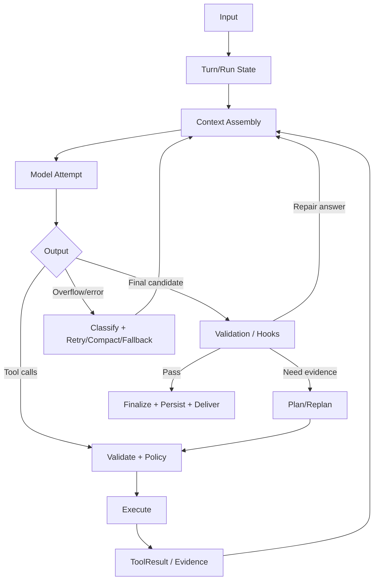
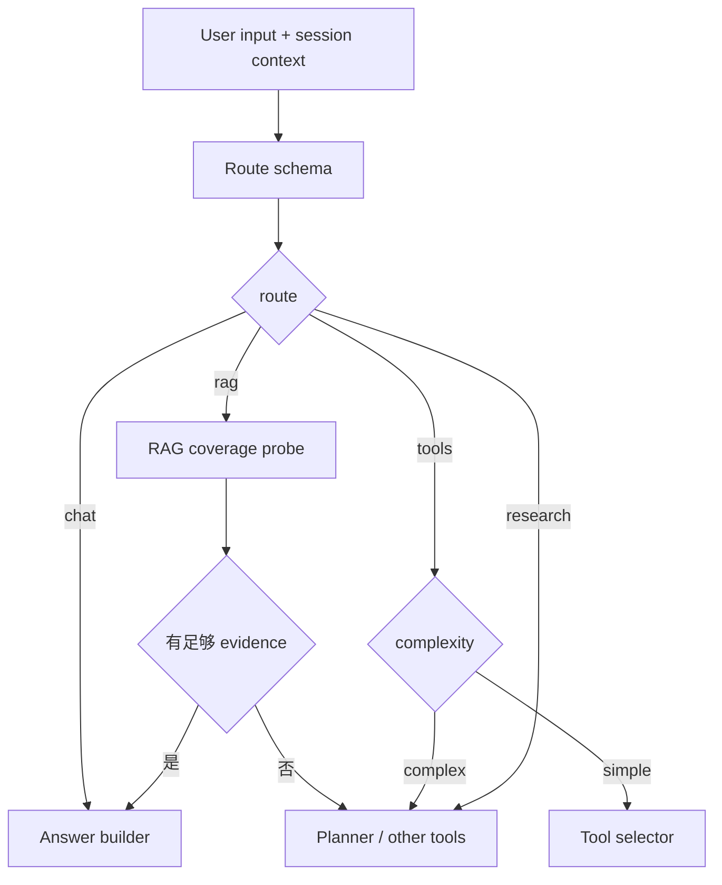
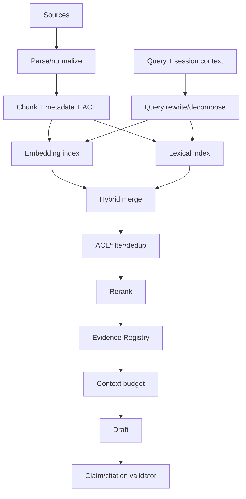
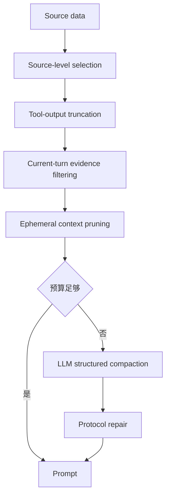
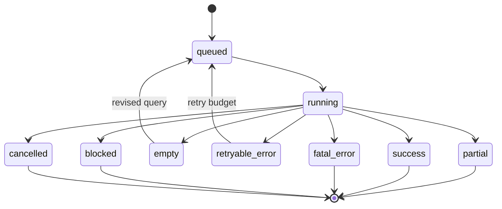
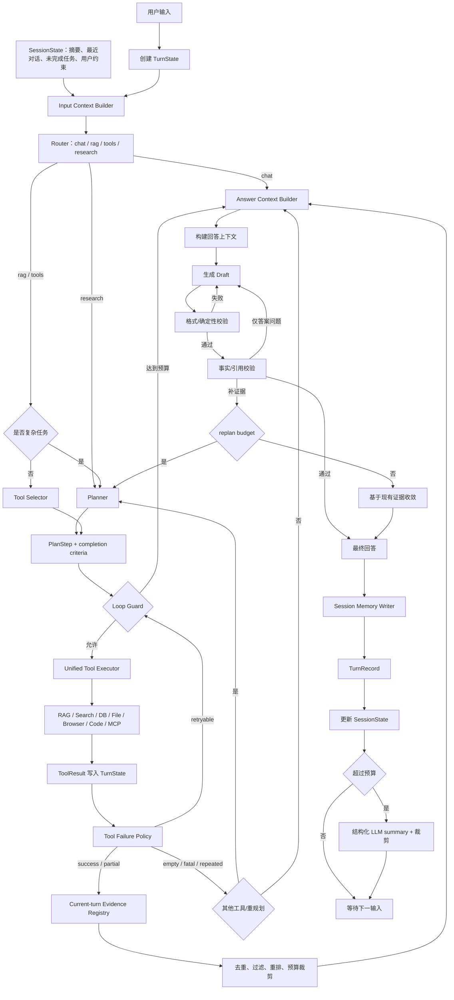

# 五个项目的 Agent 架构与实现细节对比

> 对比对象：OpenAI Codex、Anthropic Claude Code、xAI Grok-1、NousResearch Hermes Agent、OpenClaw
> 研究日期：2026-07-25
> 详细单项报告：
> [`AGENT_SOURCE_01_CODEX.md`](./AGENT_SOURCE_01_CODEX.md) ·
> [`AGENT_SOURCE_02_CLAUDE_CODE.md`](./AGENT_SOURCE_02_CLAUDE_CODE.md) ·
> [`AGENT_SOURCE_03_GROK1.md`](./AGENT_SOURCE_03_GROK1.md) ·
> [`AGENT_SOURCE_04_HERMES_AGENT.md`](./AGENT_SOURCE_04_HERMES_AGENT.md) ·
> [`AGENT_SOURCE_05_OPENCLAW.md`](./AGENT_SOURCE_05_OPENCLAW.md)

## 0. 对比口径

五个项目不在同一抽象层：

| 项目         | 主要层级                                               | 公开实现完整度                                                |
| ------------ | ------------------------------------------------------ | ------------------------------------------------------------- |
| Codex        | coding-agent harness + CLI/TUI/App Server              | 核心 runtime 大量开源                                         |
| Claude Code  | coding-agent 产品/harness                              | 公开仓库主要是 plugins/examples/changelog；核心行为靠官方文档 |
| Grok-1       | 基础模型 + JAX inference                               | 模型推理代码开源，不含 agent                                  |
| Hermes Agent | Python personal-agent harness                          | 核心 loop/tools/context/session 大量开源                      |
| OpenClaw     | Gateway + personal-agent platform + 多 harness runtime | 平台和核心 runtime 大量开源                                   |

### 0.1 本次对比固定的版本

| 项目         | Commit                                     | 快照日期   | 根许可证/使用条款                                   |
| ------------ | ------------------------------------------ | ---------- | --------------------------------------------------- |
| Codex        | `4c43465133428898aa84f0bfc02c306ed65fb66a` | 2026-07-25 | Apache-2.0                                          |
| Claude Code  | `7ef6eec9d9ba84ea6f233f26c45f1df5c5991843` | 2026-07-25 | Anthropic copyright，使用受其 Commercial Terms 约束 |
| Grok-1       | `7050ed204b8206bb8645c7b7bbef7252f79561b0` | 2024-03-19 | Apache-2.0                                          |
| Hermes Agent | `760112adb6458417da8614d2269e5325f0739ed5` | 2026-07-25 | MIT                                                 |
| OpenClaw     | `6e604438b6a2274145bae60aef053afa78d9170d` | 2026-07-25 | MIT                                                 |

版本固定很重要：默认阈值、schema 字段、工具数量和 provider 支持会快速变化。本文比较概念与上述源码状态，避免把未来版本行为倒推到当前快照。

所以“哪个 agent 最好”不是准确问题。更有意义的是：

- 谁拥有 loop；
- tool protocol 如何设计；
- context 谁管理；
- session 真相源在哪里；
- memory 是检索还是 prompt；
- schema 如何跨边界；
- output validation 能保证到哪一层；
- failure/retry 是否会重复副作用。

---

## 1. 一页总结

### 1.1 各项目最值得研究的部分

| 项目        | 最强学习价值                                                                                       | 主要边界                            |
| ----------- | -------------------------------------------------------------------------------------------------- | ----------------------------------- |
| Codex       | 强类型 turn loop、统一工具 runtime、sandbox/审批、compaction、app protocol                         | 通用知识库 RAG 不是核心             |
| Claude Code | tool-use 契约、permissions、hooks、skills/plugin 规范、subagent 产品形态                           | 核心 runtime 私有，源码级细节有边界 |
| Grok-1      | 模型推理、MoE、KV cache、JAX batching；证明 model ≠ agent                                          | 没有 tools/RAG/memory/harness       |
| Hermes      | provider normalization、工具自注册、消息 repair、SQLite session、结构化摘要、自改进                | Python 单体历史包袱较重，模块仍很大 |
| OpenClaw    | Gateway、harness-of-harnesses、context engine、tool search、memory RAG、schema/codegen、loop guard | 功能面广，直接照搬复杂度过高        |

### 1.2 对 `agent_learing` 的组合建议

```text
Loop / state：Codex
Tool-use contract / hooks：Claude Code
Provider-neutral adapter / repair：Hermes
Context engine / pruning / loop guard：OpenClaw
Model backend boundary：从 Grok-1 学“模型不拥有 agent state”
```

---

## 2. Chain 与 Loop 对比

### 2.1 五者核心循环

| 项目        | 循环单位                                      | 继续条件                                            | 结束判定                                        |
| ----------- | --------------------------------------------- | --------------------------------------------------- | ----------------------------------------------- |
| Codex       | thread -> turn -> sampling/tool steps         | tool result、pending input、`needs_follow_up`、hook | no follow-up + hooks 接受                       |
| Claude Code | session -> assistant/tool-use iterations      | `stop_reason=tool_use`、hook、subagent              | `end_turn` + Stop hook 接受                     |
| Grok-1      | token generation                              | 未达 `max_len`                                      | 达 `max_len`；公开 runner 未体现完整 agent stop |
| Hermes      | session/task -> provider/tool iterations      | tool calls、verification continuation、retry        | final candidate 通过 finalizer                  |
| OpenClaw    | Gateway run -> runtime attempts -> tool steps | tool call、compact/retry/fallback、hooks            | runtime settled + finalization + delivery       |

### 2.2 统一抽象



### 2.3 差异

#### Codex

- `run_turn` 外层 loop 与 streaming sampling 内层分开；
- response item 到达即记录；
- 工具 future 可并发；
- pending user steer 可在 loop 边界进入；
- pre/mid-turn compaction；
- stop hook 可延长 turn。

#### Claude Code

- 官方契约清晰：tool_use -> client execution -> tool_result -> next model call；
- permissions 与 hooks 是宿主确定性控制；
- subagent 是独立 context；
- 核心源码函数边界没有公开。

#### Grok-1

- 循环是 prefill + autoregressive sample；
- 没有 TurnState、tool result 或 planner；
- KV cache 只是推理加速。

#### Hermes

- provider-neutral internal messages；
- 大量 pre-call sanitizer；
- 工具执行可分段并发；
- verification candidate 可回 loop；
- provider fallback/repair 边界丰富。

#### OpenClaw

- Gateway 先异步接受 run；
- per-session lane + global lane；
- runtime 可插拔；
- 最终 delivery 是 loop 的一部分；
- post-compaction 重复 guard。

### 2.4 推荐你的 loop state

```python group=multi-42a7575cc5f1 label=Python
@dataclass
class TurnState:
    turn_id: str
    session_id: str
    user_input: str
    route: str | None
    plan: list["PlanStep"]
    tool_calls: list["ToolCall"]
    tool_results: list["ToolResult"]
    evidence: dict[str, "EvidenceItem"]
    draft: str | None
    validation: list["ValidationResult"]
    step_count: int
    replan_count: int
    model_attempt_count: int
    compaction_count: int
    started_at: datetime
    stop_reason: str | None
```

```rust group=multi-42a7575cc5f1 label=Rust
use chrono::{DateTime, Utc};
use std::collections::HashMap;

struct TurnState {
    turn_id: String,
    session_id: String,
    user_input: String,
    route: Option<String>,
    plan: Vec<PlanStep>,
    tool_calls: Vec<ToolCall>,
    tool_results: Vec<ToolResult>,
    evidence: HashMap<String, EvidenceItem>,
    draft: Option<String>,
    validation: Vec<ValidationResult>,
    step_count: u32,
    replan_count: u32,
    model_attempt_count: u32,
    compaction_count: u32,
    started_at: DateTime<Utc>,
    stop_reason: Option<String>,
}
```

```javascript group=multi-42a7575cc5f1 label=JavaScript
/**
 * @typedef {{
 *   turnId: string,
 *   sessionId: string,
 *   userInput: string,
 *   route?: string,
 *   plan: PlanStep[],
 *   toolCalls: ToolCall[],
 *   toolResults: ToolResult[],
 *   evidence: Map<string, EvidenceItem>,
 *   draft?: string,
 *   validation: ValidationResult[],
 *   stepCount: number,
 *   replanCount: number,
 *   modelAttemptCount: number,
 *   compactionCount: number,
 *   startedAt: Date,
 *   stopReason?: string
 * }} TurnState
 */
```

```typescript group=multi-42a7575cc5f1 label=TypeScript
type TurnState = {
  turnId: string
  sessionId: string
  userInput: string
  route?: string
  plan: PlanStep[]
  toolCalls: ToolCall[]
  toolResults: ToolResult[]
  evidence: Map<string, EvidenceItem>
  draft?: string
  validation: ValidationResult[]
  stepCount: number
  replanCount: number
  modelAttemptCount: number
  compactionCount: number
  startedAt: Date
  stopReason?: string
}
```

---

## 3. Planner 与 Router

### 3.1 项目侧重点

| 项目        | Router/Planner 形态                                                          |
| ----------- | ---------------------------------------------------------------------------- |
| Codex       | 模型在 turn loop 内动态选择工具；tool router 负责调用分派，不等于意图 Router |
| Claude Code | 模型自主 plan/tool use，subagents/commands 可定义流程                        |
| Grok-1      | 无 agent router                                                              |
| Hermes      | 主模型动态选择工具，delegation/todo 等辅助计划                               |
| OpenClaw    | runtime/model/policy router + 模型内部工具规划                               |

### 3.2 对你的 `chat/rag/tools/research`

不要让一次 Router 回答过多问题。拆成：

1. **Capability route**
   - 当前请求仅靠模型知识？
   - 需要内部 RAG？
   - 需要外部工具？
   - 需要多步 research？
2. **Knowledge coverage**
   - 当前知识库是否可能覆盖？
   - 这需要调用轻量 retrieval probe，不应靠 Router 猜。
3. **Complexity**
   - 单工具还是 planner？
4. **Tool selection**
   - 由 tool catalog/metadata 选择。

### 3.3 推荐链



Router 分类一致性要用固定 eval，不应只看几个手工 prompt。

---

## 4. Tools / Function Calling 对比

### 4.1 总表

| 维度           | Codex                     | Claude Code                 | Grok-1 | Hermes                           | OpenClaw                    |
| -------------- | ------------------------- | --------------------------- | ------ | -------------------------------- | --------------------------- |
| Tool schema    | Rust/JSON Schema ToolSpec | Anthropic `input_schema`    | 无     | OpenAI function schema           | TypeBox/JSON Schema         |
| Registry       | 强类型 registry           | 产品 registry，细节未公开   | 无     | import-time self-register        | built-in/plugin/MCP catalog |
| Router         | ResponseItem -> ToolCall  | tool_use blocks             | 无     | provider normalize -> tool_calls | runtime/tool catalog        |
| 并发           | 声明能力 + RwLock         | 支持并行 tool_use，宿主执行 | 无     | ThreadPool + segmented           | runtime/queue/policy        |
| Hooks          | pre/post tool             | 丰富 hooks                  | 无     | plugin/approval hooks            | 全平台 hooks                |
| Permission     | sandbox/approval          | deny > ask > allow          | 无     | dangerous approval/toolset       | policy/approval/sandbox     |
| Deferred tools | tool search/deferred      | MCP Tool Search             | 无     | 以 toolsets/availability 为主    | 三模式 Tool Search          |
| Output schema  | typed output/result       | tool_result blocks          | 无     | 主要字符串/JSON，逐步规范        | 可验证 `details`            |

### 4.2 共同正确模式

```text
Tool Definition
-> policy-filtered exposure
-> model tool call
-> parse/schema
-> semantic parameter validation
-> permission/hook
-> execute
-> normalize output
-> truncate/store full
-> evidence extraction
-> tool result paired into history
```

### 4.3 不应做的模式

```python group=multi-d6341fe434cd label=Python
if llm_output["tool"] == "calculator":
    result = calculator(**llm_output["args"])
    messages.append(str(result))
```

```rust group=multi-d6341fe434cd label=Rust
if llm_output.tool == "calculator" {
    let result = calculator(&llm_output.args)?;
    messages.push(result.to_string());
}
```

```javascript group=multi-d6341fe434cd label=JavaScript
if (llmOutput.tool === 'calculator') {
  const result = calculator(llmOutput.args)
  messages.push(String(result))
}
```

```typescript group=multi-d6341fe434cd label=TypeScript
if (llmOutput.tool === 'calculator') {
  const result = calculator(llmOutput.args)
  messages.push(String(result))
}
```

缺失：

- tool 是否存在；
- args schema；
- 语义校验；
- call id；
- 错误类型；
- 超时；
- 权限；
- 重复；
- trace；
- output schema；
- evidence；
- role/pairing。

### 4.4 Tool 与 MCP

四个 harness 都提示同一个结论：

```text
MCP is an adapter/source of tools,
not a second orchestration system.
```

推荐：

```python group=multi-ac41b0d61437 label=Python
class ToolAdapter(Protocol):
    def list_tools(self) -> list[ToolDefinition]: ...
    async def invoke(self, call: ToolCall) -> ToolResult: ...
```

```rust group=multi-ac41b0d61437 label=Rust
use async_trait::async_trait;

#[async_trait]
trait ToolAdapter {
    fn list_tools(&self) -> Vec<ToolDefinition>;
    async fn invoke(&self, call: ToolCall) -> Result<ToolResult, ToolError>;
}
```

```javascript group=multi-ac41b0d61437 label=JavaScript
class ToolAdapter {
  /** @returns {ToolDefinition[]} */
  listTools() {
    throw new Error('implement listTools()')
  }

  /** @param {ToolCall} call @returns {Promise<ToolResult>} */
  async invoke(call) {
    throw new Error('implement invoke(call)')
  }
}
```

```typescript group=multi-ac41b0d61437 label=TypeScript
interface ToolAdapter {
  listTools(): ToolDefinition[]
  invoke(call: ToolCall): Promise<ToolResult>
}
```

内置 Python tool、MCP、browser client、DB connector 都适配到这里。

### 4.5 Tool Search

当工具从 5 个增长到几十/几百：

- Codex：deferred exposure + search；
- Claude Code：MCP Tool Search；
- OpenClaw：code/tools/directory 三模式；
- Hermes：toolset/availability，进一步也适合加 tool search。

适合你的策略：

```text
0-20 tools：直接 schema
20-80：toolset/namespace 过滤
80+：目录检索 -> describe -> call
```

数量只是经验值，真正触发条件应是 schema token 成本与选择准确率。

---

## 5. Skills 对比

### 5.1 总表

| 维度                   | Codex                       | Claude Code                 | Grok-1 | Hermes                    | OpenClaw                       |
| ---------------------- | --------------------------- | --------------------------- | ------ | ------------------------- | ------------------------------ |
| 基础文件               | `SKILL.md`                  | `SKILL.md`                  | 无     | `SKILL.md`                | `SKILL.md`                     |
| Progressive disclosure | 有                          | 有                          | 无     | 有                        | 有                             |
| 显式调用               | `$skill`/structured mention | `/skill` 等                 | 无     | 支持                      | user-invocable/command         |
| 隐式调用               | description match/policy    | description match           | 无     | metadata match            | model invocation 可控          |
| 附属资源               | scripts/references/assets   | scripts/references/assets   | 无     | scripts/references/assets | scripts/references/assets      |
| 依赖 gating            | tool/MCP deps               | allowed tools/host          | 无     | bins/env/platform/trust   | bins/env/config/os/install     |
| 安装生态               | system/user/plugin          | plugin/marketplace          | 无     | Skills Hub/自改进         | ClawHub/workshop               |
| Compaction 恢复        | invoked skills 可重注入     | invoked skills 有预算重注入 | 无     | summary/prompt 重建       | skill snapshot/context rebuild |

### 5.2 共同规范

```yaml
---
name: cited-research
description: Research a topic with search tools and return source-backed claims.
---
```

正文原则：

- description 写触发条件，避免空泛宣传；
- 正文命令式；
- 核心流程短；
- 长 schema/例子进 references；
- 脚本输入输出明确；
- 依赖声明；
- 路径相对 skill root；
- 有 eval；
- secrets 避免进入文件。

### 5.3 Skill 与 Tool

```text
Tool: “执行 SQL 查询”
Skill: “如何做只读数据库故障分析，包括查询顺序、证据要求和结论模板”
```

### 5.4 推荐 skill loader

```python group=multi-d0a048f4d97d label=Python
from typing import Protocol


class SkillCatalog(Protocol):
    def discover(self) -> list["SkillMetadata"]: ...
    def validate_metadata(self, skill: "SkillMetadata") -> None: ...
    def filter_by_environment(
        self, environment: "Environment"
    ) -> list["SkillMetadata"]: ...
    def render_catalog(self, budget: int) -> str: ...
    def select_explicit(self, name: str) -> "SkillMetadata | None": ...
    def select_implicit(self, query: str) -> list["SkillMetadata"]: ...
    def load_body(self, skill: "SkillMetadata") -> str: ...
    def resolve_resource(self, path: str) -> bytes: ...
```

```rust group=multi-d0a048f4d97d label=Rust
trait SkillCatalog {
    fn discover(&self) -> Vec<SkillMetadata>;
    fn validate_metadata(&self, skill: &SkillMetadata) -> Result<(), SkillError>;
    fn filter_by_environment(&self, environment: &Environment) -> Vec<SkillMetadata>;
    fn render_catalog(&self, budget: usize) -> String;
    fn select_explicit(&self, name: &str) -> Option<SkillMetadata>;
    fn select_implicit(&self, query: &str) -> Vec<SkillMetadata>;
    fn load_body(&self, skill: &SkillMetadata) -> Result<String, SkillError>;
    fn resolve_resource(&self, path: &str) -> Result<Vec<u8>, SkillError>;
}
```

```javascript group=multi-d0a048f4d97d label=JavaScript
class SkillCatalog {
  discover() {}
  validateMetadata() {}
  filterByEnvironment() {}
  renderCatalog(budget) {}
  selectExplicit(name) {}
  selectImplicit(query) {}
  loadBody(skill) {}
  resolveResource(path) {}
}
```

```typescript group=multi-d0a048f4d97d label=TypeScript
interface SkillCatalog {
  discover(): SkillMetadata[]
  validateMetadata(skill: SkillMetadata): void
  filterByEnvironment(environment: Environment): SkillMetadata[]
  renderCatalog(budget: number): string
  selectExplicit(name: string): SkillMetadata | undefined
  selectImplicit(query: string): SkillMetadata[]
  loadBody(skill: SkillMetadata): string
  resolveResource(path: string): Uint8Array
}
```

---

## 6. RAG 与检索对比

### 6.1 谁有传统 RAG

| 项目        | 传统向量 RAG                      | 其他检索                                   |
| ----------- | --------------------------------- | ------------------------------------------ |
| Codex       | core 不是通用 vector RAG          | repo、tool、skill、memory lexical、web/MCP |
| Claude Code | 产品不是通用 vector DB            | Glob/Grep/Read、web、MCP、tool search      |
| Grok-1      | 无                                | 无                                         |
| Hermes      | 可选外部 memory/search backend    | web/file/session FTS/skills                |
| OpenClaw    | memory-core 可 hybrid vector+BM25 | tools、skills、files、session、MCP         |

### 6.2 RAG 不应只返回字符串

建议：

```python group=multi-948b1c937a91 label=Python
@dataclass(frozen=True)
class EvidenceItem:
    id: str
    turn_id: str
    source_type: Literal["rag", "web", "db", "file", "browser", "code", "memory"]
    uri: str
    locator: dict[str, object] | None
    excerpt: str
    content_hash: str
    score: float | None
    retrieved_at: datetime
    tool_call_id: str
    trust: str
```

```rust group=multi-948b1c937a91 label=Rust
use chrono::{DateTime, Utc};
use serde_json::Value;
use std::collections::HashMap;

struct EvidenceItem {
    id: String,
    turn_id: String,
    source_type: String,
    uri: String,
    locator: Option<HashMap<String, Value>>,
    excerpt: String,
    content_hash: String,
    score: Option<f64>,
    retrieved_at: DateTime<Utc>,
    tool_call_id: String,
    trust: String,
}
```

```javascript group=multi-948b1c937a91 label=JavaScript
/**
 * @typedef {{
 *   id: string,
 *   turnId: string,
 *   sourceType: 'rag'|'web'|'db'|'file'|'browser'|'code'|'memory',
 *   uri: string,
 *   locator?: Record<string, unknown>,
 *   excerpt: string,
 *   contentHash: string,
 *   score?: number,
 *   retrievedAt: Date,
 *   toolCallId: string,
 *   trust: string
 * }} EvidenceItem
 */
```

```typescript group=multi-948b1c937a91 label=TypeScript
type EvidenceItem = {
  id: string
  turnId: string
  sourceType: 'rag' | 'web' | 'db' | 'file' | 'browser' | 'code' | 'memory'
  uri: string
  locator?: Record<string, unknown>
  excerpt: string
  contentHash: string
  score?: number
  retrievedAt: Date
  toolCallId: string
  trust: string
}
```

### 6.3 完整 RAG



### 6.4 Router 判断知识库覆盖

不要让 Router 凭训练知识猜“知识库是否收录”。使用 retrieval probe：

```python group=multi-127e96f21a45 label=Python
class CoverageResult:
    status: Literal["covered", "partial", "not_covered", "error"]
    top_score: float | None
    distinct_sources: int
    evidence_ids: list[str]
    reason_code: str
```

```rust group=multi-127e96f21a45 label=Rust
enum CoverageStatus {
    Covered,
    Partial,
    NotCovered,
    Error,
}

struct CoverageResult {
    status: CoverageStatus,
    top_score: Option<f64>,
    distinct_sources: usize,
    evidence_ids: Vec<String>,
    reason_code: String,
}
```

```javascript group=multi-127e96f21a45 label=JavaScript
/**
 * @typedef {{
 *   status: 'covered'|'partial'|'not_covered'|'error',
 *   topScore?: number,
 *   distinctSources: number,
 *   evidenceIds: string[],
 *   reasonCode: string
 * }} CoverageResult
 */
```

```typescript group=multi-127e96f21a45 label=TypeScript
type CoverageResult = {
  status: 'covered' | 'partial' | 'not_covered' | 'error'
  topScore?: number
  distinctSources: number
  evidenceIds: string[]
  reasonCode: string
}
```

Coverage 结合：

- top score；
- source diversity；
- 关键实体命中；
- 时间范围；
- ACL；
- 空结果；
- 必要字段。

---

## 7. Context 与 Compression 对比

### 7.1 总表

| 项目        | Context 管理                              | 压缩                                              | Pruning              | 协议修复                          |
| ----------- | ----------------------------------------- | ------------------------------------------------- | -------------------- | --------------------------------- |
| Codex       | ContextManager、history version、注入     | local/remote，pre/mid turn                        | tool output 截断     | tool call/result 配对             |
| Claude Code | system/CLAUDE/memory/skills/tools/history | 自动/手动 compact                                 | 大输出/重复读取优化  | 产品内部处理，公开实现细节有限    |
| Grok-1      | token sequence                            | 无摘要，left truncate                             | pad/truncate         | 无 tool protocol                  |
| Hermes      | provider-neutral messages + sanitizer     | prune + head/middle/tail + structured LLM summary | 工具输出先裁剪       | 很强，处理 orphan/duplicate/roles |
| OpenClaw    | Context Engine + inspect                  | 持久 compaction                                   | 临时 session pruning | pairs + audits + loop guard       |

### 7.2 分层模型



### 7.3 LLM 摘要 schema

```json
{
  "goal": "...",
  "constraints": ["..."],
  "completed": ["..."],
  "decisions": [{ "decision": "...", "reason": "..." }],
  "artifacts": [{ "path": "...", "status": "..." }],
  "evidence_refs": ["ev_..."],
  "failures": ["..."],
  "open_tasks": ["..."],
  "next_action": "..."
}
```

摘要应：

- 增量更新 prior summary；
- preserve IDs/paths/commands；
- 不把猜测升级为事实；
- 保留失败；
- 带版本和 source turn range；
- 验证 schema；
- 压缩后修复 message/tool pair。

### 7.4 缓存何时生效

需要区分三个 cache：

| Cache                   | 生命周期            | 例子                  |
| ----------------------- | ------------------- | --------------------- |
| 同轮工具/RAG cache      | 一次用户输入的 turn | 相同 query 不重复检索 |
| Session retrieval cache | 多个 turns、短 TTL  | 相同 memory query     |
| Provider prompt cache   | provider 管理       | 稳定 system/tool 前缀 |

你之前加入的“同轮 RAG 缓存”应在：

```text
收到一次 prompt -> 创建 TurnState -> 当前 turn 多次 planner/tool loop -> final
```

之间有效；下一次用户输入创建新 registry/cache，避免过期和证据污染。若要跨 turn 复用，必须显式 TTL/provenance。

---

## 8. Memory 与 Session 对比

### 8.1 总表

| 项目        | Session                      | Session summary        | Long-term memory                 | Search                     |
| ----------- | ---------------------------- | ---------------------- | -------------------------------- | -------------------------- |
| Codex       | thread/turn/rollout          | compaction             | 两阶段 rollout 提炼/整合         | local lexical memory tools |
| Claude Code | session/resume/fork          | compaction             | CLAUDE.md + auto memory          | files/on-demand            |
| Grok-1      | 无 agent session             | 无                     | 无；KV cache 不算                | 无                         |
| Hermes      | SQLite/WAL/lineage           | structured compression | MEMORY/USER + providers + skills | FTS5/外部                  |
| OpenClaw    | Gateway session/scopes/locks | compaction             | MEMORY/daily/dreaming/plugins    | hybrid BM25/vector         |

### 8.2 四类状态

```text
Current Step State
  只服务一次 model attempt

Current Turn State
  plan、tool calls、current evidence、validators、budgets

Session State
  summary、recent turns、open tasks、user constraints

Long-term Memory
  跨 session 的稳定事实、偏好、skills/SOP
```

### 8.3 为什么先不做长期 memory

你当前更应先解决：

- Router；
- current-turn evidence 隔离；
- tool failure；
- validator 原因；
- session summary；
- context budget。

如果这些不稳定，长期 memory 会沉淀：

- 错误 Router 决策；
- 未验证工具结果；
- 历史污染；
- 过期数据；
- 模型幻觉。

### 8.4 Session schema 建议

```python group=multi-76fd9d1cce4d label=Python
@dataclass
class SessionState:
    session_id: str
    summary: SessionSummary
    recent_turns: deque[TurnRecord]
    open_tasks: list[OpenTask]
    user_constraints: list[Constraint]
    context_version: int
    last_compacted_turn_id: str | None
```

```rust group=multi-76fd9d1cce4d label=Rust
use std::collections::VecDeque;

struct SessionState {
    session_id: String,
    summary: SessionSummary,
    recent_turns: VecDeque<TurnRecord>,
    open_tasks: Vec<OpenTask>,
    user_constraints: Vec<Constraint>,
    context_version: u64,
    last_compacted_turn_id: Option<String>,
}
```

```javascript group=multi-76fd9d1cce4d label=JavaScript
/**
 * @typedef {{
 *   sessionId: string,
 *   summary: SessionSummary,
 *   recentTurns: TurnRecord[],
 *   openTasks: OpenTask[],
 *   userConstraints: Constraint[],
 *   contextVersion: number,
 *   lastCompactedTurnId?: string
 * }} SessionState
 */
```

```typescript group=multi-76fd9d1cce4d label=TypeScript
type SessionState = {
  sessionId: string
  summary: SessionSummary
  recentTurns: TurnRecord[]
  openTasks: OpenTask[]
  userConstraints: Constraint[]
  contextVersion: number
  lastCompactedTurnId?: string
}
```

---

## 9. Harness 对比

### 9.1 能力矩阵

| 能力                  |          Codex | Claude Code |          Grok-1 |                  Hermes |              OpenClaw |
| --------------------- | -------------: | ----------: | --------------: | ----------------------: | --------------------: |
| Own model loop        |              ✓ |           ✓ | token loop only |                       ✓ |              ✓/可委托 |
| Tool registry         |              ✓ |           ✓ |                 |                       ✓ |                     ✓ |
| Permissions           |              ✓ |           ✓ |                 |                       ✓ |                     ✓ |
| Durable session       |              ✓ |           ✓ |                 |                       ✓ |                     ✓ |
| Compaction            |              ✓ |           ✓ |                 |                       ✓ |                     ✓ |
| Skills                |              ✓ |           ✓ |                 |                       ✓ |                     ✓ |
| MCP                   |              ✓ |           ✓ |                 |                       ✓ |                     ✓ |
| Multi-agent           |              ✓ |           ✓ |                 |                       ✓ |                     ✓ |
| Multi-channel gateway |    较弱/非核心 | 较弱/非核心 |                 |                       ✓ |                    ✓✓ |
| Runtime plugin        |     extensions | SDK/plugins |                 |        provider plugins |       harness plugins |
| Protocol/codegen      | Rust/schema/TS |   SDK types |                 | Python/provider schemas | TypeBox/AJV/multilang |

### 9.2 Harness 价值

根据 [Agent Learning Hub](https://datawhalechina.github.io/Agent-Learning-Hub/) Stage 3，harness 不是“再包一层 SDK”，而是固定：

- loop；
- registry；
- permissions；
- state/session；
- context compaction；
- trace；
- feedback；
- replay；
- budget；
- tests。

### 9.3 Ownership

对每个组件写清 owner：

| 数据/行为            | 建议 owner            |
| -------------------- | --------------------- |
| Current TurnState    | Chain runtime         |
| Durable SessionState | Session store         |
| Tool execution       | Unified Tool Executor |
| Tool policy          | Permission service    |
| Evidence             | Current-turn registry |
| Context projection   | Context Builder       |
| Compaction           | Context service       |
| Final response       | Finalizer             |
| Provider wire format | Model adapter         |
| Long memory          | Memory service        |

---

## 10. LLM 返回检查对比

### 10.1 层级矩阵

| 层                        | Codex                | Claude Code        | Grok-1          | Hermes                    | OpenClaw              |
| ------------------------- | -------------------- | ------------------ | --------------- | ------------------------- | --------------------- |
| Stream 完整性             | 有                   | 有                 | 本地 token loop | 有                        | 有                    |
| Tool arg schema           | 有                   | 有                 | 无              | 有/清理                   | 有                    |
| Tool pair repair          | 有                   | 产品具备           | 无              | 强                        | 有                    |
| Final JSON schema         | 支持                 | SDK/CLI 支持       | 无              | provider-dependent/可扩展 | llm-task/swarm 等     |
| Exact deterministic check | 可由宿主             | 可由 hook/SDK      | 无              | 可由 finalizer            | 可由 tool/plugin      |
| Semantic factual verifier | 专用 reviewer/需定制 | 需 hook/agent 定制 | 无              | verification/finalizer    | 需 evidence validator |
| Repeated loop guard       | budgets/工具状态     | hooks/budgets      | 无              | limits/dedup              | 强，含 post-compact   |

### 10.2 三层验证

#### Layer 1：协议

- response 完整；
- JSON parse；
- content/tool blocks；
- call ids；
- 角色顺序。

#### Layer 2：确定性

- JSON Schema；
- exact enum/value；
- field range；
- 引用 id 存在；
- plan step 全部完成；
- tool result status。

#### Layer 3：开放语义

- claim 是否有证据；
- 证据是否真正支持；
- 答案是否回答问题；
- 是否需要补查；
- 多个来源是否冲突。

### 10.3 Validator 路由

| 失败类型      | 返回                            |
| ------------- | ------------------------------- |
| JSON/格式     | Generator                       |
| 确定值不符    | Generator，给 expected/received |
| tool args     | Tool selection/generation       |
| 缺 evidence   | Planner                         |
| evidence 冲突 | Planner/research                |
| 仅措辞不清    | Generator                       |
| 达预算        | Convergent finalizer            |

### 10.4 防止 validator 历史污染

Validator 输入应是：

```text
current user request
current constraints
draft
current-turn evidence registry
completion criteria
```

默认不传全 session 原始 tool history。若历史事实需要使用，先导入当前 turn evidence。

---

## 11. Tool failure policy 对比与统一方案

### 11.1 状态机



### 11.2 Retry key

```text
tool_name
+ canonical args
+ relevant context version
+ target resource identity
```

只有 tool+args 不一定够，例如当前 browser tab 已变化。

### 11.3 Side-effect tools

需要 idempotency key：

```text
send message
write DB
create issue
deploy
purchase
delete
```

失败后先查询执行状态，再决定是否重放。

### 11.4 Empty

空结果是成功执行的业务状态：

```json
{
  "status": "empty",
  "query": "...",
  "source": "...",
  "filters": {},
  "suggested_action": "broaden_query"
}
```

---

## 12. Schema 对比

### 12.1 各自方式

| 项目        | 主要 schema 技术                                                    |
| ----------- | ------------------------------------------------------------------- |
| Codex       | Rust enums/structs + serde + schemars + TS export                   |
| Claude Code | Anthropic content block/tool JSON schema + SDK types                |
| Grok-1      | Python dataclass/NamedTuple，主要 tensor invariants                 |
| Hermes      | dict/OpenAI schema + Pydantic/provider adapters + SQLite migrations |
| OpenClaw    | TypeBox + AJV + JSON Schema + Swift/Kotlin codegen；Zod config      |

### 12.2 Schema 需要覆盖的对象

```text
RouteDecision
PlanStep
ToolDefinition
ToolCall
ToolResult
ToolError
EvidenceItem
ContextFragment
ValidationResult
TurnRecord
SessionSummary
ProtocolEvent
```

### 12.3 推荐 Python

边界使用 Pydantic：

```python group=multi-3e096de71ef8 label=Python
class ValidationResult(BaseModel):
    status: Literal["pass", "fail"]
    reason_code: str | None = None
    retry_target: Literal["generator", "planner", "tool", "none"]
    message: str | None = None
    failed_claim_ids: list[str] = []
```

```rust group=multi-3e096de71ef8 label=Rust
enum ValidationStatus {
    Pass,
    Fail,
}

enum RetryTarget {
    Generator,
    Planner,
    Tool,
    None,
}

struct ValidationResult {
    status: ValidationStatus,
    reason_code: Option<String>,
    retry_target: RetryTarget,
    message: Option<String>,
    failed_claim_ids: Vec<String>,
}
```

```javascript group=multi-3e096de71ef8 label=JavaScript
/**
 * @typedef {{
 *   status: 'pass'|'fail',
 *   reasonCode?: string,
 *   retryTarget: 'generator'|'planner'|'tool'|'none',
 *   message?: string,
 *   failedClaimIds: string[]
 * }} ValidationResult
 */
```

```typescript group=multi-3e096de71ef8 label=TypeScript
type ValidationResult = {
  status: 'pass' | 'fail'
  reasonCode?: string
  retryTarget: 'generator' | 'planner' | 'tool' | 'none'
  message?: string
  failedClaimIds: string[]
}
```

内部热点路径可用 frozen dataclass，避免每一步重复昂贵 validation。

### 12.4 Versioning

- schema version；
- migration；
- unknown fields policy；
- optional vs nullable；
- stable enum；
- fixture；
- backward compatibility；
- API client generation；
- trace 也带 schema version。

---

## 13. 权限与边界

### 13.1 共同原则

```text
Model proposes; harness decides.
```

权限层应看到：

- tool；
- 参数；
- session/user；
- workspace；
- 当前 policy；
- 风险类别；
- approval history；
- subagent/runtime；
- channel。

### 13.2 Policy 位置

```text
Tool discovery 前：隐藏不可用能力
Tool call 后：检查具体参数
Execution 前：审批/sandbox
Execution 后：结果脱敏/截断
Persist 前：过滤 secrets
Final 前：引用/隐私检查
```

### 13.3 Prompt injection

RAG/web/tool result 都是不受信数据：

- 不与 system instruction 同权限；
- evidence 保留 source；
- 工具输出中的“请执行命令”只是内容；
- MCP/client tool schema/output 有 trust 标记；
- 引用检查不应让外部文本改写 validator rules。

---

## 14. 并发、多 Agent 与停止

### 14.1 工具并发

- Codex：tool declares parallel，RW lock；
- Claude：模型可发并行 tool_use，宿主并行；
- Hermes：分段 ThreadPool；
- OpenClaw：runtime/queues；
- Grok-1：推理 batch，不是工具并发。

### 14.2 Multi-agent

| 风险           | 对策                        |
| -------------- | --------------------------- |
| 上下文复制爆炸 | 子 agent 只收任务片段       |
| 无限委派       | depth/count budget          |
| 重复工作       | task registry + ownership   |
| 结果冲突       | supervisor merge + evidence |
| session 污染   | 独立 child context          |
| 副作用冲突     | shared lock/idempotency     |
| 失败丢失       | structured child result     |

### 14.3 子 agent 返回

```json
{
  "task_id": "sub_1",
  "status": "completed",
  "summary": "...",
  "artifacts": [],
  "evidence": ["ev_..."],
  "open_questions": [],
  "errors": []
}
```

---

## 15. 可观测性

### 15.1 Trace event schema

```python group=multi-4746aa4071c1 label=Python
class TraceEvent(BaseModel):
    event_id: str
    session_id: str
    turn_id: str
    step_id: str | None
    type: str
    timestamp: datetime
    payload: dict[str, object]
    parent_event_id: str | None
    schema_version: int
```

```rust group=multi-4746aa4071c1 label=Rust
use chrono::{DateTime, Utc};
use serde_json::Value;
use std::collections::HashMap;

struct TraceEvent {
    event_id: String,
    session_id: String,
    turn_id: String,
    step_id: Option<String>,
    event_type: String,
    timestamp: DateTime<Utc>,
    payload: HashMap<String, Value>,
    parent_event_id: Option<String>,
    schema_version: u32,
}
```

```javascript group=multi-4746aa4071c1 label=JavaScript
/**
 * @typedef {{
 *   eventId: string,
 *   sessionId: string,
 *   turnId: string,
 *   stepId?: string,
 *   type: string,
 *   timestamp: Date,
 *   payload: Record<string, unknown>,
 *   parentEventId?: string,
 *   schemaVersion: number
 * }} TraceEvent
 */
```

```typescript group=multi-4746aa4071c1 label=TypeScript
type TraceEvent = {
  eventId: string
  sessionId: string
  turnId: string
  stepId?: string
  type: string
  timestamp: Date
  payload: Record<string, unknown>
  parentEventId?: string
  schemaVersion: number
}
```

### 15.2 必备事件

```text
turn.created
route.decided
plan.created/revised
model.request/response
tool.call.started/completed
tool.retry
evidence.added
context.built
context.compacted
validation.completed
turn.finalized
session.updated
```

### 15.3 关键指标

| 类别        | 指标                                                       |
| ----------- | ---------------------------------------------------------- |
| Router      | accuracy、consistency、coverage probe precision            |
| Tools       | arg validity、success、empty、retry、repeat                |
| RAG         | recall@k、MRR、citation precision/recall                   |
| Context     | tokens by category、compaction rate、information retention |
| Validation  | pass rate、repair attempts、reason codes                   |
| Agent       | task success、steps、latency、cost                         |
| Session     | resume success、cross-turn contamination                   |
| Permissions | prompt/allow/deny、policy miss                             |

---

## 16. Evals

### 16.1 Datawhale 路线映射

[Agent Learning Hub](https://datawhalechina.github.io/Agent-Learning-Hub/) 的 Stage 0–8 可以映射为：

| Stage                | 五个项目给出的样本                                      |
| -------------------- | ------------------------------------------------------- |
| 0 概念               | Grok-1 对照证明 model 与 agent 区分                     |
| 1 最小 loop          | Claude tool-use 契约、Codex/Hermes loop                 |
| 2 Tools/RAG/Memory   | OpenClaw memory、Hermes session、各家 tools             |
| 3 Harness            | Codex/OpenClaw/Hermes                                   |
| 4 Multi-agent        | Codex collaboration、Claude subagents、OpenClaw runtime |
| 5 Skills/协议        | 四个 harness 的 SKILL.md、MCP、schema                   |
| 6 Browser/computer   | 各 harness 的工具边界                                   |
| 7 Eval/observability | events、hooks、loop guard、tests                        |
| 8 产品               | session、deployment、gateway、cost、permissions         |

### 16.2 你的回归集

至少建立：

1. Router 50–200 个标注请求；
2. 知识库覆盖/不覆盖；
3. tool 参数缺失、错类型、互斥字段；
4. empty/retryable/fatal；
5. 相同调用三次；
6. tool result 超长；
   7.历史 evidence 与当前 evidence 同名；
7. compaction 后未完成任务恢复；
8. exact `[1,2,3]`；
9. citation id 不存在；
10. citation 存在但不支持 claim；
11. provider 空回复/截断；
12. session resume；
13. permission blocked；
14. MCP tool schema 动态加载。

---

## 17. 代码格式与风格对比

| 项目                    | 主要语言                 | 格式/静态检查                                 | 结构风格                                          |
| ----------------------- | ------------------------ | --------------------------------------------- | ------------------------------------------------- |
| Codex                   | Rust + TS                | rustfmt/clippy/just、schema export            | 强类型、小 API、exhaustive enum、模块限制         |
| Claude Code public repo | Markdown/TS/shell/Python | 核心 runtime 规则未公开；plugin 有 validators | YAML frontmatter、约定目录、progressive docs      |
| Grok-1                  | Python/JAX               | Ruff 4 spaces/100，仅少量规则                 | dataclass/NamedTuple、functional tensors          |
| Hermes                  | Python + TS              | PEP8 practical、Ruff PLW1514、ty、隔离 pytest | provider adapters、自注册工具、历史兼容 facade    |
| OpenClaw                | TypeScript               | oxfmt/oxlint/Vitest/architecture checks       | strict TS、unknown narrowing、discriminated union |

### 17.1 对你选择的 Ruff 方案 C

继续保持 Ruff 统一格式是合适的，但格式与架构分开：

- Ruff 只处理 formatting/lint；
- Pydantic/dataclass 处理 schema；
- 模块目录处理 ownership；
- integration tests 处理 loop；
- Markdown validator 处理 skills；
- migration 处理 session DB。

---

## 18. 面向 `agent_learing` 的目标架构

### 18.1 完整链路



### 18.2 模块

```text
chain/
  orchestrator.py
  loop_guard.py
  planner.py

context/
  input_builder.py
  answer_builder.py
  budget.py
  compression.py
  message_repair.py

tool/
  schema.py
  registry.py
  executor.py
  policy.py
  errors.py
  adapters/

rag/
  ingestion.py
  retriever.py
  reranker.py
  evidence.py
  cache.py

validation/
  schema_validator.py
  exact_validator.py
  citation_validator.py
  factual_validator.py

session/
  models.py
  store.py
  summary.py

skills/
  discovery.py
  loader.py
  models.py
  validator.py
```

### 18.3 “统一执行路径”的准确范围

统一执行路径指：

```text
ToolCall
-> parameter validation
-> policy/approval
-> execution
-> timeout/retry classification
-> ToolResult
-> trace/cache
-> Evidence extraction
```

它不应包住整个“RAG + 最终 LLM 回答”大链路。大链路由 orchestrator 管理；executor 是其中一段。

### 18.4 Evidence 是否等于上下文

不是。

```text
Evidence = 有来源、可引用的事实记录
Context = 某次模型请求实际看到的全部输入
```

Context 还包含 system、history、tools、skills、summary；Evidence 只是其中经过筛选的一部分。Evidence registry 可比当前 prompt 大，Context Builder 再按预算投影。

---

## 19. 分阶段实施

### 阶段 1：当前上下文与 session

- SessionState；
- TurnRecord；
- recent turns；
- structured summary；
- context budget；
- compaction trigger；
- message repair；
- tests。

### 阶段 2：Router/Planner/Executor

- strict route schema；
- coverage probe；
- PlanStep；
- LoopBudget；
- 统一 ToolResult；
- failure policy；
- duplicate guard。

### 阶段 3：Evidence/Validation

- EvidenceItem；
- current-turn registry；
- answer context；
- exact/schema validator；
- claim/citation validator；
- reason trace。

### 阶段 4：工具扩展

- search；
- DB；
- file；
- browser；
- code；
- MCP adapter；
- per-tool policy/timeout/output schema。

### 阶段 5：Skills 与可观测性

- SKILL.md；
- progressive disclosure；
- trace UI/log；
- eval suite；
- regression reports。

### 阶段 6：长期 memory / multi-agent

等当前链路稳定后再加入：

- 长期 facts/preferences；
- memory retrieval；
- promotion pipeline；
- subagent isolation；
- supervisor；
- task ownership。

---

## 20. 最终取舍

### 20.1 应直接采用的共同原则

1. 模型和 harness 分层；
2. Turn/Session/Long-memory 分层；
3. tools 走统一 registry/executor；
4. schema 先于自然语言约定；
5. context 有类别预算；
6. tool call/result 成对；
7. compaction 后做协议修复；
8. current-turn evidence 隔离；
9. deterministic validator 优先；
10. semantic validator 返回可执行原因；
11. retries 分类型和预算；
    12.副作用使用幂等 key；
12. skills progressive disclosure；
13. MCP 作为 tool adapter；
14. trace 和 eval 是产品功能。

### 20.2 暂时不适合复制的复杂度

- OpenClaw 多 channel gateway；
- 多个 harness runtime；
- Hermes 全 provider fallback matrix；
- Codex 完整 app-server 多语言协议；
- 自改进 skill/memory；
- 大规模 multi-agent；
- 几十种 memory provider。

先把单 session、单主 agent、统一工具、证据、验证和压缩做对，再扩展。

---

## 21. 主要来源

- [OpenAI Codex](https://github.com/openai/codex)
- [Claude Code](https://github.com/anthropics/claude-code)
- [Grok-1](https://github.com/xai-org/grok-1)
- [Hermes Agent](https://github.com/NousResearch/hermes-agent)
- [OpenClaw](https://github.com/openclaw/openclaw)
- [Datawhale Agent Learning Hub](https://datawhalechina.github.io/Agent-Learning-Hub/)
- [Datawhale 上下文截断与压缩](https://datawhalechina.github.io/hello-generic-agent/part2/chapter11/)

## 22. 总结

这五个项目共同说明，当前可用 agent 的能力大多来自 harness：

```text
LLM
+ loop
+ tools
+ permissions
+ context
+ session
+ memory
+ skills
+ validation
+ observability
+ evals
```

Grok-1 提供“LLM/推理”这一块；其余四个项目展示了 harness 如何把模型变成可执行、可恢复、可检查的系统。对你的项目而言，下一步的中心不是继续增加 Router prompt，而是稳定 `TurnState -> ToolResult -> Evidence -> ValidationResult -> SessionState` 这一组可测试契约。
