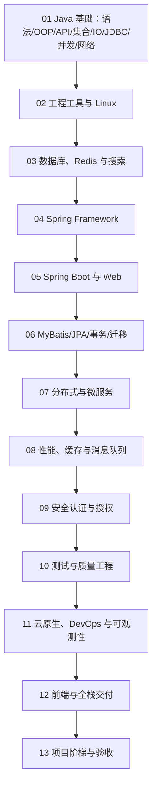

# Java 后端学习路线总览（2026）

> 主线版本：JDK 25 LTS。JDK 26 用于学习最新功能版本及 API；框架与依赖按项目兼容矩阵选择。路线整合本地 14 份 Java 课件、JavaDevelop 笔记、黑马程序员课程图谱、尚硅谷课程目录、roadmap.sh 与 JavaGuide 的学习顺序，并排除了与 Java 后端主线无关的内容。

## 1. 路线目标

完成本路线后，应能从语言和 JVM 基础出发，独立完成数据库建模、Spring Boot 服务、认证授权、缓存和消息、测试、容器化、可观测与生产发布；每一阶段都以可运行代码、测试、诊断证据和交付文档验收。

## 2. 版本基线

- **Java：** JDK 25 是当前最新 LTS，JDK 26 是当前最新功能版本。长期项目优先使用经过供应商支持的 LTS 补丁线。
- **Spring：** 新项目核对 Spring Framework 7 与 Spring Boot 4 的 Java/Servlet/Jakarta 基线；已有项目按 Spring Boot 3.5、4.0 等维护线的兼容矩阵升级。
- **构建：** Maven/Gradle Toolchain 固定编译 JDK，依赖由 BOM、版本目录或锁文件统一管理。
- **数据：** MySQL/PostgreSQL、Redis、消息系统和搜索引擎均以官方当前维护版本为准，并保留迁移与回滚测试。

## 3. 学习顺序

### 阶段一：语言与标准库

逐章完成 14 份课件对应文档。重点不是背 API，而是类型系统、对象模型、异常契约、集合复杂度、资源生命周期、JDBC 事务、Java Memory Model、线程协调和网络协议。

### 阶段二：单体服务工程能力

掌握 Git、Maven/Gradle、Linux、Docker、SQL、索引、事务、Redis；用 Spring Framework、Spring Boot、MVC、MyBatis/JPA 构建结构清晰、可测试的模块化单体。

### 阶段三：生产与分布式能力

先学习部分失败、CAP/一致性和幂等，再引入服务发现、RPC、网关、限流、消息队列、分布式事务、缓存和分片。每次拆分都需说明组织边界、数据所有权和运维收益。

### 阶段四：质量和交付

以测试金字塔、契约测试、Testcontainers、性能测试、安全验证、容器、Kubernetes、CI/CD、OpenTelemetry 和 SLO 形成上线闭环。

## 4. 主流课程路线对照与补齐结果

| 参考路线 | 重点顺序 | 本路线的映射与补齐 |
|---|---|---|
| 黑马程序员 Java 学习路线 | Java SE → JavaWeb → SSM → Spring Boot → 微服务与项目；专题覆盖 JVM、设计模式、MyBatis-Plus、Redis、MQ、Elasticsearch、Linux/Docker | 保留从语言到项目的渐进顺序；补入独立的数据结构与算法、设计模式、JVM、MyBatis-Plus、Spring Cloud Alibaba、Seata、Sentinel、SkyWalking 文档 |
| 尚硅谷 Java 课程 | Java 基础、数据结构、JUC、JVM、数据库、SSM、Spring Boot、微服务与项目 | 强化字节码/类加载/GC、并发、数据结构、源码与工程诊断；用阶段项目替代只看视频的完成标准 |
| JavaGuide | Java 基础、集合、JVM、并发、数据库、框架、分布式、高性能与系统设计 | 对齐核心知识，并增加 Spring Batch/Quartz、OpenAPI、文件/邮件/WebSocket、全链路测试和现代前端 |
| roadmap.sh Backend / Spring Boot | Internet/HTTP、语言、版本控制、数据库、API、安全、测试、缓存、容器、Web 框架与可观测性 | 将横向清单重排为可执行阶段，每阶段加入导学、代码、失败边界、验收和推荐阅读 |

**对照后的新增主线：**

1. 工程基础增加数据结构与算法、SOLID/UML/设计模式、JVM 内存/类加载/字节码/GC。
2. 框架阶段增加异步、定时任务、Quartz、Spring Batch，以及 OpenAPI、文件、邮件和 WebSocket。
3. 数据与微服务阶段增加 MyBatis-Plus、Spring Cloud/Alibaba 组件图、Seata/Sentinel/SkyWalking 的适用边界。
4. 性能阶段增加 Caffeine 本地缓存和 L1/L2 多级缓存。
5. 全栈阶段把 HTML、CSS、JavaScript、TypeScript、Vue、测试和性能拆成可独立学习的完整模块。

## 5. 每阶段统一验收

1. **知识：** 能解释术语、前提、失败模式和技术边界。
2. **代码：** 有最小示例、自动化测试、静态检查和可重复构建。
3. **数据：** 有 schema、迁移、执行计划、事务和恢复设计。
4. **运行：** 有配置、日志、指标、trace、health、容量和告警。
5. **安全：** 有身份、授权、输入、秘密、依赖和审计检查。
6. **交付：** 有镜像、部署、回滚、runbook 和故障演练证据。

## 6. 推荐学习节奏

| 周期 | 内容 | 可验证交付 |
|---|---|---|
| 1–6 周 | Java 基础、集合、IO、JDBC、并发、网络 | 命令行工具、并发任务器、JDBC 小项目 |
| 7–10 周 | 工具、Linux、数据库、Redis | 可复现构建、SQL 调优报告、缓存实验 |
| 11–16 周 | Spring、Boot、Web、MyBatis/JPA | 模块化 REST 服务与集成测试 |
| 17–22 周 | 分布式、网关、消息、高性能 | Outbox、幂等消费、容量与故障报告 |
| 23–26 周 | 安全、测试、云原生、可观测 | OIDC 服务、K8s 部署、SLO 仪表盘 |
| 持续 | 项目阶梯 | 可演示、可部署、可复盘的作品集 |

## 7. 正确性校验方法

- 语言规则以 JLS/JVMS 和 Java API 为准；框架行为以当前 reference 与源码测试为准。
- 数据库结论使用真实 schema、数据分布和 `EXPLAIN ANALYZE` 验证。
- 分布式结论必须声明故障模型、超时、重试、交付和一致性范围。
- 性能结论给出环境、负载、分位数、资源和剖析证据。
- 安全结论转成越权、重放、注入、泄露和依赖测试。

## 参考路线

- [Oracle Java Downloads](https://www.oracle.com/java/technologies/downloads/)
- [Spring Boot Reference](https://docs.spring.io/spring-boot/reference/)
- [roadmap.sh Backend Roadmap](https://roadmap.sh/backend)
- [roadmap.sh Spring Boot Roadmap](https://roadmap.sh/spring-boot)
- [JavaGuide Java 学习路线](https://javaguide.cn/roadmap/java-roadmap.html)
- [黑马程序员 Java 学习路线](https://yun.itheima.com/subject/javamap/index.html)
- [黑马程序员 Java 课程图谱](https://yun.itheima.com/map/javaeetree)
- [尚硅谷 Java 课程](https://atguigu.com/video/java/)
