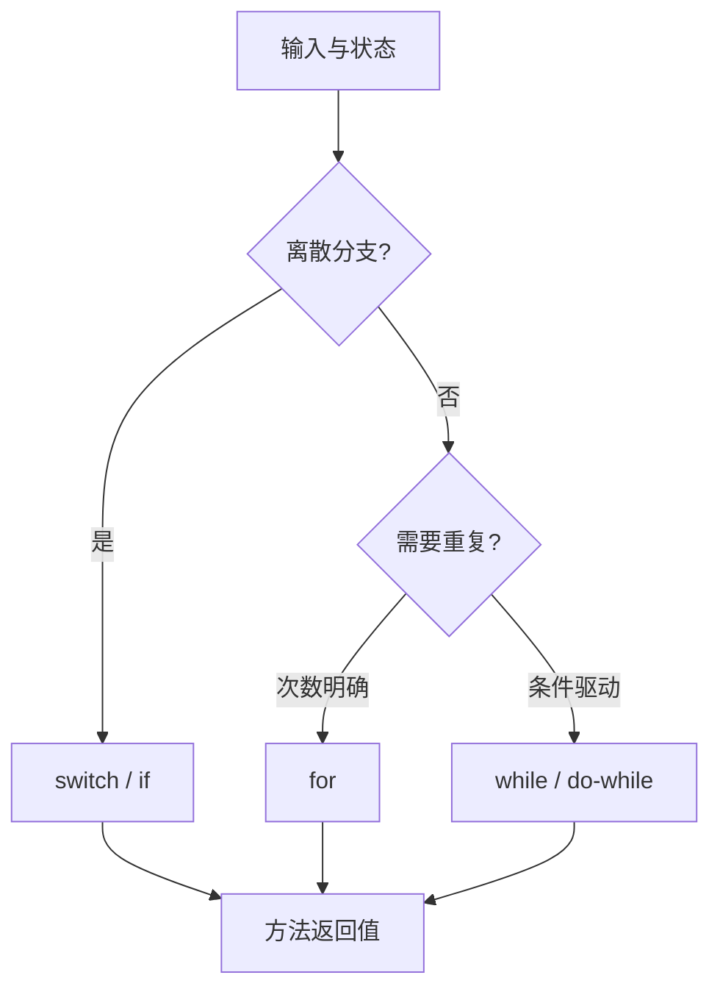

# Java 编程基础：语法、类型、运算、控制流、方法与数组

> 课件来源：《第2章 Java编程基础(1).pptx》。本文逐项覆盖课件目录，并依据 Java SE 26、JDK 25 LTS 及相关官方文档补充现代工程实践。

本章覆盖课件的程序结构、注释、标识符、关键字、常量变量、类型转换、运算符、分支循环、方法和一维/二维数组，并补充数值边界与可维护性规则。

## 1. 学习目标

- 理解 Java 的静态类型、值类型语义和数值提升规则。
- 能正确选择分支、循环、方法参数和数组结构。
- 能识别溢出、精度丢失、短路求值和数组越界。
- 建立命名、作用域和小函数习惯。

## 2. 知识结构



## 3. 逐项详解

### 1. 程序结构、注释与标识符

一个编译单元可包含 package、import 和类型声明。标识符区分大小写，可使用 Unicode 字符，但工程中通常采用 ASCII 英文命名。`//`、`/* */` 和 `/** */` 分别服务于行注释、块注释和 Javadoc。

**工程理解：** 注释解释约束和决策，不重复代码表面动作；公开 API 使用 Javadoc 描述契约、参数、返回值和异常。

**常见误区：** 用注释掩盖过长方法，或把中文、全角字符和相似 Unicode 字符混入关键标识符。

### 2. 关键字、字面量、常量与变量

变量拥有声明类型、名称、作用域和生命周期。`final` 表示变量只能赋值一次；对引用变量而言，引用本身固定，并不自动让对象不可变。整型、浮点、字符、字符串、布尔和 `null` 均有各自字面量规则。

**工程理解：** 常量使用有含义的名字；尽量缩小可变状态作用域，局部变量靠近首次使用处声明。

**常见误区：** 把 `final List` 误解为不可修改集合，或依赖未初始化局部变量。

### 3. 八种基本类型

`byte/short/int/long` 为有符号整数，`char` 是 UTF-16 code unit，`float/double` 遵循 IEEE 754，`boolean` 表示逻辑值。整数除法截断小数；浮点数存在 NaN、无穷和舍入误差。

**工程理解：** 金额使用整数最小货币单位或 `BigDecimal`；文本处理区分 code unit、Unicode code point 和 grapheme cluster。

**常见误区：** 用 `double` 保存精确金额，或认为一个 `char` 必然对应一个完整字符。

### 4. 类型转换与数值提升

窄类型参与算术运算通常先提升为 `int`；宽化转换一般安全但 `long` 到 `float/double` 仍可能丢精度；窄化转换需显式强制并可能截断高位。复合赋值隐含一次转换。

**工程理解：** 边界处使用 `Math.addExact` 等精确运算检测溢出，解析外部输入时校验范围。

**常见误区：** 认为强制转换等于四舍五入，或忽略 `int * int` 在赋给 long 之前已经溢出。

### 5. 算术、赋值、比较、逻辑与位运算

`&&`、`||` 短路求值；`&`、`|` 对布尔值不短路，对整数执行位运算。对象引用的 `==` 比较是否同一对象，内容相等通常使用 `equals`。运算符优先级可由括号明确表达。

**工程理解：** 复杂条件提取为命名良好的布尔方法；位标志仅在协议、性能或底层模型确实需要时使用。

**常见误区：** 用 `==` 比较字符串内容，或依赖读者记住长表达式的所有优先级。

### 6. if、条件表达式与 switch

`if/else` 适合范围和复杂谓词；三元表达式适合短小的值选择；`switch` 适合离散值。现代 switch 表达式用 `case ... ->` 避免意外贯穿，并可通过 `yield` 返回块结果。

**工程理解：** 把业务规则写成穷尽分支并配测试；枚举 switch 在增加新枚举值时应触发编译或测试反馈。

**常见误区：** 传统 switch 忘记 `break`，或把多层业务判断堆成难以验证的嵌套 if。

### 7. while、do-while、for 与增强 for

`while` 先判断，`do-while` 至少执行一次，`for` 适合明确初始化/条件/更新，增强 for 适合只读遍历。`break` 结束循环，`continue` 跳过本轮；标签只用于少量嵌套控制。

**工程理解：** 循环必须明确不变量、终止条件和每次迭代的进展；集合变更优先使用迭代器 API 或函数式变换。

**常见误区：** 边遍历边用集合自身 remove 破坏迭代器，或写出更新变量不前进的死循环。

### 8. 方法、参数、返回值、重载与可变参数

Java 始终按值传递：基本类型复制值，对象参数复制引用值。方法签名由名称和参数类型组成，返回类型不参与重载。可变参数编译为数组且每个方法最多一个、必须放末尾。

**工程理解：** 方法只承担一个清晰职责；用返回值表达结果，避免通过共享可变字段传递隐式状态。

**常见误区：** 把“传递引用值”说成“按引用传递”，或设计只有返回类型不同的重载。

### 9. 一维数组

数组是固定长度、同一元素类型的对象，索引范围为 `0..length-1`。创建后元素获得默认值；引用数组存放对象引用。复制需区分共享引用、浅拷贝与元素级深拷贝。

**工程理解：** 长度固定且按索引访问时用数组；动态增删优先集合。使用 `Arrays` 的排序、比较和复制工具。

**常见误区：** 访问 `length` 位置，或以为 `b = a` 创建了新数组。

### 10. 二维数组与不规则数组

Java 的二维数组本质是“数组的数组”，每一行可有不同长度。`new int[rows][cols]` 创建规则矩阵，也可逐行初始化不规则结构。

**工程理解：** 遍历每行时读取 `matrix[row].length`；矩阵算法要明确维度、空行和内存布局成本。

**常见误区：** 假设所有行与第一行同长，或混淆行列索引导致越界。

## 3.11 数值边界示例

```java
long wrong = 2_000_000_000 * 2;      // 先按 int 计算，已经溢出
long right = 2_000_000_000L * 2;     // long 运算
int checked = Math.addExact(2_000_000_000, 100_000_000);
```


## 4. 现代 Java 校准

- 现代 switch 表达式应优先于依赖贯穿行为的传统 switch。
- Java 参数传递统一为按值传递。
- 金额和精确十进制计算使用 `BigDecimal` 时要同时明确 scale 与 rounding mode。
- 字符处理涉及 emoji 或扩展字符时按 code point 处理，而不是假设 `char` 足够。

## 5. 实践任务

1. 实现一个命令行成绩统计器，覆盖空输入、非法数字、排序和分组。
2. 写测试证明 Java 的参数传递语义以及数组浅拷贝行为。
3. 用普通循环与 Stream 分别实现去重、筛选和汇总，并比较可读性。

## 6. 掌握检查

- [ ] 能列出八种基本类型及其关键边界。
- [ ] 能解释 `==`、`equals`、短路求值和数值提升。
- [ ] 能为控制流写出终止条件与边界测试。
- [ ] 能解释一维数组、二维数组和对象引用复制。

## 参考资料

- [Java Language Specification 26](https://docs.oracle.com/javase/specs/jls/se26/html/)
- [Java SE 26 API](https://docs.oracle.com/en/java/javase/26/docs/api/)
- [Dev.java Learn](https://dev.java/learn/)
