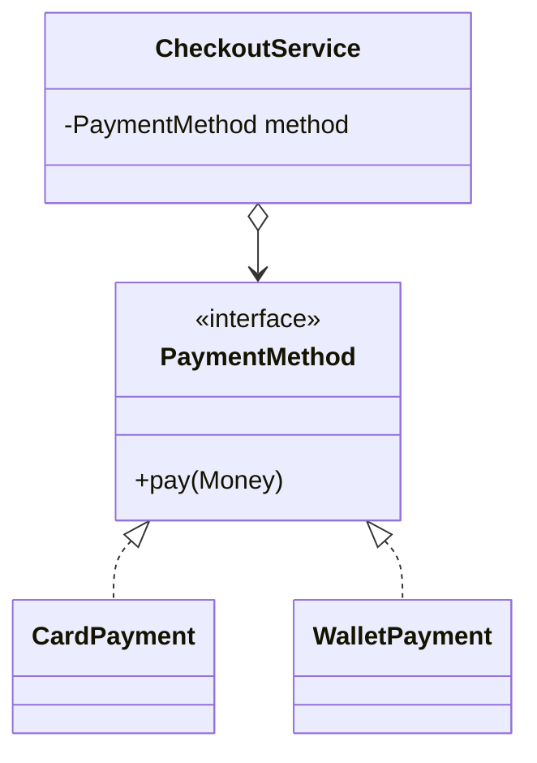

# 面向对象（下）：继承、super、final、抽象、接口、多态、Object 与内部类

> 课件来源：《第4章 面向对象(下).pptx》。本文逐项覆盖课件目录，并依据 Java SE 26、JDK 25 LTS 及相关官方文档补充现代工程实践。

本章覆盖课件中的继承与重写、super、final、抽象类、接口、多态、类型转换、Object 和四类内部类，并从组合优先和契约设计角度校准。

## 1. 学习目标

- 理解继承的 is-a 约束与组合的 has-a 关系。
- 掌握重写、动态分派、向上/向下转型和模式匹配。
- 正确实现 equals/hashCode/toString。
- 选择抽象类、接口、sealed hierarchy 和内部类。

## 2. 知识结构



## 3. 逐项详解

### 1. 继承与 is-a 关系

`extends` 建立子类型关系，子类继承可访问成员并可增加行为。Java 类只支持单继承，但接口可多实现。继承必须满足里氏替换：使用父类型的代码不应因替换为子类而破坏契约。

**工程理解：** 共享实现并不是采用继承的充分理由；优先组合与委托，把变化点放在小接口后。

**常见误区：** 为了复用几行代码建立脆弱继承树，或子类加强前置条件、削弱后置条件。

### 2. 方法重写与动态分派

重写要求实例方法签名兼容，返回类型可协变，访问级别不可更严格，受检异常不可更宽。运行时根据实际对象类型选择重写方法；字段和 static 方法不参与这种动态分派。

**工程理解：** 始终使用 `@Override` 让编译器检查；父类契约应写清副作用和异常。

**常见误区：** 把重载与重写混淆，或以为 static 方法会多态。

### 3. super 与父类构造

`super.member` 访问父类实现，`super(...)` 必须位于子类构造器首条语句。构造对象时先初始化父类部分，再初始化子类部分。

**工程理解：** 父类构造期间避免调用可重写方法，否则子类字段尚未初始化。

**常见误区：** 认为子类继承了父类构造器，或在构造器中访问未完成初始化的多态状态。

### 4. final 的三种语义

final 类不可继承，final 实例方法不可重写，final 变量只能赋值一次。final 引用仍可能指向可变对象；真正不可变还要求状态私有、无可变泄漏和线程安全发布。

**工程理解：** 值对象和不可变配置优先 final 字段；设计扩展点时只开放有稳定契约的方法。

**常见误区：** 把 final 引用与深度不可变对象等同。

### 5. 抽象类

抽象类可包含状态、构造器、具体方法和抽象方法，适合同一族对象共享不变量与部分实现。抽象类不能直接实例化，但其构造器会在子类构造过程中执行。

**工程理解：** 模板方法适用于骨架稳定、个别步骤变化的算法；扩展点要小而明确。

**常见误区：** 用巨型抽象基类承载所有公共代码，迫使无关子类继承无用能力。

### 6. 接口与默认方法

接口描述调用者可依赖的能力契约，可包含抽象方法、default、static 和 private 方法以及常量。类可实现多个接口；冲突 default 方法需显式解决。

**工程理解：** 接口按使用者需要划分，避免“万能 Service”；default 方法主要用于兼容演进。

**常见误区：** 把接口当作只有常量的容器，或让所有实现依赖庞大的接口。

### 7. 多态、向上转型与向下转型

子类引用赋给父类型是安全的向上转型；向下转型需保证实际对象兼容，否则抛出 `ClassCastException`。现代 `instanceof Type variable` 可同时判断并绑定变量。

**工程理解：** 大量类型判断通常说明多态边界或领域建模需要重构；sealed 类型配合 switch 可表达封闭状态集合。

**常见误区：** 只根据变量声明类型判断实际对象，或无检查地强制向下转型。

### 8. Object 契约

所有类最终继承 Object。`equals` 应满足自反、对称、传递、一致和非空；相等对象必须有相同 hashCode。`toString` 用于可读诊断，但不得泄露密码和令牌。

**工程理解：** 值对象同时实现 equals/hashCode；实体通常按稳定身份比较；可用 record 自动生成基于组件的实现。

**常见误区：** 只重写 equals 不重写 hashCode，导致 HashMap/HashSet 行为异常。

### 9. 成员、局部、静态与匿名内部类

非静态成员内部类持有外部实例；静态嵌套类不持有；局部类作用域限于块；匿名类创建一次性子类/接口实现。局部捕获变量必须是 final 或 effectively final。

**工程理解：** 无外部实例需求时优先 static 嵌套类；单方法接口的短行为优先 lambda。

**常见误区：** 非静态内部类意外延长外部对象生命周期，或用匿名类替代清晰可复用类型。

## 3.9 最小可运行示例

```java
public final class Example {
  private Example() {}

  public static <T> List<T> immutableCopy(Collection<? extends T> source) {
    Objects.requireNonNull(source, "source");
    return List.copyOf(source);
  }
}
```

## 4. 现代 Java 校准

- 使用 `@Override`、模式匹配 `instanceof`、record 和 sealed class/interface 可以降低经典 OOP 样板。
- 接口的 default 方法不是多继承状态；它仍然不提供实例字段。
- 组合优先并非排斥继承，而是要求继承确实表达稳定子类型。
- HashMap/HashSet 中对象的相等字段在作为 key 期间应保持稳定。

## 5. 实践任务

1. 为多种支付方式设计小接口，用组合替代 if/else 类型判断。
2. 实现不可变 Money record，并测试 equals/hashCode。
3. 制造一次错误的向下转型，再用模式匹配和 sealed hierarchy 消除。

## 6. 掌握检查

- [ ] 能区分重载、重写、隐藏和动态分派。
- [ ] 能说明接口与抽象类的选择条件。
- [ ] 能正确实现 equals/hashCode 契约。
- [ ] 能解释四类内部类对外部实例和局部变量的捕获。

## 参考资料

- [Java Language Specification 26](https://docs.oracle.com/javase/specs/jls/se26/html/)
- [Java SE 26 API](https://docs.oracle.com/en/java/javase/26/docs/api/)
- [Dev.java Learn](https://dev.java/learn/)
